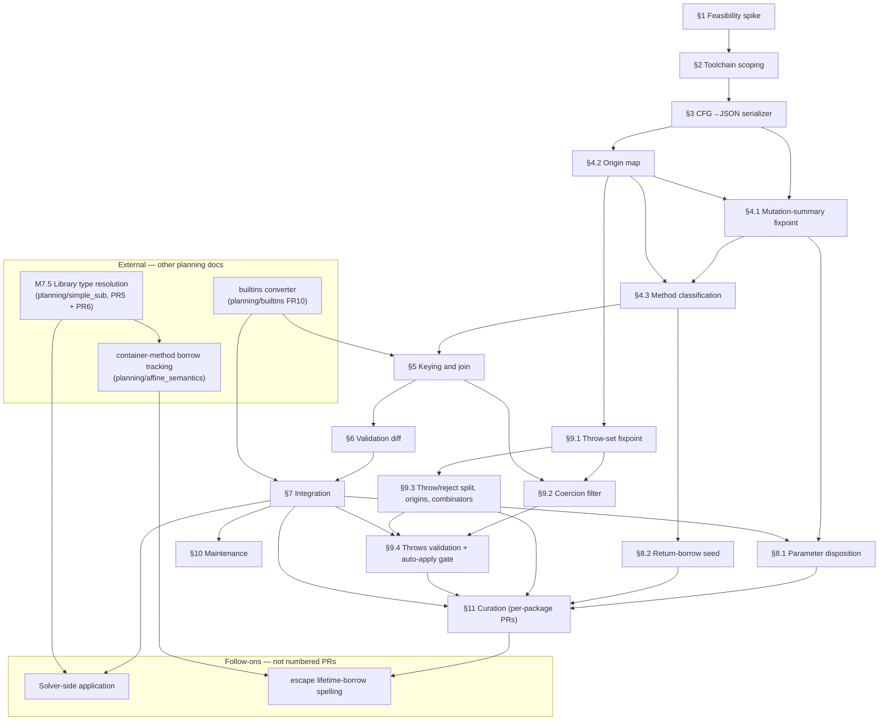

# ECMA-262-Derived Builtin Annotations: Implementation Plan

This plan implements [requirements.md](requirements.md). The whole
ECMA-262 workstream is tracked by a **single milestone**; the table below
breaks it into PRs. A section with numbered sub-sections lands as **one PR
per sub-section** (§4.1, §4.2, …); a section without sub-sections is a
single PR. Each PR lists its touch points and the gate that proves it
done. The pipeline has three stages the PRs build in dependency order:

```
ECMA-262 spec.html
   │  (ESMeta: extract → compile → build-cfg, pinned via -extract:target)
   ▼
control-flow graph  ──(thin Scala serializer)──▶  cfg.json  [committed]
   │
   ▼ (Go: origin tagging + mutation fixpoint + alias detection)
facts.json  [committed]
   │
   ▼ (Go: join + classification source)
bootstrap converter  ──▶  std/*.esc
```

The language boundary is the committed `cfg.json`. Everything left of it
is JVM/Scala and runs only on a spec bump. Everything right of it is Go
and runs in the normal build. The Scala component is a serializer with
no analysis; all Escalier-specific intelligence lives in the Go stages.

## PRs

One milestone, the PRs below — each section is a PR, and a section with
sub-sections is one PR per sub-section. Status legend: ✅ done, 🚧 partial,
⬜ not started.

| PR   | Work                                       | FRs        | Status | Depends on | Gate |
| ---- | ------------------------------------------ | ---------- | ------ | ---------- | ---- |
| §1   | Feasibility spike                          | FR1–FR4    | ✅      | —          | ESMeta CFG for ~10 representative methods (incl. escape, reject, callback) exposes the call nodes, args, stored-value operands, guards, `Throw`s, reject sites, and returns the analysis needs — met, see [spike_findings.md](spike_findings.md) |
| §2   | Toolchain scoping                          | NFR        | 🚧      | §1         | `tools/spec-extract/mise.toml` builds and runs ESMeta with no JVM in the root environment — see [tools/spec-extract/README.md](../../tools/spec-extract/README.md); `mise.lock` is still missing |
| §3   | Scala CFG→JSON serializer                  | FR6 (cfg)  | ✅      | §2         | `cfg.json` covers all 501 builtin algorithms plus the 701 functions reachable from them, at the pinned spec revision, and round-trips the schema check the run ends with — met |
| §4.1 | Mutation-summary fixpoint                  | FR1–FR3    | ✅      | §3, §4.2   | `MutArgs`/`MutatesReceiver` spot-checked — push/fill mutate the receiver, slice does not, Map.set via `[[MapData]]` — met, see [internal/ecma262/](../../internal/ecma262/) |
| §4.2 | Origin map                                 | FR2, FR4   | ✅      | §3         | origins asserted for sample functions — `ToObject(this)`→Receiver, allocators→Fresh, reads→Unknown — met, see [internal/ecma262/](../../internal/ecma262/) |
| §4.3 | Method classification                      | FR4, FR5   | ⬜      | §4.1, §4.2 | facts.json core — receiver / returns / classified for the representative methods |
| §5   | Keying and join                            | FR7, FR15  | ⬜      | §4.3       | normalizer joins facts to `.d.ts` declarations; overloads share algorithm-level facts, type-dependent parts per signature; unmatched reported |
| §6   | Validation diff                            | FR9        | ⬜      | §5         | receiver facts diffed against `mutabilityOverrides` + heuristics; every disagreement triaged |
| §7   | Integration as classification source       | FR8        | ⬜      | §6         | converter ranks facts above name tiers; the two application paths wired; redundant overrides removed |
| §8.1 | Parameter disposition                      | FR12       | ⬜      | §4.1, §7   | push/Map.set `escape`, Reflect.set `mutBorrow`+`escape`, indexOf `borrow` in facts.json |
| §8.2 | Return-borrow seed                         | FR4        | ⬜      | §4.3       | documented `returns` → `&`/lifetime annotation mapping (small) |
| §9.1 | Throw-set fixpoint                          | FR10       | ⬜      | §4.2       | raw throw sets, `Raised` = class / origin / callback-effect / unknown |
| §9.2 | Coercion filter                            | FR11       | ⬜      | §9.1, §5   | filtered throws — toFixed keeps RangeError, drops the receiver-coercion TypeError; param branch runs post-join |
| §9.3 | Throw/reject split, parametric origins, combinators | FR10, FR13 | ⬜ | §9.1  | `rejects` distinct from `throws`; Promise.reject `param:0`, forEach `throwsOf:param:k`; combinators hand-modeled |
| §9.4 | Throws validation + auto-apply gate        | FR14       | ⬜      | §9.1–§9.3, §7 | spec-independent (dynamically-observed) ground truth; false-negative rate report gates auto-apply |
| §10  | Maintenance workflow                       | NFR        | ⬜      | §7         | spec-bump runbook; `--check`-style drift report in CI |
| §11  | Curation of the override layer             | FR12, FR4, FR13, FR14 | ⬜ | §7, §8, §9 | override layer populated per pseudo-package by review; fans out into per-package PRs |

Within a section the sub-section PRs sequence per the "Depends on" column —
`§4.1` reads the origin map, so `§4.2` lands first despite the numbering.

**Dependency graph** (all PRs plus the external dependencies this plan
names in other planning docs; edges are "must land before"):



The **external** group is work in other workstreams that this plan
depends on: the builtins converter (planning/builtins FR10) that §5 and
§7 wire into; M7.5 library-type resolution, broken into PRs in
[../simple_sub/m7.5-implementation-plan.md](../simple_sub/m7.5-implementation-plan.md);
and the affine container-method borrow tracking (planning/affine_semantics),
which is itself blocked on M7.5's `Array` ingestion. The two M7.5 PRs
this plan turns on are **PR5**, which makes `Array` and its method
surface real, and **PR6**, which deletes the solver's stdlib
placeholders. That plan records both edges from its own side under "What
M7.5 unblocks." The **follow-ons**
are ecma-262 work this plan names but does not number as PRs, because each
waits on an external dependency: the solver-side application needs §7 and
M7.5, and the `escape` lifetime-borrow spelling needs §11 and the affine
work. Both are detailed in "Discovery phases may grow the plan" below.

§11 is a *content* PR series, not code: it fans out into a series of
per-package PRs and recurs as deltas on spec bumps. It is listed so the
work is explicit and scheduled, but it is unlike §1–§10 in kind.

### Discovery phases may grow the plan

§1 (spike) and §2 (toolchain scoping) are **discovery** phases: they
answer open questions about ESMeta's control-flow graph and build, and
their findings can add work to the later phases. The table above is the
plan *assuming the spike confirms the happy path*. The concrete branches
that would introduce new PRs:

- **§1 → §3 serializer scope.** The escape analysis (§8.1) needs the CFG
  to expose the *stored-value* operand of every write, and the reject
  channel (§9.3) needs to distinguish an `IfAbruptRejectPromise` /
  capability `[[Reject]]` site from a synchronous `Throw`. If ESMeta's IR
  inlines these cleanly, §3 just serializes them. If it surfaces them as
  opaque helpers, §3 grows a small hand-modeling layer for the fixed set
  of promise-combinator steps, and §8/§9 narrow their claims — a new PR
  each.
- **§1 → fallback path.** If the CFG is missing a needed signal
  wholesale, §3 becomes the pure-Go `spec.html` shallow parser (§3
  alternatives), a materially larger §3 that also has to reconstruct the
  call graph and the `?`/`!` guards itself.
- **§2 → §3 integration shape.** ESMeta ships no library artifact, so §2
  settles §3's entry point. It is an external sbt build in
  `tools/spec-extract/` that declares the vendored ESMeta as a source
  dependency, rather than an ESMeta **phase** invoked via `bin/esmeta` or a
  program depending on a `sbt publishLocal` artifact. See the §2 outcome for
  the evidence.
- **Solver-side application (new, not yet a numbered phase).** §7
  integrates the facts into the interop-layer `interop.Classify` and
  removes the legacy `internal/checker/prelude.go` overrides. The active
  checker's own builtin ingestion is milestone **M7.5 — Library type
  resolution** in the solver (`internal/solver`), **not yet landed**: its
  prelude still seeds stdlib types as opaque `unknown` placeholders
  (`addStdlibTypePlaceholders`), pending real `.esc` ingestion. (The
  underlying **M7 — Type aliases** milestone that M7.5 builds on has
  largely landed — `soltype.AliasType` and scope-driven `TypeRef`
  resolution exist — so M7 is the wrong milestone to name here; the
  blocker is M7.5's ingestion, not the alias representation.) Wiring the
  facts into that ingestion is a **dependent PR that cannot be written
  until M7.5 lands**, tracked here as a known follow-on rather than a
  scheduled phase. The specific PR that clears it is
  [M7.5 PR6](../simple_sub/m7.5-implementation-plan.md#pr6--the-well-known-protocol-set),
  which deletes `addStdlibTypePlaceholders` and resolves `Promise` /
  `Iterable` / `Generator` from the committed `.esc` files. That PR also
  retires the hardcoded `soltype.PromiseType` in favor of the ingested
  declaration, keeping the two-argument `Promise<T, E>` form this plan's
  `rejects` sets are spelled against — see "Two checkers; the active one is
  the target" in [requirements.md](requirements.md).
- **Applying the non-receiver facts.** §7 auto-applies only receiver
  mutability, the high-confidence determination. Parameter disposition
  (§8), the return-borrow seed (§8.2), `throws` (§9), and `rejects` (§9.3)
  are produced into `facts.json` but reach the `.esc` **through the
  hand-curated override layer**, not the trusted auto-apply path — a human
  review sits between the fact and the committed annotation (see §7 "Two
  application paths"; `throws`/`rejects` and the `&`/lifetime annotations
  are added by the curator, disposition gets a provisional baseline the
  curator corrects). These are not permanently curation-grade,
  though: `throws`/`rejects` have a defined graduation path — §9.4
  measures the false-negative rate, and a measured zero flips them to
  auto-apply (FR14). Whether disposition is confident enough to auto-apply
  like receiver mutability is a similar open call to settle when §8 lands.
- **`escape` spelling depends on external affine work.** §8 records the
  `escape` disposition; curation spells it a `move` (owning container) or
  a lifetime-bounded borrow (borrow-holding container), per requirements
  FR12. The affine *core* — moves, use-after-move, borrows, escape forcing
  — has landed, but the lifetime-borrow spelling needs one piece that has
  not: **borrow tracking through container methods** (`.push` of a borrow,
  `a.peers.push(&mut b)`), which the affine plan
  ([../affine_semantics/implementation_plan.md](../affine_semantics/implementation_plan.md))
  lists as deferred and out of scope. It is blocked on two things: the
  stdlib `Array` type and method surface, delivered by
  [M7.5 PR5](../simple_sub/m7.5-implementation-plan.md#pr5--a-real-arrayt-and-the-well-known-handle-mechanism),
  and a container-method lifetime
  annotation expressing "the argument-borrow is stored into the receiver."
  That is **not this workstream's work** — until it lands, curation
  applies only the `move` spelling, and the `escape` facts for
  borrow-holding containers wait on it. Tracked here as an external
  dependency.

Re-scope the table once §1 and §2 report, splitting any of the above into
their own rows before starting §4.

## §1. Feasibility spike

**Goal.** Confirm ESMeta's control-flow graph carries the structure the
analysis needs before committing to the toolchain.

**Work.**

- Build ESMeta from source — clone `es-meta/esmeta`,
  `git submodule update --init`, `sbt assembly` — and run
  `extract → compile → build-cfg` against a pinned ECMA-262 revision.
- Inspect the CFG for a representative set spanning every shape the
  analysis must handle:
  - direct receiver mutation, `Array.prototype.push`;
  - receiver mutation that returns the receiver, `Array.prototype.fill`,
    `Array.prototype.sort`;
  - fresh allocation, no receiver mutation, `Array.prototype.slice`,
    `Array.prototype.map`;
  - internal-slot mutation, `Map.prototype.set`,
    `Set.prototype.add`;
  - transitive mutation through a helper abstract operation, a named
    subroutine the specification defines to factor out shared behavior and
    abbreviated AO in the schema comments below;
  - immutable-primitive method, `String.prototype.replace`,
    `String.prototype.charAt`;
  - symbol-keyed method, `Array.prototype[Symbol.iterator]`;
  - parameter stored into the receiver (escape), `Array.prototype.push`,
    `Map.prototype.set`, `Reflect.set` — the CFG must expose the *stored
    value* operand of a write, not only the written object (§8.1);
  - promise rejection, a `Promise` combinator such as `Promise.all` or
    `Promise.race` — the CFG must let the analysis tell an
    `IfAbruptRejectPromise` / capability `[[Reject]]` site from a
    synchronous `Throw` (§9.3);
  - callback propagation, `Array.prototype.forEach` or `map` — the CFG must
    let the analysis tell a `?`-guarded call whose callee is a **callback
    parameter** (`? Call(callbackfn, …)`) from one whose callee is a
    resolvable abstract operation, for the `throwsOf:param:k` rule (§9.1).

**Gate.** For each method above, confirm the CFG exposes: the abstract-
operation call nodes with their argument variables **including the
stored-value operand of writes**, the `Let` bindings and their origins,
the internal-slot writes, the completion guards (`?`/`!`), the explicit
`Throw` steps, the promise-rejection sites, and the return values. If any
signal is missing, record it: a missing stored-value operand or reject
site narrows §8/§9 scope and may need a hand-modeled combinator step (see
§9.3); a broader gap falls back to the pure-Go `spec.html` shallow parser
noted in §3 alternatives.

**This spike can grow the plan.** §1 and §2 are discovery phases; their
findings feed back into the later phases. See "Discovery phases may grow
the plan" below.

**Outcome.** The gate is met — [spike_findings.md](spike_findings.md)
records the per-method evidence. The CFG carries every signal, so no
shallow-parser fallback is needed and §8/§9 keep their scope. The spike
resolves onto the happy-path side of the §1 branches below. It sharpens one
§3 detail and confirms two §4 ones, and it leaves the §3/§4 boundary intact —
§3 stays a structural dumper that makes no mutability or alias decision.

- **§3 (serializer).** The compiled IR carries no `?`/`!` flag; the guard is
  lowered into a fixed post-call branch — an abrupt-check that returns
  the completion for `?`, a normal assertion for `!`. §3 populates the
  completion-guard field the Appendix A schema already defines, and that §9
  reads as `node.Guard`, by matching that branch shape. This recovers spec
  control flow structurally, not by any Escalier-level decision, so it stays
  within §3's remit. §3 also copies each internal-slot name verbatim from the
  CFG, which is the bare `MapData`, not the bracketed `[[MapData]]` the
  Appendix A example shows.
- **§4.1 (Go).** The FR1 property-write seed is load-bearing, not an
  optimization: `Set` and its kin dispatch through a dynamic `[[Set]]`
  internal method the mutation fixpoint cannot resolve by callee name, so
  without the seed those writes are invisible to it. §4.1's
  `BackingStoreSlots` set must match the bare slot names §3 emits, since the
  CFG drops the `[[ ]]` brackets.
- **§4 / §9 (Go).** `yet` incompleteness is per-step, not per-method, so the
  FR5 conservative fallback applies per signal — a determination is left
  unclassified only when a `yet` sits on a step it reads.

## §2. Toolchain scoping

**Goal.** Make the JVM toolchain a maintainer-only dependency, absent
from the normal Go build and CI.

**Work.**

- Add `tools/spec-extract/mise.toml` pinning `java` and `sbt` to **exact**
  versions — e.g. `java = "temurin-21.0.5+11"` (satisfies ESMeta's JDK
  17+) and `sbt = "1.10.7"`, never a floating `1.x` — and commit the
  generated `mise.lock` so transitive tool resolution is reproducible. Do
  **not** add these to the root `mise.toml`, which every contributor and
  CI activates.
- Vendor ESMeta as a git submodule under `tools/spec-extract/` so the
  pinned ESMeta revision is reproducible alongside the pinned spec
  revision. ESMeta has no published Maven artifact and no prebuilt JAR,
  so source vendoring is the only stable option.

**Gate.** A maintainer can `cd tools/spec-extract && mise install` and
build ESMeta; a contributor building the compiler from the repo root
never installs Java or sbt.

**Outcome.** Partial. `tools/spec-extract/` holds the JVM pins and the vendored
ESMeta source, and the root `mise.toml` is unchanged, so `mise ls` at the repo
root lists no `java` and no `sbt`. ESMeta builds at the pinned revision on a
JDK 21 in about 90 seconds and the resulting `bin/esmeta` assembly runs. The
maintainer runbook is
[tools/spec-extract/README.md](../../tools/spec-extract/README.md). What is
left is the `mise.lock` this section's Work list calls for; see the closing
paragraph. Five findings shape the later phases.

- **§3's entry point is an external sbt build that declares the vendored
  ESMeta as a source dependency.** A `build.sbt` in `tools/spec-extract/`
  naming `RootProject(file("esmeta"))` as a `dependsOn` target compiles Scala 3
  sources that import `esmeta.cfg.CFG`. It needs neither `sbt publishLocal` nor
  an edit to the vendored tree. That rules out the ESMeta-phase shape §3 named
  as the alternative. Registering a phase means adding it to ESMeta's own
  `ESMeta.scala` command list, a patch that would have to be rebased on every
  spec bump. Pin the wrapper build's `project/build.properties` to sbt 1.10.11
  to match ESMeta's, because sbt loads a source dependency under the outer
  build's version.
- **The spec revision needs no pin of its own.** ESMeta tracks ECMA-262 as its
  own `ecma262` submodule, so checking out the pinned ESMeta revision checks
  out the pinned spec with it. §3's `-extract:target` has nothing to add beyond
  the submodule state.
- **Only one of ESMeta's three submodules is needed.** ESMeta declares
  `ecma262`, `tests/test262`, and `client`; `build.sbt` names `test262` only in
  its test tasks and never names `client`, so the build needs `ecma262` alone.
  The Escalier submodule entry carries `update = none` so a recursive clone of
  Escalier skips ESMeta and the large trees hanging off it.
- **The mise pin is the sbt launcher, not the sbt that compiles ESMeta.**
  ESMeta's `project/build.properties` sets `sbt.version=1.10.11` and the
  launcher downloads that version before it reads `build.sbt`. mise resolves
  `sbt` through conda-forge, whose 1.10 line stops at 1.10.2, so 1.10.11 is not
  a version mise can install. Pinning the launcher is enough, since the
  compiling sbt is pinned by the vendored revision.
- **Building in place leaves untracked files in the vendored tree.** ESMeta
  sets `semanticdbEnabled := true`, which writes a `.scala.semanticdb` beside
  every source, and ESMeta's `.gitignore` does not cover them. The submodule
  entry carries `ignore = untracked` to keep that build output out of the
  parent repo's `git status`.

`mise.lock` is not committed, which is what holds §2 at partial. Recording the
per-asset checksums needs network access to mise's tool-metadata hosts, so it
lands the next time a maintainer runs `mise install` in `tools/spec-extract/`.
The README carries the command. §2 is done once that lockfile is committed and
records a checksum per tool and platform.

## §3. Scala CFG→JSON serializer

**Goal.** Give ESMeta's in-memory `esmeta.cfg.CFG` a committed JSON
spelling. This is the only Scala we write, and it contains no analysis.

**Work.**

- Add a small Scala main in `tools/spec-extract/` that depends on the
  vendored ESMeta build, runs `extract → compile → build-cfg`, and walks
  each `cfg.Func`. The ECMA-262 revision is pinned by ESMeta's own
  `ecma262` submodule, so the run records the revision it extracted rather
  than naming one; §2's findings cover why.
- Lower each ESMeta IR node to the flat, analysis-ready schema in
  [Appendix A](#appendix-a-cfgjson-schema). The serializer's only job is
  this lowering. It pattern-matches ESMeta IR instruction types onto the
  `Node` and `Expr` variants and copies structure; it makes no
  mutability or alias decision. The shape it must surface per function:
  the declared parameters in order, with a method's receiver kept out of
  that index space and referenced as `ExprThis`; every `Let` binding's
  target and source; every abstract-operation call with its callee name,
  argument expressions, and completion guard (`?` / `!` / plain, needed
  for the throw-set fixpoint in §9); every internal-slot write with its
  object expression and slot name; every explicit `Throw` step with its
  exception type; every return with its value expression.
- Write the result to `tools/spec-extract/cfg.json` and commit it. The
  file is large; it is an intermediate regenerated only on a spec bump,
  and committing it is what keeps the JVM out of the normal build.

**Schema sketch** (full definitions in
[Appendix A](#appendix-a-cfgjson-schema)):

```go
type CFG struct{ Funcs []Func }

type Func struct {
    Name   string   // "Array.prototype.push", "Array.from", or an AO name "Set"
    Kind   FuncKind // BuiltinMethod | BuiltinStatic | AbstractOp | SyntaxDirected
    Params []string // formals in order; index 0 is the receiver for BuiltinMethod
    Nodes  []Node   // flattened, control-flow-edge order preserved
}

type Node struct {
    Kind   NodeKind // Let | Call | SlotWrite | Return | Branch
    Target string   // Let: bound name        | Call: optional result name
    Source *Expr    // Let: bound expression
    Callee string   // Call: abstract-operation name
    Args   []Expr   // Call: argument expressions
    Object *Expr    // SlotWrite: the object whose slot is written
    Slot   string   // SlotWrite: e.g. "[[MapData]]"
    Value  *Expr    // Return: returned expression
}
```

**Alternative if §1 fails.** If the CFG does not carry the needed
structure, fall back to a pure-Go shallow parser over the pinned
`spec.html` using `golang.org/x/net/html`, exploiting ECMARKUP's
structural markup — `aoid` attributes on `<emu-xref>` call nodes,
`<var>` for variables, literal `.[[Slot]]` text. It emits the same
[Appendix A](#appendix-a-cfgjson-schema) schema, so the Go stage is
unchanged. The shallow parser drops the JVM entirely but must
reconstruct the call graph itself and gives up accuracy on
indirectly-phrased mutations. Keep the §1 CFG dump as a one-time oracle
to validate the shallow parser's output.

**Gate.** `cfg.json` covers the full `std:*` method surface and
round-trips a schema validation. The schema is the contract the Go stage
reads.

**Outcome.** Done. `tools/spec-extract/` holds an sbt wrapper build that
names the vendored ESMeta checkout as a source dependency, and a Scala main
that runs `extract → compile → build-cfg` in process and lowers the result.
One run takes about 20 seconds and writes a 1.6 MB
[cfg.json](../../tools/spec-extract/cfg.json), committed. It holds 1202
functions: all 501 builtin algorithms and the 701 abstract operations,
closures, internal methods, and numeric methods reachable from them. The
1746 syntax-directed operations are the runtime semantics of the language
rather than a library surface, so they are dropped. The run ends by reading
the file back with an independent parser and checking every kind, every
field, and the builtin count against the graph, which is the gate.
[tools/spec-extract/README.md](../../tools/spec-extract/README.md) is the
maintainer runbook. Four findings shape the sections downstream.

- **The completion unwrap has to be absorbed into the guard, not emitted.**
  §1 established that `?` and `!` are lowered into control flow, and the
  serializer matches those shapes to recover the guard. What the shape also
  contains is the unwrap `x = x.Value`, which reads a field. Emitting it
  would make the guarded call's result a container read, and Appendix A
  resolves a read to an unknown origin, so `Let O be ? ToObject(this)` would
  stop tracing to the receiver and `Array.prototype.push` would lose its
  receiver mutation. The serializer drops the assertion, the unwrap, and the
  abrupt branch that forwards the completion, and records the guard on the
  call. §9.1 reads `guard`, never the branch. The drop is pinned to the edge
  the guard puts its unwrap on, because `x = x.Value` is also a step some
  algorithms write for themselves, and dropping those would lose real bindings
  in `IteratorStep`, `ToBigInt`, and the promise combinators.
- **Allocation operands are a signal Appendix A could not hold.** The
  schema had no expression for an allocation, and lowering one to a literal
  would have dropped what it stores. `Map.prototype.set` appends
  `record { Key: key, Value: value }` to `[[MapData]]`, and on that path the
  record is the only place `key` escapes through, so §8.1 would have missed
  it. Appendix A gains `ExprAlloc`, whose `Args` holds the stored operands.
- **A builtin's parameters come from its algorithm head, and the calling
  convention has to be lowered away.** ESMeta compiles every builtin with
  the same three IR parameters, `this`, `ArgumentsList`, and `NewTarget`,
  and generates a prologue that takes each declared formal out of the
  argument list, defaulting a missing one to `undefined`. `Params` is read
  off the algorithm head instead, and the prologue is dropped, so a formal
  is named only there and §4.2 reads its index by name. Keeping the prologue
  would have bound each formal to the argument list and to `undefined`,
  neither of which carries a parameter origin.
- **Eight builtins have no algorithm head.** ESMeta supplies
  `String.prototype.toUpperCase`, `Math.random`, the `toLocaleString`
  family, `Function.prototype`, and its own `print` from manual sources
  rather than from `spec.html`. Six of the eight have a body that is a
  single `yet`, so the analysis reads them as unclassified, which is the
  right answer. They are keyed from the compiled function's name so the
  surface stays complete.

Two limits are worth naming for §9.3. `Promise` is set from the shape
Appendix A describes, an algorithm that builds a promise capability and
returns either that capability's `[[Promise]]` or the result of an
operation the capability was handed to. That covers `Promise.reject`,
`Promise.prototype.then`, and the four combinators, and correctly leaves
`Promise.withResolvers` unset, since it returns a plain object holding the
capability's three pieces. It does not cover a method that returns a
promise built elsewhere. `Promise.prototype.catch` delegates to `then`
through a dynamic invoke, so proving it returns a promise needs the
inter-procedural pass rather than this serializer. Separately, ECMA-262 does not
define `Intl`, so the `Intl.*` forms in
[Appendix C](#appendix-c-canonical-spec-keys) match nothing here; they
describe ECMA-402, which a later spec source would have to supply.

## §4. Go analysis: mutation and alias

**Goal.** Produce `facts.json` from `cfg.json` entirely in Go. The
analysis has three passes: an inter-procedural mutation summary
(§4.1), a per-function origin map (§4.2), and a per-method
classification that combines them (§4.3).

The unifying idea is that **the receiver is a distinct origin, not a
parameter index**. Every function — builtin method, static, namespace
function, or abstract operation — is analyzed for which of its declared
parameter positions it mutates (`MutArgs`, 0-based with no offset), and a
method's receiver mutation is tracked separately (`MutatesReceiver`).
Receiver mutation means `&mut self`; parameter position `j` mutated means
parameter `j` is `&mut`. Keeping the receiver out of the parameter index
space is what makes static and namespace functions — whose parameter 0 is
a real argument, not a receiver — fall out correctly.

### §4.1. Mutation summary fixpoint (FR1, FR2, FR3)

Compute `MutArgs(F) ⊆ {0..arity-1}`, the formal positions function `F`
may mutate, directly or transitively. Seed it from the direct mutators
and iterate to a fixpoint over the call graph.

The receiver is tracked as its own origin, not as a formal index, so
`MutArgs[F]` holds real 0-based parameter positions for every function
kind — a method's declared parameters, a static/namespace function's
arguments, an abstract operation's arguments — with no receiver offset to
juggle. A method's receiver mutation is recorded separately in
`MutatesReceiver`.

```
MutArgs        : map[FuncName] Set[int]  // mutated parameter positions (0-based, no receiver)
MutatesReceiver: Set[FuncName]           // a method mutates its `this` value
Unattributable : Set[FuncName]           // F mutates a value tied to no formal or receiver
Incomplete     : Set[FuncName]           // analysis could not fully cover F (see below)

// Seed: direct property/integrity mutators mutate their object argument (arg 0).
seed = {
    "Set":0, "CreateDataProperty":0, "CreateDataPropertyOrThrow":0,
    "CreateMethodProperty":0, "DefinePropertyOrThrow":0,
    "OrdinaryDefineOwnProperty":0, "DeletePropertyOrThrow":0,
    "SetIntegrityLevel":0,
}
for ao, k in seed: MutArgs[ao].add(k)

worklist = all funcs
while worklist nonempty:
    F = worklist.pop()
    origin = OriginMap(F)               // §4.2, computed per function
    before = snapshot(F)                // MutArgs, MutatesReceiver, Unattributable, Incomplete

    for node in F.Nodes:
        switch node.Kind:
        case SlotWrite where node.Slot in BackingStoreSlots:   // FR3
            attribute(F, origin, node.Object)
        case Call:
            if node.Callee not in AllFuncs: Incomplete.add(F)  // unresolved callee
            else for k in MutArgs[node.Callee]:
                attribute(F, origin, node.Args[k])
        case Opaque: Incomplete.add(F)  // a step the serializer could not lower (§3)
    // (a fresh-origin mutation is intentionally ignored: mutating a
    //  value F allocated itself is not observable to F's callers.)

    if changed(before, F): worklist.push(callers(F))

// attribute: charge a mutated value expression to F's receiver or a formal.
func attribute(F, origin, expr):
    switch originOf(origin, expr):
    case Receiver:   MutatesReceiver.add(F)   // only a BuiltinMethod has one
    case Param(j):   MutArgs[F].add(j)        // real 0-based parameter position
    case Fresh:      pass                     // not observable
    case Unknown:    Unattributable.add(F)
```

`Incomplete` is distinct from `Unattributable`. `Unattributable` means
the analysis saw a mutation it could not tie to a receiver or formal —
it knows something escaped but not what. `Incomplete` means the analysis
could not see the whole algorithm: an `Opaque` node the serializer could
not lower (a prose step, §3), a `Call` to a callee absent from the CFG,
or a mutation phrasing outside the FR1 vocabulary. Both force
`classified: false` (§4.3), so FR5's heuristic fall-through handles the
method rather than the analysis emitting a claim it cannot stand behind.

**How the seed works, and why it is not inlining.** The seed entries are the
fixpoint's base cases. The analysis never invents a mutation; it only carries
existing ones up the call graph, so every position in a `MutArgs` set traces
back either to a seed entry or to an FR3 `SlotWrite`. An entry's value is the
*argument position that call site mutates*: `"Set":0` says a call to `Set`
mutates whatever was passed as its argument 0. At each call the fixpoint looks
up the callee's mutated positions, reads the argument expression sitting at
each one, and asks the §4.2 origin map what that expression is **in the
caller's terms**. `Array.prototype.push` calls `Set(O, %6, E, true)`, so
position 0 selects `O`, whose origin is `ToObject(this)` — receiver — giving
`MutatesReceiver`. The same entry yields a different answer elsewhere:
`Array.prototype.slice` calls `Set(A, "length", …)` on its freshly allocated
`A`, and a `Fresh` origin is ignored. Multi-parameter results need no special
case, since `MutArgs` is a set of positions that unions as facts propagate: a
helper writing both of its parameters accumulates `{0, 1}` from two separate
`Set` calls, and its callers inherit both positions through the same lookup.

The seed exists because these operations cannot be analyzed by descending into
their bodies. `Set`'s body is a single dispatch, `O.Set(O, P, V, O)`, to the
object's `[[Set]]` internal method — a callee chosen at runtime by the
receiver's type, and in the CFG a field reference rather than a resolvable
name. Inlining cannot follow it. Nor would inlining help further down: the
ordinary path continues through `OrdinarySetWithOwnDescriptor`, which dispatches
again on the prototype chain and can end in `Call(setter, …)`, arbitrary user
code. The concrete writes it eventually performs land on property-descriptor
records several dispatch layers below, phrased in ESMeta's internal object
representation rather than as a mutation of `O`. Recognizing those would mean
curating a larger and subtler artifact than the seed while still failing to
cross the dispatch boundary.

Treating `Set` as opaque with a known positional effect removes the problem
instead of solving it: nothing above `Set` descends into it, so the dynamic
dispatch is never reached. The claim "`Set(O, …)` mutates `O`" is also a
deliberate over-approximation. A Proxy's `[[Set]]` trap may write elsewhere,
but assuming the argument is mutated is the FR5-conservative direction — a
wrong `&mut` fails loudly at a call site, a missed one is silent unsoundness.
Composite mutators above the dispatch boundary stay derived rather than
asserted: `Object.freeze` gets `MutArgs = {0}` from calling `SetIntegrityLevel`,
which the fixpoint reads off that helper's own summary. `SetIntegrityLevel` is
seeded for robustness, not necessity. Inlining reasoning belongs in review, not
in the analysis: walking the ordinary-object path by hand is how the seed's
argument positions are validated against the spec on a bump.

`BackingStoreSlots` is the curated FR3 list: `[[MapData]]`,
`[[SetData]]`, `[[ArrayBufferData]]`, `[[ArrayBufferByteLength]]`,
`[[TypedArrayName]]`, `[[ViewedArrayBuffer]]`, `[[WeakRefTarget]]`, and
others added as collection types enter the spec. Both the seed map and
this list are reviewed Go constants — adding a mutator to the spec
without listing it here produces a false non-mutating result, so they
are deliberately explicit (FR1).

**Outcome.** Done. [internal/ecma262/mutation.go](../../internal/ecma262/mutation.go)
holds the seed, the backing-store slot list, and the fixpoint.
`NewMutationSummary(cfg)` runs the fixpoint over a whole graph and `Of(fn)`
returns one function's `Mutations`, which carries the mutated parameter
positions, the receiver flag, and the two warnings. All 1202 functions settle in
about 10 ms. Seven seed entries grow into 42 abstract operations with a mutated
position, and of the 501 builtins 43 mutate their receiver and 6 mutate a
parameter. The gate is
[internal/ecma262/mutation_test.go](../../internal/ecma262/mutation_test.go).
`Array.prototype.push` and `Array.prototype.fill` mutate the receiver,
`Array.prototype.slice` mutates nothing, and `Map.prototype.set` mutates the
receiver through `[[MapData]]`. The Date setters, the in-place Array methods,
`RegExp.prototype.exec`, and the collection adders come out receiver-mutating;
`Object.freeze`, `Object.seal`, `Object.assign`, `Object.defineProperty`,
`Object.defineProperties`, and `Reflect.set` come out mutating argument 0. Five
findings.

- **`Incomplete` stays on the function that carries the unreadable step and is
  not charged to its callers.** A callee the analysis could not fully read may
  under-report its mutated positions, so a caller that reads that summary
  inherits the gap. Charging the caller as well is the sound reading and costs
  too much to use: it takes the incomplete builtins from 93 of 501 to 340, which
  would leave §4.3 able to classify under a third of the surface. The unreadable
  steps sit in operations nearly every algorithm reaches, so the flag saturates.
  The narrower rule is what §4.1 specifies and what the code does. §6's
  validation diff against the hand-written overrides is where a mutation lost
  inside an incomplete callee surfaces.
- **A computed slot on a fresh value is not a warning.** The serializer leaves
  the slot name empty on the 155 writes whose slot the algorithm computes, and
  the curated list cannot answer for those. They mark the function incomplete,
  except where the written value is fresh, since no slot name makes a write to a
  value the function allocated itself visible to its caller. 94 of the 155 land
  on a fresh value, which keeps 47 functions out of `Incomplete`, 10 of them
  builtins.
- **The mutated position is the one the call site passes the object at, not the
  one the seed names.** `OrdinarySet(O, P, V, Receiver)` performs its write
  through `OrdinarySetWithOwnDescriptor`, which calls
  `CreateDataProperty(Receiver, …)`. Position 0 is where the seed charges
  `CreateDataProperty`, and reading the argument sitting there gives `Receiver`,
  which is `OrdinarySet`'s parameter 3. Its summary is `{3}`, and a caller of
  `OrdinarySet` charges whatever it passed fourth.
- **A record read out of a backing store loses the receiver, so
  `Map.prototype.delete` comes out non-mutating.** delete empties the entry in
  place with `Set p.[[Key]] to EMPTY`. `[[Key]]` is a field of a Map Entry
  Record rather than a backing store, and `p` itself came out of a read of
  `M.[[MapData]]`, which breaks the origin chain under §4.2. Both halves of the
  attribution fail, so the method reads as writing nothing.
  `Map.prototype.clear`, `WeakMap.prototype.delete`, and
  `TypedArray.prototype.set` are the same shape. Flagging every slot write the
  analysis cannot place as `Unattributable` catches them, at the cost of
  `Map.prototype.set` and `WeakMap.prototype.set`, which write the same record
  on their update path and would stop being classifiable. §6 triages these
  against the hand-written overrides, so the false negative is recorded rather
  than resolved here.
- **`CreateMethodProperty` is seeded and absent from the graph.** Nothing
  reachable from a builtin calls it; the spec uses it from the syntax-directed
  operations §3 drops. The entry stays, because the seed is a review artifact of
  FR1's vocabulary rather than a list of what the pinned graph happens to
  contain. `TestMutationSummarySeedResolves` snapshots the absent entries, so a
  spec bump that renames a seeded operation fails there rather than quietly
  reporting one less mutation.

### §4.2. Origin map (FR2, FR4)

For each function, map every value name to its origin by a forward pass.
Origins propagate only through **identity-preserving** operations; a
property or slot *read* breaks the origin chain, because the value read
out of a container is a different object from the container.

```
type Origin struct { Kind OriginKind; Index int }
// OriginKind ∈ { Receiver, Param, Fresh, Unknown }
// Receiver is a BuiltinMethod's `this` value; Param(i) is the i-th
// declared parameter, 0-based, matching the fact's param index. The
// receiver is never a Param, so there is no receiver offset.

func OriginMap(F) map[string]Origin:
    origin = {}                                      // unset = lattice bottom
    repeat until nothing moves:                      // a name defined by a loop's
        for i, p in F.Params:                        // back edge reaches its uses
            origin[p] = origin[p] ⊔ Param(i)         // declared params only; no receiver
        for node in F.Nodes:
            if node.Kind == Let:
                origin[node.Target] ⊔= eval(F, node.Source)
            if node.Kind == Call && node.Target != "":
                origin[node.Target] ⊔= evalCall(F, node)
    return origin                                    // a still-unset name reads back Unknown

func eval(F, e Expr) Origin:
    switch e.Kind:
    case Var:   return origin[e.Var]
    case This:  return Receiver if F.Kind == BuiltinMethod else Unknown
                // only a prototype method has a `this` value to track; a
                // static or namespace function's `this` is the constructor
                // or namespace object, never a parameter.
    case Call:  return evalCall(F, e)
    case Alloc, Lit: return Fresh                     // fresh object / primitive
    case Slot, Prop: return Unknown                   // a READ: origin chain breaks
    default:    return Unknown

func evalCall(F, c) Origin:
    if c.Callee in Allocators:      return Fresh      // ArrayCreate, ArraySpeciesCreate,
                                                      // OrdinaryObjectCreate, ...
    if c.Callee in IdentityCoercions:                 // ToObject, RequireObjectCoercible
        return eval(F, c.Args[0])                     // returns the same object identity
    return Unknown                                    // Get, ToString, ToNumber, ... → read/fresh
```

`IdentityCoercions` is the key list for receiver tracking. `ToObject`
and `RequireObjectCoercible` return the object they were given, so `O ← ?
ToObject(this value)` keeps `O` at the receiver. `ToObject` preserves
identity only for an object argument. Given a primitive it allocates a
wrapper, and the analysis propagates the receiver through it anyway. That
approximation runs in the FR5-conservative direction, since a mutation
claimed where there is none fails loudly at a call site while a missed one
is silent unsoundness. Coercions that build a new value — `ToString`,
`ToNumber` — are *not* identity-preserving, which is exactly why every
`String.prototype` method comes out non-mutating: the algorithm coerces
`this` to a fresh string primitive and never writes back to the receiver.

**The analysis is deliberately path-insensitive.** It does not model
control flow: `NodeBranch` is not interpreted, and the node list is
walked as a flat sequence. Each name takes the join of every origin
assigned to it anywhere in the function — equal origins stay, unequal
collapse to `Unknown` — and `returnAlias` (§4.3) considers *every*
`Return` node, not only the reachable ones. This over-approximates
(a throw or return on a dead branch still counts), which is safe here:
the mutation and throw sets only grow, over-approximating rather than
missing an effect, and a method the analysis cannot fully resolve is left
unclassified rather than guessed (FR5). ESMeta's CFG does carry
block successors and branch conditions; if a later precision pass wants
reachability or per-path joins, the serializer (§3) can emit that
structure and this section becomes flow-sensitive. Until then the schema
omits it (Appendix A) and the guarantees here are path-insensitive by
construction, not by accident.

**Outcome.** Done. [internal/ecma262/](../../internal/ecma262/) holds the Go
reader for `cfg.json`, mirroring Appendix A, and the origin map.
`NewOriginMap(fn)` returns the origins of one function's value names.
`Eval(expr)` answers the same question for an expression, which is the call
§4.1 makes when it charges a mutation to a receiver or a parameter. All 1202
functions analyze in about 4 ms, binding 11663 names. Of those, 373 are at the
receiver, 2007 at a parameter, 2969 fresh, and 6314 unknown. The gate is
[internal/ecma262/origin_test.go](../../internal/ecma262/origin_test.go).
`Let O be ? ToObject(this value)` puts `O` at the receiver in
`Array.prototype.push`, `? ArraySpeciesCreate(O, count)` puts `A` at `Fresh` in
`Array.prototype.slice`, and `? ToString(O)` puts `S` at `Unknown` in
`String.prototype.toLowerCase`. Four findings.

- **One walk in node order is unsound, so the walk repeats until nothing
  moves.** A loop's back edge redefines a name after its uses, and a single
  walk records only the definition it reached first. `ForBodyEvaluation` binds
  `%4` from a literal ahead of its loop and from a value read inside it. One
  walk leaves `%4` at `Fresh`, which would tell §4.1 that a mutation of it is
  invisible to the caller. Repeating the walk joins both definitions and gives
  `Unknown`. It changes 7 names across 4 functions, all of them loops, and
  costs at most three passes over any function in the graph.
- **Completion wrapping preserves the value, so `NormalCompletion` joins the
  identity list.** ESMeta compiles a normal return as
  `NormalCompletion(v)`, which is 1204 of the graph's call nodes and stands on
  nearly every algorithm's return. The record it builds is fresh, but §3 drops
  the caller-side unwrap, so the value the caller receives is `v`. Reading the
  wrap as an allocation would resolve every method's return to `Fresh` and cost
  §4.3 its `returnAlias`. `Map.prototype.set` ends in `return
  NormalCompletion(M)`, and the receiver has to survive that wrap.
- **`CanonicalizeKeyedCollectionKey` is identity-preserving and had to be
  listed.** It returns its key unchanged apart from normalizing `-0` to `+0`,
  which cannot apply to an object. `Map.prototype.set` rebinds `key` to its
  result. Without the entry, `key` joins `Param(0)` with `Unknown` and
  collapses, losing the parameter §8.1 has to follow into the `[[MapData]]`
  record.
- **`Construct` and `ProxyCreate` are deliberately not allocators.**
  `Fresh` is the one origin whose mutations the fixpoint discards, so an entry
  that can hand back a value the caller already holds turns a real mutation
  invisible. `Construct` runs a constructor chosen at runtime and may return
  one of its arguments, and a write to a proxy reaches its target. Both resolve
  to `Unknown` instead. `ArraySpeciesCreate` and the typed-array species
  operations carry the same risk and are listed anyway, as §4.2 specifies,
  because `Array.prototype.slice` and its neighbours build their result through
  them.

`Node` and `Expr` are sealed interfaces with one type per kind rather than
one struct tagged by kind, matching how [internal/ast/](../../internal/ast/)
models the compiler's own trees. Appendix A describes what that means for the
schema, which is unchanged.

`freshPrimitives` names the coercions that build a new primitive from their
argument, `ToString` and `ToNumber` among them, plus the numeric type
operations of §6.1.6. Their result is `Fresh` for the same reason an
allocation is, and with none of the risk, since a primitive cannot be
mutated and so an entry there can never hide a write. The list exists mostly
to be read: `Let S be ? ToString(O)` resolving away from the receiver is a
decision, not an omission from `allocators`. It moves no mutation site at
all, receiver attribution included, because a coerced primitive never
reaches a mutating position. It turns four returns from `Unknown` into
`Fresh` — `BigInt.prototype.toString`, `Date.prototype.toString`,
`Number.prototype.toString`, and `String.prototype.concat` — and §5's join
would settle those from the declared return type anyway.

A name the function reads but never binds resolves to `Unknown` before the
walk starts rather than sitting at the lattice bottom. 325 of the 1202
functions read such a name, 607 in total, and a closure's captured value is
the usual case. The distinction matters where the name shares a target with
another definition. `Iterator.prototype.drop`'s closure opens with `Let
remaining be integerLimit`, which the enclosing algorithm owns, and a later
step assigns `remaining` a literal. Left at the bottom the capture would
contribute nothing to the join, `remaining` would come out `Fresh`, and §4.1
would read a mutation of it as invisible to the caller.

283 of the 313 builtin methods bind a name at the receiver. The other 30 pass
`this` straight into an operation that reads a value out of it, such as
`ThisNumberValue` or `GeneratorResume`, or are among the eight §3 builtins with
no algorithm head. Binding no name is not a loss, because §4.1 asks the map
about expressions rather than names, and an `ExprThis` argument resolves to the
receiver at the call site.

### §4.3. Method classification (FR4, FR5)

For each builtin method `M`, combine the summary and the origin map.
Receiver mutability is just "is `M` in `MutatesReceiver`"; parameter
dispositions and the reject set are computed by §8 and §9.3:

```
func classify(M) MethodFact:
    fact.Receiver   = receiverKind(M)              // below
    fact.Params     = paramDispositions(M)         // §8: escape / mutBorrow (borrow omitted)
    fact.Returns    = returnAlias(M)               // below
    fact.Throws     = filterThrows(M)              // §9.2
    fact.Rejects    = rejectSet(M)                 // §9.3
    // Soundness bias (FR5): a method the analysis could not fully cover
    // OR could not fully attribute is unclassified.
    fact.Classified = M not in Unattributable and M not in Incomplete
    return fact

func receiverKind(M):
    if M.Kind != BuiltinMethod: return RecvNone    // static / namespace function: no receiver
    return RecvMutBorrow if M in MutatesReceiver else RecvBorrow

func returnAlias(M) AliasKind:
    acc = Bottom
    for node in M.Nodes where node.Kind == Return:
        acc = join(acc, aliasOf(eval(M, node.Value)))
    return acc
// aliasOf: Receiver→Receiver; Param(j)→ParamJ; Fresh→FreshReturn; Unknown→UnknownReturn
// join:    equal→same; FreshReturn⊔FreshReturn→FreshReturn;
//          two distinct input origins→Union; anything⊔UnknownReturn→UnknownReturn
```

An `Unattributable` method has a mutation the analysis could not pin to
a formal — a write through an `Unknown`-origin value, including deep
mutation reached through a property read. It is emitted with
`classified: false` and listed, so the converter falls it through to the
name heuristics and the receiver defaults to `&mut self` (FR5). The
return-alias axis tolerates `Unknown` without making the whole method
unclassified, because it is the low-stakes lifetime seed, not a
soundness-bearing claim.

**Gate.** Spot-check the representative methods from §1:
- `Array.prototype.push` — `Set(O,…)` on `Param(0)` ⇒ `receiver:
  mutBorrow`, returns `len` ⇒ `fresh`.
- `Array.prototype.fill` — `Set(O,…)`, `Return O` ⇒ `receiver:
  mutBorrow`, `returns: receiver`.
- `Array.prototype.slice` — writes only to an `ArraySpeciesCreate`
  result `A` (Fresh), `Return A` ⇒ `receiver: borrow`, `fresh`.
- `Map.prototype.set` — append to `M.[[MapData]]` (backing-store slot on
  `Param(0)`), `Return M` ⇒ `receiver: mutBorrow`, `returns: receiver`.
- every `String.prototype` method — `this` coerced to a fresh string,
  never written ⇒ all `receiver: borrow`.

Unclassified methods are listed.

## §5. Keying and join (FR7, FR15)

**Goal.** Join the two inputs the generated `.esc` is built from (FR7):

- the **type declarations** from the pinned TypeScript `.d.ts` that ships
  with TypeScript — the shapes the spec cannot supply: generics, parameter
  and return types, typed overloads. This is the type source per FR7.
- the **effect facts** in `facts.json`, produced by §4 / §8 / §9 from the
  ECMA-262 spec — receiver mutability, parameter disposition, the
  return-borrow seed, `throws`, and `rejects`.

The `.d.ts` declarations are keyed by owner + member; the facts are keyed
by canonical spec name (Appendix C). This phase is the **name-based match**
between them, so each `.d.ts`-derived method element picks up its ECMA-262
effects. The join is deliberately shape-blind — it carries no types — so it
holds whether the type declarations come from `.d.ts` today or committed
`.esc` later (FR7).

**Work.**

- Implement the name normalizer that maps a spec key onto the
  `(owner, member, sort)` triple the converter holds. `owner` is a dotted
  path so namespace-nested constructors resolve; `sort` distinguishes an
  instance method, a class static, and a namespace-level function:

```
func normalize(specKey string) (owner []string, member MemberKey, sort MemberSort):
    // MemberSort ∈ { Instance, Static, NamespaceFunc }
    // "Array.prototype.push"                   → (["Array"],     Str("push"),     Instance)
    // "Array.prototype [ @@iterator ]"         → (["Array"],     Sym("iterator"), Instance)
    // "get Map.prototype.size"                 → (["Map"],       Accessor("size"),Instance)  // never overwritten
    // "Array.from"                             → (["Array"],     Str("from"),     Static)
    // "Array [ @@species ]"                    → (["Array"],     Sym("species"),  Static)
    // "Math.max"                               → (["Math"],      Str("max"),      NamespaceFunc)
    // "Intl.getCanonicalLocales"               → (["Intl"],      Str("getCanonicalLocales"), NamespaceFunc)
    // "Intl.DateTimeFormat.prototype.format"   → (["Intl","DateTimeFormat"], Str("format"),  Instance)
    // "Intl.DateTimeFormat.supportedLocalesOf" → (["Intl","DateTimeFormat"], Str("supportedLocalesOf"), Static)
```

  The split rule: strip a trailing `.prototype.<member>` or
  `[ @@symbol ]` to get an instance member; otherwise the last dotted
  segment is the member and the leading segments are the owner. An owner
  whose leading segment is a known namespace (`Intl`, `Math`, `Reflect`,
  `JSON`, `Atomics`, `WebAssembly`) and that has no further constructor
  segment yields `NamespaceFunc`; an owner ending in a constructor name
  yields `Instance`/`Static`. The known-namespace set is a small reviewed
  list, the same one FR7 enumerates.
  `MemberKey` mirrors `soltype.ObjTypeKey` so symbol-keyed members join
  by kind plus payload, matching how
  [../../internal/interop/mutability.go](../../internal/interop/mutability.go)
  already distinguishes string- from symbol-keyed names. A
  `NamespaceFunc` carries `receiver: none`, so the join applies only its
  `params`, `throws`, and `rejects`.
- A spec algorithm maps to a single method element even when the
  TypeScript side is an overload set (requirements FR15). The
  algorithm-level facts — receiver mutability, return-alias, raw throw
  provenance — apply to **all** signatures of the merged `MethodElem`,
  the same iteration `applyMethodMutability` in
  [../../internal/checker/prelude.go](../../internal/checker/prelude.go)
  already does over `me.Signatures`. The type-dependent parts resolve per
  signature: the coercion filter (§9.2) reads each overload's parameter
  types, and a position-keyed parameter fact applies to a signature only
  where that position exists, so `normalize` must align the spec
  algorithm's parameter positions to each overload's arity.
- Skip accessor members: spec getters/setters carry fixed mutability set
  by the converter, so the normalizer tags them and the join refuses to
  overwrite them, matching the `GetterElem`/`SetterElem` carve-out in
  `applyMethodMutability`.
- Wire the lookup into the bootstrap converter (`tools/dts_to_esc/`,
  [../../internal/interop/dts_to_esc.go](../../internal/interop/dts_to_esc.go))
  so a converted method element can resolve its fact.
- Report names present on one side only, mirroring the converter's
  unmapped-symbol fail-safe
  ([../../internal/interop/partition.go](../../internal/interop/partition.go)).
  A fact with no declaration and a declaration with no fact are both
  informational, since the spec and the TS lib drift independently.

**Gate.** Every `std:*` method the converter emits either resolves to a
fact or is reported as unmatched; symbol-keyed and accessor members
resolve correctly.

## §6. Validation diff

**Goal.** Prove the facts source before trusting it.

**Work.**

- Diff the receiver-mutability facts against the union of
  `mutabilityOverrides`
  ([../../internal/checker/prelude.go](../../internal/checker/prelude.go))
  and `interop.ClassifyMethodByName`
  ([../../internal/interop/mutability.go](../../internal/interop/mutability.go))
  for the same methods.
- Triage every disagreement: facts correct and override redundant, or
  facts buggy and the §4 analysis fixed.

**Gate.** A reviewed disagreement report with a disposition for each
entry. This is the gate that authorizes removing override entries in §7.

## §7. Integration as classification source

**Goal.** Make the converter rank facts above the name tiers.

**Work.**

- Insert the facts lookup into `interop.Classify` at rung 2 (FR8):
  after explicit author signals, before the `get*` prefix and name
  heuristics.
- Set receiver mutability from a classified fact; leave unclassified
  methods to the existing tiers.
- Apply the FR5 defaults for what a `classified: false` record omits (its
  effect fields are absent). Receiver mutability falls through to the name
  tiers, defaulting to `&mut self`. For the curation-grade determinations
  the converter writes a baseline and flags it for review rather than
  trusting it — parameter mutation defaults to **`&mut`** (FR5's flipped
  conservative default, not `&`), `escape` is written only where the
  analysis found a store (never defaulted), and `throws`/`rejects` default
  to empty (under-report). Only receiver mutability is auto-applied; the
  rest are curation input, per "Applying the non-receiver facts" above.
- Remove the `mutabilityOverrides` entries that §6 proved redundant for
  `std:*`. Keep entries the facts source does not cover, such as `web:*`
  classes, untouched.

**How a method's `.esc` is assembled.** Each generated method declaration
is a **merge** of its type shape with its effects, combined per method —
not three routes to pick among. The `.d.ts` types are *always* part of the
merge, because `facts.json` is deliberately typeless (FR7) and carries no
generics, parameter/return types, or overloads:

```
per method, the .esc declaration = merge of
  .d.ts       ── type shape: generics, parameter/return types, overloads   [always]
  facts.json  ── receiver mutability                                       [auto, trusted]
  facts.json  ── disposition / return-borrow / throws / rejects
                   └─ review ─▶ override layer ─▶ merged in                 [curated]
```

The `.d.ts` line is not a bypass — a method that *has* a fact never skips
it. What differs is only how the two `facts.json` contributions reach the
merge; that split is per determination, not per method:

- **Auto-applied (trusted).** Receiver mutability is read straight from a
  classified fact and written into the `.esc` — no human in the loop. It
  is the only determination §6 has validated (FR9) as trustworthy.
- **Curation-grade (reviewed).** Parameter disposition, the return-borrow
  seed, `throws`, and `rejects` reach the `.esc` only through a
  **hand-curated override layer** — a committed data file keyed by
  canonical spec name that a human populates by reviewing the
  corresponding fields of `facts.json` (that is §11), and that generation
  **re-applies automatically** (per FR7, it is re-applied, not edited into
  the output).
  A human is in the loop once per builtin, then only for deltas — new
  methods, or a spec bump that surfaces new candidate throws; the
  committed override layer means regeneration needs no manual step.

**What "not auto-written" means, precisely** — it differs by determination:

- `throws` / `rejects` and the `&` / lifetime annotations are **omitted**
  from the generated `.esc` unless the override layer supplies them (an
  absent `throws` clause is `never`), so the human genuinely *adds* them.
- Parameter **disposition** is the exception: every parameter must carry a
  disposition for the signature to be valid, so the converter writes a
  **provisional baseline** — the analyzed disposition for a classified
  method, the FR5 `&mut` default when uncertain — which the override
  layer, if present, corrects. That is review-and-**correct**, not
  author-from-scratch. So disposition is written but not trusted; the
  other three are not written until curated.

Once §9.4's FR14 gate measures a zero false-negative rate, `throws` /
`rejects` graduate from the reviewed path to the auto-applied one for the
covered subset.

**A method absent from `facts.json` falls back to types plus defaults.**
When a `std:*` method has no fact — unclassified (§4.3) or unmatched by
the join (§5) — its declaration is `.d.ts` types plus the FR5 defaults
(`&mut self`, `&mut` parameters, empty `throws`/`rejects`), carrying no
spec-derived effects. This is the degraded path, not a preferred one: FR5
lists every unclassified method and §5 reports every unmatched
declaration, precisely so these are visible gaps to close, not a silent
route. (`web:*` / `node:*` methods have no `facts.json` entry by
construction — out of ECMA-262 scope — and take the same
types-plus-curation route until the WebIDL extractor lands.)

**Gate.** Converter output for `std:*` matches the facts for every
classified method; the removed override entries cause no regression in
the converter and checker test suites.

## §8. Parameter disposition and return-borrow outputs (FR12, FR4)

**Goal.** Produce the per-parameter borrow/mutBorrow/escape disposition
and surface the return-borrow lifetime seed.

### §8.1. Parameter disposition (FR12)

Two signals, both from the §4 machinery. Because the receiver is its own
origin (§4.1), `MutArgs[M]` holds real 0-based parameter positions and no
index offset is needed. A parameter object mutated in place is
`mutBorrow`. A parameter *value* stored into a destination that outlives
the call is `escape` — a new check over the same store nodes that reads
the *stored value* operand (`Value` on a `SlotWrite`, or the value
argument of `Set`/`CreateDataProperty`; Appendix A):

```
func paramDispositions(M) []ParamFact:
    disp = {}
    // mutBorrow: the parameter object itself is written in place (§4.1).
    for j in MutArgs[M]: disp[j] = MutBorrow

    // escape: a parameter value is stored into a destination that outlives
    // the call. Escape outranks mutBorrow.
    for (valueExpr, destExpr) in storeSites(M):  // Set(O,_,V) → (V, O);
                                                 // "Append V to O.[[slot]]" → (V, O)
        if originOf(M, valueExpr) is Param(j) and escapes(M, destExpr):
            disp[j] = Escape
    return [ {Index: j, Disposition: d} for j, d in disp ]   // direct 0-based index
```

The extractor records `escape` — the raw fact that the value is stored
into the receiver and so must outlive it. It does **not** decide whether
that is spelled a `move` (owned parameter, when the container owns its
elements) or a lifetime-bounded borrow (`&'a T`, when the container's slot
is itself a borrow); that depends on the container's element type and is
settled at the FR7 join, per requirements FR12 and the ownership-model
section. The default spelling is `move`, and it is the one the affine
checker implements today; the lifetime-borrow spelling waits on external
affine work, tracked in the dependency list under "Discovery phases may
grow the plan."

`escapes(M, dest)` decides whether a value written into `dest` outlives
the call:

- `dest` origin is `Receiver` or `Param` → **escapes**; the receiver and
  every incoming argument outlive the call, so a value stored into one
  escapes into it (`Array.prototype.push` into the receiver; `Reflect.set`
  into its `target` parameter).
- `dest` is returned by `M`, or transitively stored into something that
  escapes → **escapes** (`Array.of` stores its arguments into a fresh
  array it then returns; the arguments escape into the returned array).
- `dest` origin is `Fresh` and does not escape → does **not** escape; the
  value enters an object `M` drops, so no escape.
- `dest` origin is `Unknown` → cannot be proven to escape, so the
  parameter is **not** marked `escape` and the site is listed for review.
  FR5 gates `escape` on positive evidence of a store, so an unprovable
  destination does not raise the disposition; this is the one axis FR5
  does not default conservatively, and it is not treated as `Incomplete`.
  The parameter's mutation axis is decided separately by `MutArgs`.

Escape is **transitive** by the same fixpoint as FR2. Define, per abstract
operation `G`, `StoreEdges(G) ⊆ {(k, m)}` meaning `G` stores its `k`-th
argument into its `m`-th argument. Seed it from direct stores —
`Set(args[m], _, args[k])` yields `(k, m)` — and propagate along the call
graph: if `G` calls `H`, and `H` has edge `(k', m')`, and `G` passes its
own formals at `H`'s positions `k'` and `m'`, then `G` gains that edge.
A method then has an escape whenever it passes a parameter value at `k`
and an escaping destination at `m`. Value-typed arguments are copied at
runtime regardless (requirements ownership section), so the fact records
`escape` without committing to a spelling.

### §8.2. Return-borrow seed (FR4)

Surface the `returns` alias kind to whoever curates the `&` and lifetime
annotations in the hand-curated override layer (FR7), as review input
rather than an automatic annotator — the annotations are re-applied when
the `.esc` is generated, not hand-edited into it. The checker's lifetime
inference and elision rules
([../lifetimes/requirements.md](../lifetimes/requirements.md)) and the
borrow model ([../affine_semantics/requirements.md](../affine_semantics/requirements.md))
remain the mechanism; the facts only inform the curation. Document the
mapping: `returns: receiver` ⇒ the return borrows the receiver
(`-> &self` / `-> &mut self`); `returns: param` ⇒ the return borrows that
parameter; `returns: fresh` ⇒ an owned return; `returns: union` ⇒ a
lifetime union.

**Gate.** Disposition present in `facts.json` — `Array.prototype.push`
and `Map.prototype.set` mark their stored parameters `escape`,
`Reflect.set` marks `target` `mutBorrow` and `value` `escape`,
`Array.prototype.indexOf` leaves `searchElement` a borrow. A documented
`returns` → annotation mapping for the receiver-returning methods
(`fill`, `sort`, `reverse`, `Map.set`).

## §9. Throw-set extraction, filter, and validation (FR10, FR11, FR13, FR14)

**Goal.** Produce the `throws` candidate set for each method, reusing the
§4 machinery with a throw transfer function and then pruning the
type-guard noise.

### §9.1. Throw-set fixpoint (FR10)

Compute `Throws(F) ⊆ Raised`, the exceptions `F` can raise (a constructed
error class, or a `Param(k)`/`Receiver` origin for a propagated value),
directly or transitively. The structure is identical to the §4.1
mutation-summary fixpoint: a worklist over the call graph, a per-call
transfer, re-enqueue callers on change. The transfer differs and depends
on each call's completion guard, which §3 now records on the `Node`.

```
Throws : map[FuncName] Set[Raised]      // Class(TypeError), Origin(Param(k)), Unknown, ...
ThrowSites : map[FuncName] []ThrowSite  // provenance chains for §9.2 / §9.3

// A site preserves where the value ULTIMATELY came from, so a coercion
// throw stays recognizable however many `?`-hops it propagates through.
type ThrowSite:
    Raised : Class(name)                 // a constructed error class (Throw a T exception)
           | Origin(Param(k) | Receiver) // a propagated value, resolved to a type at the join (FR13)
           | CallbackThrows(Param(k))    // throwsOf:param:k — the method throws whatever the
                                         // function-typed parameter k throws (FR13); throws polymorphism
           | Unknown                     // a propagated value that could not be traced
    Root : Direct(node)                  // raised here (domain check, coercion AO, or plain)
         | Propagated(callee, inner)     // via ? from `callee`'s own site `inner`
    Node : node in F                     // the raising/propagating node; §9.3 reads it for the sink

worklist = all funcs
while worklist nonempty:
    F = worklist.pop()
    before = Throws[F].copy()
    for node in F.Nodes:
        switch node.Kind:
        case Throw:
            raised = node.ErrorType ? Class(node.ErrorType)   // "Throw a T exception" → class
                                    : raisedOf(F, node.Value)  // "throw <value>" → origin (rare in std:*)
            Throws[F].add(raised)
            ThrowSites[F].append(ThrowSite{ Raised: raised, Root: Direct(node), Node: node })
        case Call where node.Guard == GuardQuestion:   // ? propagates the callee's throws
            if node.Callee is a function-typed Param(k):   // ? Call(callbackfn, …) → the callback's throws
                raised = CallbackThrows(Param(k))          // throwsOf:param:k (FR13)
                Throws[F].add(raised)
                ThrowSites[F].append(ThrowSite{ Raised: raised, Root: Direct(node), Node: node })
            else for s in ThrowSites[node.Callee]:         // resolvable AO: carry its OWN sites, by name
                Throws[F].add(s.Raised)
                ThrowSites[F].append(ThrowSite{ Raised: s.Raised,
                                                Root: Propagated(node.Callee, s), Node: node })
        // GuardBang (! asserts no abrupt completion) and GuardPlain
        // (result not completion-checked) contribute nothing.
    if Throws[F] != before: worklist.push(callers(F))
```

`raisedOf(F, expr)` is the §4.2 origin map read against a raised value: a
`Param(k)` or `Receiver` origin becomes `Origin(...)` (the FR13 parametric
form), anything else becomes `Unknown`. Named-class throws dominate the
synchronous channel — ECMA-262 `Throw a *T* exception` steps always name a
constructor — so `Origin` sites are almost entirely a reject-channel
phenomenon (§9.3). When `?`-propagated, the callee's `Param(k)` origin is
re-mapped through the call's arguments to the caller's own formals, the
same threading `precludedCoercion` (§9.2) does for coercion arguments.

`CallbackThrows(Param(k))` covers the higher-order case — `?
Call(callbackfn, …)` where the callee is a function-typed parameter, as in
`Array.prototype.forEach`/`map`/`reduce`/`sort` — so the method throws
whatever that callback throws (requirements FR13, "callback effects"). It
needs the CFG to distinguish a `?`-guarded call whose callee is a formal
parameter from one whose callee is a resolvable abstract operation — a
**§1 spike / §3 serializer** question. At the FR7 join `throwsOf:param:k`
becomes throws polymorphism (`<E>(cb: … throws E) … throws E`), a curation
enrichment (§11) since `.d.ts` carries no throws to thread; unlike a value
`Origin`, it names the parameter's *effect*, not its value.

`ThrowSite.Root` threads the full chain back to the ultimate source
rather than collapsing to the immediate callee: `Propagated` nests the
callee's own site, so a `TypeError` that a method inherits through three
`?`-guarded calls still records that its origin is, say, a `ToNumber`
coercion of the method's first argument. The §9.2 filter walks that chain
to decide whether the throw is a coercion type-guard; §9.3 reads
`ThrowSite.Node` to decide whether the site reaches the synchronous exit
or a promise reject. There is no seed map as in §4.1; throws originate
only at explicit `Throw` nodes and flow outward through `?`.

### §9.2. Coercion filter (FR11)

Prune throws whose provenance is a coercion of an already-typed receiver
or parameter, because Escalier's static types make those paths
unreachable.

```
CoercionAOs = { ToObject, RequireObjectCoercible,
                ToString, ToNumber, ToNumeric, ToPrimitive }

func filterThrows(M) []Raised:
    kept = {}
    for site in syncSites(M):                        // §9.3: sites reaching the synchronous exit
        if site.Raised == Class(TypeError) and precludedCoercion(M, site):
            continue                                  // statically unreachable
        kept.add(site.Raised)                         // a class name, an Origin, or Unknown
    return sorted(kept)

// precludedCoercion: the throw's Root bottoms out at a coercion AO whose
// coerced value threads back to M's receiver, or to a parameter whose
// DECLARED type already is the coercion's target type.
func precludedCoercion(M, site) bool:
    (ao, coerced) = rootCoercion(site.Root)          // unwrap Propagated(..) to the base Direct
    if ao not in CoercionAOs: return false
    place = threadBack(M, site.Root, coerced)        // map coerced value back to M's receiver/param
    if place is Receiver:  return true               // receiver type is always statically known
    if place is Param(j):  return targetTypeProven(M, j, ao)  // needs the joined signature type
    return false
```

Receiver coercions are filtered unconditionally, because the receiver's
type is always statically known. **Parameter coercions are filtered only
when the joined declaration proves the parameter's type already is the
coercion's target** — `ToNumber(p)` on a `p: number` cannot throw, but
`ToNumber(p)` on a `p: unknown` can. That check needs the typed
signature, which the shape-free facts do not carry (FR7), so the
parameter branch of the filter **runs after the FR7 join** (or is fed the
parameter types from it); the receiver branch can run earlier. A
`RangeError`, `SyntaxError`, `URIError`, or a `TypeError` from an explicit
domain check survives. Each filter decision is recorded for review, since
FR11 is a heuristic. Channel assignment is **per throw site, not per
error type**: `filterThrows` sees only the synchronous sites, `rejectSet`
(§9.3) only the rejection sites, so the same error type can legitimately
appear in both `throws` and `rejects` when raised on both a synchronous
and an asynchronous path.

**Gate.** Spot-check: `Number.prototype.toFixed` keeps `RangeError`
(out-of-range `fractionDigits`) and drops the receiver-coercion
`TypeError`; `decodeURIComponent` keeps `URIError`; `Array.prototype.push`
keeps nothing. The dropped type-guard throws are listed in the review
report.

### §9.3. Synchronous throws versus asynchronous rejections (FR13)

Split the raised set by which sink the value reaches. A synchronous
`Throw` step feeds `throws` (§9.2); a rejection of the returned promise
feeds `rejects` (the `Promise<T, E>` reject type). The two use the same
fixpoint; they differ only in classifying the site:

```
func rejectSet(M) []Raised:
    if not returnsPromise(M): return []          // no async channel (source below)
    if M in PromiseCombinators: return combinatorRejects(M)   // hand-modeled (below)
    kept = {}
    // (a) abrupt completions routed to the reject sink — IfAbruptRejectPromise,
    //     or a throw value reaching [[Reject]]. These ARE ThrowSites.
    for site in rejectSites(M):
        if not (site.Raised == Class(TypeError) and precludedCoercion(M, site)):
            kept.add(site.Raised)                // a class name, an Origin, or Unknown
    // (b) direct rejections — Call(cap.[[Reject]], reason) whose reason is a
    //     plain value, not an abrupt completion, as in Promise.reject(r).
    //     These are NOT ThrowSites; scan them and record the reason's origin.
    for node in directRejectCalls(M):            // Call(cap.[[Reject]], reason)
        kept.add(raisedOf(M, node.reasonArg))    // Param(k)/Receiver → Origin; else Unknown
    return sorted(kept)

// combinatorRejects: the four Promise combinators forward their ELEMENT
// promises' reject type, which arrives through the resolution machinery,
// not a CFG-visible origin — so they are hand-modeled per FR13, keyed by
// name, against the iterable parameter's element-promise E:
//   Promise.all, Promise.race → [ ElementErrOf(iterableParam) ]  // union of elements' E
//   Promise.any               → [ AggregateError over ElementErrOf(iterableParam) ]
//   Promise.allSettled        → [ ]                              // never rejects from elements

// A method's throw sites partition by which exit each reaches, so channel
// assignment is per-site:
//   rejectSites(M) — ThrowSite.Node flows into the created promise
//     capability's [[Reject]]: an IfAbruptRejectPromise step or a throw
//     value routed there.
//   syncSites(M)   — every other throw site: the value leaves M as a
//     synchronous abrupt completion.
// The two are disjoint and cover ThrowSites[M]; direct [[Reject]] calls
// (source b) and the combinator model (above) add to `rejects` only. A
// single error type may appear in both `throws` and `rejects` when raised
// on both a sync and an async path.

// returnsPromise(M): read from the serialized CFG marker Func.Promise
// (Appendix A), which the serializer sets when M's algorithm builds a
// promise capability and returns its [[Promise]], or M is an async
// function. It does NOT depend on a return TYPE, which the shape-free
// facts lack. This subsumes generators and async generators (requirements
// "Synchronous throws versus asynchronous rejections"): a generator's
// %GeneratorPrototype%.next reaches the synchronous sink and a
// promise-returning %AsyncGeneratorPrototype%.next sets Func.Promise and
// reaches the reject sink, so both route through the same partition with
// no special case.
```

Recognizing a rejection site needs the CFG to represent the promise
capability and its `[[Reject]]` field access, and — for the direct-reject
source (b) — the argument passed to `[[Reject]]`, so `raisedOf` can read
its origin. Whether ESMeta's CFG surfaces `IfAbruptRejectPromise` as an
inlined reject or an opaque helper is a **§1 spike question**; if opaque,
hand-model `IfAbruptRejectPromise(x, cap)` as a reject of `cap` with `x`'s
raised value. The four combinators are hand-modeled unconditionally
(`combinatorRejects`), and that model needs the CFG only to identify the
iterable parameter whose element-promise `E` is forwarded, not to trace
the value through the resolution machinery.

**Gate.** `Promise`-returning methods carry a `rejects` field distinct
from `throws`; a synchronous validation `Throw` in a promise combinator
lands in `throws` while an `IfAbruptRejectPromise` lands in `rejects`;
`Promise.reject`'s argument is recorded as `param:0` (source b), and
`Promise.all`/`race`/`any`/`allSettled` produce the hand-modeled
element-`E` / `AggregateError` / `never` rejects. Because concrete `std:*`
domain rejections are rare (FR13), most `std:*` `rejects` sets are empty
or a forwarded element `E`, and that is recorded as an origin, not hidden.

### §9.4. Throws validation and the auto-apply gate (FR14)

The throws counterpart of §6's mutability diff. It decides, by
measurement, whether throws stay a reviewed candidate set or graduate to
auto-apply — so it is the phase that could later retire the "Throws as a
finished, unreviewed annotation" non-goal.

**Work.**

- Build the ground-truth sample so it is **independent of the spec
  extraction**. A corpus a human reads out of the same ECMA-262 algorithm
  the extractor reads would agree by construction — it would validate only
  faithfulness, not correctness, and share the extractor's blind spots.
  Seed it empirically instead:
  - **Dynamic observation** in a real engine — V8 / Node, *not* engine262,
    which is itself a spec mechanization and would reintroduce the shared
    source. For each high-value method (`JSON.parse`, `decodeURIComponent`,
    `Number.prototype.toFixed`, `BigInt`, the `Promise` combinators, …) run
    an adversarial argument matrix (null/undefined, wrong types,
    out-of-range values) and record the constructor of what it throws
    (`try`/`catch`) or rejects with (`.then(null, …)`). This is
    behavior-based ground truth; its coverage is input-dependent, so a
    missed path surfaces as a *false positive* against the extractor
    (triage: extend the fuzz inputs), never a silent gap.
  - **Independent docs** (MDN, JSDoc) as a second cross-check — again not
    the spec.
  - **Hand-authored origin and combinator entries.** Dynamic observation
    yields concrete error classes well but not the parametric forms, so the
    `param:k` / `receiver` structure (visible only by varying the argument
    across runs) and the combinator element-`E` / `AggregateError<E>` /
    `never` forms are modeled into the corpus by hand.

  Apply the documented host-throws exclusion throughout, so stack-overflow
  `RangeError` and OOM are filtered from the observations and never enter
  the ground truth. A human verifies and commits the result.
- Diff the extracted sets against it and report two rates (FR14):
  - the **false-negative rate** — real throws the emitted set omits —
    measured in two layers: against the *raw* FR10 set (should be zero
    when the CFG is faithful — isolates §9.1 soundness) and against the
    *filtered* FR11 set (its false negatives are the coercion filter's
    over-prunes);
  - the **false-positive rate** — phantom throws — which costs only a
    redundant handler and carries less weight.
- Triage every filtered false negative: a genuine over-prune fixes the
  §9.2 filter; a ground-truth error fixes the sample.

**Gate.** A reviewed rate report. While the filtered false-negative rate
is above zero, the converter treats `throws`/`rejects` as curation input
(§7 does not auto-apply them). A measured filtered false-negative rate of
zero on the sample is the evidence that authorizes flipping throws to
auto-apply, mirroring how §6 authorizes trusting the mutability facts.

## §10. Maintenance workflow

**Goal.** Make spec-edition bumps a repeatable runbook.

**Work.**

- Document the bump: update the pinned `-extract:target`, rebuild
  `cfg.json` under `tools/spec-extract/`, re-run the Go analysis, review
  the `facts.json` diff, re-run the §6 validation.
- Add a CI check that re-runs the Go analysis over the committed
  `cfg.json` and fails if `facts.json` is stale, so the committed facts
  cannot drift from the committed CFG without the JVM.
- Add an informational drift report flagging spec methods that gained or
  lost a mutating operation since the last bump.

**Gate.** A bump runbook exists and a stale-facts CI check is green.

## §11. Curation of the override layer (FR12, FR4, FR13, FR14)

**Goal.** Populate the override layer (§7) with reviewed curation-grade
annotations — parameter disposition, the return-borrow / lifetime seed,
`throws`, and `rejects` — so the generated `.esc` carries trustworthy
effects for everything the facts cannot auto-apply.

This is a **content phase, not a code phase.** §1–§10 build the pipeline
that *produces* `facts.json` and *applies* the override layer; §11
*populates* it, by reviewing the curation-grade fields of `facts.json` and
recording the accepted or corrected annotations. It is data work, and
treating it as such — its own PRs, reviewed on their own terms — keeps it
legible.

**Sequencing.** Curation cannot begin until the facts exist (§4, §8, §9)
and the override-layer path is wired (§7 plus the builtins converter that
generates `.esc`). It is independent of the M7.5 solver-side application —
the override layer can be populated against the converter's output before
the active checker ingests it. Some curation-adjacent review is embedded
earlier: §6 triages the receiver-mutability diff, and §9.4 builds the FR14
ground-truth corpus.

**PR shape.** Curation lands as its own PRs, separate from the infra
phases and incremental — one per pseudo-package or batch (`std:array`,
then `std:string`, …), each a self-contained diff against the override
layer, plus the §9.4 ground-truth corpus PR. It is kept out of the infra
PRs because a diff of hand-reviewed annotations reviews on different terms
than a diff that changes the analyzer, and because the volume is large and
recurs as deltas on spec bumps.

**A shrinking surface.** Receiver mutability is already auto-applied (no
curation). Once §9.4's FR14 gate measures a zero false-negative rate,
`throws`/`rejects` graduate to auto-apply for the covered subset. So the
curation surface contracts over time toward mostly disposition and
lifetime annotations.

**Where an assistant can and cannot stand in.** The labor is largely
mechanical and an assistant (including Claude) can take much of it on:
drafting override entries from the facts plus MDN/spec, triaging the FR11
filter's false positives, cross-referencing each candidate against the
FR14 ground truth and surfacing only the disagreements, batching per
package, and — most valuably — running the §9.4 dynamic-observation
harness, which is empirical and spec-independent and so free of the
circularity below. What must **not** collapse onto the assistant is the
trusted sign-off: an automated reviewer of automatically-extracted facts
shares the extractor's blind spots, so it would validate faithfulness, not
correctness — the same circularity FR14's ground truth avoids by being
observed rather than re-read from the spec. So the assistant proposes and
explains; independent verification — a human, or the empirical corpus —
approves the deltas.

**Gate.** Each pseudo-package's curation PR commits the reviewed override
entries; every candidate was cross-checked against the §9.4 ground truth
with disagreements triaged; the package's generated `.esc` carries the
reviewed annotations, not the raw facts. The phase is "done" per package,
never globally — new methods and spec bumps reopen it as deltas (§10).

---

## Appendix A. `cfg.json` schema

The serialized control-flow graph. This is the contract between the
Scala serializer (§3) and the Go analysis (§4); it is the only shape
either side agrees on. The schema is provisional pending the §1 spike,
which confirms the ESMeta IR carries each field.

```go
type CFG struct {
    SpecTarget string  `json:"specTarget"` // pinned ecma262 git ref (-extract:target)
    Funcs      []Func  `json:"funcs"`
}

type FuncKind string
const (
    BuiltinMethod  FuncKind = "builtin-method"  // X.prototype.method; has a `this` value (ExprThis)
    BuiltinStatic  FuncKind = "builtin-static"  // X.method; no receiver
    AbstractOp     FuncKind = "abstract-op"     // Set, ToObject, ArrayCreate, ...
    SyntaxDirected FuncKind = "syntax-directed" // evaluation semantics; not emitted
)

type Func struct {
    Name    string   `json:"name"`    // canonical spec key (Appendix C) or AO name
    Kind    FuncKind `json:"kind"`
    Params  []string `json:"params"`  // DECLARED parameters, in order, 0-based. The receiver
                                       // is NOT a parameter — a method's receiver is the `this`
                                       // value, referenced via ExprThis, never Params[0].
    Promise bool     `json:"promise"` // true when the algorithm builds a promise capability and
                                       // returns its [[Promise]], or the function is async (§9.3)
    Nodes   []Node   `json:"nodes"`   // CFG nodes in flat order; branches carry no analyzed data
}

type NodeKind string
const (
    NodeLet       NodeKind = "let"       // bind Target = Source
    NodeCall      NodeKind = "call"      // optional Target = Callee(Args...)
    NodeSlotWrite NodeKind = "slotwrite" // write Value into Object.Slot
    NodeThrow     NodeKind = "throw"     // Throw a <ErrorType> exception
    NodeReturn    NodeKind = "return"    // return Value
    NodeBranch    NodeKind = "branch"    // control flow; carries no data we analyze
    NodeOpaque    NodeKind = "opaque"    // a step the serializer could not lower ⇒ Incomplete (§4.1)
)

// Guard is the completion-record guard on a call, needed for the §9
// throw-set fixpoint. ? propagates abrupt completions; ! asserts none.
type Guard string
const (
    GuardQuestion Guard = "?"     // Let x be ? Foo(...)
    GuardBang     Guard = "!"     // Let x be ! Foo(...)
    GuardPlain    Guard = "plain" // result not completion-checked
)

type Node struct {
    Kind      NodeKind `json:"kind"`
    Target    string   `json:"target,omitempty"`    // Let target, or Call result binding
    Source    *Expr    `json:"source,omitempty"`    // Let
    Callee    string   `json:"callee,omitempty"`    // Call: the callee's name — an abstract-operation
                                                    // name (resolvable in the CFG) OR a formal parameter
                                                    // holding a function (a callback: `? Call(callbackfn,…)`).
                                                    // The analysis tells them apart via the §4.2 origin map:
                                                    // a callee bound to Param(k) drives CallbackThrows (§9.1).
    Args      []Expr   `json:"args,omitempty"`      // Call
    Guard     Guard    `json:"guard,omitempty"`     // Call: ? / ! / plain
    Object    *Expr    `json:"object,omitempty"`    // SlotWrite: the written object
    Slot      string   `json:"slot,omitempty"`      // SlotWrite: the slot name without its
                                                    // brackets, so [[MapData]] is "MapData"
    ErrorType string   `json:"errorType,omitempty"` // Throw of a constructed error: "TypeError", ...
    Value     *Expr    `json:"value,omitempty"`     // Return: the returned expression;
                                                    // SlotWrite: the stored value (needed by §8.1
                                                    // escape detection — the V in "Append V to O.[[slot]]");
                                                    // Throw of a non-constructed value: the thrown expr,
                                                    // whose origin §9.1 reads (rare in std:*)
}

type ExprKind string
const (
    ExprVar  ExprKind = "var"  // a named value
    ExprThis ExprKind = "this" // the this value
    ExprLit  ExprKind = "lit"  // literal / primitive
    ExprCall ExprKind = "call" // nested AO call, e.g. ToObject(x)
    ExprSlot ExprKind = "slot" // READ of Object.Slot
    ExprProp ExprKind = "prop" // READ via Get(Object, Key) etc.
    ExprAlloc ExprKind = "alloc" // a record, list, or map the algorithm allocates, or a copy
                                 // of one. The value is fresh, and Args holds the operands
                                 // stored into it — a parameter appearing there escapes into
                                 // whatever the allocation is then stored in (§8.1).
)

type Expr struct {
    Kind   ExprKind `json:"kind"`
    Var    string   `json:"var,omitempty"`    // ExprVar; also names a closure passed as a value,
                                              // which resolves against Funcs like a Callee does
    Callee string   `json:"callee,omitempty"` // ExprCall
    Args   []Expr   `json:"args,omitempty"`   // ExprCall / ExprAlloc
    Object *Expr    `json:"object,omitempty"` // ExprSlot / ExprProp
    Slot   string   `json:"slot,omitempty"`   // ExprSlot
}
```

The analysis never interprets `NodeBranch`, and the schema carries no
block successors or branch conditions: the analysis is path-insensitive
by construction (§4.2), joining every definition of a name regardless of
control flow. A later precision pass that wanted reachability would add
that structure here first. `ExprSlot` and `ExprProp` are *reads* and
deliberately resolve to `Unknown` origin, so the origin chain breaks at a
container access — this is what keeps deep mutation through reads from
being mis-attributed to the receiver.

`Name` lives in two spaces that a lookup has to keep apart. A builtin is
keyed by its canonical spec key and an `abstract-op` by the name a call
names it under, and those overlap: `Set` is both the property-write
abstract operation and the `Set` constructor. A `Callee`, and a closure
named by an `ExprVar`, resolve against the `abstract-op` functions only.
`ExprCall` is reserved: the compiled IR states every call as its own node,
so a call never appears nested inside an expression.

**The schema above is the serialized shape, not the Go model.** A node and an
expression each serialize as one object tagged by `kind`, which is what the
Scala serializer writes and what a reader has to decode. Tagging one struct
with a kind is not how this repository models a tree with several node
shapes, though, and it lets a reader consult a field the tag does not carry,
such as `Slot` on a `let`. So
[internal/ecma262/cfg.go](../../internal/ecma262/cfg.go) declares `Node` and
`Expr` as sealed interfaces with one type per kind, the pattern
[internal/ast/expr.go](../../internal/ast/expr.go) uses, and decodes the
JSON through unexported structs that mirror the schema above and are read
only while parsing. The serialized format does not change, so §3 is
untouched. The serializer omits every field a kind does not carry, so a
`branch` node is `{"kind":"branch"}` and nothing more. The reader holds it
to that: a field appearing on a kind that does not use it is an error,
which is what catches the schema moving a field rather than letting the
reader take it for absent. Two operands are genuinely
optional and the rest are required at decode time: a `Throw` carries no
`Value` when it constructs its error, and 22 `SlotWrite` nodes carry none
because the serializer could not name what they store. Those 22 are all
closure argument prologues writing into `__args__`, as in
`NewPromiseCapability:clo0`, and none is a builtin method, so §8.1 sees a
`SlotWrite` with no stored value only inside an abstract operation.

## Appendix B. `facts.json` schema

The committed output of §4, consumed by the converter (§7). Small,
reviewable, keyed by canonical spec name.

```go
type Facts struct {
    SpecTarget string               `json:"specTarget"` // echoes CFG.SpecTarget
    Methods    map[string]MethodFact `json:"methods"`   // key: canonical spec name
}

type ReceiverKind string
const (
    RecvBorrow    ReceiverKind = "borrow"    // &self  (non-mutating method)
    RecvMutBorrow ReceiverKind = "mutBorrow" // &mut self (mutating method)
    RecvNone      ReceiverKind = "none"      // static / namespace function, no receiver
)

type Disposition string
const (
    DispMutBorrow Disposition = "mutBorrow" // &mut: parameter object mutated in place (FR12)
    DispEscape    Disposition = "escape"    // stored into the receiver ⇒ must outlive it; spelled a
                                            // move or a lifetime-bounded borrow at curation (FR12)
    // A parameter the analysis PROVED read-only (&) is omitted from Params.
    // That omission is distinct from the FR5 uncertain default (&mut): it
    // means "shown read-only", and applies only to a classified method.
)

type ParamFact struct {
    Index       int         `json:"index"`
    Disposition Disposition `json:"disposition"` // never "borrow": borrow params are omitted
}

type AliasKind string
const (
    AliasReceiver AliasKind = "receiver" // return borrows the receiver (&self / &mut self)
    AliasParam    AliasKind = "param"    // return borrows ParamIndex
    AliasFresh    AliasKind = "fresh"    // owned return: fresh / primitive values
    AliasUnion    AliasKind = "union"    // returns borrow differing inputs (lifetime union)
    AliasUnknown  AliasKind = "unknown"  // a return origin could not be resolved
)

// The effect fields are pointers/slices so they are ABSENT (JSON null or
// omitted) when Classified is false — an unanalyzed method, distinct from
// a proven-empty result which is Classified:true with empty effect fields.
type MethodFact struct {
    Classified bool          `json:"classified"`           // false ⇒ effect fields absent (FR5)
    Receiver   *ReceiverKind `json:"receiver,omitempty"`   // borrow | mutBorrow | none (FR2)
    Params     []ParamFact   `json:"params,omitempty"`     // only non-borrow parameters (FR12)
    Returns    *AliasKind    `json:"returns,omitempty"`    // return-borrow lifetime seed (FR4)
    ParamIndex int           `json:"paramIndex,omitempty"` // when Returns == "param"
    Throws     []string      `json:"throws,omitempty"`     // sync throws post-filter (FR10, FR11)
    Rejects    []string      `json:"rejects,omitempty"`    // async rejects → Promise<T,E>.Err (FR13)
}
```

Each entry in `Throws` / `Rejects` is one of (requirements FR13): a
standard error-class name the spec constructs (`TypeError`, `RangeError`,
…); an **origin ref** for a value the spec propagates rather than
constructs — `"param:k"` or `"receiver"` for a directly-forwarded value
(`Promise.reject`'s argument, `throw <arg>`), or a combinator's element-`E`
form (`Promise.all`/`race`/`any` forwarding their element promises' `E`);
the **effect ref** `"throwsOf:param:k"` for a method that propagates a
callback parameter's throws (`Array.prototype.forEach`/`map`/…), resolved
at the FR7 join to throws polymorphism; or the sentinel `"unknown"` for a
propagated value the analysis can neither name nor trace. All origin and
effect refs resolve to types at the FR7 join. A `classified: false` entry carries no receiver,
disposition, throw, or reject claim — those fields are absent, not empty —
so the converter cannot mistake "unanalyzed" for "proven none"; it applies
the FR5 defaults itself and falls the method through to the name
heuristics. Such methods are also collected into a separate
`unclassified` report alongside `facts.json` for auditing
(FR5). In a *classified* method's entry, a parameter absent from `Params`
was proven read-only (`&`) — not to be confused with the FR5 `&mut`
default the converter applies to an *unclassified* method's parameters.
The receiver-returning and fresh-returning alias kinds carry the return's
borrow lifetime per FR4.

## Appendix C. Canonical spec keys

The shared key space between `cfg.json`, `facts.json`, and the §5
normalizer.

The host `X` is a dotted path, so a constructor nested in a namespace
(`Intl.DateTimeFormat`) is just a longer `X`.

| Form                          | Example                                  | Joins to                              |
| ----------------------------- | ---------------------------------------- | ------------------------------------- |
| `X.prototype.method`          | `Array.prototype.push`                   | instance method `push` on `X`         |
| `X.method`                    | `Array.from`                             | static method `from` on `X`           |
| `X.prototype [ @@symbol ]`    | `Array.prototype [ @@iterator ]`         | `[Symbol.iterator]` on `X`            |
| `X [ @@symbol ]`              | `Array [ @@species ]`                    | static `[Symbol.species]` on `X`      |
| `get X.prototype.accessor`    | `get Map.prototype.size`                 | getter `size` (not overwritten)       |
| `set X.prototype.accessor`    | `set …`                                  | setter (not overwritten)              |
| `Namespace.fn`                | `Math.max`, `Intl.getCanonicalLocales`   | namespace-level function (no receiver)|
| `Namespace.Class.prototype.m` | `Intl.DateTimeFormat.prototype.format`   | instance method on a nested ctor      |
| `Namespace.Class.method`      | `Intl.DateTimeFormat.supportedLocalesOf` | static method on a nested ctor        |

Namespace-level functions carry `Kind: builtin-static` in `cfg.json`:
like a class static they have no receiver, so the analysis treats index
0 of their `Params` as the first real argument, not a `this` value. The
§5 normalizer distinguishes a class static from a namespace function by
the known-namespace owner list; the analysis itself does not need the
distinction, because parameter mutation (`Reflect.set` writing its
`target`) flows through the same formal-index machinery either way.

Abstract operations referenced inside algorithms — `Set`, `ToObject`,
`ArrayCreate`, and the like — appear in `cfg.json` as `Func`s with
`Kind: abstract-op` keyed by their plain spec name. So do three other
categories of function JavaScript cannot call: the closures an algorithm
defines, keyed `INTRINSICS.Promise.prototype.finally:clo0`; the internal
methods, keyed `Record[OrdinaryObject].Set`; and the numeric methods,
keyed `Number::toString`. Each is keyed by the name a call to it names,
so a `Callee` resolves by string equality. All of them feed the §4.1
fixpoint but never appear in `facts.json`, which holds only builtin
methods.

A prototype with no name of its own in the language is the root of the
path rather than a `prototype` segment, so `%ArrayIteratorPrototype%`'s
`next` is keyed `ArrayIteratorPrototype.next`. It still has a receiver
and carries `Kind: builtin-method`.
