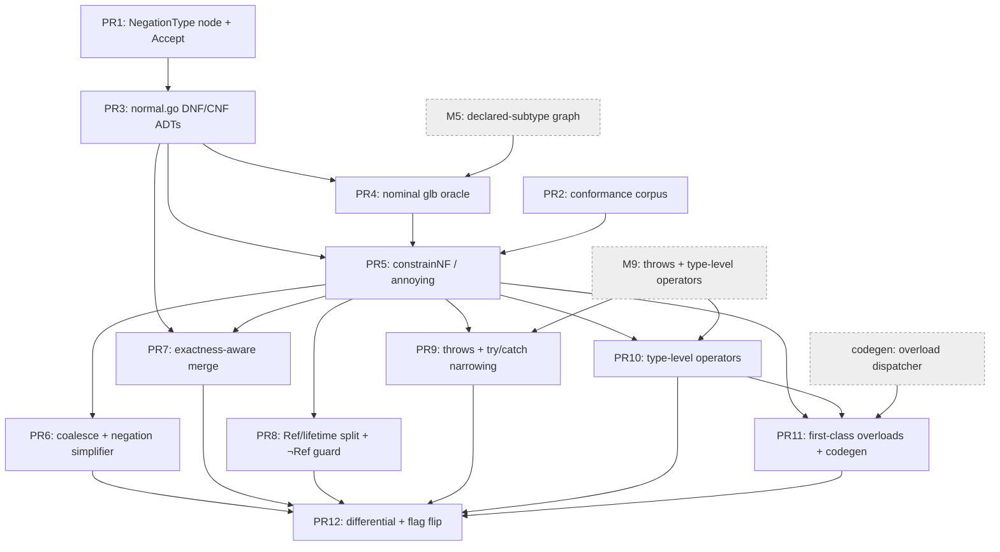

# 07 — Implementation plan (PR breakdown)

The ordered PRs that take `internal/solver/` from Simple-sub to MLstruct — a
Boolean algebra of structural types with first-class negation. Each PR lists the
**data structures** and **algorithms** it adds or changes, its dependencies, and
its test surface. The dependency graph and a mermaid diagram are in the last
section.

This is the PR-level decomposition; per-PR file-by-file sketches are left to the
session that picks up each PR. The work realizes the seams in
[03-graft-sketch.md](03-graft-sketch.md), threads the feature interactions in
[04-type-level-operators.md](04-type-level-operators.md) and
[05-feature-interactions.md](05-feature-interactions.md), and discharges the open
items in [06-open-items.md](06-open-items.md).

**Assumptions.** The `simple_sub` M-series is complete through at least M9 (so the
type-level operators, `throws`, classes, exactness, and lifetimes all exist), and
adoption is warranted per [00-overview.md](00-overview.md). The Simple-sub core —
`TypeVarType` bounds, levels, `extrude`, `probe`, the M6 PR2.5 `trialAndCommit`
helper — carries over unchanged except where noted.

**External prerequisites** referenced below: **M5** (the declared-subtype graph
that backs the nominal `glb` oracle), **M9** (`throws` and the type-level
operators), and **codegen** (`internal/codegen/builder.go`'s overload dispatcher).

---

## Phase A — Representation

### PR1 — `NegationType` node and polarity-flipping traversal

Add the one new surface node and thread it through every structural pass, with no
constraint behavior yet.

- **Data structures.** `soltype.NegationType{Inner Type}` in
  [type.go](../../internal/soltype/type.go), sealed via `isType()`.
- **Algorithms.**
  - `NegationType.Accept` in [visitor.go](../../internal/soltype/visitor.go) that
    visits `Inner` at `pol.Flip()` — the one node that inverts polarity, mirroring
    how `FuncType.Accept` flips its params. This single method threads negation
    through `coalesce` / `extrude` / `freshenAbove`, which all ride on `Accept`.
  - `LevelOf` arm (`return LevelOf(t.Inner)`).
  - `equalType` (structural), `compareType` / `typeKindOrder` slot for canonical
    ordering ([coalesce.go](../../internal/solver/coalesce.go),
    [lattice.go](../../internal/solver/lattice.go)).
  - Printer arm in [print.go](../../internal/soltype/print.go) rendering `¬T`
    (surface syntax provisional; no `Not<T>` parser support required here).
- **Depends on.** Nothing (additive).
- **Tests.** Node round-trips through the printer; `Accept`-based identity rewrite
  preserves a `¬(A → B)` and flips polarity correctly; `LevelOf` and `equalType`
  on nested negations.

### PR2 — Arrow-intersection conformance corpus (test oracle)

Tests-only PR that lands the sound-verdict oracle later PRs assert against — open
item 1 ([06-open-items.md](06-open-items.md)).

- **Data structures.** A table of `(intersection type, target type, sound verdict)`
  rows in a new `constrain_nf_test.go`, derived by hand from the
  Frisch–Castagna–Benzaken arrow decomposition, plus the MLscript-observed column
  to be filled during PR5's verification.
- **Algorithms.** None — it is the oracle, not the implementation. Seed the corners:
  same-domain/different-codomain, different-domain/same-codomain (doc 04 example A),
  different/different (example B), overlapping domains, nested arrows, a free-var arm.
- **Depends on.** Nothing (independent; can land in parallel with PR1).
- **Tests.** The table itself; initially `t.Skip` on the not-yet-implemented path.

---

## Phase B — Normal forms

### PR3 — The `solver/normal.go` DNF/CNF module

The heart of the approach: the normal-form ADTs and their Boolean algebra, ported
from MLscript's `NormalForms.scala`. Solver-internal and transient — never in
`Info` or coalesced output.

- **Data structures.** `DNF{Conjuncts []Conjunct}`, `CNF{Disjuncts []Disjunct}`;
  `Conjunct{Lnf LhsNf; Vars set.Set[*TypeVarType]; Rnf RhsNf; NVars set.Set[...]}`
  reading as `Lnf ∩ (⋂Vars) ∩ ¬Rnf ∩ (⋂¬NVars)`, and its dual `Disjunct`; `LhsNf`
  (at most one of each structural kind plus the nominal base) and `RhsNf` (the dual
  union).
- **Algorithms.**
  - `DNF.mk` / `mkDeep(t, pol)` — push a `soltype.Type` into DNF; the
    `NegationType` case is `DNF(CNF.mk(t, !pol).map(neg))`.
  - `Conjunct.and` / `.or` and `Conjunct.neg` (De Morgan as a field permutation).
    **Reuse [lattice.go](../../internal/solver/lattice.go)**: `newIntersection` /
    `newUnion` for structural merges, `subsumeMembers` to drop subsumed parts,
    `compareType` / `sortTypes` for canonical member order.
  - `tryMergeUnion` / `tryMergeInter` — lossless merge or keep separate; **keep
    un-mergeable members separate, never collapse to ⊤** (caveat #4,
    [02-caveats-and-mitigations.md](02-caveats-and-mitigations.md)).
- **Depends on.** PR1 (negated atoms need `NegationType`).
- **Tests.** `type → DNF → type` round-trips; De Morgan on `¬(A ∩ B)`; merge-vs-keep
  for `{x} | {y}`; unit tests fully isolated from `constrain`.

### PR4 — Nominal `glb` oracle for the `LhsNf` base slot

Wire the class-tag base of `LhsNf` to the M5 declared-subtype graph.

- **Data structures.** A `ClassNode` reference in `LhsNf.base` carrying the class
  identity and its M5 parent set.
- **Algorithms.** `glb(c, d)` over class nodes delegating to the M5 declared-subtype
  graph: unrelated classes return "no glb," which makes the conjunct `never` and
  drops it (the caveat #1 combinatorial fast path). `subtype(c, parent)` via graph
  reachability, reusing M5's nominal `constrain` arm.
- **Depends on.** PR3 (LhsNf exists); **M5** (the graph).
- **Tests.** `C & D` unrelated ⟹ `never`; `C <: P` via the declared graph; a
  conjunct mixing two structural kinds collapses.

---

## Phase C — Constraint solving

### PR5 — `constrainNF` / `annoying` wired into `constrain`

The core algorithmic change: replace the exists-rule trial-and-commit with
deterministic normalization. This is the PR that makes the solver an MLstruct
solver.

- **Data structures.** No new persistent state; reuses the existing `seen`
  cache, which already keys arbitrary `(sub, super)` pairs — the coinductive keying
  normalization needs.
- **Algorithms.**
  - `constrainNF(sub, super)` = `annoying(DNF.mkDeep(sub, Positive),
    CNF.mkDeep(super, Negative))`.
  - `annoying` / `annoyingImpl` — the worklist over `(ls, rs)` accumulating
    `done_ls LhsNf` / `done_rs RhsNf`, generating each implied `conjunct <:
    disjunct`. Moves: leading positive variable ⟹ record the rest of the conjunct
    as a *negated* bound on the variable (`rec(v, mkRhs(rest))`); union-left /
    intersection-right ⟹ flatten; `NegationType` ⟹ move across `<:`; `⊥`-left /
    `⊤`-right ⟹ discharge; base case ⟹ class-tag-vs-parent (PR4), func-vs-func /
    field-vs-field recursing into the existing `constrain` (`rec`), else
    `CannotConstrainError`.
  - **Seam:** route the M6 PR2.5 `trialAndCommit` exists-rule call sites
    (union-super, intersection-sub, and the overload subtype check) to
    `constrainNF` instead of the probe trial. The existing structural `switch`
    (the `rec` layer) and the deterministic "for all" rules stay untouched; the
    `probe` machinery stays for non-subtyping speculation (`subsumeMembers`,
    assignment probing).
  - **Verification gate:** fill PR2's MLscript-observed column and confirm the
    solver matches the *sound* column; where MLscript diverges, follow the sound
    verdict (caveat #4).
- **Depends on.** PR3, PR4; asserts against PR2.
- **Tests.** PR2's corpus now runs; example A gives `callable`, example B gives
  `not`; a `¬T` constraint records a negated bound; no regression in the existing
  `constrain_test.go` union/intersection suites.

---

## Phase D — Coalescing and display

### PR6 — Coalesce negation + the disjointness-aware simplifier

Make negation renderable and inferred types readable — caveat #2.

- **Data structures.** None new.
- **Algorithms.**
  - A `NegationType` arm in the coalescer
    ([coalesce.go](../../internal/solver/coalesce.go)) rendering a negated bound as
    `¬T`; `coalesceScheme`'s occurrence / single-polarity logic unchanged.
  - The disjointness-aware negation simplifier in
    [simplify.go](../../internal/solver/simplify.go): `T ∩ ¬U → T` when `T` and `U`
    are provably disjoint, using the M5 class-tag and M6 literal/primitive
    disjointness facts; reuse `subsumeMembers` / `compareType`. Runs post-coalesce,
    never inside `constrain`.
- **Depends on.** PR5 (negations now appear in bounds and output).
- **Tests.** `(string | number) ∩ ¬string` renders as `number`; nested-guard
  accumulation stays collapsed given binding-based narrowing; an irreducible
  `T ∩ ¬Tag` over an abstract `T` renders faithfully.

---

## Phase E — Feature threading (parallelizable after PR5)

### PR7 — Exactness-aware normalization merge

Ensure the normal-form merges respect Escalier's exactness semantics —
[05-feature-interactions.md](05-feature-interactions.md) §"Exact / inexact".

- **Data structures.** `Inexact` flags carried on the `LhsNf` / `RhsNf` structural
  atoms.
- **Algorithms.** The object/tuple/func merge in `normal.go` delegates to the
  exactness-aware `newIntersection` / `newUnion` rather than a blind field-union, so
  two exact objects with differing required fields meet to `never` while inexact
  ones union fields; negated atoms carry the flag.
- **Depends on.** PR3 (merge ops), PR5 (reachable through solving).
- **Tests.** exact `{x} & {y}` ⟹ `never`; inexact `{x, ...} & {y, ...}` ⟹
  `{x, y, ...}`; `¬{x}` vs `¬{x, ...}` stay distinct.

### PR8 — Ref-atom lifetime split and the `¬Ref` exclusion invariant

Integrate the lifetime second sort into normalization and close open item 2.

- **Data structures.** A `RefType`-shaped atom in `LhsNf` carrying inner + lifetime
  separately.
- **Algorithms.**
  - Ref-atom merge splits work by sort: inner combines in the type algebra, the
    lifetime combines via `constrainLt` (the lifetime meet); a lifetime-only-differing
    ref union factors to `mut ('a | 'b) T` via the existing M4 D4 single-carrier
    logic.
  - **Invariant enforcement:** `DNF.mk`'s `NegType` case / the `NegationType` smart
    constructor panics when handed a `RefType` operand (fail loud, per the
    `AsProperty` convention); refs stay a `rec`-layer atom and never enter
    `constrainNF`. `mut 'a ¬T` (negation *inside* the inner) is allowed and
    normalizes its inner normally.
- **Depends on.** PR5.
- **Tests.** `(mut 'a T) | (mut 'b T)` factors correctly; `¬(mut 'a T)` panics;
  `mut 'a ¬T` normalizes its inner; every borrow-narrowing path stays in `rec`.

### PR9 — `throws` threading and native try/catch narrowing

Carry `throws` through arrow normalization and resolve M9's open narrowing question.

- **Data structures.** The existing `FuncType.Throws` field, now merged inside the
  normal-form arrow atom.
- **Algorithms.** `Throws` rides parallel to `Ret` in the arrow-intersection merge
  and the Lemma-6.8 decomposition (covariant, checked per overload). `try`/`catch`
  narrowing becomes the native set difference `surrounding_throws = body_throws ∩
  ¬caught`, replacing M9's conservative two-variable encoding.
- **Depends on.** PR5; **M9** (`throws`).
- **Tests.** overloaded-throws subtyping; a `catch` of a concrete type subtracts it
  from the body's inferred throws; the fidelity boundary when caught types are
  abstract.

---

## Phase F — Operators and overloading (depend on M9 / codegen)

### PR10 — Type-level operator interactions

Thread negation through the M9 operators and upgrade the set-difference family —
[04-type-level-operators.md](04-type-level-operators.md).

- **Data structures.** `NegationType` arms in the `keyof` / indexed-access / mapped
  / conditional reducers; a Boolean key-set representation for mapped-type keys
  (`keyof T ∩ ¬K`).
- **Algorithms.**
  - Native set difference: `Exclude<U,V>` = `U ∩ ¬V`, `NonNullable` = `T ∩ ¬(null |
    undefined)`, `Omit` keys = `keyof T ∩ ¬K` — total on type variables, not just
    ground unions. Choose and document TS-distributive vs native-`∩¬` per operator.
  - Distribution composition: `keyof (A | B) = keyof A ∩ keyof B`; indexed access
    distributes over unions; mapped types iterate a Boolean key set.
  - Conditional `T extends U ? X : Y` now decides its branch via the new `<:`
    (caveat #4 becomes user-visible here — the PR2/PR5 verification gates this).
  - `infer` matches the positive structural skeleton; negated members are
    non-matching.
- **Depends on.** PR5; **M9** (operators).
- **Tests.** `Exclude`/`Omit`/`NonNullable` over variable operands; doc 04 examples
  A/B as conditional-type results; `keyof`-of-union distribution; `infer` over a
  merged arrow intersection.

### PR11 — First-class arrow-intersection overloads and codegen reconciliation

Make overload types lattice-first (trigger 3) and reconcile with the runtime
dispatcher — [05-feature-interactions.md](05-feature-interactions.md) §"Function
overloading", open item 3.

- **Data structures.** An arm→body side map kept alongside the fused lattice type
  (normalization is body-agnostic); the overload display type as a genuine `(A → B)
  ∩ (C → D)`.
- **Algorithms.**
  - Fold overload resolution into the lattice via the arrow-decomposition rule, so a
    recursive-group overload need not pick a branch — the intersection is one
    fixed-point type; the mutual-recursion annotation requirement relaxes for
    *inference*.
  - Reconcile static resolution with `buildOverloadedFunc` / `buildTypeGuard`
    (`internal/codegen/builder.go`): the dispatcher consumes per-arm annotations, so
    scope the trigger-3 relaxation to inference and display and keep the annotation
    obligation wherever a dispatcher is generated; verify static resolution selects
    the same arm the dispatcher routes to (example A is where they can disagree).
- **Depends on.** PR5, PR10; **codegen**.
- **Tests.** un-annotated recursive-group overload infers; overload-resolution
  conformance rows (static vs dispatcher agree); implemented overload without per-arm
  annotations is rejected at codegen.

---

## Phase G — Integration

### PR12 — Differential, flag-gated rollout, and flip to default

> **Status.** Shipped by a different route than the flag-and-flip mechanics
> below. MLstruct normalization has been the sole `constrain` path since PR5, so
> there is no solver-mode flag and nothing to flip inside `internal/solver`. The
> conformance oracle and the new-checker corpus stand in for the differential, and
> the production flip is deferred to the Simple-sub M12 cutover. See
> [08-pr12-rollout-status.md](08-pr12-rollout-status.md) for the blessed-improvement
> table and coverage bounds.

Ship it behind a flag, triage divergences, then default it on.

- **Data structures.** A solver-mode flag; a divergence-triage bucket in the
  conformance harness.
- **Algorithms.** Run the MLstruct path over the new-checker conformance corpus and
  the `fixtures/` tree; bucket every divergence from the Simple-sub baseline as
  match / intended-improvement / bug; gate CI on the bug bucket; flip the default
  once the bug bucket is empty.
- **Depends on.** PR6, PR7, PR8, PR9, PR10, PR11.
- **Tests.** The full corpus green under the MLstruct path; a documented list of
  blessed intended improvements.

---

## Dependency graph

**Critical path:** PR1 → PR3 → PR4 → PR5, then the Phase-E/F PRs fan out from PR5
and reconverge at PR12. PR2 is independent and joins at PR5 as the verification
oracle. Phase E (PR7–PR9) and Phase F (PR10–PR11) are mutually independent and can
proceed in parallel once PR5 lands. PR6 (display) is likewise parallel after PR5.

External milestones gate specific PRs rather than the whole effort: **M5** → PR4,
**M9** → PR9 and PR10, **codegen** → PR11.

**Reading the graph.** PR1–PR5 is a linear spine — the representation, the
normal-forms module, the nominal oracle, and the constraint-solving graft must land
in order. Everything downstream of PR5 is a fan-out of independent concerns
(display, exactness, lifetimes, throws, operators, overloading) that reconverge only
at the PR12 rollout, so the second half of the effort parallelizes across
contributors. The dashed nodes are external milestones already assumed complete;
they are drawn only to show which PR each one unblocks.
