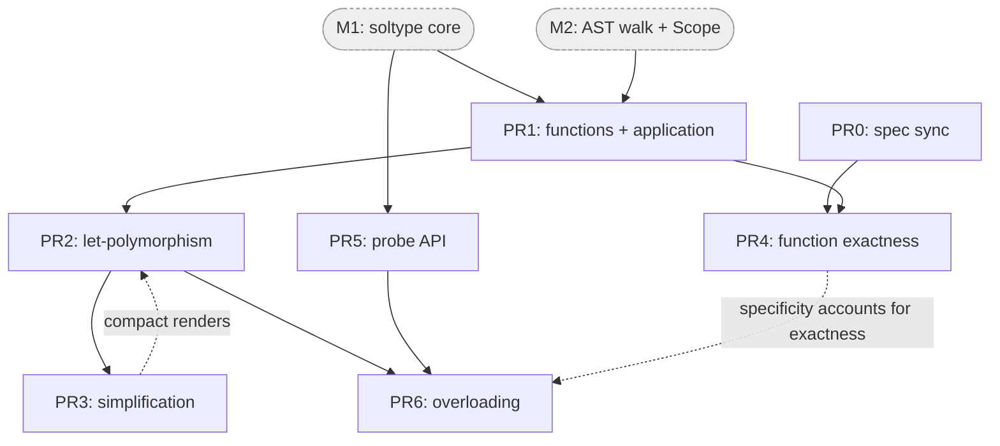

# M3 — Functions, application, let-polymorphism — implementation plan

Concrete, PR-by-PR plan for landing milestone **M3** of the SimpleSub checker
(`internal/solver/`). Read [01-milestones.md](01-milestones.md) §"M3" for the
milestone definition and [02-design-notes.md](02-design-notes.md) for the
`soltype` shapes this plan promotes. Names are provisional and follow the
design-notes leaf-name decision (`internal/solver/`, types in `soltype/`).

## What M3 delivers

M3 turns the soltype scaffolding from M1/M2 into a real function-language
checker. Five workstreams, in dependency order:

1. **Functions + application + multi-arg** — lambda/`fn` decls and call
   expressions inferred against the real AST, with the function `constrain`
   rule (params contravariant, return covariant).
2. **Level-based let-polymorphism** — schemes (`MonoScheme`/`PolyScheme`),
   `instantiate`, `freshenAbove`, and generalization at binding boundaries
   threaded through the AST walk by level.
3. **The simplification pass** — single-polarity elimination + co-occurrence
   variable merging, so generalized signatures render compactly and
   parameter-only variables coalesce to `unknown` rather than a vacuous `<T0>`.
4. **Function exactness** — the `exact` flag on `FunctionType` plus the
   accept-set subtyping model and direct-call arity rule from
   escalier-lang/escalier#677.
5. **Function overloading (free functions)** — overload sets as side-channel
   metadata, call-site resolution as a separate phase from `constrain`, with
   the ground-enough / specificity / mutual-recursion-needs-annotation rules.

## Prerequisites (M1 + M2 must be merged)

M3 has no new infrastructure of its own except the **probe API** (see PR 5); it
builds entirely on what M1 and M2 stand up. Before starting, the following must
exist in `internal/solver/`:

- **From M1:** `soltype.TypeVarType` (bound lists + level), `PrimitiveType`,
  `LiteralType`, `FunctionType`, `TupleType`; `constrain(lhs <: rhs)` with the
  coinductive seen-cache, levels + extrusion; polarity-driven `coalesce`; the
  `soltype` printer; the `Info` side table (`map[ast.Node]soltype.Type` +
  `TypeOf`/`setType`).
- **From M2:** the constraint-generating AST walk (`infer.go`) driving from
  real `*ast.Module` via `dep_graph`/`resolver`; the owned
  `Scope`/`Binding`/`Namespace`; the fixture-style table-test harness that
  asserts rendered binding types from `.esc` source.

> **Note on the M1/M3 boundary.** M1's acceptance ("an identity term renders
> `fn <T0>(x: T0) -> T0`") is over a **hand-built** soltype term, exercising the
> printer + coalescing on a single variable. M3 is where that render is produced
> **from real source** end-to-end, which additionally requires generalization
> (PR2) and the simplification pass (PR3). The `freshenAbove`/`instantiate`
> and `analyze`/`mergeCoOccurring` code in the spike (`scheme.go`, `simplify.go`)
> is *promoted* here, not invented.

## Sequencing rationale

Seven PRs (PR0–PR6) across two prerequisites (M1, M2). The diagram shows the
dependency edges; solid = hard dependency (the downstream PR can't compile or
pass its tests without the upstream one), dashed = soft (downstream lands
correctly without it, but produces a degraded result — non-compact renders, or a
specificity rule that doesn't yet account for exactness — until the upstream PR
fills it in).



Three independent tracks fall out of the graph, exploitable for parallelism:
the **function-core chain** (PR1 → PR2 → PR3), **exactness** (PR0 → PR4, joining
after PR1), and the **probe API** (PR5, gated only on M1). Overloading (PR6) is
the join point where the schemes track (PR2), the probe (PR5), and — softly —
exactness (PR4) all converge.

- **PR1 → PR2 → PR3 is a hard chain.** Application needs function types (PR1).
  Generalization needs application working so that polymorphic uses actually
  instantiate (PR2). The Category-A acceptance renders (`fn <T0>(x: T0) -> T0`,
  the `unknown` improvement) only become *correct and compact* once
  simplification runs (PR3) — before it, generalized signatures render with
  redundant or single-polarity variables. (PR2's `generalize` calls `simplify`,
  so the PR3 → PR2 edge is soft: PR2 lands with a no-op `simplify` and PR3 makes
  the renders compact.)
- **PR4 (exactness) depends on PR1** (it reworks the function subtyping case)
  but is independent of PR2/PR3, so it can land in parallel with PR2/PR3 once
  PR1 is in. It is gated on **PR0 (spec-sync)** because the default it encodes
  (exact bare `fn`, inexact `fn(..., ...)`) must be recorded in the spec before
  the implementation asserts it. Direct-call arity and the `constrainCall`
  obligation live in **PR1**, not here — PR4 owns only the `exact`/`required`
  representation and the accept-set *subtyping* rule.
- **PR5 (probe API) depends only on M1.** It is general speculation
  infrastructure (length-snapshot journal over bound lists + side-table cleanup
  closures), independently unit-testable, and reused well beyond M3 (M4
  mutability transitions, M8 conditional-branch selection, `satisfies`). Split
  out of overloading so it can be built and reviewed on its own and so PR6's
  risk is contained to the resolution logic.
- **PR6 (overloading) depends on PR2** (it bundles per-overload *schemes*) and
  **PR5** (each candidate trial runs under a probe), and softly on **PR4** (the
  one specificity ordering must account for the exact/inexact distinction). It
  is the highest-uncertainty PR; keeping it last lets the function core and the
  probe settle first, and it is the one piece that can ship in a reduced form
  (declaration-order first-match) without blocking M4.

## Core types added or changed in M3

The sketches below use design-notes `soltype` naming (`FunctionType`,
`TypeVarType`, …) and are **illustrative, not final** — field names and exact
shapes are settled in code review. `// ...` marks elisions. They show *what M3
adds on top of M1/M2*, not the whole package.

**`FunctionType` grows two fields** beyond the spike's `Function`. Both are
introduced in PR1 with trivial values (`exact: true`, `required: len(params)`)
so the call path compiles; PR4 gives `exact` real variance and refines
`required` from optional-param (`x?`) detection:

```go
// soltype/type.go — promoted from spike Function, extended for M3.
type FunctionType struct {
    params     []Type   // parameter types, in declared order
    paramNames []string // parallel to params; for rendering only
    required   int      // # of args that MUST be supplied (optionals lower this)
    ret        Type
    exact      bool     // bare fn(...) ⇒ true; fn(..., ...) ⇒ false  (varies in PR4)
}
```

**Schemes** (let-polymorphism, PR2) — promoted verbatim from `scheme.go`:

```go
// solver/poly.go
type TypeScheme interface{ isScheme() }

type MonoScheme struct{ ty Type }            // param, current-level RHS, LetRec self-ref
type PolyScheme struct{ level int; body Type } // generalized: freshen vars with level > level

func (*MonoScheme) isScheme() {}
func (*PolyScheme) isScheme() {}
```

**`ValueBinding` carries either a scheme or an overload set** (PR6). An
overloaded symbol is *not* a single `soltype.Type` — the disjunction never
enters the lattice:

```go
// solver/scope.go
type ValueBinding struct {
    scheme   TypeScheme   // nil iff this is an overload set
    overload *OverloadSet // non-nil for overloaded fn declarations
}

type OverloadSet struct {
    branches  []TypeScheme // one per declared/inferred overload, declaration order
    annotated bool         // every branch explicitly annotated? (gates recursive groups)
}
```

**The probe** (PR5) — baseline (A) from
[02-design-notes.md](02-design-notes.md) §"Speculative checks," the only new
infrastructure in M3:

```go
// solver/probe.go
type Bounded interface { // implemented by *TypeVarType (and *LifetimeVar in M4)
    boundLengths() (lower, upper int)
    truncateBounds(lower, upper int)
}

type probeEntry struct{ v Bounded; prevLower, prevUpper int }

type Probe struct {
    entries  []probeEntry
    touched  set.Set[Bounded] // dedupe — snapshot only first touch
    cleanups []func()         // Info/Prov side-table rollback closures
    parent   *Probe           // nested probes
    done     bool             // idempotent Discard/Commit
}
```

## PR breakdown

### PR0 — Spec sync: Policy A, the `open` marker, and #677's accept-set model

Pure documentation; no code. Unblocks PR4's assertions and records decisions
the milestones doc flags as "not yet in the spec."

- Add a section to `planning/exact-types/requirements.md` recording **Policy A**
  (usage-inferred record shapes coalesce as *exact*; row polymorphism is opt-in
  via the `open` parameter marker) and the `open` keyword (provisional). This is
  the M3 prerequisite called out in
  [01-milestones.md](01-milestones.md) and [02-design-notes.md](02-design-notes.md)
  §"Exactness".
- Rewrite §4.2 per escalier-lang/escalier#677: **direct calls reject extra args
  regardless of exactness**; **exactness governs callback subtyping** via the
  accept-set model (`G <: F` iff `accept(G) ⊇ accept(F)`, params contravariant,
  return covariant; exact `fn(p1..pn)` accepts `[required, n]`, inexact accepts
  `[required, ∞)`).
- Close the loop on #677's "knock-on": the M3 acceptance line in the milestones
  doc already reflects the accept-set model — confirm and cross-link.

**Why first:** PR4's tests assert exact-by-default function behavior; that
default must be blessed in the spec before it is encoded in tests
(Settled Decision #6 — "tests assert what the implementation produces").

---

### PR1 — Function inference + application + multi-arg

Promote the spike's `*Lambda`/`*App` handling (`infer.go:140–170`) onto the real
AST. Most of the constrain machinery already exists from M1; this PR is the
**AST walk** for functions plus multi-arg generalization of the spike's
single-arg `App`.

- **`*ast.FuncExpr` / `fn` decl** → a fresh var per unannotated param (annotated
  params take their `TypeAnn`); infer the body in a child scope binding each
  param to a `MonoScheme`; build `FunctionType{params, paramNames, ret}`.
  `info.setType` on the node and each param.
- **`*ast.CallExpr`** → infer callee and each arg; run `checkDirectCallArity`
  for the call-site arity check (too-many / too-few args); then allocate a fresh
  result var and emit a **call obligation** (`constrainCall`, sketched below) —
  *not* a `FunctionType <: FunctionType` subtype assertion. Arity is owned by the
  call-site check, so the obligation only relates arg/return types and lets an
  unresolved callee resolve structurally. Generalize the spike's single-arg `App`
  to N args. (In PR1 `required == len(params)`, so `checkDirectCallArity` rejects
  any omitted arg; PR4's optional-param detection relaxes that for `x?` params.)
- **Function `constrain` rule** (already in M1 from the spike, `constrain.go:137`)
  — verify the multi-arg/variance path used by **function-to-function**
  subtyping (assignment, callback slots): `len(l.params) <= len(r.params)` arity
  check (the *inexact* fewer-params rule, replaced by the accept-set rule in
  PR4), params contravariant, return covariant. Direct calls do **not** go
  through this rule — they use `constrainCall`.
- **Multi-statement bodies / `return`** as needed by real `FuncExpr` bodies
  (the spike's IR had expression bodies only); a body with no value infers
  `Void`.

**Sketch:**

```go
// solver/infer.go — the constraint-generating walk (replaces spike typeTerm).
func (c *checker) inferFuncExpr(n *ast.FuncExpr, s *Scope) Type {
    child := s.child()
    params := make([]Type, len(n.Params))
    names := make([]string, len(n.Params))
    for i, p := range n.Params {
        var pt Type
        if p.TypeAnn != nil {
            pt = c.typeFromAnn(p.TypeAnn, child)
        } else {
            pt = c.freshVarAt(p, ParamBinding) // fresh inference var + Prov entry
        }
        params[i] = pt
        names[i] = p.Name
        child.values[p.Name] = ValueBinding{scheme: &MonoScheme{ty: pt}}
    }
    ret := c.inferBlock(n.Body, child) // Void if the body yields no value
    f := &FunctionType{params: params, paramNames: names,
        required: len(params), ret: ret, exact: true} // exact/required refined in PR4
    c.info.setType(n, f)
    return f
}

func (c *checker) inferCallExpr(n *ast.CallExpr, s *Scope) Type {
    callee := c.inferExpr(n.Callee, s)
    args := make([]Type, len(n.Args))
    for i, a := range n.Args {
        args[i] = c.inferExpr(a, s)
    }
    c.checkDirectCallArity(n, callee, len(args)) // call-site arity (too many / too few)
    res := c.freshVarAt(n, Application)
    // Call obligation, NOT function subtyping: relates arg/return types and lets
    // an unresolved callee resolve structurally; arity is owned above.
    c.constrainCall(callee, args, res)
    c.info.setType(n, res)
    return res
}
```

```go
// solver/constrain.go — function-to-function subtyping (PR1 baseline; reworked
// to the accept-set rule in PR4). Direct calls use constrainCall, not this rule.
case *FunctionType:
    if r, ok := rhs.(*FunctionType); ok {
        if len(l.params) > len(r.params) { // fewer-params-is-subtype (inexact case)
            return arityError(l, r)
        }
        var errs []error
        for i := range l.params {
            errs = append(errs, c.constrain(r.params[i], l.params[i], seen)...) // contravariant
        }
        return append(errs, c.constrain(l.ret, r.ret, seen)...) // covariant
    }
```

```go
// solver/constrain.go — direct-call obligation; no accept-set arity gate.
func (c *checker) constrainCall(callee Type, args []Type, res Type) {
    if f, ok := peelToFunc(callee); ok {
        n := min(len(args), len(f.params))
        for i := 0; i < n; i++ {
            c.constrain(args[i], f.params[i]) // arg flows into param
        }
        c.constrain(f.ret, res)
        return
    }
    // Unresolved callee: record the call shape as an application-tagged bound so
    // resolution relates it structurally, not via the accept-set <: rule.
    c.recordCallObligation(callee, args, res)
}

// solver/infer.go — call-site arity; in PR1 every param is required, so this also
// catches omitted args. PR4's optional-param detection lowers f.required for x?.
func (c *checker) checkDirectCallArity(n *ast.CallExpr, callee Type, argc int) {
    f, ok := peelToFunc(callee) // through aliases / a resolved var bound
    if !ok {
        return // not (yet) known to be a function; the obligation handles it
    }
    switch {
    case argc > len(f.params):
        c.error(n, TooManyArgsError{Got: argc, Want: len(f.params)})
    case argc < f.required:
        c.error(n, TooFewArgsError{Got: argc, Required: f.required})
    }
}
```

**Tests:** monomorphic function inference from real source — application type
flows (`val n = (fn (x) { return x + 1 })(5)` ⇒ `n: number`), arity mismatch
errors (full message), contravariant-param / covariant-return acceptance and
rejection cases. No generalization yet — top-level `fn id` still renders with a
raw inference variable at this point (a temporary, asserted as such or deferred
to PR3).

**Risk:** low. This is mechanical promotion of proven spike code; the constrain
rule is already M1-tested on hand-built terms.

---

### PR2 — Level-based let-polymorphism

Promote `scheme.go` (`TypeScheme`/`MonoScheme`/`PolyScheme`, `instantiate`,
`freshenAbove`) and wire level discipline through the AST walk.

- **Schemes in the scope.** `ValueBinding` carries a `TypeScheme`. Param
  bindings and current-level `let` RHS-during-inference and `LetRec` self-refs
  are `MonoScheme` (returned as-is by `instantiate`); generalized top-level/inner
  `let`/`fn` decls are `PolyScheme` (trigger `freshenAbove` + a
  `FromInstantiation` provenance entry).
- **Level threading.** Type a binding's RHS at `lvl+1`, then generalize:
  variables created at `> lvl` become quantifiable; captured outer variables
  (`level <= lvl`) do not. This is the spike's `*Let` rule
  (`infer.go:171–179`) over real decls, with module-level declaration order
  driven by the existing `dep_graph` SCC order (matching how the old checker
  handles mutual recursion).
- **Recursive groups.** Promote `*LetRecGroup` (`infer.go:185–216`): one fresh
  var per binding, all visible in every RHS, constrain each RHS `<:` its var,
  generalize the whole SCC at the shared level boundary. No placeholder phase,
  no `typeRefsToUpdate` patching.
- **`IdentExpr` value-position lookup** calls `instantiate` uniformly; only the
  `PolyScheme` case does work. Namespace-in-value-position is a
  `NamespaceUsedAsValueError` (per [02-design-notes.md](02-design-notes.md)
  §"infer.go"); unknown identifiers are `UnknownIdentifierError`.
- **`freshenAbove` lifetime caveat.** The spike copies a carrier's lifetime by
  reference rather than freshening it (`scheme.go:29–39`). M4 introduces
  lifetimes properly; for M3 there are no lifetime-carrying types yet, so this
  is a non-issue — but leave a `// M4:` marker where `freshenAbove` will need a
  lifetime cache.

**Sketch:**

```go
// solver/poly.go — promoted from scheme.go.
func (c *checker) instantiate(s TypeScheme, lvl int) Type {
    switch sc := s.(type) {
    case *MonoScheme:
        return sc.ty // no freshening
    case *PolyScheme:
        return c.freshenAbove(sc.level, sc.body, lvl, map[int]*TypeVarType{}) // + FromInstantiation Prov
    }
    panic("unreachable")
}

// freshenAbove copies ty, replacing each var with level > lim by a fresh var at
// lvl (bounds freshened too); vars at level <= lim are shared. // M4: thread a
// lifetime cache here so generalized lifetimes freshen per-instance.
func (c *checker) freshenAbove(lim int, ty Type, lvl int, cache map[int]*TypeVarType) Type { /* ... */ }

// generalize runs at a binding boundary once the RHS has finished inferring.
func (c *checker) generalize(body Type, lvl int) TypeScheme {
    body = c.simplify(body, lvl) // PR3 — compact the signature before quantifying
    return &PolyScheme{level: lvl, body: body}
}
```

```go
// solver/infer.go — module-level: dep-graph SCC order drives declaration order.
func (c *checker) inferModule(m *ast.Module) {
    for _, scc := range c.deps.SCCsInTopoOrder(m) {
        c.checkOverloadAnnotations(scc) // PR6 gate (no-op until overloading lands)
        c.inferSCC(scc)                 // fresh var per binding, constrain RHS <: var, generalize
    }
}
```

**Tests:** polymorphic instantiation — `val id = fn (x) { return x }` used at two
types; let-bound polymorphism captured correctly (inner `let` generalizes after
its RHS finishes); recursive and mutually-recursive groups infer without
annotations. Renders may still be non-compact until PR3 — assert via the
two-types-of-use behavior rather than the printed signature where simplification
is load-bearing.

**Risk:** low–medium. The level discipline is the subtle part; the spike proves
it, and the dep-graph SCC ordering is the only new (M2-provided) ingredient.

---

### PR3 — The simplification pass

Promote `simplify.go` (`analyze` single-polarity elimination, `symmetrize`,
co-occurrence collection, union-find `mergeCoOccurring`) and run it at
generalization boundaries before coalescing.

- **Single-polarity elimination.** A variable that occurs only positively or
  only negatively in the generalized type is replaced by its bound (or by
  `never`/`unknown` for the empty case) — this is what turns a parameter-only
  variable with no lower bounds into `unknown` in negative position (the
  blessed `unknown`-vs-vacuous-`<T0>` improvement, [03-references.md](03-references.md)
  §"Lattice 1").
- **Co-occurrence merging.** Variables that co-occur in every polarity they
  appear in are merged via union-find, so `fn <T0>(x: T0) -> T0` renders with one
  type parameter, not several aliased ones.
- **Wire into the pipeline:** run `analyze` → `symmetrize` → `collectCoOcc` →
  `mergeCoOccurring` on a `PolyScheme`'s body at generalization time, feeding the
  merged result into `coalesce` and then the printer.

**Sketch:**

```go
// solver/simplify.go — promoted from simplify.go; pipeline orchestrated here.
func (c *checker) simplify(ty Type, lvl int) Type {
    // 1. occurrence analysis: which polarities does each var appear in?
    occ := map[int]map[Polarity]bool{}
    analyze(ty, Positive, occ, map[polKey]bool{})

    // 2. co-occurrence: which vars share a union/intersection node, per polarity?
    vars := map[int]*TypeVarType{}
    collectVars(ty, vars)
    symmetrize(vars) // mirror one-sided var<:var bounds so each var sees all its facts
    coOcc := map[polKey]map[int]bool{}
    collectCoOcc(ty, Positive, coOcc, map[polKey]bool{})

    // 3. merge vars that co-occur in EVERY polarity they appear in.
    uf := mergeCoOccurring(vars, occ, coOcc)

    // 4. rewrite: drop single-polarity vars (-> their bound, or unknown/never for
    //    the empty case), apply union-find representatives.
    return rewrite(ty, occ, uf)
}

// analyze / collectVars / collectCoOcc / mergeCoOccurring port directly from the
// spike; the Mut->Ref and ResidualOp bipolarity special cases come along in M4/M8.
func analyze(st Type, pol Polarity, occ map[int]map[Polarity]bool, seen map[polKey]bool) { /* ... */ }
func mergeCoOccurring(vars map[int]*TypeVarType, occ map[int]map[Polarity]bool,
    coOcc map[polKey]map[int]bool) *unionFind { /* ... */ }
```

**Tests — the Category-A acceptance from the milestone, against real source:**

| Case | Expected render |
|---|---|
| `TopLevelLetPolymorphism` (`val id = fn (x) { return x }`) | `fn <T0>(x: T0) -> T0` |
| `IdentityPolymorphism` | `fn () -> ["hello", 5]` |
| `InnerCapturesOuterParam` | `fn <T0>(y: T0) -> [T0, T0]` |
| parameter-only var (unused param) | coalesces to `unknown`, not `<T0>` |

These are the spike's M1 differential cases (`simplesub_test.go` /
`differential_test.go`); port the assertions into the new package's table tests
with the **improved** forms.

**Risk:** medium. Simplification is the subtlest algorithm in the set
(occurrence analysis polarity, the `Mut`/`ResidualOp` bipolarity special cases).
It is well-covered by the spike's existing tests, which port directly.

---

### PR4 — Function exactness (accept-set model, #677)

Give `exact` real meaning per the now-synced spec (PR0), and rework
function-to-function subtyping to the accept-set rule. Depends on PR1 (which
introduced the fields and the call-site machinery) and PR0; can land in parallel
with PR2/PR3. Scope is deliberately narrow: the call-site mechanics
(`constrainCall`, `checkDirectCallArity`) already shipped in PR1 — PR4 changes
only the *subtyping* rule and `required` derivation.

- **Representation + parser.** `exact bool` is already on `soltype.FunctionType`
  (PR1, default `true`); PR4 makes it vary. A bare `fn(...)` stays exact;
  `fn(..., ...)` (trailing `...`) is inexact. Add parser support for the
  trailing-marker on function types if not already present from M2; the old
  checker ignores the flag (parser-level tolerance, per M7's strategy).
- **Callback subtyping = accept-set rule.** Rework the function case of
  `constrain` (the function-to-function rule from PR1, not the direct-call
  `constrainCall`): `G <: F` iff `accept(G) ⊇ accept(F)`, i.e. `rG <= rF`
  (required) **and** `uG >= uF` (upper bound: `n` if exact, `∞` if inexact).
  Params remain contravariant per shared position, return covariant. The spike's
  current "fewer params is a subtype" becomes exactly the **inexact** case
  (`uG = ∞`).
- **Direct-call arity is unchanged by exactness.** `checkDirectCallArity` (PR1)
  already rejects extra args regardless of `exact` — matching TypeScript — and
  it never went through the subtyping rule, so reworking the rule here doesn't
  touch it. Confirm with a test that an *inexact* function still rejects a
  too-many-args direct call.
- **`required` vs `n`.** Optional params lower `required` without changing `n`.
  Wire optional-param detection from the AST (`x?`-style) into `required` (set in
  PR1 to `len(params)`); this simultaneously relaxes `checkDirectCallArity`'s
  lower bound and the accept-set rule's `r`.

**Sketch:**

```go
// solver/constrain.go — accept-set helper + refined function case.
const unboundedArity = math.MaxInt

// acceptSet is the inclusive range of arg-counts a function accepts when invoked.
func acceptSet(f *FunctionType) (lo, hi int) {
    lo = f.required
    if f.exact {
        hi = len(f.params)
    } else {
        hi = unboundedArity
    }
    return
}

case *FunctionType:
    if r, ok := rhs.(*FunctionType); ok {
        // l <: r  iff  accept(l) superset-of accept(r):  loL <= loR  AND  hiL >= hiR.
        loL, hiL := acceptSet(l)
        loR, hiR := acceptSet(r)
        if loL > loR || hiL < hiR {
            return callContractError(l, r)
        }
        var errs []error
        n := min(len(l.params), len(r.params)) // relate shared positions only
        for i := 0; i < n; i++ {
            errs = append(errs, c.constrain(r.params[i], l.params[i], seen)...) // contravariant
        }
        return append(errs, c.constrain(l.ret, r.ret, seen)...) // covariant
    }
```

(The direct-call path — `constrainCall` and `checkDirectCallArity` — shipped in
PR1 and is unchanged here; this rule governs only function-to-function
subtyping.)

**Tests (the milestone's exactness acceptance):**

- Direct calls: both exact `fn(x, y)` and inexact `fn(x, y, ...)` **reject** a
  3-arg call (full error message); both accept 2 args.
- Into a `fn(x, y)` callback slot: `fn(x, y)`, `fn(x, ...)`, `fn(...)` are
  **accepted**; exact `fn(x)` and any 3+-param function are **rejected**.
- Round-trip exact/inexact function types through the printer.

**Risk:** low–medium. The rule is small and precisely specified by #677; the
care is in the `required`/`n`/`exact` bookkeeping and getting the four
acceptance rows exactly right.

---

### PR5 — Probe API (speculation infrastructure)

The **only** new soltype infrastructure in M3, split out from overloading so it
can be built and reviewed on its own. Depends only on M1 (`TypeVarType` bound
lists), so it can proceed in parallel with PR1–PR4. Baseline (A) + (D) from
[02-design-notes.md](02-design-notes.md) §"Speculative checks."

- **Length-snapshot journal (A).** A nullable `*Probe` on `Context`. The first
  mutation of each variable records `(len(lower), len(upper))`; discard truncates
  each touched var's bound slices back. Commit on a nested probe propagates its
  touched set to the parent so an outer discard still covers them.
- **Side-table cleanup closures.** `Info` (node → type) and `Prov` (type →
  origin) writes register an `onRollback` closure so a discarded trial leaves no
  stray hover/error entries. The `seen` cache inside a single `constrain` call is
  *not* a probe concern — it dies with the call frame.
- **Push/pop discipline.** `openProbe` pushes the current-probe pointer;
  `closeProbe(p, commit)` runs `Commit`/`Discard` and pops it back to
  `p.parent`, so `c.probe` never dangles at a finished probe.
- **Fresh-instance retry (D)** is just the existing `instantiate`/`freshenAbove`
  used per-candidate by consumers — no probe state of its own; it composes with
  (A) for the caller-side bounds. No standalone code here beyond documenting the
  pattern.
- Keep it minimal — **no** overlay map, generation tags, or
  `Prune`/`InstanceChain` (none exist in soltype). This API is reused well beyond
  M3 (M4 mutability transitions, M8 conditional-branch selection, `satisfies`,
  `NoInfer`), so getting the shape right here pays off repeatedly.

**Sketch:**

```go
// solver/probe.go — baseline (A).
func (p *Probe) record(v Bounded) {
    if p.touched.Contains(v) {
        return
    }
    p.touched.Add(v)
    lo, hi := v.boundLengths()
    p.entries = append(p.entries, probeEntry{v, lo, hi})
}
func (p *Probe) onRollback(f func()) { p.cleanups = append(p.cleanups, f) }

func (p *Probe) rollback() {
    for i := len(p.cleanups) - 1; i >= 0; i-- { p.cleanups[i]() } // side tables first
    for i := len(p.entries) - 1; i >= 0; i-- {
        e := p.entries[i]
        e.v.truncateBounds(e.prevLower, e.prevUpper)
    }
}
func (p *Probe) Discard() { if !p.done { p.rollback(); p.done = true } }
func (p *Probe) Commit()  { /* hand touched + cleanups to parent; clear entries */ }

func (c *checker) openProbe() *Probe { p := &Probe{parent: c.probe}; c.probe = p; return p }

// closeProbe pops the probe stack after a trial — always paired with openProbe,
// on both the commit and discard paths, so c.probe never dangles at a finished probe.
func (c *checker) closeProbe(p *Probe, commit bool) {
    if commit {
        p.Commit()
    } else {
        p.Discard()
    }
    c.probe = p.parent
}
```

**Tests:** a discarded probe restores bound-list lengths exactly (append-then-
discard is a no-op on the var); a discarded probe runs `Info`/`Prov` cleanups
(no stray entries); a committed nested probe leaves its touched vars covered by
the parent's later discard; nesting depth is balanced (`c.probe` returns to its
original value after paired open/close). All unit tests over hand-built terms —
no overload machinery needed, which is the point of the split.

**Risk:** low. Small, self-contained, and exactly specified by the design notes;
the append-only bound-list representation makes rollback a slice truncation.

---

### PR6 — Function overloading (free functions)

The highest-uncertainty PR. Lands overloaded free `fn` declarations and their
call-site resolution. Depends on **PR2** (per-overload schemes) and **PR5** (each
candidate trial runs under a probe), and softly on **PR4** (the specificity
ordering must account for the exact/inexact distinction).

- **Overload sets as side-channel metadata.** An overloaded symbol's binding
  holds a *set* of declared/inferred schemes, **not** a single `soltype.Type`.
  Infer each overload body individually (each is a normal `fn` with its own
  principal type), then bundle. Never inject the disjunction into the lattice —
  there is no SimpleSub type for "either this arrow or that arrow."
- **Call-site resolution as a separate phase from `constrain`.** At each call,
  collect the argument types' bounds, then pick a single overload and emit
  constraints only for the chosen branch — under a probe (PR5), committing the
  first success and rolling back losers' caller-side bounds.
- **Ground-enough deferral.** If an argument is still a fully unconstrained
  variable, **defer the call** (preferred — let bounds accumulate) or fall back
  to declaration-order first-match. No speculative pinning + backtrack.
- **One documented specificity ordering.** Declaration-order + best-match
  (TypeScript-style), documented in a `doc.go` comment and chosen to interact
  cleanly with subtyping and the exact/inexact distinction from PR4 (M5's
  method overloads and M4's object-arg overloads will reuse this one rule).
- **Mutual recursion forces annotations.** If an overloaded function
  participates in a mutually recursive group, **its overload signatures must be
  annotated** (bodies still checked against them; only the set itself must be
  ground before the group starts) — fixed-point iteration over overload choices
  isn't guaranteed to converge under subtyping. Self-recursion is softer (each
  body inferred with the *other* overload signatures visible). Emit a clear
  error pointing at the unannotated overloaded participant.

**Sketch:**

```go
// solver/overload.go — call-site resolution (D + A), a phase distinct from constrain.
func (c *checker) resolveOverload(set *OverloadSet, args []Type, call ast.Node) (res Type, decided bool) {
    if !groundEnough(args) {
        return nil, false // defer: let more bounds accumulate before choosing
    }
    for _, sig := range orderBySpecificity(set.branches) { // ONE documented ordering
        inst := c.instantiate(sig, c.level).(*FunctionType) // (D) fresh per candidate; branches are fn schemes
        p := c.openProbe()                                  // (A, PR5) wrap caller-side bounds
        ok := c.tryConstrainArgs(args, inst, p)
        c.closeProbe(p, ok) // commit on success, roll back on failure; always pops the stack
        if ok {
            return inst.ret, true
        }
    }
    c.error(call, NoMatchingOverloadError{Set: set, Args: args})
    return nil, true
}

// groundEnough: no argument is a fully-unconstrained variable.
func groundEnough(args []Type) bool { /* ... */ }
```

```go
// solver/infer.go — the mutual-recursion gate, run before inferring an SCC (PR2 hook).
func (c *checker) checkOverloadAnnotations(scc []ast.Decl) {
    if len(scc) <= 1 {
        return // self-recursion is softer; only multi-member groups require annotation
    }
    for _, d := range scc {
        if set := overloadSetOf(d); set != nil && !set.annotated {
            c.error(d, UnannotatedRecursiveOverloadError{Decl: d})
        }
    }
}
```

**Tests:** a two-overload free `fn` resolves per-argument-type at call sites;
declaration-order tie-break is asserted; a deferred-then-resolved call (argument
ground only after later constraints); the mutual-recursion-without-annotation
error (full message); a resolution-rollback test (a losing overload leaves no
bounds on argument vars and no stray `Info` entries — exercising PR5's probe).

**Risk:** **highest in M3.** Overloading is a poor fit for "one principal type
per expression." Mitigations: the probe (PR5) is already proven by the time this
lands; the design notes specify the (D + A) composition precisely; keep the
specificity rule deliberately simple and documented; lean on the ground-enough
*defer* path over guessing. If resolution proves intractable against the real
AST, the fallback is declaration-order first-match for the MVP with a tracked
follow-up — overloading is the one M3 piece that can ship in a reduced form
without blocking M4.

## Risks & gates

- **No M3-level go/no-go gate** (those live at M4's `Ref` rule and M7's
  differential). M3's risk is concentrated in **PR6 (overloading)**; the
  function core (PR1–PR4) and the probe (PR5) are high-confidence promotion of
  spike / design-notes work.
- **Simplification correctness (PR3)** is the subtlest core algorithm — but it
  is the most thoroughly spike-tested, so the risk is "port faithfully," not
  "design."
- **Probe API scope creep (PR5)** — resist building beyond baseline A + D.
  Everything heavier (overlay, generation tags) is explicitly deferred by the
  design notes.

## Acceptance (maps to [01-milestones.md](01-milestones.md) §"M3")

M3 is done when, against **real source**:

- Category-A renders: `TopLevelLetPolymorphism` ⇒ `fn <T0>(x: T0) -> T0`;
  `IdentityPolymorphism` ⇒ `fn () -> ["hello", 5]`; `InnerCapturesOuterParam`
  ⇒ `fn <T0>(y: T0) -> [T0, T0]`; parameter-only var ⇒ `unknown`. *(PR2+PR3)*
- Function exactness (#677): both exact `fn(x, y)` and inexact `fn(x, y, ...)`
  reject a 3-arg direct call; into a `fn(x, y)` slot, `fn(x, y)`/`fn(x, ...)`/
  `fn(...)` are accepted while exact `fn(x)` and any 3+-param function are
  rejected. *(PR4)*
- Overloaded free `fn` declarations resolve at call sites per the documented
  specificity rule; mutually-recursive overloaded participants without
  annotations are rejected with a full error message. *(PR6, on the PR5 probe)*

All assertions are full error messages and Escalier-syntax rendered types, in
the new package's table-test harness (CLAUDE.md test conventions; the M7
`*_test.go` table shape from [02-design-notes.md](02-design-notes.md)
§"Granular semantics").
