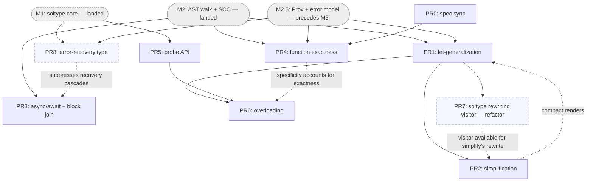

# M3 — Functions, application, let-polymorphism — implementation plan

Concrete, PR-by-PR plan for milestone **M3** of the SimpleSub checker. Read
[01-milestones.md](01-milestones.md) §"M3" for the milestone definition,
[m2-implementation-plan.md](m2-implementation-plan.md) and
[m2.5-implementation-plan.md](m2.5-implementation-plan.md) for the surface this
builds on, and [02-design-notes.md](02-design-notes.md) for the longer-range
shapes. Sketches below use the **shipped** names (`FuncType`, `checker`, …) and
are illustrative — `// ...` marks elisions.

> **This plan was revised to match shipped reality.** M1, M2, and the M2.5 plan
> have landed (`main`, PRs #686–#705). M2 already shipped the
> function/application/block walk monomorphically, so M3 is **not** "build the
> function walk" — it is "add polymorphism, async, exactness, and overloading on
> top of M2's monomorphic walk, and finish the carried-over block semantics."

## Prerequisites (what M1, M2, and M2.5 shipped)

M3 builds directly on the landed packages. The exact surface matters because
earlier drafts of this plan assumed spike-era names that never shipped.

**Packages.** Two top-level siblings (not one nested package):

- `internal/soltype/` — the type representation. `Type` (sealed, marker
  `isType()`); `TypeVarType{ID, Level, LowerBounds, UpperBounds}` +
  `BoundsAt(pol)`; `PrimType{Prim}`, `LitType{Lit}` (`NumLit`/`StrLit`/`BoolLit`);
  `FuncType{Params []*FuncParam, Ret}`, `FuncParam{Pattern Pat, Type}` (name via
  `IdentPat`); `TupleType{Elems}`; `RecordType{Fields []*RecordField}` + `Field`;
  `Void`, `NeverType`, `UnknownType`, `UnionType`, `IntersectionType`; `LevelOf`;
  `Polarity`; `soltype.Print` (the coalesced-output renderer).
- `internal/solver/` — the engine + walk. `Context{…}` with `freshVar(level)` and
  `Constrain(lhs, rhs) []SolverError`; the `checker` carrier `{ctx *Context; info
  *Info; errs []SolverError}` (method receiver for the whole walk) with
  `freshAt(lvl)`, `constrain(n, lhs, rhs)`, `report`, `reportUnsupported`,
  `recordType`; `Info{TypeOf, setType}`; `Scope` (three-sorted: `values`/`types`/
  `namespaces`, with `Child()`, `defineValue`/`removeValue`/`defineType`/
  `defineNamespace`, `GetValue`/`GetType`/`GetNamespace`); `ValueBinding{Type
  soltype.Type; Sources []provenance.Provenance}`; `coalesce(t, pol)`; the
  `SolverError` hierarchy (`errors.go`); the module driver `InferModule` →
  `inferDepGraph` → `inferComponent`.

**M2 already implements (all MONOMORPHIC):**

- Function expressions and declarations — `inferFuncExpr` → `inferFunc`
  (`infer_expr.go`): child scope, fresh var per un-annotated param, body inferred,
  return annotation constrained, builds `*soltype.FuncType`. **This is the work an
  earlier draft of this plan put in "PR1"; it is done.**
- Application — `inferCall` (`infer_expr.go`): types callee and args, mints a
  fresh result var, and emits **`constrain(callee <: FuncType{args → res})`** (a
  single subtype constraint — the design M3 builds on, *not* a separate
  obligation). N-ary already.
- Blocks / `return` / `Void` — `inferBlock`/`inferStmt` (`infer_stmt.go`): block
  value is its **last statement** (or `Void`); `ReturnStmt` handled.
- Tuples, object literals, member access — `inferTuple`/`inferObject`/
  `inferMember` (`infer_expr.go`).
- Module ordering + recursive groups — `inferComponent` (`module.go`): dep-graph
  SCC order, fresh var per binding, define-before-infer, constrain each def `<:`
  its var, then **phase 3 coalesces each var to a monomorphic type** (`coalesce(b.v,
  Positive)`) and rebinds. No generalization.
- The `FuncType <: FuncType` constrain rule is **exact same-arity** today
  (`len(l.Params) != len(r.Params)` → `FuncArityMismatchError`); a code comment
  notes the inexact arm "lands in M3 with the exactness flag."
- Diagnostics for out-of-scope constructs: `NamespaceUsedAsValueError`,
  `UnknownIdentifierError`, `OverloadNotSupportedError` (M2 rejects multiple
  top-level `FuncDecl`s of one name), `UnsupportedNodeError`, etc.

**M2.5 (precedes M3 — its plan has landed, the work lands before M3):**

- The **`Prov: Type → Origin` side table** — ships the **leaf** `FromAST{Node,
  Kind}` only. The interior edge kinds ride along with the M3+ operations that
  mint them; **`FromInstantiation` is explicitly assigned to M3** (added below in
  PR1). `Prov` lives on the `checker` carrier.
- **Errors carry AST nodes, not strings.** M2.5 reshapes `SolverError`:
  `setSpan`/`errSpan` give way to node-derived `Span()` + `Related()`. Errors
  partition into **bridge** errors (born in the walk with an `ast.Node` in hand —
  self-blame) and **constraint** errors (born in the AST-free engine — carry typed
  `soltype` operands and get their node injected from `Prov`). **Every new M3
  error follows this model** — no `c.error(n, …)` span-stamping.
- The `val`-annotation subtype check and the **span-fixture harness**
  (`requireBlame`) — M3's "full error message / blame" tests use these.

## What M3 adds (the genuine delta over M2)

1. **Let-generalization** — schemes, `instantiate`/`freshenAbove`, generalize at
   the SCC boundary (replacing M2's monomorphic freeze), the `<T0, …>` quantifier
   prefix in the printer, and the `inferIdent` instantiation hook. Plus the
   `FromInstantiation` provenance variant (extends M2.5's `Prov`). (The
   `coalesce` recursion `seen`-guard this would otherwise need already shipped in
   M2 PR-5; M3 owns only the precise μ-bound recursive *rendering*.)
2. **The simplification pass** — single-polarity elimination + co-occurrence
   merging, so generalized signatures render compactly and parameter-only
   variables coalesce to `unknown` rather than a vacuous `<T0>`.
3. **`async fn` / `await`** — `async fn () -> T` types externally as `fn () ->
   Promise<T>`; `await e` requires `e <: Promise<U>` and yields `U`. No
   auto-flatten (that is `Awaited<T>`, M9). Plus the **block return-point join**
   carried over from M2 (`inferBlock` TODO(M3)): collect *every* `ReturnStmt` and
   join with the tail.
4. **Function exactness** (#677) — an `Exact` flag on `FuncType` and `Optional` on
   `FuncParam`; the inexact accept-set arm in the subtyping rule; and the
   direct-call extra-arg rejection as a call-site lint.
5. **The probe API** — speculation infrastructure (length-snapshot journal over
   bound lists + side-table cleanup), needed by overloading and reused later.
6. **Function overloading** (free functions) — overload sets as a multi-scheme
   `ValueBinding`, call-site resolution as a separate phase, value-position
   references as an intersection of the arms (the one scoped lattice exception,
   resolved via the probe), the ground-enough / specificity /
   mutual-recursion-needs-annotation rules.

## Sequencing rationale

Nine PRs (PR0–PR8) on three landed prerequisites (M1, M2, M2.5). Solid edges =
hard dependency (downstream won't compile / pass tests without upstream); dashed
= soft (downstream lands correctly but degraded until upstream fills it in). PR7
is a behavior-preserving refactor (the shared `soltype` rewriting visitor) — it
depends only on PR1 and is otherwise independent. PR8 is a robustness fix (the
error-recovery sentinel) — it depends only on M1 and M2.5, nothing depends on it,
but it stops every error-emitting PR from cascading a spurious second diagnostic.



Parallelizable tracks: the **polymorphism chain** (PR1 → PR2), **async + block
join** (PR3, only needs M2's walk), **exactness** (PR0 → PR4, reworking M2's
`inferCall` + the `FuncType` rule), and the **probe** (PR5, only needs M1).
Overloading (PR6) is the join of schemes (PR1), the probe (PR5), and — softly —
exactness (PR4). **PR7** (the `soltype` rewriting visitor) is a non-blocking
refactor off PR1, ideally sequenced right after it and before PR2 (so PR2's
`rewrite` builds on the visitor rather than hand-rolling a fourth walk), but it
can slip later with no correctness cost. M2.5's error model is a universal
prerequisite for every error-emitting PR; only the strongest edges are drawn.

- **PR1 → PR2 is the core chain.** Generalization (PR1) is what mints the
  quantified signatures; they only render *compact* once simplification (PR2)
  runs (the `PR2 ⇢ PR1` soft edge: PR1 lands with a no-op `simplify`, PR2 makes
  renders compact). The Category-A acceptance is PR1+PR2.
- **PR3 (async + block join) depends only on M2's walk.** `async`/`await` is a
  self-contained feature (gated on the `Promise<T>` placeholder M2 seeded); the
  block return-point join finishes `inferBlock`'s carried-over TODO. Independent
  of generalization, so it can land in parallel with PR1/PR2.
- **PR4 (exactness) reworks M2's shipped call path.** It depends on PR0 (the
  default must be in the spec first) and on M2's `inferCall`/`FuncType` rule. It
  does **not** introduce a separate call obligation — see PR4 for why the shipped
  single-constraint path is kept.
- **PR5 (probe) depends only on M1.** General speculation infrastructure, reused
  beyond M3 (M4 mutability transitions, M9 conditional-branch selection,
  `satisfies`); split from overloading so it lands and is unit-tested alone.
- **PR6 (overloading) depends on PR1** (per-overload schemes) and **PR5** (each
  candidate trial runs under a probe), softly on **PR4** (the specificity rule
  must account for exact/inexact). Highest-uncertainty; last.
- **PR7 (`soltype` rewriting visitor) depends only on PR1.** A behavior-preserving
  refactor that extracts one polarity-threading rewriting visitor and reimplements
  the three structural type→type transforms — `coalesce`, `extrude`, and PR1's
  `freshenAbove` — on top of it. It needs `freshenAbove` to exist as the third
  concrete instance (the trigger to extract), hence the PR1 edge; nothing depends
  on it. Numbered last as a non-blocking cleanup, but lands cleanest right after
  PR1 so PR2's `rewrite` can reuse the visitor.
- **PR8 (error-recovery type) depends only on M1 + M2.5.** A self-contained
  robustness fix: one new `soltype` atom plus two short-circuit arms at the top of
  `constrain`, repointing `report` off `never`. Nothing depends on it, but every
  error-emitting site (PR3's `if`/`await` recovery, the `report` placeholder
  generally) stops cascading a spurious second `cannot constrain never <: …` once
  it lands. Numbered last alongside PR7 as a non-blocking quality fix; surfaced
  while implementing PR3.

### Shared files & merge ordering

"Parallelizable" above means **no hard dependency edge** — not file-disjoint.
Several parallel-track PRs edit the same files (different functions within them),
so concurrent development produces *merge* conflicts even where the logic is
independent. The collisions are mechanical (adjacent hunks, shared import blocks),
not semantic. Tracks: **A** = PR1→PR2, **B** = PR3, **C** = PR0→PR4, **D** = PR5.

| File | A (PR1) | B (PR3) | C (PR4) | D (PR5) |
|---|---|---|---|---|
| `internal/solver/infer_expr.go` | `inferIdent` | `inferFuncExpr`/`inferFunc` + new `await` | `inferCall` lint | — |
| `internal/solver/constrain.go` | — | — | `FuncType<:FuncType` case | bound-append sites |
| `internal/soltype/print.go` | `<T0,…>` prefix | — | `Exact`/`Optional` in `printFuncTail`/`paramName` | — |
| `internal/solver/errors.go` | — | await-outside-`async` error | `TooManyArgsError` | — |

- **`infer_expr.go` is the one real hotspot** — three tracks (A/B/C) edit it, but
  each touches a *different* `infer*` function, so conflicts are rebase-mechanical.
- **Single-owner in the parallel set:** PR1 also owns `scope.go`, `module.go`,
  `coalesce.go`, `infer_decl.go`, new `poly.go`; PR3 owns `infer_stmt.go`; PR4 owns
  `soltype/type.go` and the `internal/parser/` `...`/`x?` changes; PR5 owns
  `context.go` and new `probe.go`.
- **Suggested merge order to minimize churn:** land the two structure-reshaping
  PRs — **PR1** (`ValueBinding`/printer) and **PR4** (`FuncType` fields, `constrain`
  `FuncType` case, printer markers) — *before* **PR3** and **PR5**, which then rebase
  onto the settled shape of `infer_expr.go`/`constrain.go`/`print.go`.
- Note: PR1's `coalesce` `seen`-guard sub-task is **already shipped** —
  `coalesceRec` in `coalesce.go` already threads a `seen` set; verify before
  re-adding.
- **PR7 (refactor) rewrites the transforms the others edit, so land it after
  them.** It touches new `soltype/visitor.go`, `soltype/type.go` (an `Accept`
  method per type node), `coalesce.go`, `constrain.go` (`extrude`), and `poly.go`
  (`freshenAbove`). Those overlap PR1 (`coalesce.go`/`poly.go`), PR4
  (`constrain.go` `FuncType` case + `soltype/type.go` fields), and PR5
  (`constrain.go` bound-append sites). Since PR7 is a pure refactor with no
  behavior change, sequence it *after* PR1/PR4/PR5 have settled those regions and
  rebase onto them — don't run it concurrently.
- **PR8 (error-recovery type) touches `soltype/type.go` (the new `ErrorType` atom),
  `constrain.go` (the two top-of-function short-circuits), `infer.go` (`report`),
  and the recovery sites whose `ok=false`-skips retire.** It overlaps PR4
  (`soltype/type.go` fields, `constrain.go` `FuncType` case) and PR5 (`constrain.go`
  bound-append sites), but its `constrain` edit is a short-circuit *above* the
  structural switch, so it rebases cleanly past either. Land it after PR3 (which
  surfaces the cascade the tests assert away) and after PR7 if PR7 has landed (so
  the `ErrorType` pass-through rides the visitor rather than another hand-rolled
  arm); otherwise it stands alone.

## Core types added or changed in M3

**`FuncType` gains `Exact`; `FuncParam` gains `Optional`** (PR4). The shipped
type has neither; M3 adds them (exported, matching soltype's style):

```go
// internal/soltype/type.go — shipped today: FuncType{Params, Ret},
// FuncParam{Pattern, Type}. M3 adds the two flags.
type FuncType struct {
    Params []*FuncParam
    Ret    Type
    Exact  bool // PR4: bare fn(...) ⇒ true; fn(..., ...) ⇒ false
}

type FuncParam struct {
    Pattern  Pat
    Type     Type
    Optional bool // PR4: x? — lowers `required` without changing arity
}
```

**`ErrorType` — the error-recovery sentinel** (PR8). A new childless `soltype`
atom, distinct from `never`/`unknown`. The latter two are coalesced-**output**
only ([type.go](../../internal/soltype/type.go): "appear only as coalesced
output, never as constrain inputs"); `ErrorType` is a legal constrain **input**
that absorbs in both directions, so a reported diagnostic's placeholder never
cascades a second one. Never user-spellable (distinct from a future `any`), minted
only by `report`:

```go
// internal/soltype/type.go
type ErrorType struct{} // ⊤⊥ absorbing sentinel; see PR8
func (*ErrorType) isType() {}
```

**Schemes** (PR1) — new file `internal/solver/poly.go`:

```go
type TypeScheme interface {
    isScheme()
    IsAnnotated() bool // PR6: this arm came from a user-written signature
}

type MonoScheme struct {
    Ty        soltype.Type // param, current-level RHS, rec self-ref
    Annotated bool         // PR6 only — consulted solely for overload arms
}
type PolyScheme struct {
    Level     int          // generalize vars with Level > Level
    Body      soltype.Type
    Annotated bool         // PR6 only — set per overload arm; folds for the recursion gate
}

func (*MonoScheme) isScheme()           {}
func (*PolyScheme) isScheme()           {}
func (s *MonoScheme) IsAnnotated() bool { return s.Annotated }
func (s *PolyScheme) IsAnnotated() bool { return s.Annotated }
```

**`ValueBinding` swaps `Type` for a *slice* of schemes and keeps `Sources`** (PR1
introduces the slice; PR6 reuses it). M2 PR-5 sanctioned the `Type`→scheme swap;
`Sources` stays (load-bearing for M2.5 blame / go-to-definition). A binding holds
**one** scheme for an ordinary value and **N** for an overload set — collapsing
PR6's would-be `OverloadSet` into the same slice rather than a separate
nullable field. This parallels `Sources`, which *already* carries one entry per
arm (`scope.go` documents the multi-`FuncDecl` accumulation today), so `Schemes[i]`
lines up with the arm at `Sources[i]`; and it makes the "is the scheme `nil` when
overloaded?" footgun unrepresentable — cardinality is just `len(Schemes)`.

```go
// internal/solver/scope.go — was {Type soltype.Type; Sources []provenance.Provenance}.
type ValueBinding struct {
    Schemes []TypeScheme            // 1 = ordinary binding; >1 = overload set (declaration order)
    Sources []provenance.Provenance // RETAINED — M2.5 blame / go-to-definition; parallels Schemes
}

// IsOverloaded reports whether this binding is an overload set. Consumers MUST
// check it before routing (expected to be a common call): an ordinary call
// (false) keeps M2's shipped subtype-constraint path and its FuncArityMismatch /
// deferred-callee behavior; an overloaded call (true) goes through resolveOverload
// (PR6). inferIdent's value-position lookup branches on it too.
func (b ValueBinding) IsOverloaded() bool { return len(b.Schemes) > 1 }
```

**No separate `OverloadSet` type.** What was `OverloadSet.Branches` *is*
`ValueBinding.Schemes`; what was `OverloadSet.Annotated` (the recursion gate)
folds over the arms — `all(s.IsAnnotated() for s in b.Schemes)` — with
annotated-ness riding on the scheme, where it belongs (a per-arm property, not a
binding-wide one). Invariant to record: `Schemes` is never empty for a live
binding — `inferComponent` pre-binds a fresh `MonoScheme` before inferring, and a
failed binding is `removeValue`'d, not left at `len == 0`.

**Value-position type of an overloaded name = an intersection of the arms**
(`let g = f` where `f` has `len(Schemes) > 1`). `inferIdent`, on the
`b.IsOverloaded()` branch, instantiates each arm and synthesizes
`IntersectionType{arm₁, …, armₙ}` (arm order preserved). This is the
TS-compatible, codebase-sanctioned representation — the old checker did exactly
this, and [module.go:81](../../internal/solver/module.go) already names the
"overloads as an IntersectionType of the per-arm signatures" destination. It
matches what a user writing the explicit `F1 & F2` annotation
([intersection_types/requirements.md](../intersection_types/requirements.md)
§"Intersection with Functions") would get.

**Caveat — this carries a *scoped exception* to "the disjunction never enters the
lattice".** A first-class overloaded *value* flowing into a function-typed slot
needs `(F1 & F2) <: F` — the **disjunctive** intersection-LHS rule (`(A & B) <: C`
iff `A <: C` *or* `B <: C`), i.e. ordered speculative arm-trial, the very thing
`resolveOverload` was split out to contain. Synthesizing the intersection does not
*remove* overload resolution; it *relocates* it into `constrain`. So M3 scopes it
deliberately:

1. **`b.Schemes` stays the source of truth.** The intersection is synthesized
   **lazily, only at value-position `inferIdent`** — never eagerly per binding
   (most overloaded fns are only ever called directly).
2. **Only the function-intersection-LHS rule ships**, and it is implemented by
   **reusing PR5's probe + `resolveOverload`'s ordered first-match** — the
   disjunction lives in the existing speculation phase, not in naive constraint
   propagation. General intersection support (objects, distribution,
   normalization) is **out of M3** (its own milestone; today the new solver's
   `constrain` has *no* `IntersectionType` case at all).
3. **The exception is documented as exactly that** — function-intersection LHS,
   resolved via the probe — so the lattice's principal-type/determinism story
   stays intact everywhere else.
4. **Two known costs accepted:** the scheme-slice ↔ intersection-type
   representations must be kept consistent (one synthesis helper), and the
   declaration-order tie-break depends on the intersection *retaining arm order*
   (don't let normalization reorder/dedup it).

`inferIdent` still branches on `IsOverloaded()`; the non-overloaded path is the
plain `c.instantiate(b.Schemes[0], lvl)`.

**Why not call-signature objects (a TS-interface-style object with N call
signatures) instead of an intersection?** It was considered and **deferred to M4**.
An object-with-call-signatures is the *same type* as the intersection of those
signatures (TS treats `{ (x:string):number; (x:number):string }` and
`((x:string)=>number) & ((x:number)=>string)` as interconvertible), so it has
**identical subtyping behavior in both directions** and the **same disjunctive
use-direction rule** — the disjunction is intrinsic to "callable in multiple ways,"
not to the intersection encoding, so the object model would not avoid the scoped
lattice exception above; it would only move it to a different node. For *pure
overloading* it buys nothing and costs more than intersection: `RecordType` has no
call-signature slot today (`{Fields []*RecordField}`, [type.go](../../internal/soltype/type.go)),
whereas `IntersectionType` nodes already ship in M1, and Escalier already specs the
writable `F1 & F2` syntax but no call-signature-object syntax. Its genuine wins are
all **M4+ object-system** territory: **hybrid callable types** (a value both
callable *and* carrying properties — `f.version`, jQuery's `$` — plus construct
signatures), and the richer **LSP** surface that a unified object representation
gives (hover/signature-help/members on a callable that also has fields). The clean
future framing: an overload is the degenerate callable-object with N call
signatures and 0 properties, so M4's object model can later **subsume** this
intersection encoding without a representational fork — adopting it in M3 would pay
M4 cost for no M3 gain.

**The probe** (PR5) — `internal/solver/probe.go`:

```go
type Bounded interface { boundLengths() (lower, upper int); truncateBounds(lower, upper int) }
type probeEntry struct{ v Bounded; prevLower, prevUpper int }

type Probe struct {
    entries  []probeEntry
    touched  set.Set[Bounded]
    cleanups []func()  // Info / Prov side-table rollback closures (Prov is M2.5's)
    parent   *Probe
    done     bool
}
```

## PR breakdown

### PR0 — Spec sync: exact-by-default, the `open` marker, and #677's accept-set model

Pure documentation; unblocks PR4. Records decisions the milestones doc flags as
"not yet in the spec."

- Add a section to `planning/exact-types/requirements.md` recording the
  **exact-by-default** rule (usage-inferred record shapes coalesce as *exact*; row
  polymorphism is opt-in via the `open` parameter marker). (Records the decision now even though
  usage-inference itself is M4 — exactness defaults must be settled before PR4.)
- Rewrite §4.2 per escalier-lang/escalier#677: **direct calls reject extra args
  regardless of exactness** (a call-site lint); **exactness governs callback
  subtyping** via the accept-set model (`G <: F` iff `accept(G) ⊇ accept(F)`,
  params contravariant, return covariant; exact `fn(p1..pn)` accepts `[required,
  n]`, inexact accepts `[required, ∞)`).

**Why first:** PR4's tests assert exact-by-default behavior, which must be blessed
in the spec before the implementation asserts it.

---

### PR1 — Let-generalization

The core M3 PR. M2 infers functions monomorphically and freezes recursive groups
to coalesced monotypes; PR1 turns that into real let-polymorphism.

- **Schemes in the scope.** `ValueBinding.Type` → `ValueBinding.Schemes`
  (`poly.go`/`scope.go`); keep `Sources`. PR1 only ever sets `len(Schemes) == 1`
  (PR6 grows it); add the `IsOverloaded()` helper now so the single-scheme call
  path reads `!b.IsOverloaded()` from the start. Param bindings and current-level
  RHS during inference are `MonoScheme`; generalized decls are `PolyScheme`.
- **`instantiate` / `freshenAbove`** (`poly.go`): `instantiate(MonoScheme)`
  returns as-is; `instantiate(PolyScheme)` calls `freshenAbove` (fresh var per
  var with `Level > scheme.Level`, bounds freshened) and records a
  **`FromInstantiation`** entry — the first interior `Origin`, *added to M2.5's
  existing `Prov` sum* (M2.5 ships `FromAST`; this extends it). The multi-hop
  *renderer* that walks `FromInstantiation` chains to AST leaves is deferred to
  M11.5; PR1 only mints the edge.
- **`inferIdent` instantiation hook.** M2 returns `b.Type` directly with a
  `// M3: instantiate` comment; PR1 makes value-position lookup
  `c.instantiate(b.Schemes[0], lvl)` for the ordinary (`!b.IsOverloaded()`) case.
  The `b.IsOverloaded()` value-position branch — synthesizing the arm intersection
  (see "Core types") — is PR6's; PR1 can leave it as a TODO, since M2 rejects
  multi-`FuncDecl` names today so no overloaded binding reaches here yet.
- **Generalize at the SCC boundary.** `inferComponent` phase 3 today does
  `coalesce(b.v, Positive)` → a monotype. PR1 changes it to generalize: variables
  at `Level > lvl` become quantifiable; captured outer vars do not. The result is
  a `PolyScheme`.
- **Recursive-group rendering (not the `seen`-guard).** The `coalesce`
  path-scoped `seen`-guard that keeps the walk total over a cyclic var↔var bound
  graph **already shipped in M2 PR-5** (`coalesceRec` in `coalesce.go`) — M3 does
  *not* re-add it. M3 owns only the precise μ-bound recursive *rendering* of a
  generalized recursive type.
- **Printer `<T0, …>` prefix.** Extend `soltype.Print` to render a quantifier
  prefix for a generalized scheme's free variables (M2's printer renders only
  monotypes).

**Sketch:**

```go
// internal/solver/poly.go
func (c *checker) instantiate(s TypeScheme, lvl int) soltype.Type {
    switch sc := s.(type) {
    case *MonoScheme:
        return sc.Ty
    case *PolyScheme:
        return c.freshenAbove(sc.Level, sc.Body, lvl, map[int]*soltype.TypeVarType{}) // + FromInstantiation in Prov
    }
    panic("unreachable")
}

// freshenAbove copies t, replacing each var with Level > lim by a fresh var at
// lvl (bounds freshened); vars at Level <= lim are shared. // M4: thread a
// lifetime cache once lifetime-bearing types exist. // PR1 lands this hand-rolled,
// parallel to coalesce/extrude; PR7 collapses all three onto a shared rewriting
// visitor (no behavior change).
func (c *checker) freshenAbove(lim int, t soltype.Type, lvl int, cache map[int]*soltype.TypeVarType) soltype.Type { /* ... */ }

func (c *checker) generalize(t soltype.Type, lvl int) TypeScheme {
    t = c.simplify(t, lvl) // PR2 — compact before quantifying (no-op until PR2)
    return &PolyScheme{Level: lvl, Body: t}
}
```

```go
// internal/solver/module.go — inferComponent phase 3, generalize instead of freeze.
for _, key := range component {
    b := bindings[key]
    if !b.bound { scope.removeValue(key.Name()); continue }
    scheme := c.generalize(b.v, lvl) // was: coalesce(b.v, Positive) → monotype
    scope.defineValue(key.Name(), ValueBinding{Schemes: []TypeScheme{scheme}, Sources: b.sources})
    // ... recordType on the name/pattern as today
}
```

**Tests (Category-A, against real source):** `TopLevelLetPolymorphism` ⇒
`fn <T0>(x: T0) -> T0`; `IdentityPolymorphism` ⇒ `fn () -> ["hello", 5]`;
`InnerCapturesOuterParam` ⇒ `fn <T0>(y: T0) -> [T0, T0]`. Renders are
non-compact until PR2 — until then assert two-types-of-use behavior rather than
the printed signature where simplification is load-bearing. A recursive group
generalizes without looping (exercises the `seen`-guard).

**Risk:** medium. Level discipline + the SCC generalization change are the subtle
parts; M2's `inferComponent` already proves the ordering, so PR1 changes only
phase 3.

---

### PR2 — The simplification pass

Single-polarity elimination + co-occurrence merging, run at generalization time
before the printer.

- **Single-polarity elimination.** A variable occurring only positively /
  negatively in a generalized type is replaced by its bound (or `never`/`unknown`
  for the empty case) — this is what turns a parameter-only variable into
  `unknown` (the blessed `unknown`-vs-vacuous-`<T0>` improvement,
  [03-references.md](03-references.md) §"Lattice 1").
- **Co-occurrence merging.** Variables co-occurring in every polarity they appear
  in merge (union-find), so `fn <T0>(x: T0) -> T0` renders with one type
  parameter.
- **Wire into `generalize`** (PR1's no-op `simplify` becomes real): occurrence
  analysis → co-occurrence → union-find → rewrite, feeding `coalesce` + the
  printer. The `coalesce` `seen`-guard (shipped in M2 PR-5) covers the cyclic
  bound graphs this walks.

**Sketch:**

```go
// internal/solver/simplify.go
func (c *checker) simplify(t soltype.Type, lvl int) soltype.Type {
    occ := analyze(t, soltype.Positive)            // polarities per var
    uf := mergeCoOccurring(t, occ)                 // union-find of co-occurring vars
    return rewrite(t, occ, uf)                     // drop single-polarity vars; apply merges
}
```

**Tests:** the Category-A renders now assert their *compact* form (the PR1 table,
verbatim); parameter-only var ⇒ `unknown`. These port from the spike's
`simplesub_test.go` with the improved forms.

**Risk:** medium. The subtlest core algorithm, but the most spike-tested — "port
faithfully," not "design."

---

### PR3 — `async`/`await` + block return-point join

Two self-contained completions of the function/block walk, grouped (both small,
both independent of generalization); split into two PRs if review prefers.

- **`async fn`.** Type the body exactly like a plain function (body return type
  `T`), then wrap the *external* return in `Promise<T>` — `async fn () -> T`
  externally is `fn () -> Promise<T>`. Uses the `Promise<T>` placeholder M2
  seeded (real resolution is M7).
- **`await e`.** Mint a fresh `U`, emit `constrain(e <: Promise<U>)`, yield `U`.
  No auto-flatten — `await` of `Promise<Promise<T>>` yields `Promise<T>`
  (`Awaited<T>` is M9). `await` outside an `async` function is rejected by the
  **walk**, not the type rule.
- **Block return-point join (carried over from M2).** M2's `inferBlock` uses the
  *last statement* and drops non-tail `return`s — harmless at the M2 bar (no
  `IfElseExpr`), but M3 must collect **every** `ReturnStmt` (valued and bare) and
  join them with the tail before constraining against the return annotation. See
  the `inferBlock` TODO(M3) in `infer_stmt.go`.

**Tests:** `async fn () -> number` ⇒ `fn () -> Promise<number>`; `await p` with
`p: Promise<string>` ⇒ `string`; `await p` with `p: Promise<Promise<number>>` ⇒
`Promise<number>`; `await` outside `async` ⇒ walk error (full message). Block:
`fn () { if c { return 1 } return "x" }` joins both return points.

**Risk:** low–medium. `async`/`await` is a thin wrap + one constraint; the block
join is a localized `inferBlock` change. The return-join interacts with whatever
conditional/early-return support M3 adds — land them together.

---

### PR4 — Function exactness (accept-set model, #677)

Add exactness to functions and rework the **subtyping** rule, reworking M2's
shipped call path rather than introducing a parallel obligation. Depends on PR0
and M2's `inferCall`/`FuncType` rule.

- **Representation + parser.** Add `Exact` to `FuncType` and `Optional` to
  `FuncParam`. A bare `fn(...)` is exact; `fn(..., ...)` is inexact. Add parser
  support for the trailing-`...` marker and `x?` optional params if not already
  present; the old checker ignores the flag (parser-level tolerance, per M7).
- **Callback subtyping = accept-set rule.** Rework the `FuncType <: FuncType`
  case (today exact same-arity, `len(l.Params) != len(r.Params)`): `G <: F` iff
  `accept(G) ⊇ accept(F)`, i.e. `required_G <= required_F` **and** `upper_G >=
  upper_F` (`upper = len(Params)` if exact, `∞` if inexact). Params contravariant
  per shared position, return covariant. The spike's "fewer params is a subtype"
  is exactly the **inexact** case.
- **Direct-call arity: keep the shipped single-constraint path; add an extra-arg
  lint.** M2's `inferCall` emits `constrain(callee <: FuncType{args → res})`,
  which soundly enforces "at least `required` args" — including for an unresolved
  callee, via bound propagation when it later resolves. **Keep that.** #677's
  *extra-arg* rejection ("reject more args than declared, even for inexact
  functions") is a deliberate **lint the subtype lattice does not model** (an
  inexact function legitimately accepts extras), so it cannot come from the
  constraint — it is a separate call-site check. Add it to `inferCall`: when the
  callee is concrete, reject `argc > len(Params)`. For an unresolved callee the
  lint is best-effort (skipped) while "too few / required" still flows through the
  constraint — so nothing regresses for deferred calls.
- **The synthesized call demand is EXACT + all-required — and the M2 sketch's
  default is a latent bug.** `inferCall` constrains `callee <: FuncType{args →
  res}`; that synth must be `Exact: true` with non-optional params, so `accept(synth)
  = [N, N]` (N = arg count) and the constraint reads exactly "callee accepts being
  called with N args" (`required(callee) ≤ N ≤ upper(callee)`). An **inexact** synth
  has `accept = [N, ∞)`, which forces `upper(callee) = ∞` — i.e. rejects every call
  to an *exact* function. M2 builds the synth with no flag, so the Go zero value is
  `Exact: false` (inexact) — PR4 **must** set it `true`.
- **Reconcile the exact synth with the lint so too-many isn't double-reported.** An
  exact synth's accept-set gate *already* rejects too-many for an *exact* concrete
  callee (`upper(callee) = M < N`), which would fire `FuncArityMismatchError`
  alongside the `TooManyArgsError` lint. So when the lint fires (concrete callee,
  `argc > len(Params)`), hand the constraint only the arity-matched prefix
  `args[:len(fn.Params)]`: the lint owns the single, uniform too-many message and the
  constraint does pure type-flow. The lint remains the *only* catch for an *inexact*
  concrete callee (whose `upper = ∞` the gate can't reject — #677's deliberate case).
  For a deferred (var) callee neither fires up front; too-many still surfaces from the
  gate as `FuncArityMismatchError` if it later resolves to an exact-with-fewer-params
  function.
- **`required` from `Optional`.** `required` = count of non-optional params;
  `Optional` lowers it without changing `len(Params)`.

**Sketch:**

```go
// internal/solver/constrain.go — FuncType case, reworked from exact-same-arity.
const unboundedArity = math.MaxInt
func acceptSet(f *soltype.FuncType) (lo, hi int) {
    lo = requiredCount(f)
    if f.Exact { hi = len(f.Params) } else { hi = unboundedArity }
    return
}
case *soltype.FuncType:
    if r, ok := rhs.(*soltype.FuncType); ok {
        loL, hiL := acceptSet(l); loR, hiR := acceptSet(r) // l <: r  iff accept(l) ⊇ accept(r)
        if loL > loR || hiL < hiR {
            return []SolverError{&FuncArityMismatchError{LHS: l, RHS: r}} // existing kind
        }
        var errs []SolverError
        n := min(len(l.Params), len(r.Params))
        for i := 0; i < n; i++ {
            errs = append(errs, c.constrain(r.Params[i].Type, l.Params[i].Type, seen)...) // contravariant
        }
        return append(errs, c.constrain(l.Ret, r.Ret, seen)...) // covariant
    }
```

```go
// internal/solver/infer_expr.go — inferCall gains the extra-arg lint and an
// EXACT, all-required call demand (the type-flow constraint is otherwise the
// shipped one: it carries the required lower bound, deferred-callee-safe).
func (c *checker) inferCall(scope *Scope, lvl int, e *ast.CallExpr) soltype.Type {
    callee := c.inferExpr(scope, lvl, e.Callee)
    args := make([]*soltype.FuncParam, len(e.Args))
    for i, a := range e.Args { args[i] = &soltype.FuncParam{Type: c.inferExpr(scope, lvl, a)} }
    // Too-many is the lint's job (uniform message; fires for exact AND inexact).
    // When it fires on a concrete callee, hand the constraint only the arity-matched
    // prefix so the exact synth's accept-set gate doesn't ALSO report arity.
    demand := args
    if fn, ok := callee.(*soltype.FuncType); ok && len(e.Args) > len(fn.Params) {
        c.errs = append(c.errs, &TooManyArgsError{Call: e, Fn: fn}) // bridge error (M2.5)
        demand = args[:len(fn.Params)]
    }
    res := c.freshAt(lvl)
    // EXACT + all-required ⇒ accept(synth) = [N, N], so the constraint demands
    // "callee accepts N args" (required(callee) ≤ N ≤ upper(callee)). Inexact here
    // would force the callee inexact and reject every exact-fn call.
    c.constrain(e, callee, &soltype.FuncType{Params: demand, Ret: res, Exact: true})
    if fn, ok := callee.(*soltype.FuncType); ok { c.constrain(e, fn.Ret, res) }
    c.recordType(e, res)
    return res
}
```

`TooManyArgsError` is a new **bridge** error per M2.5 — it holds the `*ast.CallExpr`
and derives `Span()` from it (and `Related()` to the callee), not the retired
`c.error(n, …)` stamp. The existing `FuncArityMismatchError` continues to cover
the "too few / required" failures, callback-arity failures, and — for a *deferred*
callee that resolves to an exact-with-fewer-params function — the too-many case the
up-front lint had to skip.

**Tests (#677 acceptance):** both exact `fn(x, y)` and inexact `fn(x, y, ...)`
reject a 3-arg direct call (full message via `requireBlame`); both accept 2 args.
Into a `fn(x, y)` callback slot, `fn(x, y)`/`fn(x, ...)`/`fn(...)` are accepted
while exact `fn(x)` and any 3+-param function are rejected. Plus two regressions
the exact synth guards: an exact `fn(x, y)` called with 2 args **type-checks**
(an inexact synth would reject it); a 3-arg call to exact `fn(x, y)` yields
**exactly one** diagnostic (the `TooManyArgsError` lint), not a doubled
lint + `FuncArityMismatchError`.

**Risk:** medium. The accept-set rule is small and precisely specified; the care
is the `required`/`Exact`/`Optional` bookkeeping, setting the call demand
`Exact: true` (the inexact default silently rejects every exact-fn call), and
keeping the extra-arg lint distinct from the constraint — both so deferred calls
don't lose the required check and so the exact synth's gate doesn't double-report
too-many alongside the lint.

---

### PR5 — Probe API (speculation infrastructure)

The only new soltype/solver infrastructure in M3, split out so it lands and is
unit-tested alone. Depends only on M1 (`TypeVarType` bound lists). Baseline (A)+(D)
from [02-design-notes.md](02-design-notes.md) §"Speculative checks."

- **Length-snapshot journal (A).** First mutation of each variable records
  `(len(LowerBounds), len(UpperBounds))`; discard truncates back. The engine's
  `constrain` is on `*Context`, so the probe lives there: `Context` gains a
  nullable `probe *Probe`, and each bound append calls `probe.record(v)`.
- **Side-table cleanup closures.** The carrier owns `Info` and (M2.5's) `Prov`;
  writes to them under a probe register an `onRollback` closure so a discarded
  trial leaves no stray entries. The `seen` cache inside a `constrain` call is not
  a probe concern (dies with the call frame).
- **Push/pop discipline.** `checker.openProbe()` sets `ctx.probe` (saving the
  parent); `checker.closeProbe(p, commit)` runs `Commit`/`Discard` and restores
  `ctx.probe = p.parent`, so the engine's current-probe pointer never dangles.
  This reconciles "probe on `Context`" (engine bound-rollback) with "side tables
  on the carrier" (Info/Prov cleanup).
- **Fresh-instance retry (D)** is just `instantiate`/`freshenAbove` used
  per-candidate by PR6; no probe state of its own. Keep the probe minimal — no
  overlay map / generation tags.

**Sketch:**

```go
// internal/solver/probe.go
func (p *Probe) record(v Bounded) {
    if p.touched.Contains(v) { return }
    p.touched.Add(v); lo, hi := v.boundLengths(); p.entries = append(p.entries, probeEntry{v, lo, hi})
}
func (p *Probe) onRollback(f func()) { p.cleanups = append(p.cleanups, f) }
func (p *Probe) rollback() {
    // Cleanups run before entries (side tables first) and in reverse (LIFO).
    // Reverse is *required*, not stylistic: a single Info/Prov key may be
    // written more than once under the probe, and each closure captured that
    // key's prior value at registration time — only unwinding newest-first
    // restores the original. (Entry truncation below is reverse for symmetry
    // only; touched dedupes to one entry per var, so order there is moot.)
    for i := len(p.cleanups) - 1; i >= 0; i-- { p.cleanups[i]() }
    for i := len(p.entries) - 1; i >= 0; i-- { e := p.entries[i]; e.v.truncateBounds(e.prevLower, e.prevUpper) }
}
func (p *Probe) Discard() { if !p.done { p.rollback(); p.done = true } }
func (p *Probe) Commit()  { /* hand touched + cleanups to parent; clear entries */ }

func (c *checker) openProbe() *Probe { p := &Probe{parent: c.ctx.probe}; c.ctx.probe = p; return p }
func (c *checker) closeProbe(p *Probe, commit bool) {
    if commit { p.Commit() } else { p.Discard() }
    c.ctx.probe = p.parent
}
```

**Tests (unit, over hand-built terms — no overload machinery):** a discarded
probe restores bound-list lengths exactly; a discarded probe runs Info/Prov
cleanups (no stray entries); a committed nested probe leaves its touched vars
covered by the parent's later discard; `ctx.probe` returns to its original value
after paired open/close.

**Risk:** low. Small, self-contained; append-only bound lists make rollback a
slice truncation.

---

### PR6 — Function overloading (free functions)

Highest-uncertainty PR. Depends on PR1 (per-overload schemes), PR5 (each
candidate trial runs under a probe), softly on PR4 (specificity must account for
exact/inexact). M2 currently *rejects* multiple top-level `FuncDecl`s of one name
with `OverloadNotSupportedError`; PR6 replaces that with real overloading.

- **Overload sets as a multi-scheme binding.** An overloaded symbol is a
  `ValueBinding` with `len(Schemes) > 1` (`b.IsOverloaded()`) — a set of schemes,
  not a single `soltype.Type`; the disjunction stays out of the lattice for call
  resolution (the value-position intersection below is the one scoped exception).
  `inferComponent` collects the per-name `FuncDecl` arms (which M2 already gathers
  into `Sources`, index-aligned with `Schemes`) and infers each body
  independently, setting each arm scheme's `Annotated` from its signature.
- **Call-site resolution as a separate phase from `constrain`.** At each call,
  collect the args' bounds, pick one overload under a probe (PR5), commit the
  first success, roll back losers' caller-side bounds.
- **Value-position reference ⇒ intersection of arms (scoped lattice exception).**
  On `inferIdent`'s `b.IsOverloaded()` branch, synthesize
  `IntersectionType{arm₁, …, armₙ}` (arm order preserved) — lazily, only here, with
  `b.Schemes` staying the source of truth (see "Core types"). This is the *only*
  place the disjunction touches the lattice: a value flowing into a function-typed
  slot needs the **function-intersection-LHS** rule `(A & B) <: C` iff `A <: C` *or*
  `B <: C`. Implement *only* that rule, and implement it by **reusing the PR5 probe
  + this PR's ordered first-match** (the same `resolveOverload` machinery), so the
  disjunction stays confined to the speculation phase rather than leaking into naive
  constraint propagation. General `IntersectionType` subtyping (objects,
  distribution, normalization) is explicitly **out of M3** — the new solver's
  `constrain` has no `IntersectionType` case today, and full intersection support is
  its own milestone. A value-position call on a `let`-bound overload (`g = f; g(x)`)
  therefore routes through this intersection-LHS arm of `constrain`, which re-enters
  the ordered probe — *not* a second copy of the resolver.
- **Ground-enough deferral.** If an argument is still a fully unconstrained
  variable, defer the call (preferred) or fall back to declaration-order
  first-match. No speculative pinning + backtrack.
- **One documented specificity ordering** (declaration-order + best-match,
  TypeScript-style), in a `doc.go` comment, chosen to interact cleanly with
  subtyping and PR4's exact/inexact distinction (M4 object-arg and M5 method
  overloads reuse this one rule).
- **Mutual recursion forces annotations.** An overloaded function in a mutually
  recursive group must have annotated overload signatures (bodies still checked
  against them; only the set must be ground before the group starts) — fixed-point
  iteration over overload choices isn't guaranteed to converge under subtyping.
  Self-recursion is softer. Emit a clear error pointing at the unannotated
  participant.

**Sketch:**

```go
// internal/solver/overload.go — resolution is a phase distinct from constrain.
func (c *checker) resolveOverload(scope *Scope, lvl int, schemes []TypeScheme, args []soltype.Type, call ast.Node) (soltype.Type, bool) {
    if !groundEnough(args) { return nil, false } // defer
    for _, sig := range orderBySpecificity(schemes) { // schemes = b.Schemes, b.IsOverloaded()
        inst := c.instantiate(sig, lvl).(*soltype.FuncType) // (D) fresh per candidate; branches are fn schemes
        p := c.openProbe()                                  // (A, PR5) wrap caller-side bounds
        ok := c.tryConstrainArgs(args, inst, p)
        c.closeProbe(p, ok)
        if ok { return inst.Ret, true }
    }
    c.errs = append(c.errs, &NoMatchingOverloadError{Call: call /* ... */}) // bridge error (M2.5)
    return nil, true
}
```

```go
// internal/solver/module.go — gate before inferring a recursive component.
func (c *checker) checkOverloadAnnotations(component []dep_graph.BindingKey, g *dep_graph.DepGraph) {
    if len(component) <= 1 { return } // self-recursion is softer
    // for each overloaded member (b.IsOverloaded()) whose arms aren't all IsAnnotated():
    //   c.errs = append(c.errs, &UnannotatedRecursiveOverloadError{...}) // bridge error
}
```

`NoMatchingOverloadError` and `UnannotatedRecursiveOverloadError` are new
**bridge** errors (carry their AST node, derive `Span()`/`Related()`), replacing
M2's interim `OverloadNotSupportedError`.

**Tests:** a two-overload free `fn` resolves per-arg-type at call sites;
declaration-order tie-break asserted; a deferred-then-resolved call; the
mutual-recursion-without-annotation error (full message); a resolution-rollback
test (a losing overload leaves no bounds on arg vars and no stray `Info`/`Prov`
entries — exercising PR5).

**Risk:** **highest in M3.** Overloading is a poor fit for "one principal type per
expression." Mitigations: the probe (PR5) is proven by the time this lands; keep
the specificity rule simple and documented; prefer the ground-enough *defer* path
over guessing. If resolution proves intractable, the fallback is declaration-order
first-match for the MVP with a tracked follow-up — overloading is the one M3 piece
that can ship reduced without blocking M4.

---

### PR7 — `soltype` rewriting visitor (refactor)

Behavior-preserving cleanup. After PR1, the solver has **three** near-identical
structural type→type transforms — `coalesce` ([coalesce.go](../../internal/solver/coalesce.go)),
`extrude` ([constrain.go](../../internal/solver/constrain.go)), and PR1's
`freshenAbove` (new `poly.go`) — that each re-spell the same `FuncType`/`TupleType`/
`RecordType` rebuild-from-children boilerplate *and* the same variance knowledge
(`pol.Flip()` on func params). `soltype` has no visitor today, even though
`type_system` already ships the rewriting pattern ([visitor.go](../../internal/type_system/visitor.go):
`Accept(TypeVisitor) Type`, `ExitType(t) Type`) and CLAUDE.md mandates "use the
existing visitor for that tree … don't hand-roll a new traversal." PR7 fills that
gap and reimplements the three transforms on it.

- **A polarity-threading rewriting visitor in `soltype`.** Unlike
  `type_system`'s visitor, it threads `Polarity` and the walker flips it on
  contravariant positions (func params) so variance lives in **one** place instead
  of being re-spelled per transform. **Replacement can happen in either phase:**
  `EnterType` may return a replacement node (optionally with `SkipChildren`) and
  `ExitType` may replace the rebuilt node — enter fires *before* child traversal
  (so it can prune, break a cycle, or take over the recursion), exit fires *after*
  (bottom-up, a function of already-rewritten children). Each `soltype.Type` gains
  an `Accept(v, pol)` method that rebuilds `Func`/`Tuple`/`Record` from visited
  children (atoms pass through).
- **Identity-preserving rebuild.** `Accept` allocates a new node only when a child
  actually changed (`pt != p.Type`, `ret != t.Ret`); when nothing changed it returns
  the original `t`. Unchanged subtrees keep pointer identity — no needless
  allocation, and identity-keyed caches / `seen` sets stay valid across a walk. The
  structural arms copy the child slice on first change (copy-on-write) so the
  original is never mutated.
- **The var case stays bespoke — by design.** A `TypeVarType`'s bounds are a side
  graph, not tree children (polarity-and-direction-selected; `extrude` even mutates
  the original var mid-walk). So each transform handles the var node entirely in
  its own `EnterType` returning `{Type: replacement, SkipChildren: true}`, with its
  auxiliary state (coalesce's path-scoped `seen`; extrude's `(ID, pol)` cache;
  freshenAbove's `ID` cache) living on the visitor struct. The visitor unifies the
  *structural arms and the variance*, not the algorithmic core.
- **`freshenAbove` ignores `pol`** (it freshens uniformly — no variance needed), so
  the one visitor serves all three; the polarity machinery is what `coalesce`/
  `extrude` need.
- **No new behavior.** This is a pure refactor; the contract is that existing
  snapshots/fixtures are untouched.

**Sketch:**

```go
// internal/soltype/visitor.go
type EnterResult struct {
    Type         Type // nil = keep the node; non-nil = replace it
    SkipChildren bool // true = skip the structural rebuild, go straight to ExitType
}
type TypeVisitor interface {
    EnterType(t Type, pol Polarity) EnterResult
    ExitType(t Type, pol Polarity) Type
}

// per node — the walker owns variance (callers never re-spell pol.Flip()) and
// rebuilds IDENTITY-PRESERVINGLY: a fresh node is allocated only when a child
// actually changed; otherwise the original t flows through unchanged.
func (t *FuncType) Accept(v TypeVisitor, pol Polarity) Type {
    e := v.EnterType(t, pol)
    cur := t
    if e.Type != nil { cur = e.Type.(*FuncType) }
    if e.SkipChildren { return v.ExitType(cur, pol) }
    changed := false
    params := cur.Params                 // copy-on-write: alias until a param changes
    for i, p := range cur.Params {
        pt := p.Type.Accept(v, pol.Flip()) // params contravariant
        if pt != p.Type {
            if !changed { params = append([]*FuncParam(nil), cur.Params...); changed = true }
            params[i] = &FuncParam{Pattern: p.Pattern, Type: pt}
        }
    }
    ret := cur.Ret.Accept(v, pol)        // return covariant
    out := cur
    if changed || ret != cur.Ret { out = &FuncType{Params: params, Ret: ret} }
    return v.ExitType(out, pol)
}
```

```go
// internal/solver/coalesce.go — coalesce becomes a visitor; the var case is the
// whole content, the Func/Tuple/Record arms come from Accept.
type coalescer struct{ seen set.Set[*soltype.TypeVarType] }
func (c *coalescer) EnterType(t soltype.Type, pol soltype.Polarity) soltype.EnterResult {
    v, ok := t.(*soltype.TypeVarType)
    if !ok { return soltype.EnterResult{} } // structural node: let Accept rebuild it
    // ... seen-guard + combine(pol, freshened bounds) ..., SkipChildren: true
}
func (c *coalescer) ExitType(t soltype.Type, _ soltype.Polarity) soltype.Type { return t }
```

**Tests:** the existing `coalesce`/`extrude`/`freshenAbove` suites and all
checker snapshots/fixtures pass **unchanged** (the behavior-preservation contract).
Plus a few unit tests for the visitor itself: contravariant `pol` flip on func
params, `EnterType` replacement + `SkipChildren`, atom pass-through, and identity
preservation (a no-op rewrite returns the *same* `FuncType` pointer; changing one
param's type allocates a new node but reuses the unchanged `*FuncParam`s).

**Risk:** low. Pure refactor guarded by the existing snapshot/fixture suites; the
subtlety is getting the polarity-flip and the var-case `SkipChildren` short-circuit
right, both directly asserted. Lands cleanest after PR1/PR4/PR5 settle
`coalesce.go`/`constrain.go`/`poly.go` (see "Shared files & merge ordering").

---

### PR8 — Error-recovery type (the `ErrorType` absorbing sentinel)

A robustness fix surfaced while implementing PR3. Today `report`
([infer.go](../../internal/solver/infer.go)) hands back `&soltype.NeverType{}` as
the value-position placeholder after emitting a diagnostic. But `never` (⊥) and
`unknown` (⊤) are **coalesced-output only** in this design —
[type.go](../../internal/soltype/type.go) is explicit that, like
`Union`/`Intersection`, "their *subtyping rules* in constrain are M6 … these nodes
appear only as coalesced output, never as constrain inputs." Error recovery is the
one path that violates that invariant: it feeds a `never` back into `constrain`,
where there is no `never <: T` (nor `T <: never`) input rule, so the placeholder
**cascades a second, spurious `cannot constrain never <: …`** on top of the real
error. PR3's `if <unknown> { … }` (constrains `never <: boolean`) and `await
<unknown>` (constrains `never <: Promise<U>`) are the live cases; the walk already
dodges the RHS half elsewhere with scattered `ok=false`-skip special-cases (e.g.
`inferVarDeclInit`, `inferFunc`'s return-annotation arm, `resolveTypeAnn`
recovery), which is the same problem patched site-by-site.

PR8 replaces the overloaded `never` placeholder with a dedicated sentinel, so the
fix is one mechanism instead of a guard at every constraint site:

- **`soltype.ErrorType`** — a childless atom, distinct from `never`/`unknown`, that
  is a *legal `constrain` input* and **absorbs in both directions**: any constraint
  with an `ErrorType` operand trivially succeeds. This keeps `never` as the precise
  lattice bottom (output-only, its M6 input rule still deferred) and gives recovery
  its own input-legal, direction-agnostic behavior — the standard "error type" of
  TS / Roslyn / GHC.
- **Two short-circuit arms at the TOP of `constrain`** — before the structural
  switch and the variable arms — so an `ErrorType` operand returns `nil`
  immediately and **never enters a variable's bound list**. coalesce / extrude /
  freshenAbove therefore never see it *propagated through bounds*; they need only
  trivial childless-atom pass-through arms (since `report` can still hand an
  `ErrorType` out as a binding's type, e.g. `val x = <unknown ident>`).
- **`report` returns `&soltype.ErrorType{}`** instead of `&soltype.NeverType{}`.
  Minted **only** by `report` (where a diagnostic was definitely already emitted),
  never by `freshVar` — the discipline that keeps absorption from silently hiding a
  genuine checker bug.
- **Retire the now-redundant `ok=false`-skip guards** that exist purely to dodge a
  `never`-in-RHS cascade — the constraint now absorbs on its own. *Keep* the cases
  that adopt a **better inferred type** (a valued `val x: <bad ann> = 5` still keeps
  `5` for downstream completions rather than poisoning `x` to `error`): PR8 changes
  the *no-good-type* recovery, not every recovery.
- **Internal-only.** `ErrorType` is never produced by `resolveTypeAnn` from user
  syntax and never rendered into a signature a user authored — distinct from a
  future user-facing `any`. It renders as `error` for diagnostics / debug only.

**Sketch:**

```go
// internal/soltype/type.go — a new childless atom. LevelOf's default arm already
// returns 0 for it; print/describe render "error".
type ErrorType struct{}
func (*ErrorType) isType() {}
```

```go
// internal/solver/constrain.go — top of constrain, BEFORE the structural switch
// and the var arms. An ErrorType operand carries an already-reported error; it
// absorbs both ways so recovery never cascades, and short-circuiting here keeps it
// out of every bound list.
if _, ok := lhs.(*soltype.ErrorType); ok { return nil }
if _, ok := rhs.(*soltype.ErrorType); ok { return nil }
```

```go
// internal/solver/infer.go
func (c *checker) report(e SolverError) soltype.Type {
    c.errs = append(c.errs, e)
    return &soltype.ErrorType{} // was &soltype.NeverType{}
}
```

**Tests:** the PR3 cascade cases now yield **exactly one** diagnostic — `if
<unknown> { … }` reports only the `UnknownIdentifierError` (no trailing `cannot
constrain never <: boolean`); `await <unknown>` inside an `async fn` reports only
the unknown identifier; an unsupported RHS annotation reports only its
unsupported-node error. Unit `constrain` tests pin `ErrorType` absorbing as **both**
LHS and RHS against every concrete and against a var. A value flowing through an
error-typed binding produces no secondary errors. The existing blame / `requireBlame`
suite passes unchanged once the redundant `ok=false`-skips are removed.

**Risk:** low–medium. The real risk is **over-suppression** — an `ErrorType` that
leaks too far would silence constraints that *should* fail, masking genuine checker
bugs during development. Contained by the "minted only by `report`" discipline and
by short-circuiting at the top of `constrain` (it absorbs but does not spread). The
`soltype` fan-out is cheap (a childless atom, not a recursive former). Touches
`soltype/type.go` (+ print / describe), `constrain.go` (the two arms), `infer.go`
(`report`), and the recovery sites whose `ok=false`-skips retire.

**Future direction — marking / used holes (the principled end-state).** The
`ErrorType` sentinel is the *minimal* recovery: a single absorbing wildcard that
suppresses cascades but carries no information — every poisoned subterm looks the
same and the surrounding context learns nothing from it. The principled version is
**marking-based recovery with holes**, as in Hazel's "Total Type Error Localization
and Recovery with Holes" (POPL 2024, https://hazel.org/papers/marking-popl24.pdf):
an ill-fitting expression is wrapped in a **non-empty ("used") hole** that acts as a
*membrane* — internally it holds the actual (wrong) type and the localized mark, but
at its boundary it adopts the **expected** type, so the rest of the program type-
checks against the precise expected type rather than against a wildcard. The payoff
over a flat `ErrorType` is twofold: (1) *better recovery* — `val x: number = "hi"`
leaves `x: number` (not `error`), so `x + 1` and downstream inference stay precise;
and (2) *total, principled localization* — every program (however broken) has a
well-defined marked typing, and the mark sits on the exact offending subterm rather
than smearing an absorbing type outward. It also subsumes the ad-hoc "adopt the
annotation on `ok=false`" recovery the walk already does in a couple of places
(`inferVarDeclInit`, `inferFunc`) — those are hand-rolled non-empty holes.

*Feasibility for this SimpleSub-based checker: promising in spirit, not a drop-in.*
The marking calculus is formulated **bidirectionally** (synthesis ⇒ / analysis ⇐),
and the totality theorem leans on that structure; we are **constraint-based
subtyping (biunification)** with no published "marked biunification" to port, so we
would be adapting the *idea*, not the calculus. The adaptation is natural, though:
our `constrain(actual, expected)` is exactly the analysis judgment, so the
membrane rule becomes "on a `constrain` failure, report + mark the node (via `Prov`,
which already pins precise blame) + let the node's recovered type be the **RHS**
(expected), and do not propagate the actual as a bound." The side tables (`Info` for
node→type, `Prov` for node→origin) already give us the machinery to record marks and
boundary types, and empty holes map onto the parser's existing error nodes
(`ErrorStmt`/synthesized placeholders) seeded with a fresh var. The genuine open
questions are (a) what "the expected type" means when the analysis RHS is itself an
inference *variable* rather than a concrete type (the membrane still suppresses
cascades, but the recovered type is as under-determined as the var — less
informative than Hazel's often-concrete analysis types), and (b) re-checking
SimpleSub's principal-type / determinism story under marking (how a marked subterm
interacts with var bounds and generalization), which the bidirectional totality
proof does not hand us for free. Net: `ErrorType` is the right MVP and a clean
stepping stone — it is a degenerate hole with no boundary type — and "holes that
carry the expected type" is the natural follow-on once the recovery mechanism needs
to preserve information rather than merely stop cascades. Worth a spike, likely its
own milestone rather than part of M3.

## Risks & gates

- **No M3-level go/no-go gate** (those live at M4's `Ref` rule and M7's
  differential). M3's risk is concentrated in **PR6 (overloading)**; the
  polymorphism core (PR1/PR2) is a focused change to M2's proven walk, and the
  probe (PR5) is small.
- **Simplification correctness (PR2)** is the subtlest core algorithm — but it is
  the most spike-tested; the risk is "port faithfully," not "design."
- **Exactness's extra-arg lint (PR4)** must stay distinct from the subtype
  constraint, or the "too few / required" check regresses for deferred callees.
- **Probe scope creep (PR5)** — resist building beyond baseline A + D.

## Acceptance (maps to [01-milestones.md](01-milestones.md) §"M3")

M3 is done when, against **real source**:

- Category-A renders: `TopLevelLetPolymorphism` ⇒ `fn <T0>(x: T0) -> T0`;
  `IdentityPolymorphism` ⇒ `fn () -> ["hello", 5]`; `InnerCapturesOuterParam` ⇒
  `fn <T0>(y: T0) -> [T0, T0]`; parameter-only var ⇒ `unknown`. *(PR1+PR2)*
- Async: `async fn () -> number` ⇒ `fn () -> Promise<number>`; `await p`
  (`p: Promise<string>`) ⇒ `string`; `await p` (`p: Promise<Promise<number>>`) ⇒
  `Promise<number>` (no auto-flatten). Block return-point join over a conditional.
  *(PR3)*
- Function exactness (#677): both exact `fn(x, y)` and inexact `fn(x, y, ...)`
  reject a 3-arg direct call; into a `fn(x, y)` slot, `fn(x, y)`/`fn(x, ...)`/
  `fn(...)` are accepted while exact `fn(x)` and any 3+-param function are
  rejected. *(PR4)*
- Overloaded free `fn` declarations resolve at call sites per the documented
  specificity rule; mutually-recursive overloaded participants without annotations
  are rejected with a full error message. *(PR6, on the PR5 probe)*

All assertions are full error messages (via M2.5's `requireBlame` span harness)
and Escalier-syntax rendered types in the solver package's table tests.
