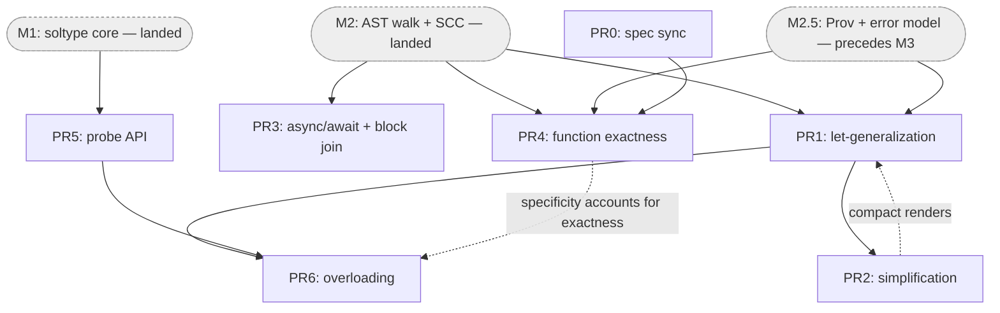

# M3 — Functions, application, let-polymorphism — implementation plan

Concrete, PR-by-PR plan for milestone **M3** of the SimpleSub checker. Read
[01-milestones.md](01-milestones.md) §"M3" for the milestone definition,
[m2-implementation-plan.md](m2-implementation-plan.md) and
[m2.5-implementation-plan.md](m2.5-implementation-plan.md) for the surface this
builds on, and [02-design-notes.md](02-design-notes.md) for the longer-range
shapes. Sketches below use the **shipped** names (`FuncType`, `checker`, …) and
are illustrative — `// ...` marks elisions.

> **This plan was revised to match shipped reality.** M1, M2, and the M2.5 plan
> have landed (`main`, PRs #686–#705). M2 already shipped the
> function/application/block walk monomorphically, so M3 is **not** "build the
> function walk" — it is "add polymorphism, async, exactness, and overloading on
> top of M2's monomorphic walk, and finish the carried-over block semantics."

## Prerequisites (what M1, M2, and M2.5 shipped)

M3 builds directly on the landed packages. The exact surface matters because
earlier drafts of this plan assumed spike-era names that never shipped.

**Packages.** Two top-level siblings (not one nested package):

- `internal/soltype/` — the type representation. `Type` (sealed, marker
  `isType()`); `TypeVarType{ID, Level, LowerBounds, UpperBounds}` +
  `BoundsAt(pol)`; `PrimType{Prim}`, `LitType{Lit}` (`NumLit`/`StrLit`/`BoolLit`);
  `FuncType{Params []*FuncParam, Ret}`, `FuncParam{Pattern Pat, Type}` (name via
  `IdentPat`); `TupleType{Elems}`; `RecordType{Fields []*RecordField}` + `Field`;
  `Void`, `NeverType`, `UnknownType`, `UnionType`, `IntersectionType`; `LevelOf`;
  `Polarity`; `soltype.Print` (the coalesced-output renderer).
- `internal/solver/` — the engine + walk. `Context{…}` with `freshVar(level)` and
  `Constrain(lhs, rhs) []SolverError`; the `checker` carrier `{ctx *Context; info
  *Info; errs []SolverError}` (method receiver for the whole walk) with
  `freshAt(lvl)`, `constrain(n, lhs, rhs)`, `report`, `reportUnsupported`,
  `recordType`; `Info{TypeOf, setType}`; `Scope` (three-sorted: `values`/`types`/
  `namespaces`, with `Child()`, `defineValue`/`removeValue`/`defineType`/
  `defineNamespace`, `GetValue`/`GetType`/`GetNamespace`); `ValueBinding{Type
  soltype.Type; Sources []provenance.Provenance}`; `coalesce(t, pol)`; the
  `SolverError` hierarchy (`errors.go`); the module driver `InferModule` →
  `inferDepGraph` → `inferComponent`.

**M2 already implements (all MONOMORPHIC):**

- Function expressions and declarations — `inferFuncExpr` → `inferFunc`
  (`infer_expr.go`): child scope, fresh var per un-annotated param, body inferred,
  return annotation constrained, builds `*soltype.FuncType`. **This is the work an
  earlier draft of this plan put in "PR1"; it is done.**
- Application — `inferCall` (`infer_expr.go`): types callee and args, mints a
  fresh result var, and emits **`constrain(callee <: FuncType{args → res})`** (a
  single subtype constraint — the design M3 builds on, *not* a separate
  obligation). N-ary already.
- Blocks / `return` / `Void` — `inferBlock`/`inferStmt` (`infer_stmt.go`): block
  value is its **last statement** (or `Void`); `ReturnStmt` handled.
- Tuples, object literals, member access — `inferTuple`/`inferObject`/
  `inferMember` (`infer_expr.go`).
- Module ordering + recursive groups — `inferComponent` (`module.go`): dep-graph
  SCC order, fresh var per binding, define-before-infer, constrain each def `<:`
  its var, then **phase 3 coalesces each var to a monomorphic type** (`coalesce(b.v,
  Positive)`) and rebinds. No generalization.
- The `FuncType <: FuncType` constrain rule is **exact same-arity** today
  (`len(l.Params) != len(r.Params)` → `FuncArityMismatchError`); a code comment
  notes the inexact arm "lands in M3 with the exactness flag."
- Diagnostics for out-of-scope constructs: `NamespaceUsedAsValueError`,
  `UnknownIdentifierError`, `OverloadNotSupportedError` (M2 rejects multiple
  top-level `FuncDecl`s of one name), `UnsupportedNodeError`, etc.

**M2.5 (precedes M3 — its plan has landed, the work lands before M3):**

- The **`Prov: Type → Origin` side table** — ships the **leaf** `FromAST{Node,
  Kind}` only. The interior edge kinds ride along with the M3+ operations that
  mint them; **`FromInstantiation` is explicitly assigned to M3** (added below in
  PR1). `Prov` lives on the `checker` carrier.
- **Errors carry AST nodes, not strings.** M2.5 reshapes `SolverError`:
  `setSpan`/`errSpan` give way to node-derived `Span()` + `Related()`. Errors
  partition into **bridge** errors (born in the walk with an `ast.Node` in hand —
  self-blame) and **constraint** errors (born in the AST-free engine — carry typed
  `soltype` operands and get their node injected from `Prov`). **Every new M3
  error follows this model** — no `c.error(n, …)` span-stamping.
- The `val`-annotation subtype check and the **span-fixture harness**
  (`requireBlame`) — M3's "full error message / blame" tests use these.

## What M3 adds (the genuine delta over M2)

1. **Let-generalization** — schemes, `instantiate`/`freshenAbove`, generalize at
   the SCC boundary (replacing M2's monomorphic freeze), the `<T0, …>` quantifier
   prefix in the printer, and the `inferIdent` instantiation hook. Plus the
   `coalesce` `seen`-guard (M2 PR-5 forward-referenced it) and the
   `FromInstantiation` provenance variant (extends M2.5's `Prov`).
2. **The simplification pass** — single-polarity elimination + co-occurrence
   merging, so generalized signatures render compactly and parameter-only
   variables coalesce to `unknown` rather than a vacuous `<T0>`.
3. **`async fn` / `await`** — `async fn () -> T` types externally as `fn () ->
   Promise<T>`; `await e` requires `e <: Promise<U>` and yields `U`. No
   auto-flatten (that is `Awaited<T>`, M9). Plus the **block return-point join**
   carried over from M2 (`inferBlock` TODO(M3)): collect *every* `ReturnStmt` and
   join with the tail.
4. **Function exactness** (#677) — an `Exact` flag on `FuncType` and `Optional` on
   `FuncParam`; the inexact accept-set arm in the subtyping rule; and the
   direct-call extra-arg rejection as a call-site lint.
5. **The probe API** — speculation infrastructure (length-snapshot journal over
   bound lists + side-table cleanup), needed by overloading and reused later.
6. **Function overloading** (free functions) — overload sets as side-channel
   metadata, call-site resolution as a separate phase, the ground-enough /
   specificity / mutual-recursion-needs-annotation rules.

## Sequencing rationale

Seven PRs (PR0–PR6) on three landed prerequisites (M1, M2, M2.5). Solid edges =
hard dependency (downstream won't compile / pass tests without upstream); dashed
= soft (downstream lands correctly but degraded until upstream fills it in).



Parallelizable tracks: the **polymorphism chain** (PR1 → PR2), **async + block
join** (PR3, only needs M2's walk), **exactness** (PR0 → PR4, reworking M2's
`inferCall` + the `FuncType` rule), and the **probe** (PR5, only needs M1).
Overloading (PR6) is the join of schemes (PR1), the probe (PR5), and — softly —
exactness (PR4). M2.5's error model is a universal prerequisite for every
error-emitting PR; only the strongest edges are drawn.

- **PR1 → PR2 is the core chain.** Generalization (PR1) is what mints the
  quantified signatures; they only render *compact* once simplification (PR2)
  runs (the `PR2 ⇢ PR1` soft edge: PR1 lands with a no-op `simplify`, PR2 makes
  renders compact). The Category-A acceptance is PR1+PR2.
- **PR3 (async + block join) depends only on M2's walk.** `async`/`await` is a
  self-contained feature (gated on the `Promise<T>` placeholder M2 seeded); the
  block return-point join finishes `inferBlock`'s carried-over TODO. Independent
  of generalization, so it can land in parallel with PR1/PR2.
- **PR4 (exactness) reworks M2's shipped call path.** It depends on PR0 (the
  default must be in the spec first) and on M2's `inferCall`/`FuncType` rule. It
  does **not** introduce a separate call obligation — see PR4 for why the shipped
  single-constraint path is kept.
- **PR5 (probe) depends only on M1.** General speculation infrastructure, reused
  beyond M3 (M4 mutability transitions, M9 conditional-branch selection,
  `satisfies`); split from overloading so it lands and is unit-tested alone.
- **PR6 (overloading) depends on PR1** (per-overload schemes) and **PR5** (each
  candidate trial runs under a probe), softly on **PR4** (the specificity rule
  must account for exact/inexact). Highest-uncertainty; last.

## Core types added or changed in M3

**`FuncType` gains `Exact`; `FuncParam` gains `Optional`** (PR4). The shipped
type has neither; M3 adds them (exported, matching soltype's style):

```go
// internal/soltype/type.go — shipped today: FuncType{Params, Ret},
// FuncParam{Pattern, Type}. M3 adds the two flags.
type FuncType struct {
    Params []*FuncParam
    Ret    Type
    Exact  bool // PR4: bare fn(...) ⇒ true; fn(..., ...) ⇒ false
}

type FuncParam struct {
    Pattern  Pat
    Type     Type
    Optional bool // PR4: x? — lowers `required` without changing arity
}
```

**Schemes** (PR1) — new file `internal/solver/poly.go`:

```go
type TypeScheme interface{ isScheme() }

type MonoScheme struct{ Ty soltype.Type }            // param, current-level RHS, rec self-ref
type PolyScheme struct{ Level int; Body soltype.Type } // generalize vars with Level > Level

func (*MonoScheme) isScheme() {}
func (*PolyScheme) isScheme() {}
```

**`ValueBinding` swaps `Type` for a scheme but keeps `Sources`** (PR1; M2 PR-5
sanctioned the field swap, but the `Sources` field is load-bearing for M2.5 blame
and go-to-definition and must be retained):

```go
// internal/solver/scope.go — was {Type soltype.Type; Sources []provenance.Provenance}.
type ValueBinding struct {
    Scheme   TypeScheme               // PR1: replaces the monomorphic Type
    Sources  []provenance.Provenance  // RETAINED — M2.5 blame / go-to-definition
    Overload *OverloadSet             // PR6: non-nil for overloaded fn decls
}
```

**`OverloadSet`** (PR6) — an overloaded symbol is a *set of schemes*, not a
single `soltype.Type`:

```go
type OverloadSet struct {
    Branches  []TypeScheme // one per declared/inferred overload, declaration order
    Annotated bool         // every branch annotated? (gates recursive groups)
}
```

**The probe** (PR5) — `internal/solver/probe.go`:

```go
type Bounded interface { boundLengths() (lower, upper int); truncateBounds(lower, upper int) }
type probeEntry struct{ v Bounded; prevLower, prevUpper int }

type Probe struct {
    entries  []probeEntry
    touched  set.Set[Bounded]
    cleanups []func()  // Info / Prov side-table rollback closures (Prov is M2.5's)
    parent   *Probe
    done     bool
}
```

## PR breakdown

### PR0 — Spec sync: Policy A, the `open` marker, and #677's accept-set model

Pure documentation; unblocks PR4. Records decisions the milestones doc flags as
"not yet in the spec."

- Add a section to `planning/exact-types/requirements.md` recording **Policy A**
  (usage-inferred record shapes coalesce as *exact*; row polymorphism is opt-in
  via the `open` parameter marker). (Records the decision now even though
  usage-inference itself is M4 — exactness defaults must be settled before PR4.)
- Rewrite §4.2 per escalier-lang/escalier#677: **direct calls reject extra args
  regardless of exactness** (a call-site lint); **exactness governs callback
  subtyping** via the accept-set model (`G <: F` iff `accept(G) ⊇ accept(F)`,
  params contravariant, return covariant; exact `fn(p1..pn)` accepts `[required,
  n]`, inexact accepts `[required, ∞)`).

**Why first:** PR4's tests assert exact-by-default behavior, which must be blessed
in the spec before the implementation asserts it.

---

### PR1 — Let-generalization

The core M3 PR. M2 infers functions monomorphically and freezes recursive groups
to coalesced monotypes; PR1 turns that into real let-polymorphism.

- **Schemes in the scope.** `ValueBinding.Type` → `ValueBinding.Scheme`
  (`poly.go`/`scope.go`); keep `Sources`. Param bindings and current-level RHS
  during inference are `MonoScheme`; generalized decls are `PolyScheme`.
- **`instantiate` / `freshenAbove`** (`poly.go`): `instantiate(MonoScheme)`
  returns as-is; `instantiate(PolyScheme)` calls `freshenAbove` (fresh var per
  var with `Level > scheme.Level`, bounds freshened) and records a
  **`FromInstantiation`** entry — the first interior `Origin`, *added to M2.5's
  existing `Prov` sum* (M2.5 ships `FromAST`; this extends it). The multi-hop
  *renderer* that walks `FromInstantiation` chains to AST leaves is deferred to
  M11.5; PR1 only mints the edge.
- **`inferIdent` instantiation hook.** M2 returns `b.Type` directly with a
  `// M3: instantiate` comment; PR1 makes value-position lookup
  `c.instantiate(b.Scheme, lvl)`.
- **Generalize at the SCC boundary.** `inferComponent` phase 3 today does
  `coalesce(b.v, Positive)` → a monotype. PR1 changes it to generalize: variables
  at `Level > lvl` become quantifiable; captured outer vars do not. The result is
  a `PolyScheme`.
- **`coalesce` `seen`-guard.** M2 PR-5 noted `coalesce` has no recursion guard;
  generalizing recursive-group types can loop. Add the `seen`-guard here (the M1
  deferral M2 forward-referenced).
- **Printer `<T0, …>` prefix.** Extend `soltype.Print` to render a quantifier
  prefix for a generalized scheme's free variables (M2's printer renders only
  monotypes).

**Sketch:**

```go
// internal/solver/poly.go
func (c *checker) instantiate(s TypeScheme, lvl int) soltype.Type {
    switch sc := s.(type) {
    case *MonoScheme:
        return sc.Ty
    case *PolyScheme:
        return c.freshenAbove(sc.Level, sc.Body, lvl, map[int]*soltype.TypeVarType{}) // + FromInstantiation in Prov
    }
    panic("unreachable")
}

// freshenAbove copies t, replacing each var with Level > lim by a fresh var at
// lvl (bounds freshened); vars at Level <= lim are shared. // M4: thread a
// lifetime cache once lifetime-bearing types exist.
func (c *checker) freshenAbove(lim int, t soltype.Type, lvl int, cache map[int]*soltype.TypeVarType) soltype.Type { /* ... */ }

func (c *checker) generalize(t soltype.Type, lvl int) TypeScheme {
    t = c.simplify(t, lvl) // PR2 — compact before quantifying (no-op until PR2)
    return &PolyScheme{Level: lvl, Body: t}
}
```

```go
// internal/solver/module.go — inferComponent phase 3, generalize instead of freeze.
for _, key := range component {
    b := bindings[key]
    if !b.bound { scope.removeValue(key.Name()); continue }
    scheme := c.generalize(b.v, lvl) // was: coalesce(b.v, Positive) → monotype
    scope.defineValue(key.Name(), ValueBinding{Scheme: scheme, Sources: b.sources})
    // ... recordType on the name/pattern as today
}
```

**Tests (Category-A, against real source):** `TopLevelLetPolymorphism` ⇒
`fn <T0>(x: T0) -> T0`; `IdentityPolymorphism` ⇒ `fn () -> ["hello", 5]`;
`InnerCapturesOuterParam` ⇒ `fn <T0>(y: T0) -> [T0, T0]`. Renders are
non-compact until PR2 — until then assert two-types-of-use behavior rather than
the printed signature where simplification is load-bearing. A recursive group
generalizes without looping (exercises the `seen`-guard).

**Risk:** medium. Level discipline + the SCC generalization change are the subtle
parts; M2's `inferComponent` already proves the ordering, so PR1 changes only
phase 3.

---

### PR2 — The simplification pass

Single-polarity elimination + co-occurrence merging, run at generalization time
before the printer.

- **Single-polarity elimination.** A variable occurring only positively /
  negatively in a generalized type is replaced by its bound (or `never`/`unknown`
  for the empty case) — this is what turns a parameter-only variable into
  `unknown` (the blessed `unknown`-vs-vacuous-`<T0>` improvement,
  [03-references.md](03-references.md) §"Lattice 1").
- **Co-occurrence merging.** Variables co-occurring in every polarity they appear
  in merge (union-find), so `fn <T0>(x: T0) -> T0` renders with one type
  parameter.
- **Wire into `generalize`** (PR1's no-op `simplify` becomes real): occurrence
  analysis → co-occurrence → union-find → rewrite, feeding `coalesce` + the
  printer. The `seen`-guard from PR1 covers the cyclic bound graphs this walks.

**Sketch:**

```go
// internal/solver/simplify.go
func (c *checker) simplify(t soltype.Type, lvl int) soltype.Type {
    occ := analyze(t, soltype.Positive)            // polarities per var
    uf := mergeCoOccurring(t, occ)                 // union-find of co-occurring vars
    return rewrite(t, occ, uf)                     // drop single-polarity vars; apply merges
}
```

**Tests:** the Category-A renders now assert their *compact* form (the PR1 table,
verbatim); parameter-only var ⇒ `unknown`. These port from the spike's
`simplesub_test.go` with the improved forms.

**Risk:** medium. The subtlest core algorithm, but the most spike-tested — "port
faithfully," not "design."

---

### PR3 — `async`/`await` + block return-point join

Two self-contained completions of the function/block walk, grouped (both small,
both independent of generalization); split into two PRs if review prefers.

- **`async fn`.** Type the body exactly like a plain function (body return type
  `T`), then wrap the *external* return in `Promise<T>` — `async fn () -> T`
  externally is `fn () -> Promise<T>`. Uses the `Promise<T>` placeholder M2
  seeded (real resolution is M7).
- **`await e`.** Mint a fresh `U`, emit `constrain(e <: Promise<U>)`, yield `U`.
  No auto-flatten — `await` of `Promise<Promise<T>>` yields `Promise<T>`
  (`Awaited<T>` is M9). `await` outside an `async` function is rejected by the
  **walk**, not the type rule.
- **Block return-point join (carried over from M2).** M2's `inferBlock` uses the
  *last statement* and drops non-tail `return`s — harmless at the M2 bar (no
  `IfElseExpr`), but M3 must collect **every** `ReturnStmt` (valued and bare) and
  join them with the tail before constraining against the return annotation. See
  the `inferBlock` TODO(M3) in `infer_stmt.go`.

**Tests:** `async fn () -> number` ⇒ `fn () -> Promise<number>`; `await p` with
`p: Promise<string>` ⇒ `string`; `await p` with `p: Promise<Promise<number>>` ⇒
`Promise<number>`; `await` outside `async` ⇒ walk error (full message). Block:
`fn () { if c { return 1 } return "x" }` joins both return points.

**Risk:** low–medium. `async`/`await` is a thin wrap + one constraint; the block
join is a localized `inferBlock` change. The return-join interacts with whatever
conditional/early-return support M3 adds — land them together.

---

### PR4 — Function exactness (accept-set model, #677)

Add exactness to functions and rework the **subtyping** rule, reworking M2's
shipped call path rather than introducing a parallel obligation. Depends on PR0
and M2's `inferCall`/`FuncType` rule.

- **Representation + parser.** Add `Exact` to `FuncType` and `Optional` to
  `FuncParam`. A bare `fn(...)` is exact; `fn(..., ...)` is inexact. Add parser
  support for the trailing-`...` marker and `x?` optional params if not already
  present; the old checker ignores the flag (parser-level tolerance, per M7).
- **Callback subtyping = accept-set rule.** Rework the `FuncType <: FuncType`
  case (today exact same-arity, `len(l.Params) != len(r.Params)`): `G <: F` iff
  `accept(G) ⊇ accept(F)`, i.e. `required_G <= required_F` **and** `upper_G >=
  upper_F` (`upper = len(Params)` if exact, `∞` if inexact). Params contravariant
  per shared position, return covariant. The spike's "fewer params is a subtype"
  is exactly the **inexact** case.
- **Direct-call arity: keep the shipped single-constraint path; add an extra-arg
  lint.** M2's `inferCall` emits `constrain(callee <: FuncType{args → res})`,
  which soundly enforces "at least `required` args" — including for an unresolved
  callee, via bound propagation when it later resolves. **Keep that.** #677's
  *extra-arg* rejection ("reject more args than declared, even for inexact
  functions") is a deliberate **lint the subtype lattice does not model** (an
  inexact function legitimately accepts extras), so it cannot come from the
  constraint — it is a separate call-site check. Add it to `inferCall`: when the
  callee is concrete, reject `argc > len(Params)`. For an unresolved callee the
  lint is best-effort (skipped) while "too few / required" still flows through the
  constraint — so nothing regresses for deferred calls.
- **`required` from `Optional`.** `required` = count of non-optional params;
  `Optional` lowers it without changing `len(Params)`.

**Sketch:**

```go
// internal/solver/constrain.go — FuncType case, reworked from exact-same-arity.
const unboundedArity = math.MaxInt
func acceptSet(f *soltype.FuncType) (lo, hi int) {
    lo = requiredCount(f)
    if f.Exact { hi = len(f.Params) } else { hi = unboundedArity }
    return
}
case *soltype.FuncType:
    if r, ok := rhs.(*soltype.FuncType); ok {
        loL, hiL := acceptSet(l); loR, hiR := acceptSet(r) // l <: r  iff accept(l) ⊇ accept(r)
        if loL > loR || hiL < hiR {
            return []SolverError{&FuncArityMismatchError{LHS: l, RHS: r}} // existing kind
        }
        var errs []SolverError
        n := min(len(l.Params), len(r.Params))
        for i := 0; i < n; i++ {
            errs = append(errs, c.constrain(r.Params[i].Type, l.Params[i].Type, seen)...) // contravariant
        }
        return append(errs, c.constrain(l.Ret, r.Ret, seen)...) // covariant
    }
```

```go
// internal/solver/infer_expr.go — inferCall gains the extra-arg lint; the
// existing subtype constraint is unchanged (it carries type flow + the required
// lower bound, deferred-callee-safe).
func (c *checker) inferCall(scope *Scope, lvl int, e *ast.CallExpr) soltype.Type {
    callee := c.inferExpr(scope, lvl, e.Callee)
    args := make([]*soltype.FuncParam, len(e.Args))
    for i, a := range e.Args { args[i] = &soltype.FuncParam{Type: c.inferExpr(scope, lvl, a)} }
    if fn, ok := callee.(*soltype.FuncType); ok && len(e.Args) > len(fn.Params) {
        c.errs = append(c.errs, &TooManyArgsError{Call: e, Fn: fn}) // bridge error: carries the node (M2.5)
    }
    res := c.freshAt(lvl)
    c.constrain(e, callee, &soltype.FuncType{Params: args, Ret: res})
    if fn, ok := callee.(*soltype.FuncType); ok { c.constrain(e, fn.Ret, res) }
    c.recordType(e, res)
    return res
}
```

`TooManyArgsError` is a new **bridge** error per M2.5 — it holds the `*ast.CallExpr`
and derives `Span()` from it (and `Related()` to the callee), not the retired
`c.error(n, …)` stamp. The existing `FuncArityMismatchError` continues to cover
the "too few / required" and callback-arity failures from the constraint.

**Tests (#677 acceptance):** both exact `fn(x, y)` and inexact `fn(x, y, ...)`
reject a 3-arg direct call (full message via `requireBlame`); both accept 2 args.
Into a `fn(x, y)` callback slot, `fn(x, y)`/`fn(x, ...)`/`fn(...)` are accepted
while exact `fn(x)` and any 3+-param function are rejected.

**Risk:** medium. The accept-set rule is small and precisely specified; the care
is the `required`/`Exact`/`Optional` bookkeeping and keeping the extra-arg lint
distinct from the constraint (so deferred calls don't lose the required check).

---

### PR5 — Probe API (speculation infrastructure)

The only new soltype/solver infrastructure in M3, split out so it lands and is
unit-tested alone. Depends only on M1 (`TypeVarType` bound lists). Baseline (A)+(D)
from [02-design-notes.md](02-design-notes.md) §"Speculative checks."

- **Length-snapshot journal (A).** First mutation of each variable records
  `(len(LowerBounds), len(UpperBounds))`; discard truncates back. The engine's
  `constrain` is on `*Context`, so the probe lives there: `Context` gains a
  nullable `probe *Probe`, and each bound append calls `probe.record(v)`.
- **Side-table cleanup closures.** The carrier owns `Info` and (M2.5's) `Prov`;
  writes to them under a probe register an `onRollback` closure so a discarded
  trial leaves no stray entries. The `seen` cache inside a `constrain` call is not
  a probe concern (dies with the call frame).
- **Push/pop discipline.** `checker.openProbe()` sets `ctx.probe` (saving the
  parent); `checker.closeProbe(p, commit)` runs `Commit`/`Discard` and restores
  `ctx.probe = p.parent`, so the engine's current-probe pointer never dangles.
  This reconciles "probe on `Context`" (engine bound-rollback) with "side tables
  on the carrier" (Info/Prov cleanup).
- **Fresh-instance retry (D)** is just `instantiate`/`freshenAbove` used
  per-candidate by PR6; no probe state of its own. Keep the probe minimal — no
  overlay map / generation tags.

**Sketch:**

```go
// internal/solver/probe.go
func (p *Probe) record(v Bounded) {
    if p.touched.Contains(v) { return }
    p.touched.Add(v); lo, hi := v.boundLengths(); p.entries = append(p.entries, probeEntry{v, lo, hi})
}
func (p *Probe) onRollback(f func()) { p.cleanups = append(p.cleanups, f) }
func (p *Probe) rollback() {
    for i := len(p.cleanups) - 1; i >= 0; i-- { p.cleanups[i]() } // side tables first
    for i := len(p.entries) - 1; i >= 0; i-- { e := p.entries[i]; e.v.truncateBounds(e.prevLower, e.prevUpper) }
}
func (p *Probe) Discard() { if !p.done { p.rollback(); p.done = true } }
func (p *Probe) Commit()  { /* hand touched + cleanups to parent; clear entries */ }

func (c *checker) openProbe() *Probe { p := &Probe{parent: c.ctx.probe}; c.ctx.probe = p; return p }
func (c *checker) closeProbe(p *Probe, commit bool) {
    if commit { p.Commit() } else { p.Discard() }
    c.ctx.probe = p.parent
}
```

**Tests (unit, over hand-built terms — no overload machinery):** a discarded
probe restores bound-list lengths exactly; a discarded probe runs Info/Prov
cleanups (no stray entries); a committed nested probe leaves its touched vars
covered by the parent's later discard; `ctx.probe` returns to its original value
after paired open/close.

**Risk:** low. Small, self-contained; append-only bound lists make rollback a
slice truncation.

---

### PR6 — Function overloading (free functions)

Highest-uncertainty PR. Depends on PR1 (per-overload schemes), PR5 (each
candidate trial runs under a probe), softly on PR4 (specificity must account for
exact/inexact). M2 currently *rejects* multiple top-level `FuncDecl`s of one name
with `OverloadNotSupportedError`; PR6 replaces that with real overloading.

- **Overload sets as side-channel metadata.** `ValueBinding.Overload` holds a set
  of schemes — not a single `soltype.Type`; the disjunction never enters the
  lattice. `inferComponent` collects the per-name `FuncDecl` arms (which M2
  already gathers into `Sources`) and infers each body independently.
- **Call-site resolution as a separate phase from `constrain`.** At each call,
  collect the args' bounds, pick one overload under a probe (PR5), commit the
  first success, roll back losers' caller-side bounds.
- **Ground-enough deferral.** If an argument is still a fully unconstrained
  variable, defer the call (preferred) or fall back to declaration-order
  first-match. No speculative pinning + backtrack.
- **One documented specificity ordering** (declaration-order + best-match,
  TypeScript-style), in a `doc.go` comment, chosen to interact cleanly with
  subtyping and PR4's exact/inexact distinction (M4 object-arg and M5 method
  overloads reuse this one rule).
- **Mutual recursion forces annotations.** An overloaded function in a mutually
  recursive group must have annotated overload signatures (bodies still checked
  against them; only the set must be ground before the group starts) — fixed-point
  iteration over overload choices isn't guaranteed to converge under subtyping.
  Self-recursion is softer. Emit a clear error pointing at the unannotated
  participant.

**Sketch:**

```go
// internal/solver/overload.go — resolution is a phase distinct from constrain.
func (c *checker) resolveOverload(scope *Scope, lvl int, set *OverloadSet, args []soltype.Type, call ast.Node) (soltype.Type, bool) {
    if !groundEnough(args) { return nil, false } // defer
    for _, sig := range orderBySpecificity(set.Branches) {
        inst := c.instantiate(sig, lvl).(*soltype.FuncType) // (D) fresh per candidate; branches are fn schemes
        p := c.openProbe()                                  // (A, PR5) wrap caller-side bounds
        ok := c.tryConstrainArgs(args, inst, p)
        c.closeProbe(p, ok)
        if ok { return inst.Ret, true }
    }
    c.errs = append(c.errs, &NoMatchingOverloadError{Call: call /* ... */}) // bridge error (M2.5)
    return nil, true
}
```

```go
// internal/solver/module.go — gate before inferring a recursive component.
func (c *checker) checkOverloadAnnotations(component []dep_graph.BindingKey, g *dep_graph.DepGraph) {
    if len(component) <= 1 { return } // self-recursion is softer
    // for each overloaded member of the group whose branches aren't all annotated:
    //   c.errs = append(c.errs, &UnannotatedRecursiveOverloadError{...}) // bridge error
}
```

`NoMatchingOverloadError` and `UnannotatedRecursiveOverloadError` are new
**bridge** errors (carry their AST node, derive `Span()`/`Related()`), replacing
M2's interim `OverloadNotSupportedError`.

**Tests:** a two-overload free `fn` resolves per-arg-type at call sites;
declaration-order tie-break asserted; a deferred-then-resolved call; the
mutual-recursion-without-annotation error (full message); a resolution-rollback
test (a losing overload leaves no bounds on arg vars and no stray `Info`/`Prov`
entries — exercising PR5).

**Risk:** **highest in M3.** Overloading is a poor fit for "one principal type per
expression." Mitigations: the probe (PR5) is proven by the time this lands; keep
the specificity rule simple and documented; prefer the ground-enough *defer* path
over guessing. If resolution proves intractable, the fallback is declaration-order
first-match for the MVP with a tracked follow-up — overloading is the one M3 piece
that can ship reduced without blocking M4.

## Risks & gates

- **No M3-level go/no-go gate** (those live at M4's `Ref` rule and M7's
  differential). M3's risk is concentrated in **PR6 (overloading)**; the
  polymorphism core (PR1/PR2) is a focused change to M2's proven walk, and the
  probe (PR5) is small.
- **Simplification correctness (PR2)** is the subtlest core algorithm — but it is
  the most spike-tested; the risk is "port faithfully," not "design."
- **Exactness's extra-arg lint (PR4)** must stay distinct from the subtype
  constraint, or the "too few / required" check regresses for deferred callees.
- **Probe scope creep (PR5)** — resist building beyond baseline A + D.

## Acceptance (maps to [01-milestones.md](01-milestones.md) §"M3")

M3 is done when, against **real source**:

- Category-A renders: `TopLevelLetPolymorphism` ⇒ `fn <T0>(x: T0) -> T0`;
  `IdentityPolymorphism` ⇒ `fn () -> ["hello", 5]`; `InnerCapturesOuterParam` ⇒
  `fn <T0>(y: T0) -> [T0, T0]`; parameter-only var ⇒ `unknown`. *(PR1+PR2)*
- Async: `async fn () -> number` ⇒ `fn () -> Promise<number>`; `await p`
  (`p: Promise<string>`) ⇒ `string`; `await p` (`p: Promise<Promise<number>>`) ⇒
  `Promise<number>` (no auto-flatten). Block return-point join over a conditional.
  *(PR3)*
- Function exactness (#677): both exact `fn(x, y)` and inexact `fn(x, y, ...)`
  reject a 3-arg direct call; into a `fn(x, y)` slot, `fn(x, y)`/`fn(x, ...)`/
  `fn(...)` are accepted while exact `fn(x)` and any 3+-param function are
  rejected. *(PR4)*
- Overloaded free `fn` declarations resolve at call sites per the documented
  specificity rule; mutually-recursive overloaded participants without annotations
  are rejected with a full error message. *(PR6, on the PR5 probe)*

All assertions are full error messages (via M2.5's `requireBlame` span harness)
and Escalier-syntax rendered types in the solver package's table tests.
