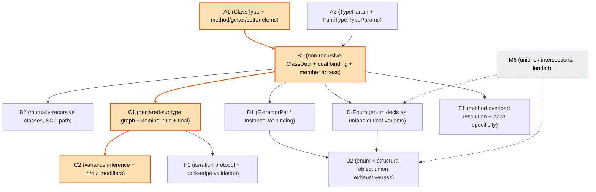

# M5 implementation plan — Nominal types (classes)

This is the implementation plan for **M5** as defined in
[01-milestones.md](01-milestones.md) §"M5 — Nominal types (classes)". M1
(`internal/soltype/` + `internal/solver/`), M2 (parser/resolver bridge), M2.5
(provenance + precise error spans), M3 (let-polymorphism, function exactness,
overloading, async), M4 (records, `mut`, lifetimes, destructuring/`match`),
M4.5 (script inference), and **M6** (unions / intersections — landed *before*
M5, see [m6-implementation-plan.md](m6-implementation-plan.md) §"Ordering note")
have landed on main. This plan is written against that code, not the spike or
the pre-M1 sketches. Where the two disagree, the shipped code wins and is cited.

The design sources are [01-milestones.md](01-milestones.md) §M5,
[02-design-notes.md](02-design-notes.md) §§"`soltype`"/"Exactness"/"`RefInner`",
[03-references.md](03-references.md) §"Nominal types", and the merged
[exact-types/requirements.md](../exact-types/requirements.md) §2.6 (`final` ⇒
exact instance). The **port reference** for the language semantics — constructor
handling, static/instance partition, `Self` substitution, the dual type/value
binding, overload merge — is the old checker's class support
(`internal/checker/infer_class_decl.go` + `infer_class_ctor.go` +
`check_implements.go`, ~2,100 LoC), reimplemented over `soltype` rather than
`type_system`.

## What M1–M6 actually shipped (ground truth this plan builds on)

Facts from the code on main that shape every PR below:

1. **No nominal former exists yet.** `soltype` has `TypeVarType`, `PrimType`,
   `LitType`, `FuncType`, `TupleType`, `ObjectType`, `RefType`, `PromiseType`,
   `Void`, `NullType`, `NeverType`, `UnknownType`, `ErrorType`, `UnionType`,
   `IntersectionType` ([type.go:385-399](../../internal/soltype/type.go)). There
   is **no** `ClassType`, `AliasType`, or `TypeRefType`. The only forward
   references are comments: `RefInner`'s doc reserves an `isRefInner` arm for a
   future `ClassType` ([type.go:309-310](../../internal/soltype/type.go)), and
   `ObjectType` is designated as the carrier for "(M5) class instance bodies"
   ([type.go:221-224](../../internal/soltype/type.go)).

2. **`soltype.ObjectType` already carries an element list — but only
   `PropertyElem`.** This point is about the `soltype` type representation
   (`internal/soltype/type.go`) only, not the repo as a whole; the old checker's
   `internal/type_system` has its own separate `ObjTypeElem` set. In `soltype`,
   `ObjectType{Elems []ObjTypeElem, Inexact bool}`; `ObjTypeElem` is a sealed
   `interface{ isObjTypeElem() }` with the single concrete `PropertyElem{Name,
   Type, Optional, Readonly}` ([type.go:221-239](../../internal/soltype/type.go)).
   **`MethodElem`/`GetterElem`/`SetterElem` are absent from `soltype`'s
   `ObjectType` baseline** — the doc comment explicitly slates them for M5 (they
   already exist in `internal/type_system/types.go`, but that is the old
   checker's parallel model, not this one). Lookup is `ObjectType.Prop(name)`
   ([type.go:248](../../internal/soltype/type.go)); `AsProperty(e)` **panics** on
   a non-`PropertyElem` ([type.go:266-272](../../internal/soltype/type.go)), the
   loud-fail convention that M5's new element kinds must extend at every
   "visit every element" site.

3. **The pattern set already forward-declares the M5 concretes.** `soltype.Pat`
   has `IdentPat`/`TuplePat`/`ObjectPat`/`LitPat`/`WildcardPat` produced today,
   plus `ExtractorPat` ([type.go:147-152](../../internal/soltype/type.go)) and
   `InstancePat{ClassName string; Object *ObjectPat}`
   ([type.go:158-163](../../internal/soltype/type.go)) declared "lands with
   classes in M5" but **never produced** — `bindPattern` hits its `default` and
   reports unsupported for both ([pattern.go:234-240](../../internal/solver/pattern.go)).
   `printPat` **already renders** `ExtractorPat`/`InstancePat`
   ([print.go:512-527](../../internal/soltype/print.go)), so pattern printing is M5-ready.

4. **`Inexact` = exact-by-default (zero value = exact).** `FuncType`/`TupleType`/
   `ObjectType`/`UnionType` all follow the convention; `IntersectionType` has no
   exactness flag. M5's class-instance exactness is the `final` analogue:
   `final` ⇒ exact instance, non-`final` ⇒ inexact
   ([02-design-notes.md](02-design-notes.md) §"Exactness":
   `ClassType{name, args, final}`, `final ⇒ exact instance`).

5. **The `constrain` structural switch has a settled shape and a forward note
   for M5.** `constrain(sub, super, seen, mutCtx)`
   ([constrain.go:129](../../internal/solver/constrain.go)) runs: seen-cache →
   `ErrorType`/`Unknown`/`Never` absorbers → the M6 pre-switch lattice block
   (union-sub, intersection-super, union-super trial-and-commit) → the structural
   switch on `sub` (`Prim`/`Lit`/`Func`/`Tuple`/`Object`/`Promise`/`Ref`/`Void`/
   `Intersection`-sub) → `bare <: RefType` auto-wrap → the var arms →
   `CannotConstrainError`. **The object arm ([constrain.go:357-423](../../internal/solver/constrain.go))
   already implements the target-dispatched exactness split** M4's plan recorded
   as the forward hook for M5: `Inexact` is the width gate, `AsProperty` walks the
   elems (M5 must widen it to methods/getters/setters), and the M4 plan's
   ObjectType arm carries the note "M5's `ClassType` reuses this `ObjectType`
   element list for its body and adds the nominal identity on top" (m4 plan
   §"Target-dispatched subtyping (forward note for M5)").

6. **Overload machinery is type-agnostic and reused verbatim.** `overload.go`'s
   `specificityOrder`/`moreSpecific`/`structuralSubtype`
   ([overload.go:149-345](../../internal/solver/overload.go)),
   `resolveOverload`/`tryOverloadArm` with per-arm probe rollback
   ([overload.go:42-98](../../internal/solver/overload.go)), and the
   "ground-enough" deferral (`hasUnconstrainedArg` → declaration order,
   [overload.go:104-242](../../internal/solver/overload.go)) all operate over
   `FuncType`/`Type` with no free-function assumptions. M5 method overloads
   plug straight in.

7. **`match` and exhaustiveness are partially built; the M5 gaps are marked.**
   `inferMatch` + `bindPattern` handle the structural patterns (M4);
   `checkMatchExhaustive` ([infer_expr.go:2324](../../internal/solver/infer_expr.go))
   dispatches union vs object/tuple; `unionMatchExhaustive`
   ([infer_expr.go:2351-2391](../../internal/solver/infer_expr.go)) covers only
   **literal** union members via `litMemberCovered`, and reports a non-literal
   union member as an unsupported feature "needs the structural or nominal
   coverage M5 adds" ([infer_expr.go:2346-2350, 2376-2388](../../internal/solver/infer_expr.go)).

8. **The decl walk has no class case.** `inferDeclDef`
   ([infer_decl.go:30-66](../../internal/solver/infer_decl.go)) handles only
   `*ast.VarDecl`/`*ast.FuncDecl`; the `default` reports unsupported. The SCC
   driver `inferComponent` ([module.go:148](../../internal/solver/module.go))
   pre-binds each name to a fresh var, infers, then rebinds to the coalesced/
   generalized type — the exact "fresh var per binding + constrain + generalize"
   shape M5's recursive classes need. `module.go:325-338` explicitly rejects
   non-value keys and notes "a class/enum contributes both a value and a type key
   for the same decl" — the dual-binding hook.

9. **Scope carries the dual sorts already.** `Scope` has `values`/`types`/
   `namespaces` maps ([scope.go:99-104](../../internal/solver/scope.go));
   `ValueBinding{Schemes, Sources, Kind, ...}` ([scope.go:16-47](../../internal/solver/scope.go))
   and `TypeBinding{Type, Sources}` ([scope.go:61-70](../../internal/solver/scope.go),
   today only stdlib placeholders — "real type aliases/classes are M3+"). A class
   binds **both**: a `ValueBinding` for the constructor and a `TypeBinding` for
   the instance type.

10. **The AST class node is rich and unconsumed.** `ast.ClassDecl`
    ([internal/ast/class.go:5-18](../../internal/ast/class.go)) has `TypeParams`,
    `LifetimeParams`, `Extends`, `Implements`, `Body []ClassElem`; `ClassElem`
    concretes are `FieldElem`, `MethodElem`, `GetterElem`, `ConstructorElem`,
    `SetterElem`, with `MethodReceiver` modeling `self`/`mut self`/`'a self`.
    `ast.EnumDecl` exists ([internal/ast/decl.go:343](../../internal/ast/decl.go)).
    None are consumed by the solver yet.

11. **The old checker is the semantics port source — but two of its behaviors are
    greenfield, not ports.** `internal/checker` decides class `<:` class **purely
    by `ObjectType.ID` identity and never walks `extends`** (TODO(#424),
    [unify.go:900-913](../../internal/checker/unify.go)), and has **no
    per-type-parameter variance at all** — no `Variance` field on `TypeParam`, no
    `in`/`out` syntax, no inference. M5's declared-subtype graph and Option-2
    variance are therefore **new work**, not translations. Everything else —
    constructor synthesis + `mut self` rules, static/instance partition, `Self`
    substitution, dual binding, overload merge/specificity, structural
    `implements` check, the structural iteration protocol — is a port. Note the
    old class-decl logic is **triplicated** (`infer_class_decl.go` + two
    `infer_module.go` branches, ~1,285 LoC of duplication, TODO(#604)); port the
    single-copy `inferClassDecl` shape, not all three.

## Why M5 is smaller than M4 but not small

The *subtyping rule* is genuinely short — a few `constrain` cases plus a
declared-subtype graph and a per-parameter variance dispatch. The bulk is
**language semantics**: constructor handling, static-vs-instance partitioning,
method overload merging, `Self` substitution, the type-vs-value dual binding.
That work is roughly proportional to the class surface regardless of the
inference core, and it is a port. What SimpleSub lets M5 *avoid* is the old
checker's placeholder / `typeRefsToUpdate` patching for cross-class recursive
references ([infer_module.go:1836-1859](../../internal/checker/infer_module.go)):
recursive classes reuse the SCC "fresh var per binding + constrain + generalize"
path that already drives recursive functions, with no placeholder-patch phase.

## Scope

In (per the milestone):

1. A nominal `ClassType{Name, Args, Lt, Final}` former + `MethodElem`/
   `GetterElem`/`SetterElem` object elements; all standing sites.
2. `ClassDecl` inference: instance body + constructor/static type, dual
   type/value binding, `Self` substitution, constructor synthesis/validation,
   static/instance partition. Non-recursive first, then mutually-recursive via
   the SCC path.
3. The declared-subtype graph + the nominal `constrain` rule (name identity +
   transitive `extends`/`implements`), target-dispatched against structural
   object targets by exactness; `final` ⇒ exact instance.
4. Per-type-parameter variance via polarity (Option 2) + `in`/`out`/`in out`
   modifier checking; composition with the `RefType` mut-invariance.
5. Nominal `match` patterns (`ExtractorPat`/`InstancePat`) + enum-exhaustive
   `match` + the structural-object union-exhaustiveness case M6 left open.
6. Method overloading (reuse M3 machinery + receiver-dependent dispatch + the
   deferred #723 object-argument specificity fix).
7. The iteration protocol for `for (x in xs)` / `for await (x in xs)` as an
   `xs <: Iterable<T>` subtype check, plus the CFG back-edge validation for the
   move + borrow-edge dataflow that a loop first exercises.

Out: TypeRef/generic-alias *resolution* against real libraries (M7 — M5 uses M2
placeholders for `Iterable`/`Iterator`/`AsyncIterable`/`IteratorResult`); the
second fixture harness (M8); type-level operators incl. `keyof`/mapped/`Awaited`
and path-based lifetimes (M9); codegen (M10). Enum *declarations* are handled
only as far as the enum-exhaustive `match` leg needs — an enum is a union of
implicitly-`final` variant types reusing the class machinery (see D-Enum).

---

## Key types and function sketches

Sketches use the shipped conventions: exported fields, `Inexact`/`Final` zero
value = exact, `[]SolverError`, journal-gated bound appends, visitor `Accept`,
the loud-fail `AsProperty` discipline.

### The nominal former (`soltype/type.go`)

`ClassType` is a **lightweight nominal token**. Its heavy data — the projected
member body, the resolved supers, and the inferred variance — lives in a side
registry keyed by `Name`, mirroring the old checker's split between
`ObjectType.ID` (identity) and the `TypeAlias` (body). This keeps `ClassType`
small, makes `equalType`/`Accept` cheap, and lets the registry be populated once
at class-decl time and read by `constrain`.

```go
// ClassType is a nominal lattice element. Two ClassTypes are the same nominal
// type iff Name matches; Args are the type arguments (variance-dispatched per
// position by the registry's Variance slice). Final ⇒ exact instance
// (exact-types §2.6); the zero value (false) is inexact, matching a
// non-final class whose subclasses may add members.
type ClassType struct {
    Name  string   // dep_graph-QUALIFIED name (e.g. "Geometry.Point"), NOT the local ident
    Args  []Type
    Lt    Lifetime // nilable; classes are borrowed via RefType exactly like records
    Final bool     // final ⇒ exact instance and exact keyof
}
func (*ClassType) isType()     {}
func (*ClassType) isRefInner() {} // reserved arm (type.go:309-310) is now filled

// Args are covariant children for the rewriting visitor; the nominal identity
// (Name/Final) and the Lt (not a Type) are carried through unchanged.
func (t *ClassType) Accept(v TypeVisitor, pol Polarity) Type
```

`ClassType` touches **every standing site** (the M4 checklist): `isType()` +
`LevelOf` arm ([type.go](../../internal/soltype/type.go)), `Accept`
([visitor.go](../../internal/soltype/visitor.go)), `typePrec`/`printType`/
`freeTypeVars` ([print.go](../../internal/soltype/print.go)), `equalType`
([coalesce.go:636](../../internal/solver/coalesce.go)), and `isRefInner`
([type.go:311](../../internal/soltype/type.go)). `LevelOf` returns the max over
`Args` (the level of a nominal instance is the level of its arguments).

### Method / getter / setter elements (`soltype/type.go`)

```go
// New ObjTypeElem arms. A method's type is a FuncType carrying a SelfParam and,
// when the method is generic, its OWN quantified type parameters (see
// "Per-method type parameters" below); overloaded methods hold their arms as an
// ordered slice (most-specific-first), mirroring the old checker's
// MethodElem.Signatures.
type MethodElem struct {
    Name       string
    Signatures []*FuncType // len 1 = ordinary; >1 = overload set (declaration order)
    Static     bool
}
type GetterElem struct{ Name string; Type Type }        // covariant, like a Property read
type SetterElem struct{ Name string; Param Type }        // contravariant (write direction)
func (*MethodElem) isObjTypeElem() {}
func (*GetterElem) isObjTypeElem() {}
func (*SetterElem) isObjTypeElem() {}

// TypeParam is one quantified type parameter, shared by FuncType.TypeParams
// (function/method generics) and ClassDef.TypeParams (class generics), so classes
// and functions describe their generics the same way. Var is the quantified
// inference var minted one level DEEPER than the enclosing binding and freshened
// per use by freshenAbove — NOT a named parameter requiring substitution. The
// declared CONSTRAINT is Var's upper bound (`<U extends T>` ⇒ Var's UpperBounds is
// [T]), so constrain and freshenAbove enforce and copy it with no new machinery.
// Default is the fallback filled in when a type argument is omitted, nil when the
// parameter is required; it is consulted at type-argument resolution and ignored
// by constraint solving. Name is the source name for display, since TypeVarType
// carries none.
type TypeParam struct {
    Name    string
    Var     *TypeVarType
    Default Type // nil ⇒ required
}

// FuncType gains TypeParams: the function's own quantified type parameters, the
// same soltype.TypeParam that ClassDef.TypeParams uses. nil is monomorphic, the
// common case and the zero value. A generic method such as Array<T>.map<U> lists U
// here; the class-level T is captured from the enclosing ClassType, not listed.
type FuncType struct {
    Params     []*FuncParam
    Ret        Type
    Inexact    bool
    TypeParams []*TypeParam // declaration order; nil ⇒ monomorphic
}
```

Adding these arms is a standing-rule sweep of every "visit every element" site:
`AsProperty`'s panic-callers ([type.go:266](../../internal/soltype/type.go)),
`acceptObjElems` ([visitor.go:253-271](../../internal/soltype/visitor.go) — a
getter is covariant, a setter contravariant, so each threads polarity like a
property/param), the object `printType` arm, and the object `constrain` arm's
depth loop ([constrain.go:378](../../internal/solver/constrain.go)). A helper
`Member(name) (ObjTypeElem, bool)` generalizes `Prop` across all four kinds for
member lookup and subtyping.

#### Per-method type parameters (quantified bounded vars)

A method must be able to carry its own type parameters, distinct from the class's.
Without this, the M7 ingestion of `.d.ts` class types — including built-ins like
`Array<T>.map<U>` and `Promise<T>.then<U>` — has no representation to target. M5
adds the representation now so those signatures round-trip; the ingestion that
produces them lands in M7.

The choice here is about the *instantiation mechanism*, not about whether the type
former has a `TypeParams` field — it does, named to match `ClassDef.TypeParams`.
The mechanism is the bounded-type-variable polymorphism the solver already uses for
let-generalization, freshened per use by the level-based `freshenAbove`, NOT a
System-F substitution pass keyed by parameter name. That distinction lives on
`soltype.TypeParam` itself, so the field name carries no implication either way.
Each entry is a `TypeParam{Name, Var, Default}`:

- A declared method type parameter becomes a fresh `TypeVarType` (`Var`) minted one
  level deeper than the class binding. That var IS the type parameter;
  `TypeParams` records the `TypeParam`s in declaration order so names and arity
  survive for `.d.ts`-faithful printing (`map<U>`).
- A **constraint** `<U extends T>` is `Var`'s upper bound. `freshenAbove` already
  copies a freshened var "bounds and all" ([poly.go:75-86](../../internal/solver/poly.go)),
  so F-bounded and class-parameter-referencing constraints fall out of the existing
  machinery. No new bound representation.
- A **default** `<U = Foo>` is `TypeParam.Default`, filled in at type-argument
  resolution when the argument is omitted and `nil` when the parameter is required.
  It is metadata for resolution, not for constraint solving, though a default that
  references an earlier parameter (`<T, U = T>`) is rewritten by `Accept` so
  instantiation reaches it.
- **Instantiation is the existing level-based `instantiate`/`freshenAbove`, not a
  substitution pass.** Member access wraps the projected method `FuncType` in a
  `PolyScheme` whose generalize-level is the class's level, then instantiates at
  the call level: every var deeper than that level — exactly the method's own
  `TypeParams` vars — is freshened per call, while the class-level `T` stays
  shared per instance. This is what makes `c.map(f)` polymorphic per call and
  closes the per-method generalization gap.

The **same `TypeParam` carries class generics** — `ClassDef.TypeParams` is
`[]*TypeParam`, not `[]string`, so a class parameter records its constraint and
default exactly as a method parameter does. `ast.ClassDecl.TypeParams` already
parses `Constraint`/`Default` ([ast.TypeParam](../../internal/ast/class.go): the
same `{Name, Constraint, Default}` a function type parameter carries), so the only
gap this closes is on the resolved side.

**Why not store a `PolyScheme` inline.** `TypeScheme`/`PolyScheme` live in
`solver`, but `FuncType`/`MethodElem` live in `soltype`, and since `solver`
imports `soltype` ([doc.go:15-18](../../internal/solver/doc.go)) soltype cannot
import solver back. So the quantification is recorded soltype-natively as the
deeper-level vars in `FuncType.TypeParams`, and the solver wraps them into a scheme
at member-access time.

**Why `TypeParam.Var` is a bounded inference var, not a named parameter.** The old
checker's `FuncType.TypeParams` also held `[]*TypeParam`, but its `TypeParam` was a
*named* parameter instantiated by a substitution pass keyed on the name — a second
polymorphism mechanism running next to inference vars. `soltype.TypeParam.Var` is
instead an ordinary bounded var that the existing level-based
`instantiate`/`freshenAbove` already freshens, so no `instantiate`/generalize/
`constrain`/print site grows a second code path and no alpha-renaming machinery is
needed. This is also what keeps the design forward-compatible with the planned
MLstruct extension, which retains generalization over bounded variables rather than
adopting named parameters. Same field name and same `[]*TypeParam` shape as the old
checker; different — and cheaper — instantiation mechanism.

**Scope expansion this implies.** `FuncType.TypeParams` is not class-specific — it
gives every function type a home for its own generics, so it partially lifts the
current "generic functions are unsupported" gate
([infer_expr.go:197-203](../../internal/solver/infer_expr.go)). M5 populates and
consumes it for methods and leaves general `fn f<U>` *inference* to the
generic-function work; the *representation* is shared.

**Known limitation.** These parameters are rank-1: a parameter whose own type is
polymorphic (higher-rank, e.g. a callback typed `<V>(V) -> V`) is not expressible
and is rejected rather than silently approximated, matching SimpleSub's and
MLstruct's rank-1 boundary.

### The class registry (`solver/context.go` or a new `solver/classes.go`)

```go
// ClassDef is the heavy per-class data the nominal token points at. Built once
// at class-decl time, read by constrain (the subtype graph + variance) and by
// member lookup (the projected body). Keyed by the class's QUALIFIED name on the
// Context — the same string in ClassType.Name (see "Qualified keys" below).
type ClassDef struct {
    TypeParams []*soltype.TypeParam // name + constraint (Var's upper bound) + default
    Variance   []Variance   // one per TypeParam, frozen at decl time (Phase C)
    Supers     []*ClassType // resolved Extends ++ Implements (the declared graph edges)
    Body       *ObjectType  // instance members (the "structural view it projects")
    Static     *ObjectType  // constructor + static members (the value-side binding's type)
}

type Variance int
const (
    Invariant Variance = iota // default until inference runs; the safe conservative choice
    Covariant
    Contravariant
    Bivariant // phantom: parameter appears nowhere in the body
)

// Context gains a class registry (populated by inferClassDecl, read by constrain).
// Keyed by qualified name; classDef(name) takes the same qualified string.
//   classes map[string]*ClassDef
func (c *Context) classDef(name string) (*ClassDef, bool)
```

The registry is a single `classes map[string]*ClassDef` field on the **`Context`**
struct ([context.go:22](../../internal/solver/context.go)) — the carrier that
already owns the engine's mutable core state (the var/lifetime counters and the
speculation journal). It lives there, not on `checker`, because the readers —
`constrain` and its new `constrainNominal` helper — are `*Context` methods
([constrain.go:103,129](../../internal/solver/constrain.go)) that need the subtype
graph (`Supers`) and per-position `Variance` to decide a nominal edge. The two
sides split by struct:

- **Write:** `inferClassDecl` is a `*checker` method; it reaches the map through
  the checker's `ctx *Context` field ([infer.go:23](../../internal/solver/infer.go)),
  writing `c.ctx.classes[qname]` at class-decl time.
- **Read:** `constrain`/`constrainNominal` and member lookup read `c.classes[name]`
  directly off `Context`.

The `ClassDef` struct itself and its helpers (`classDef`, `constrainNominal`,
`projectClassBody`) land in a new `solver/classes.go` (C1's Files); only the
`classes` map field is added to the existing `Context` in `context.go`.

**Qualified keys.** Both `ClassType.Name` and the `classes` registry key are the
`dep_graph`-qualified name — `Geometry.Point`, not the bare `Point`. The registry
is one flat `map[string]*ClassDef` on the `Context`, so a bare local key would
make two sibling `class Point` declarations under different namespaces collide on
`classes["Point"]`, even though scope resolution keeps them distinct: each
`Namespace` has its own `Types map[string]TypeBinding` and a qualified
`Namespace.Name` ([scope.go:76-81](../../internal/solver/scope.go)), and
`dep_graph` already forms every binding name as `CurrentNamespace + "." + name`
([dep_graph.go:331](../../internal/dep_graph/dep_graph.go)). `inferClassDecl`
therefore keys both the registry and the minted `ClassType` off that qualified
name — the analogue of the old checker's `TypeRefType.Name` being a `QualIdent`
([type_system/types.go:270](../../internal/type_system/types.go)) rather than a
plain string. The printer strips the namespace prefix for display, which is why
the `printType` arm still renders the bare `Point` / `Box<number>`.

**Assumption — classes are top-level only, so the registry is insert/overwrite,
never remove.** Every `ClassDef` comes from a module- or namespace-level decl and
lives for the whole inference run, so an entry is never removed because its class
went out of lexical scope. A body-level `class` is rejected up front: the parser
wraps it in a `DeclStmt`, but `inferStmt` permits only a `VarDecl` there and
reports `BodyDeclNotAllowedError` for any other decl kind
([infer_stmt.go:90-94](../../internal/solver/infer_stmt.go)). The only writes to
`classes` are a plain overwrite on redeclaration (a second top-level `class Foo`
in one namespace) and the B2 retraction of a pre-bound `ClassDef` shell whose
recursive-group decl then fails to produce a definition — the analogue of the SCC
driver's `removeValue` ([scope.go:136](../../internal/solver/scope.go)), which
unwinds a tentative insert rather than closing a scope. If a later milestone adds
lexically-scoped local classes, this flat `map[string]*ClassDef` needs
scope-qualified keys or removal-on-scope-exit — a design change, not a tweak.

**The prelude holds no classes, so the per-run registry needs no shared tier.**
The `classes` map lives on `Context`, and `newChecker` mints a fresh `Context`
per `InferModule` run ([infer.go:264](../../internal/solver/infer.go)), while the
prelude `Scope` is a process-wide singleton reused across runs
([prelude.go:14-24](../../internal/solver/prelude.go), `module.go:38-39`). That
split would force a shared prelude `ClassDef` tier — a prelude `ClassType` token
resolving `classDef` against an empty per-run map — ONLY if the prelude declared
classes. It does not: `NewPrelude` seeds operator value bindings and opaque
`unknown` stdlib type stubs, no `ClassType`/`ClassDef`
([prelude.go:40-117](../../internal/solver/prelude.go)). Built-ins like
`Promise`/`Iterable` are reached by importing them from pseudo-packages, not by
ambient prelude names, so async/iterator desugaring must resolve them through the
imported binding. A name that is not imported never enters the source file's
scope and so never reaches the registry.

**Imported classes are just more inserts, keyed by their package-qualified
name.** When the import system lands (beyond M5 — the solver has no `ImportStmt`
handling yet), a foreign class's `ClassDef` is inserted into the importing
package's per-run `classes` under its package-qualified name, then lives for that
run like a local class. This preserves "insert/overwrite, never remove" and
sidesteps cross-package name collisions. The one downstream design point M5 does
not settle: whether that foreign `ClassDef` is re-derived from the dependency's
serialized type info or copied by pointer from its inference result. Either way it
must stay inference-variable-free so one package's `constrain` cannot mutate a
bound another package sees — the same invariant that makes the prelude `Scope`
safe to share ([prelude.go:16-19](../../internal/solver/prelude.go)).

The **declared-subtype graph** is the adjacency implied by `ClassDef.Supers`.
`constrain` walks it transitively with a seen-set; no separate graph object is
needed beyond the registry.

### The nominal constrain rule (`solver/constrain.go`)

A new `case *soltype.ClassType` in the structural switch, sitting beside the
`ObjectType` arm ([constrain.go:357](../../internal/solver/constrain.go)):

```go
case *soltype.ClassType:
    switch sup := super.(type) {
    case *soltype.ClassType:
        // Nominal: identical name (per-position arg check by variance) OR
        // sub reaches sup transitively through the declared-subtype graph.
        return c.constrainNominal(sub, sup, seen)
    case *soltype.ObjectType:
        // Target-dispatched (m4 plan forward note): a class instance satisfies a
        // structural object target ONLY when the target is inexact — project the
        // class body and reuse the object arm's width rule. An EXACT object target
        // rejects (a Point is not an exact {x: number}).
        if !sup.Inexact {
            return []SolverError{&ClassIntoExactObjectError{Sub: sub, Super: sup}}
        }
        body := c.projectClassBody(sub) // ClassDef.Body with Args substituted for TypeParams
        return c.constrain(body, sup, seen)
    }
    // A ClassType against anything else falls through to the var arms / error.

// constrainNominal:
//   1. if sub.Name == sup.Name: per-position over Args, dispatched by
//      c.classDef(name).Variance[i] — covariant ⇒ constrain(argSub, argSup);
//      contravariant ⇒ constrain(argSup, argSub); invariant ⇒ both;
//      bivariant ⇒ no constraint.
//   2. else: for each direct super S of sub (ClassDef.Supers, Args substituted),
//      recurse constrainNominal(S, sup); success on the first that reaches sup.
//      A (subName, supName) seen-set bounds the walk on cyclic hierarchies.
//   3. neither ⇒ CannotConstrainError (nominal mismatch).
```

The reverse — a structural `ObjectType` **source** against a `ClassType`
**target** — is handled in the existing `ObjectType` arm by rejecting a
`ClassType` super: a `{x: number}` is never a `Point`
(`StructuralIntoClassError`).

**Composition with `RefType` mut-invariance.** No new code: the `RefType` arm
([constrain.go:434](../../internal/solver/constrain.go)) already fires the
bidirectional inner sweep when `Mut`, so `mut ClassType <: mut ClassType`
constrains the inner `ClassType` in both directions, which `constrainNominal`
cascades to both directions per arg — invariance in every `T` regardless of its
declared variance. That is exactly the four-line acceptance matrix (`mut Box`,
`mut Consumer`).

### Variance inference (`solver/classes.go`, Phase C)

```go
// inferVariance walks the class body once per type parameter using the existing
// polarity-threading visitor (the same machinery SimpleSub uses for inference
// vars). A parameter's occurrence polarities collapse to a Variance:
//   only Positive  ⇒ Covariant       only Negative ⇒ Contravariant
//   both           ⇒ Invariant       neither       ⇒ Bivariant
// Then an `in`/`out`/`in out` declaration-site modifier, if present, is CHECKED
// against the inferred variance and rejected on mismatch (VarianceMismatchError).
// Result stored on ClassDef.Variance, frozen at decl time.
func (c *Context) inferVariance(def *ClassDef, decl *ast.ClassDecl) []Variance
```

A **non-recursive** generic type alias carries no variance of its own. It is
transparent, so `Box<A> <: Box<B>` reduces to the structural subtyping of the
alias's expansion and the variance falls out per use. A modifier there would
annotate something already fully determined by the expansion, so M5 forbids
`in`/`out`/`in out` on `type` decls at parse/resolve time.

**This restriction is temporary and lifts in M7.** M7 brings generic type alias
/ `TypeRef` resolution, and with it **recursive** generic aliases, where the
transparency argument no longer holds. A recursive alias cannot be fully
expanded, so measuring its variance structurally becomes a self-referential
fixpoint: in `type List<A> = { head: A, tail: List<A> }` the polarity `A` picks
up inside `tail` depends on the variance of `List` itself, which is what the walk
is trying to compute. There the modifier stops being redundant and becomes
load-bearing — it supplies the variance as a declared contract, which turns
fixpoint inference into a single consistency check and gives `constrain` a frozen
variance to consult nominally rather than expanding the alias, the same role
`ClassDef.Variance` plays for a class. So M7 allows the modifiers on recursive
aliases and checks them against the definition the way `inferVariance` checks a
class. This also means the "allowed only on classes/interfaces" rule is an M5
simplification, not a permanent design choice.

### Class declaration inference (`solver/infer_class.go`, Phase B)

Port of `inferClassDecl` ([internal/checker/infer_class_decl.go](../../internal/checker/infer_class_decl.go))
over `soltype`, two phases:

```go
// inferClassDecl (NEW). Mirrors the old checker's two-phase shape:
//   Phase 1 (signatures): register a TypeBinding for the class name bound to a
//     fresh instance var BEFORE walking the body (so the body refers to the
//     class recursively); resolve each ast.TypeParam to a soltype.TypeParam —
//     mint its Var, set the resolved Constraint as the Var's upper bound, resolve
//     the Default — and declare them into a child scope; build the
//     Self reference (a ClassType{Name, Args: typeParamVars}) reused as every
//     method/getter/setter receiver, the constructor return, and the `self`
//     binding; partition Static vs instance elems; infer method/ctor SIGNATURES
//     (not bodies); synthesize a constructor from instance fields if none is
//     declared (SubclassConstructorRequiredError when extends + no ctor);
//     merge same-named method overloads (mergeMethodOverloads, ported).
//   Phase 2 (bodies): re-walk, infer field initializers and method/ctor BODIES
//     against their signatures; `self` is `mut Self` in constructors and where
//     the receiver is `mut self`, plain `Self` otherwise; check constructor
//     field-init completeness; run checkImplements (ported structural check).
// Registers the DUAL binding: a TypeBinding{Type: ClassType} (instance) and a
// ValueBinding{Schemes: [ctor+static ObjectType]} (constructor). Populates
// c.classes[qname] with the ClassDef (Body, Static, Supers, Variance), where
// qname is the dep_graph-qualified name also stored in ClassType.Name.
func (c *checker) inferClassDecl(scope *Scope, decl *ast.ClassDecl) *ClassType
```

Wired into `inferDeclDef` ([infer_decl.go:30](../../internal/solver/infer_decl.go))
as a new `case *ast.ClassDecl`, and into the SCC path
([module.go:325](../../internal/solver/module.go)) for the dual-key registration
and recursive groups.

**Field and parameter types are inferred from in-class usage.** An unannotated
field or method/constructor parameter is not an error and does not default to a
fixed type. It follows the solver's ordinary "fresh var per binding + constrain +
generalize" path, the same one that types an unannotated parameter in a plain
function ([infer_expr.go:169](../../internal/solver/infer_expr.go): "an
un-annotated param simply gets a fresh var"). Because `inferClassDecl` generalizes
only after every method and constructor body is walked in Phase 2, usage flows
into these fresh vars before they freeze:

- **Parameters.** An unannotated parameter mints a fresh var bound as a MonoScheme
  for the body, then refined by how the body uses it and by sibling call sites
  within the class, since the methods form one recursive group. `class C { fn
  f(self, x) { self.n = x + 1 } }` infers `x: number`.
- **Instance fields.** Each field mints a fresh var in Phase 1
  ([infer_class_decl.go:147,153](../../internal/checker/infer_class_decl.go)),
  refined in Phase 2 by either its annotation or an assignment such as `self.x =
  value` in the constructor or a method, where `self` is `mut Self`. An
  unannotated instance field therefore takes its type from its constructor
  assignment.

**Instance fields take no field-level initializer; only static fields do.** M5
ports the old checker's rule: a `= value` written directly on an *instance* field
is a `FieldInitializerNotAllowedError`, while a *static* field's initializer is
inferred ([infer_class_decl.go:390-401](../../internal/checker/infer_class_decl.go)).
So an instance field's type comes from its annotation or a constructor/method
assignment, never a field-level initializer. Phase 2's "infer field initializers"
step is therefore the static-field initializers plus the constructor-assignment
inference above, not a direct `x = 5` on an instance field.

### Nominal patterns (`solver/pattern.go`, Phase D)

```go
// bindPattern's default currently reports ExtractorPat/InstancePat as
// unsupported (pattern.go:234-240). D1 replaces that with real binding, through
// MEMBER LOOKUP, not subtyping — the same path that resolves p.x:
//   InstancePat{ClassName, Object}: resolve ClassName to its ClassDef, project
//     the body, and bind the inner ObjectPat's fields against the projected
//     member types (a record pattern against a class instance succeeds because
//     it dispatches through member lookup — assignability is NOT consulted).
//   ExtractorPat: an enum/class constructor pattern; resolve the constructor,
//     bind its argument sub-patterns against the constructor's parameter types.
func (c *checker) bindInstancePat(scope *Scope, p *soltype.InstancePat, scrut soltype.Type)
func (c *checker) bindExtractorPat(scope *Scope, p *soltype.ExtractorPat, scrut soltype.Type)
```

### Iteration protocol (`solver/infer_stmt.go`, Phase F)

```go
// inferForIn desugars `for (x in xs)` to a protocol subtype check — NO new
// constraint machinery, just wire the loop syntax to the existing dispatch path:
//   T := c.freshVar(lvl)
//   c.Constrain(xs, Iterable<T>)      // sync; Iterable from the M2 prelude placeholder
//   bind x : T in the loop-body scope
// `for await (x in xs)` uses AsyncIterable<T> and is rejected by the AST walk
// outside an async fn; `for await` over a sync iterable is rejected by the type
// rule (AsyncIterable membership fails). The protocol resolution is one
// method-dispatch step through the M5 nominal machinery.
func (c *checker) inferForIn(scope *Scope, lvl int, s *ast.ForInStmt) soltype.Type
```

---

## PR breakdown

10 PRs across 6 phases (A–F) plus one enum PR, each independently mergeable and
green, each with table-driven tests asserting rendered types (Escalier
type-annotation syntax) and **full** error messages. Every PR names the files
touched, the structures added/modified, the algorithm changes, and its
acceptance set.

A standing rule for every PR that adds a `soltype` former or `ObjTypeElem` arm:
**touch every site that switches over the set** — `type.go` (`isType`/`LevelOf`),
`visitor.go` (`Accept`/`acceptObjElems`), `print.go` (`typePrec`/`printType`/
`freeTypeVars`), `coalesce.go` (`equalType`), and any `AsProperty` caller.
Missing one is a latent `panic("unhandled %T")` or a silent `LevelOf`-defaults-to-0
corruption of `freshenAbove`.

### Phase A — Nominal representation (soltype plumbing)

- **A1 — `ClassType` former + method/getter/setter elements** (~260).
  - **Files:** `soltype/type.go`, `soltype/visitor.go`, `soltype/print.go`,
    `solver/coalesce.go` (`equalType`).
  - **Structures:**
    - add `ClassType{Name, Args, Lt, Final}` with `isType`/`isRefInner`;
      `LevelOf` arm (max over `Args`).
    - add `MethodElem`/`GetterElem`/`SetterElem` `ObjTypeElem` arms; add a
      `Member(name)` helper generalizing `Prop` across all element kinds.
    - `ClassType.Accept` (Args covariant, Name/Final/Lt carried through);
      extend `acceptObjElems` with getter (covariant) / setter (contravariant) /
      method (each signature is a `FuncType`, params contravariant) arms.
    - `printType` arms: `ClassType` renders `Point` / `Box<number>` /
      `mut 'a Point` (the `Lt`/`mut` forms via the existing `RefType` wrapper,
      not on `ClassType` itself), stripping the namespace prefix off the qualified
      `Name` for display; object arm renders method/getter/setter members.
    - `equalType` arm: `a.Name == b.Name && a.Final == b.Final && equalArgs`.
    - `freeTypeVars` descends `Args` and the new element kinds.
  - **Accept:** no constrain rule or decl handling yet, so trivially green —
    `ClassType` and the three element kinds round-trip `Accept`; the printer
    renders a class instance, a generic instance `Box<number>`, and an object with
    a monomorphic method, getter, and setter.

- **A2 — `TypeParam` + per-method `FuncType.TypeParams` (constraint + default)**
  (~120). **← the soundness-sensitive representation, isolated for its own tests.**
  - **Files:** `soltype/type.go` (the `TypeParam` type + the `FuncType.TypeParams`
    field), `soltype/visitor.go` (`FuncType.Accept`), `soltype/print.go`
    (generic-signature rendering + `freeTypeVars`), `solver/coalesce.go`
    (`equalType`).
  - **Structures:**
    - add `soltype.TypeParam{Name, Var, Default}` (constraint = `Var`'s upper
      bound, `Default` nil ⇒ required) and `FuncType.TypeParams []*TypeParam`
      (declaration order, nil ⇒ monomorphic). `LevelOf` still maxes over
      `Params`/`Ret`; the `TypeParams` vars are deeper by construction so they do
      not lower the func's level.
    - `FuncType.Accept` rewrites each `TypeParam`'s `Var`, its constraint (the
      var's upper bound), and its `Default` so all three survive a `freshenAbove`
      copy.
    - `printType`: a generic function or method renders its `TypeParams` — `<U>`,
      `<U: T>` for a constraint, `<U = Foo>` for a default, `<U: T = Foo>` for both.
      Extends A1's method-elem arm from monomorphic to generic.
    - `equalType`: two generic `FuncType`s compare **up to alpha-renaming** of
      their positional `TypeParams`, constraints and defaults included — a
      parameter's identity is its position, not its var id.
    - `freeTypeVars` **excludes** a `FuncType`'s own `TypeParams` vars (they are
      bound, not free) — the one non-mechanical arm, since every other site treats
      vars as free.
  - **Depends on:** only `FuncType` (on main), so it runs in parallel with A1; the
    lone shared edit is the method-elem `printType` arm A1 lands monomorphic and A2
    extends to render `<U>`. Both feed B1.
  - **Accept:** the three soundness arms get direct tests before any class decl
    consumes the field — a generic function `map<U>(f: fn (T) -> U) -> Array<U>`
    round-trips `Accept` and prints; a constrained-plus-defaulted param renders
    `<U: Ord = number>`; `freeTypeVars` omits a generic function's own `U`; two
    signatures differing only in var id compare equal under `equalType`.

### Phase B — Class declaration inference (the semantics port)

- **B1 — Non-recursive `ClassDecl` inference + dual binding + member access**
  (~420).
  - **Files:** `solver/infer_class.go` (new), `solver/infer_class_ctor.go`
    (new), `solver/infer_decl.go` (dispatch case), `solver/scope.go`
    (dual-binding helpers if needed), `solver/classes.go` (new — the `ClassDef`
    registry), `solver/infer_expr.go` (`valueProp` — method/getter access),
    `solver/errors.go`.
  - **Structures:** the `ClassDef` registry on `Context`
    (`classes map[string]*ClassDef`); `ClassDef{TypeParams []*soltype.TypeParam,
    Variance (invariant placeholder until C2), Supers, Body, Static}`.
  - **Algorithm — port `inferClassDecl`** (see sketch): the two-phase
    signature-then-body walk, `ast.TypeParam` → `soltype.TypeParam` resolution
    (constraint into the var's upper bound, default resolved), static/instance
    partition, `Self` = `ClassType{Name, Args: typeParamVars}` substitution,
    constructor synthesis + `mut self` validation (port `infer_class_ctor.go`),
    `mergeMethodOverloads` (port `merge_overloads.go`), dual `TypeBinding` +
    `ValueBinding` registration. A `ClassType` type reference with fewer `Args`
    than `TypeParams` fills the missing trailing positions from each
    `TypeParam.Default`, which may reference an earlier parameter; too few args
    and no default is `MissingTypeArgError`. `Extends`/`Implements` resolved to
    `*ClassType` and stored on `ClassDef.Supers` (the subtype-graph edges; the
    *rule* that walks them is C1). **Member access:** extend `valueProp`
    ([infer_expr.go:1831](../../internal/solver/infer_expr.go)) to resolve
    a method/getter through the projected `ClassDef.Body` — single-signature
    methods and getters here; overloaded-method resolution is E1. A resolved
    method carrying its own `FuncType.TypeParams` is wrapped in a `PolyScheme` at
    the class's generalize-level and `instantiate`d at the access level, so each
    call freshens the method's own params while class-level args stay shared.
    A non-generic method (`TypeParams` nil) skips the wrap and returns the
    projected `FuncType` directly.
  - **Errors (ported names):** `MultipleConstructorsError`,
    `SubclassConstructorRequiredError`, `MissingSelfReceiverError`,
    plus constructor-return / field-init errors.
  - **Accept:** a single `class Point { x: number; y: number; fn dist(self) ->
    number {...} }` infers; `Point(5, 10)` constructs an instance; `p.x` and
    `p.dist()` resolve through the body; a class with an explicit constructor and
    a synthesized one both check; `mut self` vs `self` receivers bind correctly.
    A generic method `fn first<U>(self, xs: Array<U>) -> U` instantiated at two
    call sites with different `U` type-checks at each, confirming the per-method
    params freshen per call. A `class Box<T: Ord = number>` records the constraint
    and default: `Box<string>` requires `string <: Ord`, a bare `Box` resolves to
    `Box<number>`, and `Box<T>` where `T` fails the constraint reports the bound
    error.

- **B2 — Mutually-recursive classes in the SCC path** (~180).
  - **Files:** `solver/module.go` (the `inferComponent` dual-key path), tests.
  - **Algorithm:** register each class in a recursive group to a fresh instance
    var + its `ClassDef` shell *before* any body walk (the existing pre-bind
    step, [module.go:148](../../internal/solver/module.go)), infer all bodies,
    then generalize — the same "fresh var per binding + constrain + generalize"
    used for recursive functions. **No `typeRefsToUpdate` placeholder patching**
    (the old checker's cross-class fixup, [infer_module.go:1836](../../internal/checker/infer_module.go)):
    the fresh var *is* the forward reference and unifies with the real
    `ClassType` when the body completes. Handle the dual value+type key priority
    in the SCC ordering (a class contributes both, per module.go:325-338).
  - **Accept:** `class A { b: B }` / `class B { a: A }` infer cleanly;
    a method on `A` returning `B` and vice versa type-check; no placeholder leak
    in the rendered types.

### Phase C — Nominal subtyping + variance

- **C1 — The declared-subtype graph + the nominal constrain rule + `final`
  exactness** (~240). **← the core subtyping PR.**
  - **Files:** `solver/constrain.go`, `solver/classes.go` (`constrainNominal`,
    `projectClassBody`), `solver/errors.go`, tests.
  - **Algorithm — the new `case *soltype.ClassType`** (see sketch):
    `constrainNominal` (name identity with **conservative invariant** per-arg
    dispatch until C2; then the transitive `extends`/`implements` walk with a
    `(subName, supName)` seen-set); the target-dispatched class-vs-object arm
    gated on the target's `Inexact`; the reverse object-vs-class rejection in the
    existing object arm.
    - **`final` exactness:** a `final` class projects an **exact** body
      (`Body.Inexact = false`), a non-`final` class an **inexact** one — so
      `final class Point` rejects extra members against an exact target and
      `keyof` is an exact union, while a non-`final` instance behaves like an
      open object. This is one line at `projectClassBody`, reading `sub.Final`.
  - **Errors:** `ClassIntoExactObjectError`, `StructuralIntoClassError`, and the
    nominal-mismatch `CannotConstrainError` path.
  - **Accept:** `class B extends A` yields `B <: A` via the graph and A's methods
    dispatch on a `B` when not overridden; a bare `{x: number}` is rejected
    against `Point` and vice versa; `var foo: {x, y, ...} = Point(5,10)` is
    accepted (inexact target) while `var foo: {x, y} = Point(5,10)` and
    `var bar: Point = {x, y}` reject; a `final` instance is exact (extra members
    reject), a non-`final` instance is inexact.

- **C2 — Per-type-parameter variance inference + `in`/`out` modifiers** (~220).
  - **Files:** `solver/classes.go` (`inferVariance`), `solver/constrain.go`
    (dispatch C1's per-arg check on `ClassDef.Variance`), parser hook for
    `in`/`out`/`in out` on class type params, `solver/errors.go`, tests.
  - **Algorithm:** `inferVariance` walks each class body via the polarity
    visitor, collapsing per-parameter occurrence polarities to a `Variance`
    (only-Positive ⇒ Covariant, only-Negative ⇒ Contravariant, both ⇒ Invariant,
    neither ⇒ Bivariant), frozen onto `ClassDef.Variance`. A declared modifier is
    **checked** against the inferred variance (`VarianceMismatchError`). C1's
    `constrainNominal` arg dispatch switches from conservative-invariant to the
    stored `Variance`. **Composition with `mut`** is free (the `RefType` arm's
    bidirectional sweep forces both arg directions).
  - **Accept:** the four variance lines from the milestone against `Box<T>`
    (covariant) and `Consumer<T>` (contravariant), plus their `mut` forms
    (all invariant); a `<in T>` on a covariant-inferred parameter is rejected;
    a matching `<out T>` checks.

### Phase D — Nominal `match` patterns + exhaustiveness

- **D1 — `ExtractorPat` / `InstancePat` binding** (~200).
  - **Files:** `solver/pattern.go` (`bindPattern` default → real binding),
    `solver/infer_expr.go` (produce the patterns from the AST — the AST-to-`soltype`
    pattern lowering), tests.
  - **Algorithm:** produce `InstancePat`/`ExtractorPat` from the AST pattern
    nodes; bind through **member lookup** (project the `ClassDef.Body`, bind the
    inner `ObjectPat` fields / constructor arguments against the projected member
    types), **not** subtyping — so `let {x, y} = point` and the `match` arm
    `Point({x, y})` both succeed against a `Point`.
  - **Accept:** a `match` over class/enum constructor patterns binds and
    type-checks each arm; a record pattern against a `Point` binds `x`/`y` at
    their member types; a wrong field/constructor is a typed error.

- **D-Enum — Enum declarations as unions of `final` variants** (~180).
  - **Files:** `solver/infer_enum.go` (new), `solver/infer_decl.go` (dispatch),
    `solver/module.go` (dual key), tests.
  - **Algorithm:** infer `ast.EnumDecl` as a `UnionType` of implicitly-`final`
    variant `ClassType`s (reusing B1's variant/binding machinery — each variant
    is a nominal token, the enum name binds the union as a type and the variant
    constructors as values). This is the substrate the enum-exhaustive leg (D2)
    needs; enums are modeled as unions of variants exactly as the old checker
    does. **Depends on B1 (class/variant machinery) + M6 (unions).**
  - **Accept:** an enum decl binds its variants; a value of a variant type is
    `<:` the enum union; the enum name resolves as a type.

- **D2 — Enum-exhaustive + structural-object union exhaustiveness** (~170).
  - **Files:** `solver/infer_expr.go` (`unionMatchExhaustive` extension), tests.
  - **Algorithm:** extend the union-member loop
    ([infer_expr.go:2351-2391](../../internal/solver/infer_expr.go)) with two
    coverage cases beyond M6's literal-member check:
    - **nominal:** an `InstancePat`/`ExtractorPat` covers a union member iff the
      member's class name matches (enum variants are `final`, so a `match`
      covering every variant needs no default arm).
    - **structural object:** an object pattern covers a union member iff that
      member carries every field the pattern names; the arms are exhaustive when
      they collectively cover each member — this replaces the
      unsupported-feature report the loop emits today for a structural arm
      ([infer_expr.go:2376-2388](../../internal/solver/infer_expr.go)).
  - **Accept:** a `match` over an enum with an arm per variant needs no
    catch-all, and a missing variant is reported non-exhaustive; a `match` over
    `{x: number} | {y: string}` with an object pattern per member is exhaustive.

### Phase E — Method overloading

- **E1 — Method overload resolution + #723 object-argument specificity** (~200).
  - **Files:** `solver/infer_expr.go` (method-call path through `valueProp`),
    `solver/overload.go` (reuse `specificityOrder`/`moreSpecific`; add the
    record/class field-subsumption ranking), tests.
  - **Algorithm:** plug overload selection into the **class-body member-lookup
    path** (not `constrain` — the lookup already holds the declared class, so no
    arrow-type synthesis for subtyping). Reuse M3's `resolveOverload`
    machinery; the two method-specific wrinkles:
    - **receiver-dependent dispatch** — defer resolution until the receiver's
      bounds are collected; if the receiver is still a free variable, fall back
      to declaration order on its nominally-known declared class.
    - **#723 object-argument specificity** (deferred from M4): rank record/class
      arguments by field-set subsumption and exactness (a superset-of-fields or
      exact arg dominates), the object analogue of M3's arity/exactness ranking,
      replacing `structuralSubtype`'s current record-shaped tie.
  - **Accept:** an overloaded method resolves the most-specific arm by receiver
    + args; an overload on object arguments picks by field subsumption (the
    #723 cases); a free-variable receiver falls back to declaration order.

### Phase F — Iteration protocol

- **F1 — `for (x in xs)` / `for await` + CFG back-edge validation** (~220).
  - **Files:** `solver/infer_stmt.go` (the for-loop arm — greenfield), the AST
    walk (for-await-in-async enforcement), `solver/borrow_flow.go` /
    move-analysis tests, tests.
  - **Algorithm:** `inferForIn` desugars to `xs <: Iterable<T>` (sync) /
    `xs <: AsyncIterable<T>` (async), `T` fresh, binding the loop variable at
    `T` — one method-dispatch step through the M5 nominal machinery, no new
    constraint form. `for await` outside an `async fn` is rejected by the AST
    walk; `for await` over a sync iterable fails the type rule.
    **Back-edge validation:** a `for` loop is the first inferable source that
    gives the CFG a back edge, so add loop tests for the move consumed-lattice
    (`AnalyzeMoves`) and the borrow-edge dataflow (`analyzeBorrows`) — confirm
    `clearEagerSubtree` emits the unconditional kill for a whole-binding
    reassignment across the back edge, and re-examine the field-store-across-a-back-edge
    prune-gated kill (the remaining imprecision the milestone flags).
  - **Depends on:** C1 (the subtype rule the protocol check rides) + the M2
    `Iterable`/`Iterator`/`AsyncIterable`/`IteratorResult` prelude placeholders
    ([prelude.go:98-107](../../internal/solver/prelude.go); real resolution is M7).
  - **Accept:** `for (x in numbers)` where `numbers: Array<number>` binds
    `x: number`; `for (x in 5)` rejects (number doesn't implement `Iterable`);
    `for await (x in stream)` outside an `async fn` rejects; `for await` over a
    sync iterable rejects; the two back-edge dataflow loop tests pass.

---

## Dependency graph

```
A1 (ClassType + method/getter/setter elems) ──┐
A2 (TypeParam + FuncType.TypeParams)         ──┤   ── A2 parallel with A1 (needs only FuncType)
                                               ▼
 └─► B1 (non-recursive ClassDecl + dual binding + member access)
      ├─► B2 (mutually-recursive classes, SCC path)          ── parallel with C/D/E after B1
      ├─► C1 (declared-subtype graph + nominal rule + final)
      │    ├─► C2 (variance inference + in/out modifiers)
      │    └─► F1 (iteration protocol + back-edge validation)
      ├─► D1 (ExtractorPat / InstancePat binding)
      │    └─► D2 (enum + structural-object union exhaustiveness)   ── also needs D-Enum + M6
      ├─► D-Enum (enum decls as unions of final variants)     ── needs M6 (landed)
      └─► E1 (method overload resolution + #723 specificity)
```

The same graph in mermaid, with the critical path (A1 → B1 → C1 → C2) highlighted
and the landed `M6` prerequisite dashed:



**Critical path:** A1 → B1 → C1 → C2 (variance is the milestone's headline
acceptance, and it depends on the nominal rule it refines). F1 also hangs off
C1. A2 depends only on `FuncType` (on main), so it runs in parallel with A1 and
stays off the critical path as long as it lands before B1. Everything else is off
the critical path.

**Parallelizable once B1 lands** (all depend only on B1, mutually independent):

- **B2** (recursive classes) — pure SCC-path work, no overlap with subtyping.
- **C1** (nominal subtyping) — `constrain`/`classes.go`.
- **D1** (nominal patterns) — `pattern.go`, uses member lookup, **not** the C1
  subtyping rule, so it does not wait on C1.
- **D-Enum** (enum decls) — reuses B1's variant machinery + M6 unions.
- **E1** (method overloads) — member-lookup path + `overload.go`, independent of
  subtyping and patterns.

So after the A1+A2 → B1 spine (A1 and A2 run in parallel, both landing before B1),
**B2, C1, D1, D-Enum, and E1 can proceed in parallel** (five tracks). The
second-tier dependents each wait on one first-tier PR: **C2** on C1, **F1** on C1,
**D2** on both D1 and D-Enum. The only PR that joins two tracks is D2 (patterns ×
enums × M6's union exhaustiveness).

## Algorithms and data structures added or modified — summary

**Added data structures:**

- `soltype.ClassType{Name, Args, Lt, Final}` — the nominal lattice token
  (`Name` is the dep_graph-qualified name, the shared key into `classes`).
- `soltype.MethodElem`/`GetterElem`/`SetterElem` — new `ObjTypeElem` arms
  (methods hold overload arms as an ordered `[]*FuncType`).
- `soltype.TypeParam{Name, Var, Default}` — one quantified type parameter, shared
  by functions and classes. Constraint is `Var`'s upper bound; `Default` is the
  omitted-argument fallback (nil ⇒ required); `Name` is for display.
- `soltype.FuncType.TypeParams []*TypeParam` — a method's or function's own
  quantified type params, bounded vars one level deeper than the class,
  instantiated per call by the existing `freshenAbove`. `nil` ⇒ monomorphic. Gives
  `.d.ts` generic methods like `Array<T>.map<U>` a representation for M7 ingestion.
- `solver.ClassDef` registry (`Context.classes map[string]*ClassDef`) — the
  projected body, resolved supers (the declared-subtype-graph edges), frozen
  per-parameter variance, and `TypeParams []*soltype.TypeParam` carrying each class
  parameter's constraint and default.
- `solver.Variance` enum (`Invariant`/`Covariant`/`Contravariant`/`Bivariant`).
- Produced (not new — already declared) `soltype.InstancePat`/`ExtractorPat`.

**Added algorithms:**

- `constrainNominal` — name-identity + transitive `extends`/`implements` walk
  with a seen-set, per-position arg dispatch by variance.
- Target-dispatched class-vs-structural-object subtyping keyed on the object
  target's `Inexact`, projecting the class body through the existing object arm.
- `inferVariance` — polarity walk of the class body per type parameter,
  collapsing occurrence polarities to a `Variance`, with `in`/`out` checking.
- `inferClassDecl` — the two-phase signature/body port (constructor synthesis,
  static/instance partition, `Self` substitution, dual binding, overload merge).
- Per-method scheme instantiation at member access — wrap a projected method
  carrying `FuncType.TypeParams` in a `PolyScheme` at the class's level and
  `instantiate` it per call, so the method's own params freshen per call while
  class args stay shared.
- Recursive-class inference via the existing SCC fresh-var-per-binding path (no
  `typeRefsToUpdate` patching).
- Nominal pattern binding through member lookup; nominal + structural-object
  `match` exhaustiveness.
- Method overload resolution through the class-body lookup path (reusing
  `overload.go`), with receiver-dependent deferral and #723 field-subsumption
  specificity.
- `for..in` / `for await` desugaring to an `Iterable<T>` / `AsyncIterable<T>`
  subtype check; CFG back-edge validation for the move + borrow-edge dataflow.

**Modified sites (the standing checklist, per new former/element):**
`type.go` (`isType`/`LevelOf`/`isRefInner`), `visitor.go`
(`Accept`/`acceptObjElems`), `print.go` (`typePrec`/`printType`/`freeTypeVars`),
`coalesce.go` (`equalType`), every `AsProperty` caller, the `constrain` object
arm's depth loop, `inferDeclDef`/`inferComponent` dispatch, and `valueProp`
member access.

## Risks

- **Variance × `mut` composition (C2).** The four-line acceptance matrix is the
  milestone's headline correctness bar. It is *designed* to fall out of the
  `RefType` arm's existing bidirectional inner sweep composing with
  `constrainNominal`'s per-arg dispatch — but confirm the composition on the
  `mut Consumer<number|string> <: mut Consumer<number>` case (contravariant
  parameter under `mut` must still be invariant, i.e. reject) before declaring
  C2 done.
- **The declared-subtype graph is greenfield, not a port.** The old checker
  never walks `extends` in subtyping (TODO(#424)); C1 is writing that relation
  for the first time. Bound the transitive walk with a `(subName, supName)`
  seen-set from the start — a class hierarchy can be deep, and diamond
  `implements` graphs revisit supers.
- **Enum scope creep.** D-Enum is bounded to "a union of `final` variant tokens
  reusing the class machinery," enough for the enum-exhaustive leg — not full
  enum semantics (associated data, methods on enums). If the milestone's enum
  surface turns out larger than the exhaustiveness leg needs, split the excess to
  a follow-up rather than growing D-Enum.
- **Iteration back-edge imprecision (F1).** The field-store-across-a-back-edge
  prune-gated kill is a known open imprecision the milestone calls out; F1 adds
  the loop test that exercises it but may surface a real fix — treat a failing
  field-store back-edge test as in-scope for F1, not a deferral.
- **Per-method type params touch a core former (A2).**
  `FuncType.TypeParams` and the shared `TypeParam` modify `FuncType`, which the
  whole engine switches over, so the two non-mechanical sweep arms carry soundness
  weight. `freeTypeVars` must **exclude** a func's own `TypeParams` vars —
  treating a bound method param as free would let the class-level generalize
  capture it, collapsing per-call polymorphism into a phantom class parameter.
  `equalType` must compare generic `FuncType`s **up to positional alpha-renaming**,
  constraints and defaults included, or two ingested signatures that differ only in
  var id compare unequal and defeat dedup/caching. `Accept` must reach each
  `TypeParam`'s constraint (the var's upper bound) and `Default` so a `freshenAbove`
  copy substitutes a default that references an earlier parameter (`<T, U = T>`).
  Land A2 with direct tests for all three before B1 consumes the field.
  Keep the M5 use rank-1 and reject higher-rank rather than approximating; general
  `fn f<U>` *inference* stays out of scope — M5 only populates the representation
  for
  methods and the M7 ingestion path.
