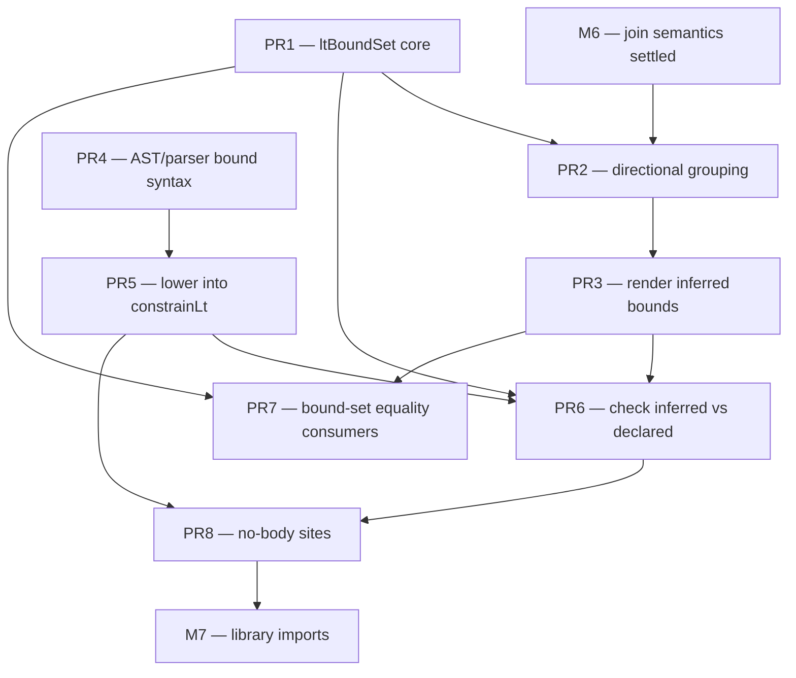

# M6.5 implementation plan — Lifetime bounds

This plan covers **M6.5 — Lifetime bounds** as listed in
[01-milestones.md](01-milestones.md). It records the design routes considered, the
chosen route, and the sequencing rationale. It is a routes-and-decision document,
not yet a PR-by-PR breakdown. The PR breakdown is written once the route is
committed and M6 has settled the join semantics this builds on.

A **lifetime bound** is a declared or rendered outlives relation between two named
lifetimes in a signature. Rust spells it `'a: 'b`, read "`'a` outlives `'b`".
Escalier's lifetimes are unrelated once named today. A bound lets a signature state
how two of them relate.

## Background — the outlives graph already exists

The constraint solver already builds the outlives relation. `constrainLt(sub, super)`
records the edges in `LifetimeVar.LowerBounds` and `LifetimeVar.UpperBounds`
([internal/soltype/lifetime.go](../../internal/soltype/lifetime.go)), and M4 D2.5
already gives lifetimes a `Level` so the freshener copies those edges per
instantiation. So the relations a body implies are inferred today. What is missing
is surfacing them, declaring them at no-body sites, and checking one against the
other.

The work splits into three capability axes:

1. **Render** an inferred bound as an outlives bound attached in the lifetime and
   type-param list, `<'a: 'c, …>`, instead of collapsing it to the union `('a | 'b)`
   or eliding it. M4 D4 collapses or elides today.
2. **Declare** a bound in source for a site that has no body to infer from, and
   lower it into `constrainLt`.
3. **Check** an inferred bound set against a declared one. This is subsumption over
   the lifetime sort.

A **bound lives in the param list, not a separate `where` clause.** Escalier attaches
a type-param's bound in the `<…>` list as `<T: U>`, so a lifetime bound follows the
same form, `<'a: 'b>`, read "`'a` outlives `'b`". One quantifier list carries both
sorts and their bounds, which keeps the surface consistent between type-param bounds
and lifetime bounds and avoids a second bound-declaration grammar.

## Inference vs annotation — the dividing line is the body

The shape of the relation does not decide whether it needs an annotation. The
presence of a body does. A bound is a fact about the solved graph, so any bound a
body produces through its borrows, joins, and stores is inferred from `constrainLt`
edges, then coalesced. A site with no body has nothing to watch, so its bounds must
be declared.

Four representative cases, with whether each is inferable from a concrete function:

1. **Multi-source join.** Returning one of two borrows. The result lives only as
   long as both inputs, so its lifetime is the shorter of the two.
   ```
   fn pick<'a: 'c, 'b: 'c, 'c>(p: mut 'a {x: number}, q: mut 'b {x: number}) -> mut 'c {x: number}
   ```
   **Fully inferred today.** `joinBorrows` mints the join lifetime and constrains
   each source into it, so `'a: 'c, 'b: 'c` is the graph the solver already builds.
   M4 D4 renders it as the union `('a | 'b)`, the conservative stand-in for "one of
   these". Upgrading that to a bounded `'c` is a display change, not an inference
   change.

2. **Store a borrow inside a borrow.** Inserting a borrowed value into a borrowed
   container. The inserted value must outlive the references the container holds.
   ```
   fn put<'a, 'v: 'a>(bag: mut 'a {items: ['v {…}]}, item: 'v {…})
   ```
   **Inferred when the body performs the store**, via the same `constrainLt` the
   borrow and escape rules already emit. The nested-container store path is not all
   wired yet, since array writes are deferred to M7.

3. **Object holding a borrow.** Returning a structure that carries a borrow.
   ```
   fn wrap<'a>(p: 'a {x: number}) -> {inner: 'a {x: number}}
   ```
   **Inferred.** Constructing `{inner: p}` carries `p`'s borrow into the literal, so
   the object's lifetime is tied to `'a` by value flow, the same mechanism as
   returning the borrow directly.

4. **Abstract interface method.** An iterator yielding a borrow tied to itself.
   ```
   fn next<'a>(self: mut 'a Iter) -> 'a Item
   ```
   **Needs an annotation, but only because it is a no-body site.** The same
   signature written as a concrete function with a body is inferred like the others.

So the split is:

- **Concrete functions** infer every shape, because each reduces to `constrainLt`
  edges then coalesced. #1 is realized now. #2 and #3 are realized to the extent
  their write and construct paths emit edges; some store paths wait on M7.
- **No-body sites** require declaration. These are external and library signatures,
  abstract interface methods, and type aliases over borrows. M5 classes surface a
  soft pull through abstract methods. M7 library imports are the hard trigger,
  because an imported borrow-relating function cannot be represented without its
  declared bounds.

A parameter still needs its `mut` or lifetime marker, or usage that makes it a
borrow, so the solver knows it is a borrow at all. The relations between those
lifetimes are inferred, not annotated.

## Implementation routes

### Route 1 — Display-first, inference-led

Surface the graph already present. Change M4 D4 so a join lifetime is named and kept,
with its outlives edges rendered as bounds in the `<…>` list, instead of expanded to
a union. Touches `internal/solver/lifetime_coalesce.go` for keeping and naming joins
and pruning bounds, and `internal/soltype/print.go` for emitting the `'a: 'b` bounds
in the quantifier list `PrintAsSchemeWith` already builds.

- **Pros.** Smallest. Reuses the `constrainLt` graph and D2.5 generalization
  wholesale. Makes the join rendering precise immediately. Reuses the existing
  quantifier list rather than adding a new clause. Zero annotation burden for
  concrete functions.
- **Cons.** Does nothing for no-body sites. Brings the bound-rendering hard parts,
  which bounds to show and transitive reduction, without an annotation to validate
  against. Risks noisy signatures if pruning is weak.

### Route 2 — Annotation-first

Add in-list bound syntax `<'a, 'b: 'a>`, mirroring type-param bounds `<T: U>`, lower
declared bounds into `constrainLt` during signature resolution, and check inferred
against declared. Keep D4's union rendering for now. Touches `internal/ast`,
`internal/parser`, `internal/solver/type_ann.go`, and a subsumption check.

- **Pros.** Unblocks the cases inference cannot reach — interfaces and library
  imports. The lowering reuses `constrainLt`, so the solver core barely changes.
  Gives users explicit control.
- **Cons.** More surface-area design. Does not improve inferred rendering, so a
  declared bound can be one the renderer still collapses. An annotation then does not
  round-trip, since parse then solve then render does not reproduce what was written.

### Route 3 — Unified bound-set model (chosen)

Make a canonical lifetime bound set the single representation both inference and
annotation produce and consume. `coalesceLifetimes` stops expanding and eliding and
instead computes a canonical, transitively-reduced bound set that both the printer
and the annotation resolver share. This is also where the undirected-component
heuristic in `newLtAnalysis` is replaced with directional reasoning, closing the
invariant that file documents.

- **Pros.** Principled and symmetric. Annotations round-trip. Closes the
  undirected-grouping invariant. Sets up bounded quantifiers and future variance work
  cleanly.
- **Cons.** Largest. Touches the lifetime sort, coalescing, printer, parser, AST, and
  `resolveTypeAnn` together, plus the directional analysis. Effectively its own
  milestone. Highest risk.

## None of the routes prevents inference

A bound is computed by `constrainLt` regardless of how it is rendered or declared, so
no route forecloses inference. The routes differ only in whether an inferred bound is
surfaced and generalized. Route 1 surfaces it. Route 2 alone leaves it
inferred-but-unrendered, which is incompleteness, not prevention. Route 3 is
symmetric by construction.

Two places could foreclose inference, and neither is one of these routes:

1. **Monomorphic lifetimes — the M4 D2.5 Option B fallback.** Refusing to generalize
   a scheme with free lifetime vars would block bounded-lifetime inference across
   instantiations. D2.5 chose Option A, full generalization with per-use freshening,
   so this door is open. Do not regress to Option B.
2. **Route 1 built on the current undirected grouping has a ceiling, not a block.**
   `coalesceLifetimes` discards outlives direction, so a display layered straight on
   it can only emit unions, never directional `'a: 'b`. The directed information is
   still on the vars, so this is not prevention, but rendering true bounds means
   reading `LowerBounds`/`UpperBounds` directly rather than the undirected components.
   That is the same directional analysis Route 3 needs.

## Decision and sequencing

**Route 3 is the chosen direction**, because its value is the symmetric
infer-declare-render loop, and that loop is what no-body sites need. Inference alone
is covered more cheaply by Route 1, so Route 3 pays off only once declaration also
exists.

Sequencing:

- **After M6.** M6 changes the join machinery directly — it relaxes the incompatible
  mut-borrow join to a read-until-narrowed union and adds canonical
  union/intersection member order. Route 3's canonical bound set is built on that
  join representation, so building it before M6 means reworking it afterward. The
  dependency is M6 then M6.5.
- **With or just before M7.** M7 library imports are the hard trigger, where declared
  bounds become mandatory. That is the first configuration where both halves of the
  loop exist at once, which is the only configuration where Route 3 beats Route 1.
- **Earlier would be premature.** Nothing in M4 or M5 is blocked, since the D4 union
  rendering is sound and only less precise. Committing to a unified bound-set
  abstraction before M5, M6, and M7 have shown what they demand of it risks building
  the wrong shape.

**Cheap down payment, available any time.** When a real signature's `('a | 'b)`
rendering first becomes confusing, do only Route 1's directional variant — read
`LowerBounds`/`UpperBounds` off the vars instead of the undirected components, and
render directional `'a: 'b`. That validates the directional analysis Route 3 depends
on, retires the undirected-grouping invariant early, and is throwaway-free, since it
is a strict subset of Route 3.

## Hard parts shared by all routes

- **Canonicalization and transitive reduction** of the bound set, so
  `'a: 'b, 'b: 'c, 'a: 'c` renders as the two non-redundant edges. Needed for stable
  output and for comparing schemes.
- **Which bounds to keep** — the lifetime-sort analogue of the single-polarity
  elimination and co-occurrence merging the type sort already does in
  [internal/solver/simplify.go](../../internal/solver/simplify.go). A bound to an
  elided or `'static`-forced lifetime should drop.
- **Bound-set subsumption and equality.** `equalType`'s `RefType` arm, scheme dedup,
  overload arms, and annotation-checking all need "does the inferred bound set imply
  the declared one". `constrainLt` gives the primitive. The set-level comparison is
  new.
- **Coexistence with `LifetimeUnion`.** Decide whether bounds supersede the union
  rendering M4 D4 produces or sit alongside it.

## Relationship to M4 D4

M4 D4 ([m4-implementation-plan.md](m4-implementation-plan.md) D4) ships the display
pass this milestone extends. D4 renders a join as a union and elides connect-nothing
lifetimes, using the undirected connected-component grouping documented in
`newLtAnalysis`. M6.5 promotes that pass from "union approximation" to "directional
bound set", and is the natural home for swapping the undirected grouping for the
directional reasoning D4 deliberately deferred.

---

# PR-by-PR breakdown (Route 3)

Route 3 is committed above, so this section turns it into single-PR chunks. Each PR
is independently reviewable, keeps `go test ./...` green, and moves along exactly one
of the three capability axes — render, declare, check — or lays the shared data
structure they all read. The wording of every referenced type and function matches
the code as it stands on this branch.

**Prerequisite — M6.** M6.5's canonical bound set is built on M6's join
representation. M6 relaxes the incompatible mut-borrow join to a read-until-narrowed
union and adds canonical union/intersection member order
([01-milestones.md](01-milestones.md) M6). Building the bound set before that
representation settles means reworking it afterward, so PR2 onward assume M6 has
landed. PR1 and PR4 touch neither join code nor union members, so they can start
against the current tree ahead of M6.

## New data structures and algorithms

Three things are added; everything else is a wiring change to code that already
exists.

### 1. `ltBoundSet` — the canonical directional bound set (solver)

The single representation both inference and annotation produce and consume. It sits
in `internal/solver/` beside `ltAnalysis`, since it is a display-and-checking
artifact over the solved graph, not a constraint input. `soltype` keeps owning the
raw `LifetimeVar.LowerBounds`/`UpperBounds` edges; `ltBoundSet` is the reduced,
canonical view built from them.

```go
// ltBoundSet is a directed outlives graph over lifetime-variable IDs, canonical
// and transitively reduced. An edge a -> b reads "'a outlives 'b" ('a: 'b), the
// same direction constrainLt records as a in b.LowerBounds / b in a.UpperBounds.
type ltBoundSet struct {
    edges map[int]set.Set[int]           // a -> {b : 'a: 'b}, after reduction
    vars  map[int]*soltype.LifetimeVar   // ID -> var, for rendering and naming
    static set.Set[int]                  // IDs forced to 'static (absorbing)
}
```

Operations, each unit-tested in isolation before any of it is wired in:

- **`buildLtBoundSet(occ)`** — walk the occurring lifetime vars' `LowerBounds`/
  `UpperBounds` directionally, recording an edge per real outlives relation instead
  of `uf.union`'s symmetric merge. This is the directed twin of `newLtAnalysis`'s
  walk.
- **`reduce()`** — transitive reduction over the DAG, so `'a: 'b, 'b: 'c, 'a: 'c`
  keeps only `'a: 'b` and `'b: 'c`. Standard reduction: drop `a -> c` when a longer
  path `a -> … -> c` exists. `'static` is the absorbing bottom, so an edge into a
  `'static`-forced node drops.
- **`implies(a, b)`** — reachability in the transitive closure: does this set prove
  `'a: 'b`. The primitive for subsumption.
- **`subsumes(other)`** — for every edge in `other`, `implies` holds here. This is
  "the inferred bound set satisfies the declared one" and "these two schemes carry
  the same bounds", the check PR6 and PR7 both need.
- **`canonicalEdges()`** — edges sorted by `(from ID, to ID)` for stable rendering
  and order-insensitive equality, the lifetime-sort analogue of the canonical
  union member order M6 gives the type sort.

### 2. Directional analysis replacing the undirected grouping (solver)

`newLtAnalysis` today builds `uf *unionFind` over the bound graph and marks a
component root positive when any positive-position lifetime falls in it
([lifetime_coalesce.go](../../internal/solver/lifetime_coalesce.go)). That undirected
grouping is sound only under the invariant that file documents — independent param
lifetimes never share a component. M6.5 replaces `uf` with `ltBoundSet` and recomputes
`kept`/elision as **directed reachability to an output**: a param lifetime is kept
when it reaches, along outlives edges, a lifetime that occurs positively. This retires
the invariant rather than resting on it.

### 3. `ast.LifetimeParam` — a lifetime binder that carries bounds (ast/parser/printer)

`FuncSig.LifetimeParams` is `[]*ast.LifetimeAnn` today, a bare name with no place for
a bound. A lifetime bound rides in the `<…>` list as `<'a, 'b: 'a>`, mirroring a
type-param bound `<T: U>`, so the binder needs a bounds slot the way `ast.TypeParam`
has `Constraint`.

```go
// LifetimeParam is a lifetime binder in a <…> quantifier list. Bounds are the
// lifetimes this one must outlive: <'a, 'b: 'a> gives 'b the bound {'a}, read
// "'b outlives 'a". A bare <'a> has no bounds. Mirrors ast.TypeParam's Name +
// Constraint shape so one quantifier list carries both sorts.
type LifetimeParam struct {
    Name   string
    Bounds []*LifetimeAnn
    span   Span
}
```

Every `LifetimeParams []*ast.LifetimeAnn` field — `FuncSig`, `FuncTypeAnn`,
`InterfaceDecl`, and the method/class carriers in [decl.go](../../internal/ast/decl.go)
— migrates to `[]*ast.LifetimeParam`. That fan-out is why the syntax lands as its own
PR (PR4) rather than riding along with the semantics.

## The PRs

### PR1 — `ltBoundSet` core: representation, reduction, subsumption

**Axis:** foundation. **Depends on:** nothing (can precede M6).

Add the `ltBoundSet` type and its five operations above to `internal/solver/`, with a
dedicated `lifetime_bounds.go` and `lifetime_bounds_test.go`. Pure data structure and
algorithms — nothing reads it yet, so there is no behavior change and no snapshot
churn. Tests assert reduction on the `'a: 'b: 'c` diamond, `implies` reachability
including the `'static` absorbing case, `subsumes` in both directions, and canonical
edge order under shuffled input.

### PR2 — Directional grouping in `coalesceLifetimes` (analysis swap, output held)

**Axis:** render (internal). **Depends on:** PR1, M6.

Replace `newLtAnalysis`'s `unionFind` with a `ltBoundSet` and recompute `kept` as
directed reachability to a positive occurrence. Hold the rendered output unchanged:
`resolveLt` still expands a join var to the `LifetimeUnion` of its reachable kept
params, so existing snapshots do not move. This isolates the risky analysis swap from
the visible display change, and it retires the undirected-grouping invariant on its
own. The `componentParams` sort folds into `canonicalEdges`. This is the "cheap down
payment" the routes section flags — a strict subset of Route 3, throwaway-free.

### PR3 — Render inferred bounds in the quantifier prefix

**Axis:** render. **Depends on:** PR2.

Flip the display. `resolveLt` keeps the join lifetime named instead of expanding it to
a union, and `PrintAsSchemeWith` / `namedPrinter`
([print.go](../../internal/soltype/print.go)) emit each kept lifetime's outlives edges
as `'a: 'c` bounds in the prefix it already builds. A multi-source join renders
`fn <'a: 'c, 'b: 'c, 'c>(p: mut 'a {…}, q: mut 'b {…}) -> mut 'c {…}` instead of
`('a | 'b)`. `LifetimeUnion` stays only for the cases a directed bound set cannot form.
Bulk snapshot update; this is the first PR whose accept-criteria line in the milestone
is visible in output.

### PR4 — AST + parser + printer for in-list lifetime bounds

**Axis:** declare (front-end). **Depends on:** nothing (can precede M6, parallel to PR1–PR3).

Introduce `ast.LifetimeParam` and migrate every `LifetimeParams` field to it. Extend
`maybeLifetimeAndTypeParams` ([decl.go](../../internal/parser/decl.go)) to parse an
optional `: 'a` — and a comma-free bound list `: 'a` after a lifetime name, mirroring
`typeParam`'s constraint parse. The printer round-trips `<'a, 'b: 'a>`. No solver
semantics yet: a declared bound is parsed and, for this PR, ignored by inference. This
PR is purely syntactic surface, which is what lets it run in parallel with the render
track.

### PR5 — Lower declared bounds into `constrainLt`

**Axis:** declare (semantics). **Depends on:** PR4.

During signature resolution, emit `constrainLt` for each declared `'a: 'b` so a
declared bound participates in solving exactly like an inferred one. The names resolve
through `namedLifetime` ([type_ann.go](../../internal/solver/type_ann.go)), which
already interns a written lifetime name to one `LifetimeVar` per function. Remove the
`"lifetime parameters in function type annotation"` `reportUnsupportedFeature` guard in
`resolveFuncTypeAnn` for the bound-carrying case. After this PR a declared bound is
indistinguishable from an inferred one in the graph, so PR3's renderer already displays
it correctly.

### PR6 — Check inferred bounds against declared

**Axis:** check. **Depends on:** PR1, PR3, PR5.

An annotated function's inferred bound set must satisfy its declared one. Build the
inferred `ltBoundSet` from the solved graph, build the declared one from the
`LifetimeParam` bounds, and require `inferred.subsumes(declared)`. A declared bound the
inference does not imply is a `LifetimeBoundNotSatisfiedError` — a new sealed
`SolverError` kind in [errors.go](../../internal/solver/errors.go) carrying the two
lifetimes and rendering the full outlives message. A redundant declared bound implied
by transitivity is dropped from the rendered set via `reduce`. This PR is the join
point of the render and declare tracks.

### PR7 — Bound-set equality in `equalType`, scheme dedup, overload arms

**Axis:** check (consumers). **Depends on:** PR1, PR3.

`equalType`'s `RefType` arm, scheme dedup, and overload-arm comparison currently have
no notion of bound-set equality, so two schemes that differ only in bound order or in a
transitively-redundant edge compare unequal. Route each through
`ltBoundSet.subsumes` in both directions over the canonical edges. Independent of the
declare track, so it runs in parallel with PR5/PR6 once PR3 has landed.

### PR8 — Declared bounds at no-body sites

**Axis:** declare (reach). **Depends on:** PR5, PR6.

Extend the PR5 lowering to the sites that have no body to infer from and therefore
*require* declaration: `declare` function signatures, abstract interface methods, and
type aliases over borrows. These are the configurations the routes section names as the
hard trigger, and they are what M7 library imports consume — an imported
borrow-relating function cannot be represented without its declared bounds. Landing this
before M7 is what makes M6.5 "with or just before M7" rather than after it.

## Dependency graph



ASCII, with each edge read "left must land before right". The critical path is
the top line; the remaining edges are listed below it as `source ─── target`
pairs, since the fan-in to PR6 and PR7 crosses too many lanes to draw inline
cleanly.

```
critical path:   PR1 ─── PR2 ─── PR3 ─── PR6 ─── PR8 ─── M7

remaining edges: PR4 ─── PR5     PR1 ─── PR6     PR1 ─── PR7
                 PR5 ─── PR6     PR3 ─── PR7     PR5 ─── PR8
```

## Parallel groups

Two independent tracks run from the start — the **render track** (PR1 → PR2 → PR3)
and the **declare front-end** (PR4 → PR5) — and they only meet at PR6.

- **Wave 1 (parallel):** PR1 and PR4. Foundation data structure and front-end syntax
  touch disjoint code — `solver/lifetime_bounds.go` versus `ast`/`parser`/`printer` —
  and neither needs M6. Start both together.
- **Wave 2 (parallel):** PR2 (needs PR1 and M6) and PR5 (needs PR4). The render
  analysis swap and the declared-bound lowering are independent.
- **Wave 3:** PR3 (needs PR2). PR5 may still be in flight alongside it.
- **Wave 4 (parallel):** PR6 (needs PR1, PR3, PR5) and PR7 (needs PR1, PR3). PR7 is a
  pure consumer change and does not touch the declare track, so it runs beside PR6.
- **Wave 5:** PR8 (needs PR5, PR6). This is the hand-off to M7.

The critical path is PR1 → PR2 → PR3 → PR6 → PR8, five PRs. PR4/PR5 and PR7 fill the
slack beside it, so the milestone is not serialized end to end despite the single
join point at PR6.

## Hard-parts coverage

The four hard parts the routes section lists above map onto the PRs so none is left
implicit:

- **Canonicalization and transitive reduction** — PR1 (`reduce`, `canonicalEdges`).
- **Which bounds to keep** — PR2, as directed reachability to an output, the
  lifetime-sort analogue of the single-polarity elimination
  [simplify.go](../../internal/solver/simplify.go) does for types.
- **Bound-set subsumption and equality** — PR1 (`subsumes`), consumed by PR6 and PR7.
- **Coexistence with `LifetimeUnion`** — PR3 decides it: bounds supersede the union
  rendering wherever a directed set forms, and `LifetimeUnion` is retained only for
  the residual cases that cannot.
