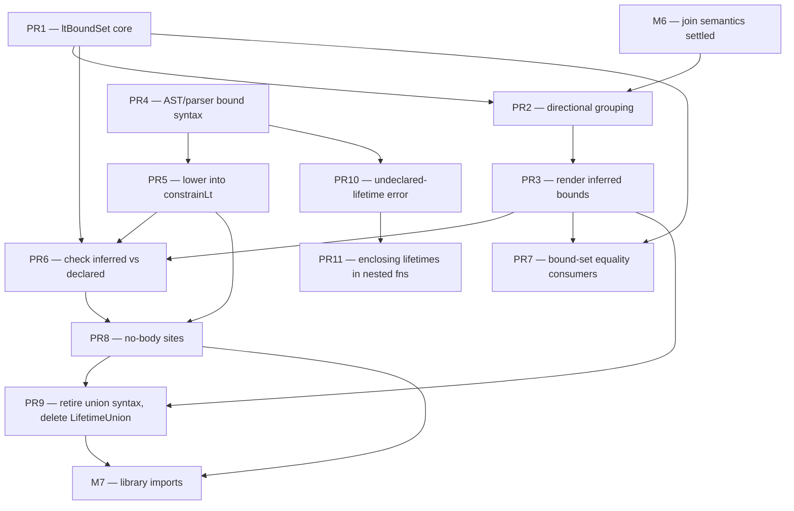

# M6.5 implementation plan — Lifetime bounds

This plan covers **M6.5 — Lifetime bounds** as listed in
[01-milestones.md](01-milestones.md). It records the design routes considered, the
chosen route, the sequencing rationale, and the PR-by-PR breakdown for the chosen
route. The routes-and-decision material comes first; the
[PR-by-PR breakdown](#pr-by-pr-breakdown-route-3) follows. The breakdown assumes M6
has settled the join semantics it builds on, as its prerequisite note records.

A **lifetime bound** is a declared or rendered outlives relation between two named
lifetimes in a signature. Rust spells it `'a: 'b`, read "`'a` outlives `'b`".
Escalier's lifetimes are unrelated once named today. A bound lets a signature state
how two of them relate.

## Background — the outlives graph already exists

The constraint solver already builds the outlives relation. `constrainLt(sub, super)`
records the edges in `LifetimeVar.LowerBounds` and `LifetimeVar.UpperBounds`
([internal/soltype/lifetime.go](../../internal/soltype/lifetime.go)), and M4 D2.5
already gives lifetimes a `Level` so the freshener copies those edges per
instantiation. So the relations a body implies are inferred today. What is missing
is surfacing them, declaring them at no-body sites, and checking one against the
other.

The work splits into three capability axes:

1. **Render** an inferred bound as an outlives bound attached in the lifetime and
   type-param list, `<'a: 'c, …>`, instead of collapsing it to the union `('a | 'b)`
   or eliding it. M4 D4 collapses or elides today.
2. **Declare** a bound in source for a site that has no body to infer from, and
   lower it into `constrainLt`.
3. **Check** an inferred bound set against a declared one. This is subsumption over
   the lifetime sort.

A **bound lives in the param list, not a separate `where` clause.** Escalier attaches
a type-param's bound in the `<…>` list as `<T: U>`, so a lifetime bound follows the
same form, `<'a: 'b>`, read "`'a` outlives `'b`". One quantifier list carries both
sorts and their bounds, which keeps the surface consistent between type-param bounds
and lifetime bounds and avoids a second bound-declaration grammar.

## Inference vs annotation — the dividing line is the body

The shape of the relation does not decide whether it needs an annotation. The
presence of a body does. A bound is a fact about the solved graph, so any bound a
body produces through its borrows, joins, and stores is inferred from `constrainLt`
edges, then coalesced. A site with no body has nothing to watch, so its bounds must
be declared.

Four representative cases, with whether each is inferable from a concrete function:

1. **Multi-source join.** Returning one of two borrows. The result lives only as
   long as both inputs, so its lifetime is the shorter of the two.
   ```
   fn pick<'a: 'c, 'b: 'c, 'c>(p: mut 'a {x: number}, q: mut 'b {x: number}) -> mut 'c {x: number}
   ```
   **Fully inferred today.** `joinBorrows` mints the join lifetime and constrains
   each source into it, so `'a: 'c, 'b: 'c` is the graph the solver already builds.
   M4 D4 renders it as the union `('a | 'b)`, the conservative stand-in for "one of
   these". Upgrading that to a bounded `'c` is a display change, not an inference
   change.

2. **Store a borrow inside a borrow.** Inserting a borrowed value into a borrowed
   container. The inserted value must outlive the references the container holds.
   ```
   fn put<'a, 'v: 'a>(bag: mut 'a {items: ['v {…}]}, item: 'v {…})
   ```
   **Inferred when the body performs the store**, via the same `constrainLt` the
   borrow and escape rules already emit. The nested-container store path is not all
   wired yet, since array writes are deferred to M7.

3. **Object holding a borrow.** Returning a structure that carries a borrow.
   ```
   fn wrap<'a>(p: 'a {x: number}) -> {inner: 'a {x: number}}
   ```
   **Inferred.** Constructing `{inner: p}` carries `p`'s borrow into the literal, so
   the object's lifetime is tied to `'a` by value flow, the same mechanism as
   returning the borrow directly.

4. **Abstract interface method.** An iterator yielding a borrow tied to itself.
   ```
   fn next<'a>(self: mut 'a Iter) -> 'a Item
   ```
   **Needs an annotation, but only because it is a no-body site.** The same
   signature written as a concrete function with a body is inferred like the others.

So the split is:

- **Concrete functions** infer every shape, because each reduces to `constrainLt`
  edges then coalesced. #1 is realized now. #2 and #3 are realized to the extent
  their write and construct paths emit edges; some store paths wait on M7.
- **No-body sites** require declaration. These are external and library signatures,
  abstract interface methods, and type aliases over borrows. M5 classes surface a
  soft pull through abstract methods. M7 library imports are the hard trigger,
  because an imported borrow-relating function cannot be represented without its
  declared bounds.

A parameter still needs its `mut` or lifetime marker, or usage that makes it a
borrow, so the solver knows it is a borrow at all. The relations between those
lifetimes are inferred, not annotated.

## Implementation routes

### Route 1 — Display-first, inference-led

Surface the graph already present. Change M4 D4 so a join lifetime is named and kept,
with its outlives edges rendered as bounds in the `<…>` list, instead of expanded to
a union. Touches `internal/solver/lifetime_coalesce.go` for keeping and naming joins
and pruning bounds, and `internal/soltype/print.go` for emitting the `'a: 'b` bounds
in the quantifier list `PrintAsSchemeWith` already builds.

- **Pros.** Smallest. Reuses the `constrainLt` graph and D2.5 generalization
  wholesale. Makes the join rendering precise immediately. Reuses the existing
  quantifier list rather than adding a new clause. Zero annotation burden for
  concrete functions.
- **Cons.** Does nothing for no-body sites. Brings the bound-rendering hard parts,
  which bounds to show and transitive reduction, without an annotation to validate
  against. Risks noisy signatures if pruning is weak.

### Route 2 — Annotation-first

Add in-list bound syntax `<'a, 'b: 'a>`, mirroring type-param bounds `<T: U>`, lower
declared bounds into `constrainLt` during signature resolution, and check inferred
against declared. Keep D4's union rendering for now. Touches `internal/ast`,
`internal/parser`, `internal/solver/type_ann.go`, and a subsumption check.

- **Pros.** Unblocks the cases inference cannot reach — interfaces and library
  imports. The lowering reuses `constrainLt`, so the solver core barely changes.
  Gives users explicit control.
- **Cons.** More surface-area design. Does not improve inferred rendering, so a
  declared bound can be one the renderer still collapses. An annotation then does not
  round-trip, since parse then solve then render does not reproduce what was written.

### Route 3 — Unified bound-set model (chosen)

Make a canonical lifetime bound set the single representation both inference and
annotation produce and consume. `coalesceLifetimes` stops expanding and eliding and
instead computes a canonical, transitively-reduced bound set that both the printer
and the annotation resolver share. This is also where the undirected-component
heuristic in `newLtAnalysis` is replaced with directional reasoning, closing the
invariant that file documents.

- **Pros.** Principled and symmetric. Annotations round-trip. Closes the
  undirected-grouping invariant. Sets up bounded quantifiers and future variance work
  cleanly.
- **Cons.** Largest. Touches the lifetime sort, coalescing, printer, parser, AST, and
  `resolveTypeAnn` together, plus the directional analysis. Effectively its own
  milestone. Highest risk.

## None of the routes prevents inference

A bound is computed by `constrainLt` regardless of how it is rendered or declared, so
no route forecloses inference. The routes differ only in whether an inferred bound is
surfaced and generalized. Route 1 surfaces it. Route 2 alone leaves it
inferred-but-unrendered, which is incompleteness, not prevention. Route 3 is
symmetric by construction.

Two places could foreclose inference, and neither is one of these routes:

1. **Monomorphic lifetimes — the M4 D2.5 Option B fallback.** Refusing to generalize
   a scheme with free lifetime vars would block bounded-lifetime inference across
   instantiations. D2.5 chose Option A, full generalization with per-use freshening,
   so this door is open. Do not regress to Option B.
2. **Route 1 built on the current undirected grouping has a ceiling, not a block.**
   `coalesceLifetimes` discards outlives direction, so a display layered straight on
   it can only emit unions, never directional `'a: 'b`. The directed information is
   still on the vars, so this is not prevention, but rendering true bounds means
   reading `LowerBounds`/`UpperBounds` directly rather than the undirected components.
   That is the same directional analysis Route 3 needs.

## Decision and sequencing

**Route 3 is the chosen direction**, because its value is the symmetric
infer-declare-render loop, and that loop is what no-body sites need. Inference alone
is covered more cheaply by Route 1, so Route 3 pays off only once declaration also
exists.

Sequencing:

- **After M6.** M6 changes the join machinery directly — it relaxes the incompatible
  mut-borrow join to a read-until-narrowed union and adds canonical
  union/intersection member order. Route 3's canonical bound set is built on that
  join representation, so building it before M6 means reworking it afterward. The
  dependency is M6 then M6.5.
- **With or just before M7.** M7 library imports are the hard trigger, where declared
  bounds become mandatory. That is the first configuration where both halves of the
  loop exist at once, which is the only configuration where Route 3 beats Route 1.
- **Earlier would be premature.** Nothing in M4 or M5 is blocked, since the D4 union
  rendering is sound and only less precise. Committing to a unified bound-set
  abstraction before M5, M6, and M7 have shown what they demand of it risks building
  the wrong shape.

**Cheap down payment, available any time.** When a real signature's `('a | 'b)`
rendering first becomes confusing, do only Route 1's directional variant — read
`LowerBounds`/`UpperBounds` off the vars instead of the undirected components, and
render directional `'a: 'b`. That validates the directional analysis Route 3 depends
on, retires the undirected-grouping invariant early, and is throwaway-free, since it
is a strict subset of Route 3.

## Hard parts shared by all routes

- **Canonicalization and transitive reduction** of the bound set, so
  `'a: 'b, 'b: 'c, 'a: 'c` renders as the two non-redundant edges. Needed for stable
  output and for comparing schemes.
- **Which bounds to keep** — the lifetime-sort analogue of the single-polarity
  elimination and co-occurrence merging the type sort already does in
  [internal/solver/simplify.go](../../internal/solver/simplify.go). A bound to an
  elided or `'static`-forced lifetime should drop.
- **Bound-set subsumption and equality.** `equalType`'s `RefType` arm, scheme dedup,
  overload arms, and annotation-checking all need "does the inferred bound set imply
  the declared one". `constrainLt` gives the primitive. The set-level comparison is
  new.
- **Removal of `LifetimeUnion`.** Bounds supersede the union on both sides, so
  `soltype.LifetimeUnion` is deleted outright rather than kept alongside them. It has
  two mint sites today and a named lifetime with directional bounds is strictly more
  precise than either. The join-rendering mint
  ([lifetime_coalesce.go](../../internal/solver/lifetime_coalesce.go)) is replaced by
  the bounded form in PR3. The annotation-input mint
  ([type_ann.go](../../internal/solver/type_ann.go), lowering a written `('a | 'b) T`)
  is retired with the `('a | 'b)` surface syntax it lowers, since `<'a: 'b>` bounds
  express the same relation. See PR3 and PR9 for the removal split.

## Relationship to M4 D4

M4 D4 ([m4-implementation-plan.md](m4-implementation-plan.md) D4) ships the display
pass this milestone extends. D4 renders a join as a union and elides connect-nothing
lifetimes, using the undirected connected-component grouping documented in
`newLtAnalysis`. M6.5 promotes that pass from "union approximation" to "directional
bound set", and is the natural home for swapping the undirected grouping for the
directional reasoning D4 deliberately deferred.

---

# PR-by-PR breakdown (Route 3)

Route 3 is committed above, so this section turns it into single-PR chunks. Each PR
is independently reviewable, keeps `go test ./...` green, and moves along exactly one
of the three capability axes — render, declare, check — lays the shared data structure
they all read, or does the final cleanup deletion. The wording of every referenced
type and function matches the code as it stands on this branch.

**Prerequisite — M6.** M6.5's canonical bound set is built on M6's join
representation. M6 relaxes the incompatible mut-borrow join to a read-until-narrowed
union and adds canonical union/intersection member order
([01-milestones.md](01-milestones.md) M6). Building the bound set before that
representation settles means reworking it afterward, so PR2 onward assume M6 has
landed. PR1 and PR4 touch neither join code nor union members, so they can start
against the current tree ahead of M6.

## New data structures and algorithms

Three things are added; everything else is a wiring change to code that already
exists.

### 1. `ltBoundSet` — the canonical directional bound set (solver)

The single representation both inference and annotation produce and consume. It sits
in `internal/solver/` beside `ltAnalysis`, since it is a display-and-checking
artifact over the solved graph, not a constraint input. `soltype` keeps owning the
raw `LifetimeVar.LowerBounds`/`UpperBounds` edges; `ltBoundSet` is the reduced,
canonical view built from them.

**The raw graph is not a DAG.** `constrainLt` records an edge for each direction of
a var-to-var constraint, so `'a: 'b` together with `'b: 'a` puts each lifetime in the
other's bound lists and forms a cycle — the case `TestConstrainLtCycleTerminates`
already exercises for termination. A cycle in the outlives relation means those
lifetimes are mutually outliving, so they are **equal** as lifetimes. Transitive
reduction is only defined on a DAG, so `ltBoundSet` first condenses each strongly
connected component to a single representative — the canonical form for a set of
outlives-equivalent lifetimes — and every edge, query, and rendering is over that
condensed DAG, never the raw graph.

```go
// ltBoundSet is a directed outlives graph over lifetime-variable IDs, condensed
// over outlives-equivalent lifetimes and then transitively reduced. An edge a -> b
// reads "'a outlives 'b" ('a: 'b), the same direction constrainLt records as a in
// b.LowerBounds / b in a.UpperBounds. Cyclic constraints (mutual 'a: 'b, 'b: 'a)
// collapse into one SCC representative, so edges and vars are keyed by
// representative ID, not raw lifetime ID.
type ltBoundSet struct {
    edges map[int]set.Set[int]           // rep -> {rep : 'a: 'b}, condensed then reduced
    rep   map[int]int                    // lifetime ID -> its SCC representative ID
    vars  map[int]*soltype.LifetimeVar   // representative ID -> a member var, for rendering
    static set.Set[int]                  // representative IDs forced to 'static (absorbing)
}
```

Operations, each unit-tested in isolation before any of it is wired in:

- **`buildLtBoundSet(occ)`** — walk the occurring lifetime vars' `LowerBounds`/
  `UpperBounds` directionally, recording an edge per real outlives relation instead
  of `uf.union`'s symmetric merge. Then find the strongly connected components of
  that directed graph — Tarjan or Kosaraju over the same edges — and condense each to
  a representative in `rep`, collapsing a mutual-outlives cycle to one node. The
  smaller lifetime ID is the stable representative, mirroring `unionFind`'s
  smaller-id rule. This is the directed twin of `newLtAnalysis`'s walk, plus the SCC
  condensation the undirected union-find got for free by never distinguishing
  direction.
- **`reduce()`** — transitive reduction over the **condensed DAG**, so
  `'a: 'b, 'b: 'c, 'a: 'c` keeps only `'a: 'b` and `'b: 'c`. Standard reduction: drop
  `a -> c` when a longer path `a -> … -> c` exists. Well-defined only because the SCC
  condensation in `buildLtBoundSet` already removed every cycle. `'static` is the
  absorbing bottom, so an edge into a `'static`-forced node drops.
- **`implies(a, b)`** — map `a` and `b` to their representatives, then test
  reachability in the transitive closure: does this set prove `'a: 'b`. Two
  outlives-equivalent lifetimes share a representative, so `implies` reports the
  cycle as equality in both directions. The primitive for subsumption.
- **`subsumes(other)`** — for every edge in `other`, `implies` holds here. This is
  "the inferred bound set satisfies the declared one" and "these two schemes carry
  the same bounds", the check PR6 and PR7 both need.
- **`canonicalEdges()`** — condensed edges sorted by `(from rep, to rep)` for stable
  rendering and order-insensitive equality, the lifetime-sort analogue of the
  canonical union member order M6 gives the type sort.

### 2. Directional analysis replacing the undirected grouping (solver)

`newLtAnalysis` today builds `uf *unionFind` over the bound graph and marks a
component root positive when any positive-position lifetime falls in it
([lifetime_coalesce.go](../../internal/solver/lifetime_coalesce.go)). That undirected
grouping is sound only under the invariant that file documents — independent param
lifetimes never share a component. M6.5 replaces `uf` with `ltBoundSet` and recomputes
`kept`/elision as **directed reachability to an output**: a param lifetime is kept
when it reaches, along outlives edges, a lifetime that occurs positively. This retires
the invariant rather than resting on it.

### 3. `ast.LifetimeParam` — a lifetime binder that carries bounds (ast/parser/printer)

`FuncSig.LifetimeParams` is `[]*ast.LifetimeAnn` today, a bare name with no place for
a bound. A lifetime bound rides in the `<…>` list as `<'a, 'b: 'a>`, mirroring a
type-param bound `<T: U>`, so the binder needs a bounds slot the way `ast.TypeParam`
has `Constraint`.

**Multiple bounds use `&`, the same token as a type-param bound.** A type param
expresses several bounds with the intersection type `<T: A & B>`, since its constraint
is one type annotation and `T <: A & B` unfolds to `T <: A` and `T <: B`. A lifetime
outliving several others is the exact lattice twin — `'a` outlives both `'b` and `'c`
iff `'a <: ('b ⊓ 'c)`, below the *meet* of the two — so the same `&` spells it:
`<'a: 'b & 'c>`. The parse is unambiguous because a bound's right-hand side holds only
lifetimes, so a `&` there is always the meet separator and a `&mut T` / `&'x T` borrow
after it is a type-in-lifetime-position error. `&` reused as both the borrow sigil and
the bound-meet is a readability cost accepted for parity with type-param bounds and for
naming the actual lattice operation, rather than introducing a `+` that corresponds to
no operator elsewhere in the language. Multiple bounds on one lifetime are the
secondary case anyway; the common join renders as several lifetimes each with a single
bound, `<'a: 'c, 'b: 'c, 'c>`.

```go
// LifetimeParam is a lifetime binder in a <…> quantifier list. Bounds are the
// lifetimes this one must outlive: <'a, 'b: 'a> gives 'b the bound {'a}, read
// "'b outlives 'a". Several bounds are written with &, the meet, as a type-param
// bound writes an intersection: <'a: 'b & 'c> gives 'a the bounds {'b, 'c}. A bare
// <'a> has no bounds. Mirrors ast.TypeParam's Name + Constraint shape so one
// quantifier list carries both sorts.
type LifetimeParam struct {
    Name   string
    Bounds []*LifetimeAnn
    span   Span
}
```

Every `LifetimeParams []*ast.LifetimeAnn` field — `FuncSig`, `FuncTypeAnn`,
`InterfaceDecl`, and the method/class carriers in [decl.go](../../internal/ast/decl.go)
— migrates to `[]*ast.LifetimeParam`. That fan-out is why the syntax lands as its own
PR (PR4) rather than riding along with the semantics.

## The PRs

### PR1 — `ltBoundSet` core: representation, reduction, subsumption

**Axis:** foundation. **Depends on:** nothing (can precede M6).

Add the `ltBoundSet` type and its five operations above to `internal/solver/`, with a
dedicated `lifetime_bounds.go` and `lifetime_bounds_test.go`. Pure data structure and
algorithms — nothing reads it yet, so there is no behavior change and no snapshot
churn. Tests assert reduction on the `'a: 'b: 'c` diamond, `implies` reachability
including the `'static` absorbing case, `subsumes` in both directions, and canonical
edge order under shuffled input. The load-bearing case is a **mutual-outlives cycle**
(`'a: 'b, 'b: 'a`): `buildLtBoundSet` must condense it to one representative so
`reduce` sees a DAG, `implies` reports it as equality in both directions, and a
three-node cycle folded to one node reduces without looping.

### PR2 — Directional grouping in `coalesceLifetimes` (analysis swap, output held)

**Axis:** render (internal). **Depends on:** PR1, M6.

Replace `newLtAnalysis`'s `unionFind` with a `ltBoundSet` and recompute `kept` as
directed reachability to a positive occurrence. Hold the rendered output unchanged:
`resolveLt` still expands a join var to the `LifetimeUnion` of its reachable kept
params, so existing snapshots do not move. This isolates the risky analysis swap from
the visible display change, and it retires the undirected-grouping invariant on its
own. The `componentParams` sort folds into `canonicalEdges`. This is the "cheap down
payment" the routes section flags — a strict subset of Route 3, throwaway-free.

### PR3 — Render inferred bounds in the quantifier prefix

**Axis:** render. **Depends on:** PR2.

Flip the display. `resolveLt` keeps the join lifetime named instead of expanding it to
a union, and `PrintAsSchemeWith` / `namedPrinter`
([print.go](../../internal/soltype/print.go)) emit each kept lifetime's outlives edges
as `'a: 'c` bounds in the prefix it already builds. A multi-source join renders
`fn <'a: 'c, 'b: 'c, 'c>(p: mut 'a {…}, q: mut 'b {…}) -> mut 'c {…}` instead of
`('a | 'b)`. A named lifetime with directional bounds is strictly more precise than
the union approximation, and a directed bound set forms for every join, so this
**removes the join-rendering mint of `LifetimeUnion`** at
[lifetime_coalesce.go:217](../../internal/solver/lifetime_coalesce.go) rather than
leaving a residual case. The `soltype.LifetimeUnion` type itself is not deleted until
PR9, because its second mint — the `('a | 'b)` annotation input — is still live until
then. Bulk snapshot update; this is the first PR whose accept-criteria line in the
milestone is visible in output.

### PR4 — AST + parser + printer for in-list lifetime bounds

**Axis:** declare (front-end). **Depends on:** nothing (can precede M6, parallel to PR1–PR3).

Introduce `ast.LifetimeParam` and migrate every `LifetimeParams` field to it. Extend
`maybeLifetimeAndTypeParams` ([decl.go](../../internal/parser/decl.go)) to parse an
optional `: 'b` after a lifetime name, and `: 'b & 'c` for several bounds, mirroring
`typeParam`'s `: Constraint` parse. The `&`-separated form reads a `'lifetime` after
each `&` and rejects a non-lifetime there, since only lifetimes are legal in a bound's
right-hand side. The printer round-trips `<'a, 'b: 'a>` and `<'a: 'b & 'c>`. No solver
semantics yet: a declared bound is parsed and, for this PR, ignored by inference. This
PR is purely syntactic surface, which is what lets it run in parallel with the render
track.

**Two disambiguations the surface must settle here.**

- **`:` means different relations per sort, by design.** `<T: U>` is subtyping —
  `T <: U`. `<'a: 'b>` is outliving — `'a` lives at least as long as `'b`. The token is
  the same and the two never mix on one binder, since a binder is a lifetime *or* a
  type, so the checker picks the relation from the binder's sort. Call this out in the
  `LifetimeParam` and `TypeParam` doc comments so the shared `:` is not read as one
  relation.
- **`'static` is a legal bound RHS.** `<'a: 'static>` parses like any other bound. It
  says `'a` outlives `'static`, and since `'static` is the bottom of the outlives
  lattice — it outlives everything — the only lifetime that outlives it is `'static`
  itself, so the bound forces `'a = 'static`. PR5 lowers it to `constrainLt('a,
  'static)`, the same escape-to-static constraint an escaping borrow already emits, so
  no special case is needed. `'static` on the *left* of a binder (`<'static: 'a>`) is
  rejected: `'static` is not a bindable parameter name.

### PR5 — Lower declared bounds into `constrainLt`

**Axis:** declare (semantics). **Depends on:** PR4.

During signature resolution, emit `constrainLt` for each declared `'a: 'b` so a
declared bound participates in solving exactly like an inferred one. The names resolve
through `namedLifetime` ([type_ann.go](../../internal/solver/type_ann.go)), which
already interns a written lifetime name to one `LifetimeVar` per function. Remove the
`"lifetime parameters in function type annotation"` `reportUnsupportedFeature` guard in
`resolveFuncTypeAnn` for the bound-carrying case. After this PR a declared bound is
indistinguishable from an inferred one in the graph, so PR3's renderer already displays
it correctly.

### PR6 — Check inferred bounds against declared

**Axis:** check. **Depends on:** PR1, PR3, PR5.

An annotated function's inferred bound set must satisfy its declared one. Build the
inferred `ltBoundSet` from the solved graph, build the declared one from the
`LifetimeParam` bounds, and require `inferred.subsumes(declared)`. A declared bound the
inference does not imply is a `LifetimeBoundNotSatisfiedError` — a new sealed
`SolverError` kind in [errors.go](../../internal/solver/errors.go) carrying the two
lifetimes and rendering the full outlives message. A redundant declared bound implied
by transitivity is dropped from the rendered set via `reduce`. This PR is the join
point of the render and declare tracks.

### PR7 — Bound-set equality in `equalType`, scheme dedup, overload arms

**Axis:** check (consumers). **Depends on:** PR1, PR3.

`equalType`'s `RefType` arm keys a lifetime by pointer identity today —
`ltEqual` bottoms out in `a == b` ([coalesce.go](../../internal/solver/coalesce.go)) —
which is deliberately strict so dedup never silently drops a lifetime the solver
computed. That works while every comparison is within one coalesce, where the vars are
shared pointers. It breaks at the cross-scheme sites — scheme/alias dedup and
overload-arm comparison — where the two sides carry independent `LifetimeVar` identities,
so pointer equality always reports unequal. PR3 makes this pervasive: a kept join now
renders as a named lifetime with bounds instead of a `LifetimeUnion`, so nearly every
borrow carries an identity-significant var. Without PR7, that fragments the dedup PR3's
precision depends on — duplicate schemes miss their cache slot, and two semantically
identical overloads read as distinct arms. PR3 and PR7 therefore move as a pair.

Upgrade lifetime equality from pointer identity to **bound-set equivalence**, but note
that equivalence is not a raw `subsumes`. Two schemes are equal when they are
alpha-equivalent over their quantifier *and* their bounds agree, so the comparison has
three steps:

1. **Match lifetimes by canonical position.** Pair each scheme's lifetime parameters in
   the printer's first-appearance `'a, 'b, …` order, the same order `canonicalEdges`
   already imposes. This bijection is what makes `'a`-in-A correspond to `'a`-in-B; a
   raw `subsumes` without it would over-merge structurally different borrows, dropping a
   computed distinction — the exact failure the pointer check guards against.
2. **Compare structure with lifetimes matched by that pairing**, not by pointer.
3. **Compare the canonical reduced edge sets under the pairing** — a set comparison,
   since PR1 already reduced and canonicalized both, not a closure-based `subsumes` on
   what is a `coalesce`/lattice hot path. Mutual `subsumes` is the fallback only if an
   input is not known-canonical.

Independence must survive the upgrade: within one scheme, two param lifetimes with no
bound between them stay unequal. Route `equalType`'s `RefType` arm, scheme dedup, and
overload-arm comparison ([overload.go](../../internal/solver/overload.go)) through this.
`ltEqual` keeps its `LifetimeUnion` arm until PR9 deletes the type. Because
overload-arm ranking (`moreSpecific`) consumes `equalType`, borrow-typed overload
selection can shift, so cover it with tests beyond the equality unit tests. Independent
of the declare track, so it runs in parallel with PR5/PR6 once PR3 has landed.

### PR8 — Declared bounds at no-body sites

**Axis:** declare (reach). **Depends on:** PR5, PR6.

Extend the PR5 lowering to the sites that have no body to infer from and therefore
*require* declaration: `declare` function signatures, abstract interface methods, and
type aliases over borrows. These are the configurations the routes section names as the
hard trigger, and they are what M7 library imports consume — an imported
borrow-relating function cannot be represented without its declared bounds. Landing this
before M7 is what makes M6.5 "with or just before M7" rather than after it.

### PR9 — Retire the `('a | 'b)` annotation syntax and delete `LifetimeUnion`

**Axis:** cleanup. **Depends on:** PR3, PR8.

`<'a: 'b>` bounds express every relation the `('a | 'b)` type-position annotation did,
and PR8 has by now given every no-body site the bound form, so the union annotation is
redundant surface. Retire it and delete the type:

- Drop the `('a | 'b)` parse in [type_ann.go](../../internal/parser/type_ann.go) and
  the `ast.LifetimeUnionAnn` node, plus its printer arm. A written `('a | 'b) T` now
  parses as an error directing the author to a named lifetime with bounds.
- Delete the annotation-input mint at
  [type_ann.go:438](../../internal/solver/type_ann.go), the second and last live
  producer of `soltype.LifetimeUnion`.
- With both mints gone — the join-rendering one removed in PR3, this one here — delete
  `soltype.LifetimeUnion` itself and its now-dead arms: the print arms in
  [print.go](../../internal/soltype/print.go), the `ltEqual` arms in
  [lattice.go](../../internal/solver/lattice.go), and the coalesce-equality arm in
  [coalesce.go](../../internal/solver/coalesce.go). The `soltype.Lifetime` sort narrows
  to `LifetimeVar`, `StaticLifetime`, and `AnonLifetime`.

This is a pure deletion once bounds carry every case, which is why it lands last and
depends on both the render flip (PR3) and the no-body reach (PR8). It is separate from
PR3 so the risky rendering change and the surface-syntax removal are reviewed apart.

### PR10 — Error on a used-but-undeclared lifetime

**Axis:** declare (front-end). **Depends on:** PR4.

A named lifetime that appears in a signature must be bound by that signature's `<…>`
list. `fn f<'a>(p: &'a {…})` declares `'a`. A `&'b` with no `<'b>` binder is a forgotten
declaration or a typo, not a fresh lifetime to invent. The solver interns every written
`'x` through `namedLifetime` ([type_ann.go](../../internal/solver/type_ann.go)) whether
or not a binder introduced it, so `fn f<'a>(p: &'b {…})` silently renames `'b` to `'a` in
the display and no diagnostic fires. This PR rejects the undeclared use.

The rule reads the two lifetime forms the surface already has. A bare `&T` / `&mut T` is
the inferred borrow: it mints a fresh lifetime and carries no name, so it is never
undeclared. A named `&'x T` is an explicit reference to a binder, so `'x` must appear in
the enclosing `<…>` list. This keeps the inference-first ergonomics — the common borrow
writes no lifetime and declares nothing — while making a written name mean what it says.

A **use** is any named lifetime in the signature that is not itself a binder. It is the
lifetime of a `&'x` borrow, and the right-hand side of a bound, since `'a: 'x` uses `'x`.
The left-hand side of a bound is a binder, not a use. `'static` is the built-in bottom of
the outlives lattice and is never undeclared, on either side.

Severity follows the function's own quantifier clause, mirroring the retired
`internal/checker`'s §9.7 class 2 diagnostic
([diag_lifetime.go](../../internal/checker/diag_lifetime.go)):

- **The function has no `<…>` clause.** A hard error: "lifetime 'b is used but not
  declared; add `<'b>` to the enclosing function signature". The author almost certainly
  meant to declare the binder. A nested function is judged by its own clause, not an
  ancestor's, so an inner `fn` with no clause is a hard error even inside an outer
  `fn<'a>`. PR11 revisits this rule when it makes an enclosing function's lifetimes
  visible to a nested one.
- **A `<…>` clause exists but does not bind the name.** A warning with edit-distance
  suggestions drawn from the declared siblings, since a near-miss is most likely a typo:
  "lifetime 'b is used but not declared; did you mean 'a?". Recovery mints a fresh
  lifetime so the signature stays well-formed and later checks proceed.

The check reads the binder set the `LifetimeParam` list carries (PR4) and the named uses
the borrow and bound resolution already visit, so it is a scan over data both halves of
the declare track already build. It runs at signature resolution, in `resolveFuncTypeAnn`
and the `inferFunc` signature pass, before `namedLifetime` interns an unbacked name. It is
independent of the render track (PR1–PR3), the bound check (PR6), and the PR9 cleanup, so
it can land any time after PR4, in parallel with PR5.

**The symmetric companion is the unused-binder warning.** A declared `<'a>` that no borrow
or bound references is §9.7 class 1, `lifetime parameter 'a is declared but never used`.
It is the same scan read the other way — binders with no use rather than uses with no
binder — so it can ride along in this PR or land as a short follow-up.

### PR11 — Enclosing-function lifetimes visible in a nested function

**Axis:** declare (front-end). **Depends on:** PR10.

`inferFunc` gives every function a fresh lifetime scope. It saves the enclosing
`namedLifetimes` map, clears it, and restores it on exit
([infer_expr.go](../../internal/solver/infer_expr.go)). So an inner function's `'a` is a
distinct lifetime from an outer `<'a>`, and a nested function cannot name an enclosing
lifetime in its own annotations. This PR lets a nested function read an enclosing
function's declared lifetimes by name.

**This is a naming gap, not an inference one.** A captured borrow's `LifetimeVar` already
flows into a nested function through the captured value's type, so inference of a captured
borrow works today. What is missing is writing the enclosing `'a` in the inner signature
and having it resolve to that same variable. The change adds name resolution, not a new
inference path, so the computed types do not move.

**The soundness rests on levels, which already exist.** A lifetime carries a `Level` (M4
D2.5), and generalization quantifies only a variable with `Level > genLevel`
([poly.go](../../internal/solver/poly.go), [coalesce.go](../../internal/solver/coalesce.go)).
An inherited outer lifetime keeps its outer, lower level, so a nested function inferred at
a deeper level leaves it free rather than quantifying it, the same treatment a captured
outer type variable already gets. The work confirms this holds rather than building it.

The change is three coupled edits:

- **Chain the name lookup.** Resolve a lifetime name up the enclosing functions for a use,
  while a name in the inner's own `<…>` list mints a fresh, shadowing variable.
  `namedLifetime` interns lazily today with no notion of a declared-binder set, so it gains
  the inner's binder set to decide shadow versus inherit. The same chaining applies to a
  nested `fn(…)` type annotation in `resolveFuncTypeAnn`.
- **Consult the chain in the PR10 check.** A name declared in an enclosing function is no
  longer undeclared in the inner, so PR10's "judged by its own clause" rule relaxes to
  "judged by its own clause or an enclosing one". The hard-error case narrows to a name
  bound nowhere on the chain.
- **Cover it with tests.** A closure that names and borrows an enclosing lifetime; a
  shadowing inner `<'a>`; generalization leaving an inherited lifetime free; escape of a
  closure-returned inherited borrow.

**The gating decision is the capture rule, not the code.** Rust splits it by function kind.
A nested `fn` item does not capture the enclosing lifetimes, while a closure does. The
solver routes both a function declaration and a function expression through `inferFunc`, so
the rule that separates them is part of this PR. A nested `fn` declaration is rejected
outright today, since a function body admits only a `VarDecl`
([errors.go](../../internal/solver/errors.go), `BodyDeclNotAllowedError`), so the reachable
surface is the `fn` expression closure alone.

This is the lowest-priority PR in the milestone. It is an ergonomic convenience over
working inference, its only consumer is a borrowing closure, and that pattern may not
appear before M7. It depends on PR10 for the check it relaxes and can land any time after,
off the critical path.

## Dependency graph



ASCII, with each edge read "left must land before right". The critical path is
the top line; the remaining edges are listed below it as `source ─── target`
pairs, since the fan-in to PR6 and PR7 crosses too many lanes to draw inline
cleanly.

```
critical path:   PR1 ─── PR2 ─── PR3 ─── PR6 ─── PR8 ─── PR9 ─── M7

remaining edges: PR4 ─── PR5     PR1 ─── PR6     PR1 ─── PR7
                 PR5 ─── PR6     PR3 ─── PR7     PR5 ─── PR8
                 PR3 ─── PR9     PR4 ─── PR10    PR10 ─── PR11
```

PR10 hangs off PR4 on the declare track and is on no critical path, so it fills slack
beside PR5 rather than lengthening the six-PR spine. PR11 hangs off PR10 as the
lowest-priority tail of that track, also off the critical path.

## Parallel groups

Two independent tracks run from the start — the **render track** (PR1 → PR2 → PR3)
and the **declare front-end** (PR4 → PR5) — and they only meet at PR6.

- **Wave 1 (parallel):** PR1 and PR4. Foundation data structure and front-end syntax
  touch disjoint code — `solver/lifetime_bounds.go` versus `ast`/`parser`/`printer` —
  and neither needs M6. Start both together.
- **Wave 2 (parallel):** PR2 (needs PR1 and M6), PR5 (needs PR4), and PR10 (needs PR4).
  The render analysis swap, the declared-bound lowering, and the undeclared-lifetime
  diagnostic are independent.
- **Wave 3:** PR3 (needs PR2). PR5 and PR10 may still be in flight alongside it.
- **Wave 4 (parallel):** PR6 (needs PR1, PR3, PR5) and PR7 (needs PR1, PR3). PR7 is a
  pure consumer change and does not touch the declare track, so it runs beside PR6.
- **Wave 5:** PR8 (needs PR5, PR6). The no-body-site declaration lowering.
- **Wave 6:** PR9 (needs PR3, PR8). The cleanup deletion, the hand-off to M7 alongside
  PR8. PR11 (needs PR10) also lands here or later, the lowest-priority tail of the declare
  track.

The critical path is PR1 → PR2 → PR3 → PR6 → PR8 → PR9, six PRs. PR4/PR5, PR7, PR10, and
PR11 fill the slack beside it, so the milestone is not serialized end to end despite the
single join point at PR6.

## Hard-parts coverage

The four hard parts the routes section lists above map onto the PRs so none is left
implicit:

- **SCC condensation, canonicalization, and transitive reduction** — PR1
  (`buildLtBoundSet` condenses cycles, `reduce`, `canonicalEdges`).
- **Which bounds to keep** — PR2, as directed reachability to an output, the
  lifetime-sort analogue of the single-polarity elimination
  [simplify.go](../../internal/solver/simplify.go) does for types.
- **Bound-set subsumption and equality** — PR1 (`subsumes`), consumed by PR6 as
  one-directional subsumption and by PR7 as alpha-equivalence, a canonical-position
  matching plus canonical-edge comparison, not a raw two-way `subsumes`.
- **Removal of `LifetimeUnion`** — PR3 removes the join-rendering mint, PR9 removes the
  `('a | 'b)` annotation mint and deletes the type. Bounds supersede the union on both
  sides, so it is deleted outright, not kept alongside.
