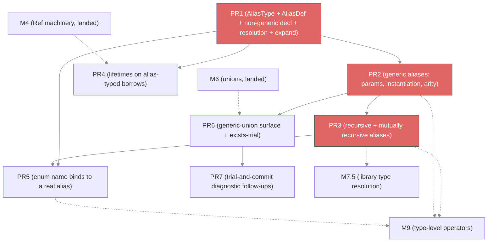

# M7 implementation plan — Type aliases

This plan covers **M7 — Type aliases** as listed in
[01-milestones.md](01-milestones.md). It is a PR-by-PR breakdown, modeled on the
[M4](m4-implementation-plan.md), [M5](m5-implementation-plan.md), and
[M6](m6-implementation-plan.md) plans: it records what prior milestones shipped,
the genuine delta M7 adds, the sequencing, the per-PR design with file
references, and a dependency graph.

M7 gives `soltype` its first named-type-definition sort: a user-written
`type Name<Params…> = Body` declaration, the reference to it, and the
instantiate/expand machinery that makes `Box<number>` type-check. It is the
foundation two later milestones stand on — **M7.5 — Library type resolution**
ingests `.d.ts` declarations *as* aliases and generic types, and **M9 —
Type-level operators** are written as generic aliases and reduce over them. A
dedicated [§Interlocks with M9](#interlocks-with-m9) section pins down the seams
so nothing slips between the two plans.

## What M1–M6.5 shipped (ground truth this plan builds on)

The registry pattern, the resolution seam, and the recursion machinery all
already exist for classes and enums; M7 adds the alias sort alongside them.

- **`soltype` has no alias node — but reserves its slot.** There is no
  `AliasType` and no use-site type-reference node today.
  [soltype/type.go:447](../../internal/soltype/type.go) already reserves the arm:
  "ClassType is a RefInner too … **AliasType adds its `isRefInner` arm when that
  type is introduced**." [PromiseType's comment](../../internal/soltype/type.go)
  calls the M7 work "the real, alias-driven `Promise<T>` lookup … TypeRef
  ingestion." So the intended node name is `AliasType`, playing the role the old
  checker's `type_system.TypeRefType` plays.
- **A `type X = …` decl is `reportUnsupported` today.** In the module SCC
  type-key loop ([module.go:385-400](../../internal/solver/module.go)), any
  non-value decl that is not a class or enum falls through to
  `c.reportUnsupported(d)`. A plain `*ast.TypeDecl`
  ([ast/decl.go:194](../../internal/ast/decl.go), carrying `Name`, `TypeParams`,
  `TypeAnn`, `declare`) lands there. M7 slots an alias case in beside the class
  and enum cases.
- **The `ClassDef` registry is the template.** `Context.classes
  map[string]*ClassDef` with `registerClass` / `classDef`
  ([context.go:46-63](../../internal/solver/context.go)) stores a class's
  definition off to the side, keyed by qualified name, while the `soltype`
  `ClassType` node at use sites carries only `{Name, TypeArgs}`. `ClassDef`
  ([classes.go](../../internal/solver/classes.go)) holds `TypeParams`,
  `LifetimeParams`, `Variance`, `Body`, `Level`. M7's `AliasDef` is the direct
  analogue: `{TypeParams, LifetimeParams, Body, Level}`.
- **The resolution seam already exists.** `resolveScopedTypeRef`
  ([infer_class.go:342](../../internal/solver/infer_class.go)) resolves a written
  `*ast.TypeRefTypeAnn` against the scope — a bare `Point` or `T`, or a generic
  `Box<number>` via `buildClassInstance`. `resolveTypeAnn`'s `TypeRefTypeAnn` arm
  ([type_ann.go:72](../../internal/solver/type_ann.go)) already delegates to it
  before the hardcoded `Promise` stub. M7 extends `resolveScopedTypeRef` so a name
  bound to an alias instantiates the alias, and deletes the "FOOTGUN (removed in
  M7)" `Promise` special-case.
- **The two-pass SCC recursion machinery exists.** `preBindEnum` /
  `inferEnumBody` ([infer_enum.go](../../internal/solver/infer_enum.go)) pre-bind
  every nominal identity in a dep-graph type-key component before resolving any
  body, so a group of mutually-recursive enums and classes resolves each other.
  M7's `preBindAlias` / `inferAliasBody` is the same shape, simpler because an
  alias has no variant-constructor namespace.
- **`constrain` carries a coinductive seen-set, but it keys by *pointer* identity.**
  `constrain`'s `constraintKey` is `{sub, super, mutCtx}` compared by pointer
  ([constrain.go:58-77](../../internal/solver/constrain.go)); its own comment warns
  "M4's recursive types (**aliases**, letrec) must preserve this property." A
  **non-generic** recursive alias whose reference node is reused preserves it, so
  the existing seen-set closes the cycle directly. A **generic** recursive alias
  does **not**: `expandAlias` substitutes the type arguments and mints a *fresh*
  node each lap, so pointer identity never matches and it would expand forever.
  PR3 therefore keys the alias recursion guard on the canonical
  `(AliasDef, args)` identity for the generic case — it does not rely on pointer
  identity alone.
- **The enum name binds to a bare union, with an explicit M7 TODO.**
  `preBindEnum` binds `Color`'s type directly to `UnionType{RGB, Hex}`
  ([infer_enum.go:122-127](../../internal/solver/infer_enum.go)), and
  [infer_enum.go:11-20](../../internal/solver/infer_enum.go) records: "once type
  aliases land, bind the enum name to a proper alias whose body is this union, so
  a reference renders under its own name — `Color` rather than the expanded
  `Color.RGB | Color.Hex`." M7 discharges that TODO.
- **The generic-union surface is unreachable from source today.** M6 deferred
  generic function-type annotations, so a user-written `T | number` in an
  annotation cannot resolve. [01-milestones.md](01-milestones.md) M7 hosts the two
  design notes — the union-super exists-trial open question and the trial-and-commit
  diagnostic follow-ups — because M7 is where that surface first becomes reachable.

## What M7 adds (the delta)

1. **`soltype.AliasType{Name, TypeArgs}`** — the use-site reference node, with the
   reserved `isRefInner` arm, a visitor arm, a printer arm rendering `Name` /
   `Name<args>`, and `LevelOf` over its args.
2. **An `AliasDef` registry** in `Context` (`aliases map[string]*AliasDef`,
   `registerAlias` / `aliasDef`), holding `{TypeParams, LifetimeParams, Body,
   Level}` — the class-registry pattern.
3. **`type` declaration inference** — `inferTypeDecl`, slotted into the module SCC
   type-key path, with a `preBindAlias` / `inferAliasBody` two-pass for recursion.
4. **Scope-driven resolution + on-demand expansion** — `resolveScopedTypeRef`
   resolves an alias reference; a reusable `expandAlias` substitutes `TypeArgs`
   into the body; `constrain` expands an `AliasType` against its structural body
   through the existing seen-set, transparently.
5. **Lifetimes on alias-typed borrows** — `AliasType`'s `RefInner` arm, so
   `mut 'a Point` over an alias works through the M4 `Ref` machinery unchanged.
6. **The enum-as-alias binding** — the enum name binds to an `AliasType` whose
   `AliasDef.Body` is the variant union, discharging the `infer_enum.go` TODO.
7. **The generic-union annotation surface** — generic function-type and alias
   annotations with type-var union members resolve, the union-super exists-trial
   open question is settled and implemented, and the two trial-and-commit
   diagnostic follow-ups land.

---

## PR-by-PR breakdown

Seven PRs. PR1–PR3 are the alias core in strict dependency order. PR4 (lifetimes)
and PR5 (enum-as-alias) hang off the core and are mutually independent. PR6–PR7
are the generic-union surface, which depends only on generic aliases (PR2) and M6,
so it runs in parallel with PR3–PR5.

### PR1 — `AliasType` node + `AliasDef` registry + non-generic `type` decl

The foundational PR: the representation, the registry, and the simplest decl.

**Data structures.**
- `soltype.AliasType{Name string, TypeArgs []Type}` — `isType()`, the reserved
  `isRefInner()` arm ([type.go:447](../../internal/soltype/type.go)), a visitor arm
  ([soltype/visitor.go](../../internal/soltype/visitor.go)), a printer arm
  ([soltype/print.go](../../internal/soltype/print.go)) rendering `Name` when
  `TypeArgs` is empty, and `LevelOf` as the max over `TypeArgs` (0 when empty). PR4
  extends the node with a `LifetimeArgs` field for lifetime-generic aliases; until
  then it carries type arguments only.
- `AliasDef{TypeParams []*soltype.TypeParam, LifetimeParams []*soltype.LifetimeParam,
  Body soltype.Type, Level int}` plus `Context.aliases map[string]*AliasDef` with
  `registerAlias` / `aliasDef`, mirroring
  [context.go:46-63](../../internal/solver/context.go).

**Algorithms.**
- `inferTypeDecl` for a non-generic `type X = Body`: resolve `Body` via
  `resolveTypeAnn`, `registerAlias("X", &AliasDef{Body, Level: lvl-1})`, and bind
  the name with `scope.defineType("X", TypeBinding{Type: &AliasType{Name: "X"},
  Sources: …})`. Slot the `*ast.TypeDecl` case into the module type-key loop
  ([module.go:391-400](../../internal/solver/module.go)) so it stops reporting
  unsupported. PR1 handles only the single-decl, non-recursive case; the
  recursion two-pass is PR3.
- Extend `resolveScopedTypeRef`
  ([infer_class.go:342](../../internal/solver/infer_class.go)): when the looked-up
  binding's `Type` is an `AliasType`, return it (the bare, no-args case). Delete
  the hardcoded `Promise` branch in `resolveTypeAnn`
  ([type_ann.go:21-72](../../internal/solver/type_ann.go)) — the "FOOTGUN (removed
  in M7)" — so a real `type Promise<T> = …` wins over the stub.
- **On-demand expansion in `constrain`.** A reusable `expandAlias(ref *AliasType)
  soltype.Type` looks up the `AliasDef` and returns its `Body` (no args to
  substitute in PR1). `constrain` gets an `AliasType` arm on both sides: expand and
  recurse through the **existing seen-set**
  ([constrain.go:129](../../internal/solver/constrain.go)), so an alias is
  transparently its body. Exposing `expandAlias` as a standalone helper — not
  inlined into `constrain` — is what M9's evaluator reuses (see
  [§Interlocks with M9](#interlocks-with-m9)).

**Accept.** `type Point = {x: number, y: number}` binds; `val p: Point = {x: 1, y:
2}` type-checks; `val p: Point = {x: 1}` rejects the missing field with the full
message; `p` renders as `Point`, not `{x: number, y: number}`.

### PR2 — Generic aliases: type parameters, instantiation, arity

**Algorithms.**
- Resolve the alias's `<…>` list through the existing two-pass `resolveTypeParams`
  ([type_params.go](../../internal/solver/type_params.go), M5) into
  `AliasDef.TypeParams`, so a bound, a default, and a forward or mutual reference
  between sibling parameters resolve exactly as they do for a class.
- **Instantiation.** At a use site `Box<number>`, `resolveScopedTypeRef` returns
  `AliasType{Name: "Box", TypeArgs: [number]}` — the generic-instance path beside
  `buildClassInstance` ([infer_class.go:352](../../internal/solver/infer_class.go)).
- **Expansion by substitution.** `expandAlias` substitutes `TypeArgs` for the
  `AliasDef.TypeParams` vars in the body — a fresh substitution per expansion.
  `Box<A> <: Box<B>` expands both to their structural bodies and constrains
  structurally; since an alias is transparent, **M7 stores no alias variance** (the
  M5 note "Generic type aliases do not carry variance separately"). Variance for the
  non-expanding cycle-cache-hit dispatch is M9's concern, computed internally there
  — flagged in [§Interlocks with M9](#interlocks-with-m9).
- **Arity checking honors defaults.** `soltype.TypeParam.Default` (`nil ⇒
  required`, already resolved by `resolveTypeParams`) makes a trailing parameter
  optional, so arity is a range, not an equality. A reference may omit trailing
  arguments that have defaults — those slots are filled from the `AliasDef`
  defaults during instantiation — and only **fewer than the required count** or
  **more than the total parameter count** reports a full-message
  `AliasArityMismatchError` carrying the typed references, modeled on
  [errors.go](../../internal/solver/errors.go). This applies the defaults the old
  checker's `TODO(#475)` left unapplied.

**Accept.** `type Box<T> = {value: T}`; `Box<number> <: Box<number | string>` holds
by structural expansion; `Box<number>` renders as `Box<number>`. With
`type Pair<T, U = T> = [T, U]`, `Pair<number>` fills `U` from its default (`[number,
number]`) while `Pair<number, string, bool>` rejects on arity and a zero-arg `Pair`
rejects for too few required.

**Depends on** PR1.

### PR3 — Recursive + mutually-recursive aliases (SCC two-pass)

**Algorithms.**
- `preBindAlias` / `inferAliasBody`, mirroring `preBindEnum` / `inferEnumBody`
  ([infer_enum.go:65-170](../../internal/solver/infer_enum.go)): pre-bind every
  alias identity in the dep-graph type-key component — register a shell `AliasDef`
  and the `AliasType` `TypeBinding` — **before** any body resolves, so a self or
  mutual reference finds the sibling already bound. Run this from the module
  type-key SCC path ([module.go:356-383](../../internal/solver/module.go)) beside
  the enum shells, so a component mixing aliases, enums, and classes resolves each
  other.
- **Recursion closes at subtyping time — via canonical identity, not pointer
  identity.** A recursive `type List<T> = {head: T, tail: List<T> | Null}` body
  holds an `AliasType{List, [T]}` reference; `expandAlias` unfolds one level. The
  `constrain` seen-set keys by pointer identity
  ([constrain.go:58-77](../../internal/solver/constrain.go)), but `expandAlias`
  **substitutes** the arguments, minting a fresh `AliasType{List, [number]}` each
  lap, so `List<number>` would never hit that cache and would diverge. The guard
  must key on the **canonical instance identity** — the `(AliasDef, evaluated type
  args, lifetime args)` triple, the same key M9's cycle cache and the old checker's
  `expandSeen` (`{aliasPtr, typeArgKey}`) both use. Two implementations satisfy it:
  **intern** expanded `AliasType` instances so the same `List<number>` is
  pointer-stable and the existing seen-set closes it, or add a **dedicated
  alias-expansion seen-set** keyed on that triple. Pick one in this PR. **No depth
  budget and no cycle cache here** — those are M9's, for operator *reduction over* a
  recursive alias. M7 supports a recursive alias **only as a subtyping subject**.
  This boundary is the single most important M7/M9 seam; see
  [§Interlocks with M9](#interlocks-with-m9).

**Accept.** `type List<T> = {head: T, tail: List<T> | Null}` type-checks as a
subtyping subject with the cycle closed by canonical `(alias, args)` identity —
**including a generic instance** `List<number>` used as a subtyping subject, which
a pointer-identity guard would diverge on; a mutual group `type A = {b: B}` /
`type B = {a: A}` resolves; a recursive alias renders under its own name at the
knot rather than expanding forever.

**Depends on** PR2 (recursion tests use generic `List<T>`), and the module SCC
type-key path.

### PR4 — Lifetimes on alias-typed borrows

**Algorithms.**
- `AliasType` already carries its `isRefInner` arm from PR1, so `mut 'a Point` over
  an alias forms `Ref{mut, lt, inner: AliasType}` through the M4 machinery
  unchanged. Ensure `borrowInner` / `resolveRefTypeAnn`
  ([type_ann.go:386-451](../../internal/solver/type_ann.go)) accept an `AliasType`
  inner.
- A lifetime-generic alias carries `AliasDef.LifetimeParams`; expansion substitutes
  lifetime arguments the same way it substitutes type arguments.
- **`AliasType` grows a `LifetimeArgs` field.** So `Foo<'a>` and `Foo<'b>` are
  distinct nodes rather than colliding, the lifetime arguments join `Name` and
  `TypeArgs` in the node, the visitor/printer/`LevelOf` traverse them, and — the
  load-bearing part — they are part of the **instance identity** the PR3 recursion
  guard and M9's cycle cache key on (see [§Interlocks with M9](#interlocks-with-m9)
  item 2). Keying without them would let two borrows of the same alias at different
  lifetimes share a cache entry.

**Accept.** With `type Point = {x: number}`, `fn f(p: mut 'a Point) -> mut 'a
Point` round-trips the lifetime through the alias; a fresh-object return over an
alias carries no lifetime, matching the record case; `mut 'a Foo` and `mut 'b Foo`
over a lifetime-generic `Foo` stay distinct rather than collapsing.

**Depends on** PR1 (the node), M4 (the `Ref` machinery). Independent of PR3.

### PR5 — Enum name binds to a real alias

**Algorithms.**
- Replace the direct-union `TypeBinding` in `preBindEnum`
  ([infer_enum.go:122-127](../../internal/solver/infer_enum.go)) with an
  `AliasDef` whose `Body` is the variant union, binding the enum name to
  `AliasType{Name: qname}`. Remove the `TODO(M7)` and update the package doc.
- **Confirm the union-reading consumers expand the alias.** Exhaustiveness (D2,
  `unionMatchExhaustive` in
  [infer_expr.go](../../internal/solver/infer_expr.go)) and member lookup read the
  enum's union members; they must expand the `AliasType` to its `AliasDef.Body`
  first. This is the same `expandAlias` call `constrain` uses.

**Accept.** `Color` renders as `Color`, not `Color.RGB | Color.Hex`;
`Color.Hex("#fff")` still infers `Color`; a `match` over every variant is still
exhaustive without a default arm (the alias expands to the union it checks against).

**Depends on** PR1–PR3 (an enum can be recursive or mutually recursive with a
field-holding class). This PR is what lets M9's `keyof Color` and indexed access
reach the enum through the alias path — see
[§Interlocks with M9](#interlocks-with-m9).

### PR6 — Generic-union annotation surface + union-super exists-trial resolution

The milestone hosts the union-super exists-trial open question here because this is
where a user-written `T | number` first resolves.

**Status.** The union-super exists trial is **done**; the generic function-type
annotation surface is **deferred** to
[generic-functions-implementation-plan.md](generic-functions-implementation-plan.md)
PR3. The two halves separate cleanly: the trial is a `constrain`-local rule, while
the annotation surface needs a value-binding generalization path that retains a
function type's own `TypeParams` — the freezeClassBody analogue M5 built for methods
but never wired into the value path. Routing the `<…>` list through
`resolveTypeParams` resolves the parameters, but the resulting `FuncType.TypeParams`
vars then inline to `never` and panic in `acceptTypeParams`, so the surface waits on
that core.

**Algorithms.**
- **Generic annotation surface (deferred).** Resolve a generic function-type
  annotation `fn <T>(x: T | number) -> …` and a union member that is a bare type
  parameter, by routing the `<…>` list through `resolveTypeParams` and the union
  members through the alias-aware `resolveTypeAnn`. Deferred to the generic-function
  work; see the Status note above.
- **Settle the union-super exists trial (done — two-pass).** [01-milestones.md](01-milestones.md)
  M7 posed two designs for `sub <: (A | B | …)` when a member is a bare
  `TypeVarType`: keep M6's conservative skip, or a two-pass trial (concrete members
  first, var members second). Chosen: the **two-pass trial**, implemented by trialing
  every member through `specificityOrder`, which ranks a variable below every
  concrete, so a concrete member commits before a var member and a var member is a
  last-resort catch-all. This aligns the union-super arm with the mirror
  `IntersectionType`-sub arm, which already trials through the same
  `specificityOrder` ([constrain.go](../../internal/solver/constrain.go), the
  `UnionType`-super and `IntersectionType`-sub arms), under the existing probe
  journal ([probe.go](../../internal/solver/probe.go)). PR7's diagnostic follow-ups
  build on the committed-var trial this rule performs.

**Accept.** The union-super two-pass rule is exercised in
[constrain_lattice_test.go](../../internal/solver/constrain_lattice_test.go)
(`TestConstrainUnionSuperExists`): `5 <: (T | number)` commits `number` and leaves
`T` unpinned, `"hi" <: (T | number)` falls through to `"hi" <: T`, and a concrete
`string | number` still rejects a boolean. The source-reachable annotation form
`val f: fn<T>(x: T | number) -> …` lands with the deferred annotation surface; the
standalone-declaration form `fn f<T>(x: T | number)` lands with the generic-function
declaration work, both in
[generic-functions-implementation-plan.md](generic-functions-implementation-plan.md).

**Depends on** PR2 (generic surface), M6 (unions). Independent of PR3–PR5.

### PR7 — Trial-and-commit diagnostic follow-ups

The two deferred mitigations that bite once generic-union annotations are reachable
([01-milestones.md](01-milestones.md) M7).

**Algorithms.**
- **Trial-origin tagging.** When a union-super trial commits, tag the added bounds
  with a side-table entry pointing at the union annotation node; a later failing
  constraint on a tagged var chases the tag and emits "committed to branch A of
  (A | B) at <span>; later use needs B." Probe-safe via the existing rollback hook.
- **Ambient-time ambiguity detection.** After the first trial commits, peek at
  later branches under throwaway probes; when another branch would also succeed with
  different bounds, warn at the union annotation site.

**Accept.** A downstream conflict on a union-committed var carries a breadcrumb back
to the union; an ambiguous generic union warns at declaration time.

**Depends on** PR6.

---

## Interlocks with M9

The reason M7 and M9 are planned together. Each item is a seam where a decision in
one plan constrains the other; getting them consistent here is the point.

1. **`AliasType` + `AliasDef` are M9's input.** M9's `TypeEvaluator`
   ([m9-implementation-plan.md](m9-implementation-plan.md) PR1b) reduces `Pick<T,
   K>` by instantiating and expanding the alias. It calls M7's `expandAlias` and
   reads M7's `AliasDef`. **Action:** M7 PR1 exposes `expandAlias` as a standalone
   helper, not inlined into `constrain`, so the evaluator reuses it verbatim.
2. **The recursion boundary is split, and both halves key on the same canonical
   identity.** M7 handles a recursive alias **as a subtyping subject** (PR3), with
   **no cycle cache and no depth budget**. M9 handles **operator reduction over** a
   recursive alias with the cycle cache plus a depth budget (M9 PR1b) and
   `CheckRegular` (M9 PR9). **Action:** both key on the **canonical** instance
   identity — the `(AliasDef, evaluated type args, lifetime args)` triple, **not**
   `constrain`'s pointer identity, since `expandAlias` mints a fresh substituted
   node each expansion. M7 PR3 fixes that canonical key (interning instances or a
   dedicated expansion seen-set) and M7 PR4 folds lifetime args into it, so M9's
   cycle cache reuses one representation instead of inventing a second. Getting this
   wrong makes a generic recursive alias diverge in one plan and terminate in the
   other.
3. **Alias variance is M9's, not M7's.** M7 stores no alias variance (PR2), because
   a transparent alias expands. M9's non-expanding cycle-cache-hit dispatch does
   need it (the M5 note: "variance is inferred internally for use there, but is
   never user-annotated"). **Action:** M7 leaves the `AliasDef` with no variance
   field; M9 computes it internally when it lands the cycle-cache-hit rule. Named
   here so neither plan assumes the other did it.
4. **Enum-as-alias (PR5) is what M9's `keyof` / indexed access reach.** M9's `keyof
   Color` and `Color["RGB"]` resolve the enum through its alias body. **Action:**
   PR5 lands the enum-as-alias binding and confirms the union-reading consumers call
   `expandAlias`; M9 relies on that path existing.
5. **`Awaited<T>` (M9 PR12) is a recursive conditional alias.** It leans on M7's
   recursive-alias representation (PR3) for its self-reference and on M7.5 for the
   real `Promise<T>`. **Action:** none beyond PR3 — noted so the dependency is
   visible from both plans.
6. **The generic-union surface (PR6–PR7) is not an M9 dependency.** It is bundled
   into M7 because M7 first makes it reachable, but M9's operators do not need it.
   Named here so a reader does not infer a false edge between PR6/PR7 and M9.

## Dependency graph

```
PR1 (AliasType node + AliasDef registry + non-generic decl + resolution + expand)
 ├─► PR2 (generic aliases: params, instantiation, arity)
 │    ├─► PR3 (recursive + mutually-recursive aliases, SCC two-pass)
 │    │    └─► PR5 (enum name binds to a real alias)     ── also needs PR1
 │    └─► PR6 (generic-union surface + exists-trial)     ── also needs M6
 │         └─► PR7 (trial-and-commit diagnostic follow-ups)
 └─► PR4 (lifetimes on alias-typed borrows)              ── also needs M4

feeds ─► M7.5 (library ingestion produces aliases + generic types)
feeds ─► M9  (operators are generic aliases; expandAlias, AliasType identity, recursion split)
```

The same graph in mermaid, with the alias-core critical path (PR1 → PR2 → PR3)
highlighted and the downstream milestones dashed:



### Parallelism

- **Core** — PR1 → PR2 → PR3 is the critical path; every other PR hangs off it.
- **PR4** (lifetimes) and **PR5** (enum-as-alias) are mutually independent once
  their prerequisites land; PR4 needs only PR1 + M4, PR5 needs PR1–PR3.
- **PR6 → PR7** (generic-union surface) needs only PR2 + M6, so it runs alongside
  PR3–PR5 and never blocks the alias core.

The critical path is `PR1 → PR2 → PR3`, and everything M9 consumes — `expandAlias`,
the `AliasType` identity, the recursion split, and the enum-as-alias path — is in
place once PR5 lands.
