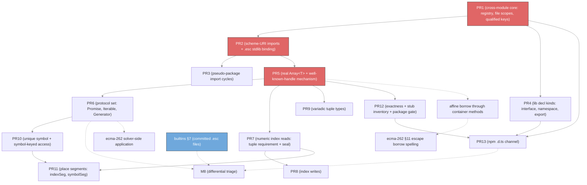

# M7.5 implementation plan — Library type resolution (`std:*` / `web:*` / `node:*`)

This plan covers **M7.5 — Library type resolution** as listed in
[01-milestones.md](01-milestones.md). It follows the shape of the
[M4](m4-implementation-plan.md), [M5](m5-implementation-plan.md),
[M6](m6-implementation-plan.md), and [M7](m7-implementation-plan.md) plans: what
the tree already ships, where the milestone text no longer matches the code, the
delta M7.5 adds, a PR-by-PR design with file references, and a dependency graph.

M7.5 is the milestone that gives `internal/solver` a way to see code it did not
parse itself. Everything before it types a single `*ast.Module` against a
hand-seeded prelude. M7.5 adds the second module, the import statement that names
it, the registry that caches it, and the standard-library types that flow through
it — and then spends the rest of its budget on the type-system surface that only
becomes expressible once `Array<T>` is real.

## What the tree already ships (ground truth)

### The solver has no import path at all

`InferModule` ([module.go:37](../../internal/solver/module.go)) takes one
`*ast.Module`, hangs a module `Scope` off `sharedPrelude()`, and walks the dep
graph. There is no `*ast.ImportStmt` handling anywhere in the package, no
per-file scope, and no package registry. The old checker's `InferModule`
([infer_module.go:1954](../../internal/checker/infer_module.go)) does all of that
in a Phase 1 that runs before the dep graph: it mints a file `Scope` per
`*ast.File` and calls `inferImport` for each of that file's `Imports`, so import
bindings are file-scoped while declarations are module-scoped. The solver has no
counterpart to that phase.

### The scheme-URI resolver exists, and lives entirely in the old checker

`internal/checker/infer_stdlib_import.go` already implements the whole
`<scheme>:<pkg>` surface: scheme split and validation over `std` / `web` / `node`,
the `?local` binding-shape flag, package-name validation, the map from
`std:array` to `<stdlib-dir>/std/array.esc`, the `@js` loader rules, and the FR5
single-class shortcut that binds `std:array` directly to the `Array` class when
the package declares one class whose name matches the package name.
`internal/checker/infer_stdlib_scc.go` adds cycle handling: it scans each package
file for its own pseudo-package imports, runs Tarjan over the resulting graph, and
loads a strongly connected component as one merged module. Both produce
`type_system.Namespace` and are unreachable from `soltype`.

The directory discovery itself — the `--stdlib-dir` flag, the
`ESCALIER_STDLIB_DIR` variable, the sibling-to-executable and repo-relative
fallbacks — is `interop.StdlibDir`
([stdlib_dir.go](../../internal/interop/stdlib_dir.go)), which is
`type_system`-free and reusable as-is.

### The standard library's content is two stub files

`internal/interop/data/` holds `std/array.esc` and `std/math.esc`, both stubs
written to satisfy a resolver gate. `web/`, `node/`, `builtins/`, and `libs/` hold
only a README. Filling them is §7 of
[planning/builtins/implementation_plan.md](../builtins/implementation_plan.md),
which is not started and depends on §6, the converter productionization, which is
partial. This is the single largest external dependency on M7.5's acceptance
criteria; see [§Cross-workstream dependencies](#cross-workstream-dependencies).

### `Array`, `Promise`, and `Generator` are dedicated `soltype` concretes

`ArrayType{Elem}` ([type.go:847](../../internal/soltype/type.go)) exists so a rest
parameter has an element type. Its own comment states the limit: "The minimal form
carries no members, so `xs.length` and `xs[0]` do not resolve." `PromiseType`
([type.go:774](../../internal/soltype/type.go)) and `GeneratorType` are the same
shape of decision — one stdlib generic hardcoded ahead of ingestion. All three are
reached by a hardcoded name test in `resolveTypeAnn`
([type_ann.go:145](../../internal/solver/type_ann.go)), which fires only after
`resolveScopedTypeRef` finds nothing, so a user declaration already shadows them.

`Iterable` and `AsyncIterable` have no representation at all: they are two of the
five names in `stdlibTypePlaceholders`
([prelude.go:102](../../internal/solver/prelude.go)), each bound to a bare
`UnknownType`. `IteratorResult`, `IteratorYieldResult`, and `IteratorReturnResult`
are the exception — they are real built-in aliases registered on every `Context`
by `registerIteratorResultAliases`.

Iteration is therefore structural rather than protocol-driven. `syncElemType`
([infer_for_in.go](../../internal/solver/infer_for_in.go)) reads an element type
off a tuple, a union of tuples, or a generator, and rejects everything else. There
is no `[Symbol.iterator]` lookup.

### M7 aliases landed; the type operators landed further than the milestone assumed

`AliasType`, `AliasDef`, `expandAlias`, the canonical-identity interning in
`Context.aliasInterns`, and the alias arms of the module SCC path are all in
([aliases.go](../../internal/solver/aliases.go),
[context.go:22](../../internal/solver/context.go),
[module.go:252](../../internal/solver/module.go)).

M9's operator machinery is substantially in as well, which retires several of the
milestone's "wait for M9" deferrals. `KeyofType`, `IndexType`, `CondType`,
`MappedElem`, `TemplateLitType`, `RestSpreadType`, and the string intrinsics all
exist in `soltype`, and `typeEvaluator`
([typeops.go](../../internal/solver/typeops.go)) reduces them.
`ObjectType.IndexSignatures` reads index signatures off a settled `MappedElem`, so
the `IndexSignatureElem` representation the milestone asks M7.5 to introduce is
already there under a different name.

### Usage-based inference seals objects, and only objects

`valueProp` ([infer_expr.go:2476](../../internal/solver/infer_expr.go)) lowers
`recv.prop` — and, through `resolveIndexPath`, a constant *string* index
`recv["prop"]` — to an inexact one-property `ObjectType` upper bound on the
receiver var. `foldUsageBounds` and `mergeObjectGroup`
([coalesce.go:915](../../internal/solver/coalesce.go)) merge those requirements by
property NAME, and `sealUsageObjects`
([poly.go:509](../../internal/solver/poly.go)) writes the merged, exact object
back into the var's stored upper bounds at generalization, gated on the var being
non-`open`, negative-only, and lower-bound-free.

There is no positional twin. A constant *numeric* index `recv[0]` is not a
constant key as far as `constStringKey`
([infer_expr.go:2720](../../internal/solver/infer_expr.go)) is concerned, so it
falls to `dynamicIndexRead`, which types it as `Recv[Kt]` and reduces it. On a
concrete tuple `indexTuple` ([typeops.go:1609](../../internal/solver/typeops.go))
answers correctly. On an inference variable the reduction does not ground, so the
access reports unsupported and no tuple is ever inferred from usage.

### The move engine's place segments carry a kind tag with one kind

`placeSeg{kind, name}` ([moves.go:170](../../internal/solver/moves.go)) has the
tag the milestone asks for, and `namedSeg` is its only value. `exprPlace`
([moves.go:202](../../internal/solver/moves.go)) builds a segment from a static
member or a `constStringKey` index and falls back to the container place for
everything else, so `arr[i]` and `t[0]` both resolve to the whole binding.
`soltype` has `SymbolPrim` but no unique-symbol type carrying a stable id, so
there is nothing for a symbol-keyed segment to key on.

### Three lib-shaped decl kinds are unsupported, and `export` is ignored

`inferDeclDef` ([infer_decl.go:31](../../internal/solver/infer_decl.go)) handles
`VarDecl`, `FuncDecl`, and `ClassDecl`; the type-key path adds `TypeDecl` and
`EnumDecl`. `InterfaceDecl` and `NamespaceDecl` reach `reportUnsupported`. The
solver reads no decl's `Export()` flag, and only `inferEnum` ever calls
`defineNamespace`, so there is no module-namespace tree and no notion of a
package's exported surface.

### Registries are per-run and keyed by dep-graph-qualified name

`Context.classes` and `Context.aliases`
([context.go:49](../../internal/solver/context.go)) key on the name stored in the
`ClassType` / `AliasType` node, which `dep_graph` qualifies within one module.
`newChecker` mints one `Context` per `InferModule` call. Two modules inferred into
one run would collide on any shared qualified name.

### The parallel-package gate is a comment, not a test

[doc.go:17](../../internal/solver/doc.go) and
[prelude.go:38](../../internal/solver/prelude.go) both assert that nothing in
`solver` imports `internal/checker` or `internal/type_system`. Nothing enforces
it. M7.5 is the first milestone with a real temptation to break it, because
`internal/interop` imports `type_system` at package scope even though its
AST-producing entry points do not.

## Where this plan diverges from the milestone text

The milestone was written before several of the things it defers. Five corrections
carry through the PR list.

- **Rest-param element checking (#677) is already done.** The milestone defers it
  to M7.5 on the grounds that it needs `Array<T>`. The `Array<T>` stub was enough:
  `constrain`'s function rule ([constrain.go:864](../../internal/solver/constrain.go))
  already checks each absorbed argument against an `Array<E>` rest slot's element
  type, in both the absorb and the scatter direction, and the scatter path is what
  a direct call goes through. M7.5 inherits this rather than building it.
- **Dynamic-key reads and index signatures are already done.** The milestone
  splits index-signature *representation* into M7.5 and index-signature
  *inference* into M9. Both landed: `MappedElem` is the representation, and
  `dynamicIndexRead` ([infer_expr.go:2678](../../internal/solver/infer_expr.go))
  routes `recv[k]` through `IndexType` reduction. What M7.5 still owes is the
  constant-numeric tuple arm and the `Array` element read.
- **`.esc` is the ingestion channel, not `.d.ts`.** The milestone describes
  ingestion as `dts_parser` → `interop.ConvertModule` → `*ast.Module`. That is the
  npm `@types` channel. The standard library goes through committed `.esc` files
  that the ordinary parser reads, with the `.d.ts` conversion happening offline in
  `tools/dts_to_esc`. Both channels end at `*ast.Module`, so the solver-side work
  is shared, but the stdlib path needs no `interop` dependency at all.
- **Named imports from a pseudo-package are rejected today.** The milestone's
  acceptance criteria say `import { Array } from "std:array"` resolves. The
  shipped resolver rejects a named import from a scheme URI and requires a bare
  `import "std:array"` plus member access through the bound namespace, with the
  single-class shortcut binding `Array` directly. This plan follows the shipped
  design, and PR2 records the wording fix to the milestone. Adding named imports
  is a separable change to both checkers and is not scheduled here.
- **Unions no longer carry exactness.** The exactness item cites
  [exact-types/requirements.md](../exact-types/requirements.md) §8, which lists
  unions among the four inexact-on-import categories. The union exactness fields
  were removed. PR12 stamps objects, tuples, and functions only.

## What M7.5 adds (the delta)

1. **Cross-module inference.** A package registry with an in-progress sentinel, a
   per-file `Scope`, an exported-surface `Namespace` per package, and registry
   keys qualified by package URI so two modules share one `Context` without
   colliding.
2. **Scheme-URI resolution on the solver.** `std:` / `web:` / `node:` split,
   validation, `.esc` path mapping, `@js` loader rules, and the two binding
   shapes, ported off `type_system`.
3. **Pseudo-package import cycles.** The package-import graph, Tarjan
   condensation, and the merged-module load for a component larger than one.
4. **The lib-shaped decl kinds.** `InterfaceDecl` with declaration merging,
   `NamespaceDecl`, and `export` visibility.
5. **Well-known type handles.** A `Context`-held handle per checker-known protocol
   type, resolved from its stdlib module rather than from lexical scope, so
   `await` / `for-in` / `yield` type-check in a file that imports nothing.
6. **A real `Array<T>`.** The `ArrayType` concrete gives way to the ingested
   declaration, so `xs.length`, `xs.push(v)`, `xs[i]`, and `for (x in xs)` all
   resolve.
7. **Positional usage inference.** A constant numeric index lowers to an inexact
   tuple requirement, `mergeTupleGroup` folds those by index, and
   `sealUsageObjects` grows a tuple arm under the existing gating.
8. **Index writes.** `recv[0] = v` and `recv[k] = v` extend the member-assign path
   with the same tuple-versus-array classification the read path uses.
9. **Variadic tuple types.** `[number, ...Array<number>]` as a typed unbounded
   tail, with its subtyping rules.
10. **`unique symbol` and symbol-keyed access.** A `soltype` kind carrying a
    stable id, plumbed through the visitor, printer, `constrain`, and `coalesce`.
11. **Precise place segments.** A type-aware `constKey` for the move engine, an
    `indexSeg` kind keyed by integer, and a `symbolSeg` kind keyed by symbol id.
12. **Visibility of the gaps.** Exactness stamping on ingested formers, an
    inventory of every lib name that resolves as a stub, and an executable
    parallel-package gate.
13. **The npm `.d.ts` channel.** `dts_parser` → `interop.ConvertModule` →
    `*ast.Module` → the solver, without pulling `type_system` into the output path.

## Cross-workstream dependencies

M7.5's acceptance criteria name `Map<K, V>`, `console`, and `web:dom`. None of
those exist on disk. The dependency is on
[planning/builtins/implementation_plan.md](../builtins/implementation_plan.md) §7,
"Stdlib bootstrap", which runs the converter, reviews the output, hand-edits
`throws` / lifetimes / mutability, and commits the `.esc` files. §7 depends on §6,
whose PR B and PR C are outstanding.

This plan does not wait on §7. Every PR below is testable against a **test stdlib
tree** — a fixture directory of hand-written `.esc` files pointed at through
`ESCALIER_STDLIB_DIR`, holding exactly the declarations that PR needs. PR2
establishes that harness. The consequence is a split acceptance boundary worth
stating plainly:

- **What M7.5 owns and can finish alone:** the resolver, the registry, the cycle
  handling, the decl kinds, the well-known handles, the whole `Array`-unlocked
  type-system surface, and the tests for all of it against the test tree.
- **What M7.5 cannot finish alone:** "real source that imports core lib types
  type-checks" against the *shipped* tree. That criterion is met when builtins §7
  lands, not when the last PR here merges.

The same split applies downstream. M8's real-package differential needs both this
plan and §7. Recording it here keeps a green M7.5 from reading as a populated
standard library.

### What M7.5 unblocks

Two workstreams wait on this milestone. Neither is owned here, and neither gates
any PR below — the edges run outward only.

- **Affine borrow tracking through container methods**
  ([affine_semantics/implementation_plan.md](../affine_semantics/implementation_plan.md)).
  The borrow-edge recorder sees a borrow stored into a container by a method call —
  `a.peers.push(&mut b)` — only once `Array` and its method surface exist. PR5 is
  that prerequisite. The fix itself is affine work. The same document's
  "Tuple-index place segments" item is discharged by PR11.
- **ECMA-262-derived builtin annotations**
  ([ecma-262/implementation_plan.md](../ecma-262/implementation_plan.md)). That
  plan names two follow-ons it cannot schedule until M7.5 lands, both listed under
  its "Discovery phases may grow the plan" section rather than as numbered PRs.
  Its **solver-side application** — wiring the extracted facts into the active
  checker's builtin ingestion — cites `addStdlibTypePlaceholders` as its evidence
  that the ingestion does not exist; PR6 deletes it. Its **`escape`
  lifetime-borrow spelling** (§11 curation) waits on the affine container-method
  work above, so it reaches M7.5 through PR5 at one remove.

The reverse edge does not exist: no PR here waits on ecma-262. That plan's §11
curation is explicitly independent of the solver-side application, and the
override layer it populates is applied by the builtins converter before the solver
sees the result. ECMA-262 raises the *fidelity* of the receiver mutability,
disposition, `throws`, and `rejects` annotations in the committed `.esc` files;
it does not gate their existence, which is builtins §7's job.

One representational coupling is worth naming, because it runs from this plan into
theirs. ECMA-262's requirements place the extracted effect facts in the MLstruct
lattice: a `throws` set is a union such as `TypeError | RangeError`, and a
`rejects` set lands on the two-argument `Promise<T, E>`. PR6 retires the
`PromiseType` concrete in favor of the ingested declaration, so the shape PR6
gives that type's error slot is the shape a `rejects` annotation is spelled
against. Keep the two-argument form through the retirement.

---

## PR-by-PR breakdown

Thirteen PRs in three lanes. **Lane A** (PR1–PR4, PR13) is ingestion plumbing.
**Lane B** (PR5–PR9) is the type-system surface `Array` unlocks. **Lane C**
(PR10–PR11) is symbol and index precision. PR12 is hygiene and can land any time
after PR5.

### PR1 — Cross-module inference core

The foundation: make the solver able to infer a second module and keep the result.

**Data structures.**
- `PackageRegistry` on the `checker`: `map[string]*packageEntry` keyed by the full
  URI, where `packageEntry` holds the package's exported `Namespace`, its resolved
  file path, and a `loading bool` in-progress sentinel. Modeled on
  [package_registry.go](../../internal/checker/package_registry.go), over
  `solver.Namespace` instead of `type_system.Namespace`.
- **A file scope per `*ast.File`.** `InferModule` grows a phase that mints a
  `Scope` child per file before the dep-graph walk, holding that file's import
  bindings. Declarations stay module-scoped; imports do not leak across files.
  This is the solver's counterpart to
  [infer_module.go:1960-1990](../../internal/checker/infer_module.go).
- **URI-qualified registry keys.** `Context.classes` and `Context.aliases` gain a
  package-URI prefix on every key minted while a package is being inferred, so
  `std:array`'s `Array` and a user's `Array` are distinct entries. The prefix is
  applied at registration and carried in the `ClassType.Name` / `AliasType.Name`
  the node stores, so nothing downstream needs to learn about packages.

**Algorithms.**
- **`loadModule(uri, path)` with a cycle sentinel.** Look the URI up; return the
  cached `Namespace` on a hit. On a miss, mark in-progress, parse, infer into a
  fresh `Namespace` under the SAME `Context`, then publish. A re-entrant lookup
  during the in-progress window returns the sentinel, and the caller skips binding
  rather than recursing. Sharing the `Context` is what makes a cross-package
  `ClassType` reference resolve through the one nominal registry; the URI prefix
  above is what makes that safe.
- **Exported-surface assembly.** After a package's dep graph is inferred, walk its
  top-level decls and copy the ones whose `Export()` is true into the package
  `Namespace`. This is the solver's first reader of the flag. A package with a
  non-exported top-level decl keeps it out of the namespace, so a consumer cannot
  name it.

**Accept.** A hand-built two-module fixture infers both: module B's `import`
resolves a class declared in module A, `B` sees only A's exported decls, and a
mutually-importing A/B pair terminates through the sentinel instead of recursing.
Two modules each declaring a class named `Point` produce two distinct
`ClassDef`s.

**Size.** Medium — one new file plus a phase in `module.go`.

### PR2 — Scheme-URI imports and `.esc` stdlib binding

Port the `std:` / `web:` / `node:` surface onto the solver.

**Data structures.**
- `stdlibSchemes` / `stdlibSchemesSet` / `stdlibKnownFlags`, ported verbatim from
  [infer_stdlib_import.go:21-33](../../internal/checker/infer_stdlib_import.go).
  These are plain string sets with no `type_system` content.
- The **test stdlib tree** the rest of the plan tests against: a fixture directory
  of hand-written `.esc` files selected through `ESCALIER_STDLIB_DIR`, with a
  helper that points a test run at it.

**Algorithms.**
- **`splitScheme` / `isRecognizedScheme` / `isSchemePrefixedImport` /
  `resolveStdlibFlags` / `isValidPackagePath`** — direct ports. Each is a pure
  string function with no checker coupling.
- **`resolveStdlibPath`** maps `scheme:pkg` to `<dir>/<scheme>/<pkg>.esc`, reusing
  `interop.StdlibDir` for discovery. `interop` imports `type_system` at package
  scope, so PR12's gate test must allow this one edge deliberately, or the
  discovery function moves to a leaf package. **Decide in this PR**; moving it is
  the cleaner answer and is a small mechanical change.
- **`bindStdlibLocal`** binds the package under the lowercased last URI segment,
  with the FR5 single-class shortcut: when the package declares exactly one class
  whose name matches the package name case-insensitively, bind that class directly
  under its own capitalization instead. Reads `Namespace.Types` / `Namespace.Values`
  from PR1's exported surface.
- **The `@js` loader rules** (§3.4(1-3) of the builtins plan): every exported
  value-level decl in a stdlib file must carry `@js`, and an unexported
  value-level decl is rejected. Rule 4, validating the `@js` argument against a
  real runtime path, stays out — the builtins plan §9 moves it to a CI-only test.
- **Diagnostics** re-anchor to the importing `import` statement's span, so a parse
  or inference error inside a stdlib file underlines the user's import rather than
  a file they cannot navigate to. The original location stays in the message body.

**Milestone correction.** Update
[01-milestones.md](01-milestones.md) M7.5's acceptance wording from
`import { Array } from "std:array"` to the bare-import form the resolver
implements, in this PR, so the two documents stop disagreeing.

**Accept.** `import "std:array"` against the test tree binds `Array` through the
single-class shortcut and `val xs: Array<number>` resolves to the ingested class;
`import "std:bogus"` reports an unknown-package diagnostic naming the searched
directory; `import "bogus:array"` reports an unknown-scheme diagnostic listing the
three recognized schemes; a named import from a scheme URI reports the
named-import rejection; a file that names `Array` with no import is an
unbound-name error, proving there is no ambient surface.

**Depends on** PR1.

**Size.** Medium-large — roughly the 420 lines of `infer_stdlib_import.go`, minus
the parts PR1 already carries.

### PR3 — Pseudo-package import cycles

`web:dom`'s siblings mutually reference it, so a cycle is the normal case, not an
edge case.

**Data structures.**
- The **pseudo-package import graph**: `map[string][]string` from a package URI to
  the URIs it imports, built by scanning each `.esc` file under the stdlib
  directory for its own scheme-prefixed imports.
- A **process-level SCC cache** keyed by stdlib directory, so the graph is built
  once per directory rather than once per import.

**Algorithms.**
- **`extractPseudoPackageImports`** parses one stdlib file and collects the
  scheme-prefixed specifiers in its `Imports`. Ported from
  [infer_stdlib_scc.go:124](../../internal/checker/infer_stdlib_scc.go).
- **`tarjanSCCs`** condenses the graph into strongly connected components. A
  direct port; it is a pure graph algorithm over strings.
- **Merged-module load.** When a URI's component has more than one member, parse
  every member into one `*ast.Module` and infer it as a single unit, so the
  existing dep-graph SCC ordering resolves the cross-package references. Publish
  each member's namespace into the registry afterwards. A member importing a
  sibling short-circuits its own bind, since the merged module already exposes the
  sibling.

**Accept.** A test tree with a `std:a` ↔ `std:b` cycle loads once, both packages
resolve each other's types, and each is registered under its own URI; a
three-package cycle behaves the same; an acyclic package still takes the
single-module path.

**Depends on** PR2.

**Size.** Medium — roughly the 330 lines of `infer_stdlib_scc.go`.

### PR4 — Lib-shaped declaration kinds

The converter emits declarations the solver cannot read yet.

**Data structures.**
- No new `soltype` node. An `InterfaceDecl` produces an `ObjectType`, reusing the
  `MethodElem` / `GetterElem` / `SetterElem` arms M5 landed.
- A `NamespaceDecl` produces a `solver.Namespace`, the container PR1 already
  assembles for a package's exported surface.

**Algorithms.**
- **Interface inference.** Slot an `*ast.InterfaceDecl` arm into the module
  type-key path beside the alias and enum arms, resolving the body through
  `resolveObjectTypeAnn` and binding the name. An interface is structural and
  transparent, so it binds to an `AliasType` over the object body rather than to a
  nominal identity — the same shape PR5 of the M7 plan gave an enum. Type
  parameters route through the existing `resolveTypeParams`.
- **Declaration merging.** Two `interface Foo` declarations in one module
  contribute to one type. Merge the element lists at bind time, last-wins per
  member name, matching the old checker's behavior. An interface merging with a
  same-named class is out of scope and reports a diagnostic.
- **`extends`.** An interface's `extends` clause resolves to the referenced object
  types and prepends their elements, so the merged element list is the flattened
  surface. This is member inheritance, not nominal subtyping.
- **Namespace inference.** A `*ast.NamespaceDecl` recurses into its own decls
  under a nested `Namespace`, wired into `Scope.defineNamespace`. The existing
  `resolveNamespaceMember` ([infer_expr.go:2704](../../internal/solver/infer_expr.go))
  then reads members off it with no change.

**Accept.** `declare interface Point { x: number }` binds and `val p: Point = {x: 1}`
type-checks; two `interface Point` blocks merge into one type carrying both member
sets; `interface Sq extends Rect {}` carries `Rect`'s members; a namespace decl
binds and `NS.member` resolves; a non-exported member of a stdlib package is
invisible to an importer.

**Depends on** PR1. Independent of PR2 and PR3.

**Size.** Medium.

### PR5 — A real `Array<T>` and the well-known-handle mechanism

The hinge PR. Everything in Lane B after it needs a real `Array`.

**Data structures.**
- **`Context.wellKnown map[wellKnownName]soltype.Type`**, a handle per
  checker-known type, populated on first use by loading that type's stdlib module
  through PR1's registry. The handle is independent of lexical scope, so a rule
  that needs `Array` fires in a file that never imports it. The set is fixed and
  closed — it is not a general ambient surface.
- **`ArrayType` retires.** The `soltype` concrete
  ([type.go:847](../../internal/soltype/type.go)) is replaced by the `ClassType`
  the ingested `Array` declaration produces, so an array carries its full member
  surface. Every arm that switches on `ArrayType` —
  [constrain.go:1213](../../internal/solver/constrain.go),
  [coalesce.go:1474](../../internal/solver/coalesce.go),
  [lattice.go:497](../../internal/solver/lattice.go),
  [inhabited.go:164](../../internal/solver/inhabited.go),
  [productivity.go:213](../../internal/solver/productivity.go) — either deletes or
  redirects to the nominal path. The rest-param absorb and scatter rules
  ([constrain.go:864](../../internal/solver/constrain.go)) switch from a type
  assertion on `*ArrayType` to a well-known-handle identity test, keeping #677's
  behavior intact.

**Algorithms.**
- **Handle resolution.** `wellKnownType(name)` loads the owning module, reads the
  name off its exported `Namespace`, and caches the result on `Context`. A missing
  name is a structured diagnostic naming the module and the name, reported once,
  not a panic — a partial stdlib tree must degrade legibly.
- **`Array` element reads.** `reduceIndex`
  ([typeops.go:1409](../../internal/solver/typeops.go)) grows an arm for the array
  instance: a numeric index or a `number`-typed key yields the element type. This
  is the "dynamic key → `Array`, not tuple" half of the milestone's index-read
  item.
- **Array iteration.** `syncElemType`
  ([infer_for_in.go](../../internal/solver/infer_for_in.go)) grows an array arm
  yielding the element type. The full `[Symbol.iterator]` protocol waits for PR10;
  this arm is the direct structural answer for the one container the milestone
  requires.
- **Annotation resolution.** Delete the hardcoded `Array` branch in `resolveTypeAnn`
  ([type_ann.go:145](../../internal/solver/type_ann.go)) and the `Array` arm of the
  arity-mismatch fallback below it, so a written `Array<number>` resolves through
  the ordinary scope path against the imported declaration.

**Accept.** With `Array` in the test tree, `val xs: Array<number>` resolves to the
ingested class; `xs.length` is `number`; `xs.push(1)` type-checks and `xs.push("a")`
is rejected with the full message; `xs[0]` is `number`; `for (x in xs) { … }` binds
`x` at `number`; a rest param `...args: Array<string>` still rejects a numeric
trailing argument, showing #677's behavior survived the concrete's retirement.

**Depends on** PR2. Independent of PR3 and PR4.

**Size.** Large. This is the PR to split further if review drags — the handle
mechanism and the `ArrayType` retirement are separable, in that order.

### PR6 — The well-known protocol set

Extend PR5's mechanism to the rest of the checker-known types and delete the
placeholders.

**Algorithms.**
- **`Promise`.** `PromiseType` retires the way `ArrayType` did in PR5, so
  `p.then(…)` resolves. `await e` constrains `e` against the handle-resolved
  `Promise<U>` rather than minting the concrete. The no-auto-flatten contract is
  unchanged: awaiting `Promise<Promise<T>>` yields `Promise<T>`, and flattening
  stays `Awaited<T>`. **The two-argument `Promise<T, E>` form must survive the
  retirement**: the ingested declaration keeps an error parameter, because that slot
  is where the ECMA-262 workstream's extracted `rejects` sets are spelled. See
  [§What M7.5 unblocks](#what-m75-unblocks).
- **`Iterable` / `AsyncIterable` / `Iterator`.** These have no concrete to retire
  — they are `UnknownType` stubs today. `for (x in xs)` and `for await` constrain
  the operand against the handle-resolved protocol type and read the element type
  off the result, replacing `syncElemType` / `asyncElemType`'s structural walk.
  Keep the tuple arm: a tuple is iterable by a rule the protocol lookup does not
  cover.
- **`Generator` / `AsyncGenerator`.** `GeneratorType` retires last, since it
  carries four slots and a `Raises` predicate that `iterationRaise`
  ([infer_for_in.go:107](../../internal/solver/infer_for_in.go)) reads. The
  ingested declaration must expose the same four type parameters for the raise
  path to survive; if it does not, this half splits out and the concrete stays,
  recorded in PR12's stub inventory.
- **Delete `stdlibTypePlaceholders` and `addStdlibTypePlaceholders`**
  ([prelude.go:98-117](../../internal/solver/prelude.go)). The prelude keeps the
  operator bindings and the built-in iterator-result aliases and loses its ambient
  type surface entirely.

**Accept.** `await` in a file that imports nothing type-checks against the real
`Promise`; `for (x in xs)` in a file that imports nothing type-checks against the
real `Iterable`; writing `Promise` in an annotation without importing it is an
unbound-name error, so the handle is reachable to the rule and not to the source;
a `yield` in a generator resolves its `IteratorResult` through the handle.

**Depends on** PR5.

**Size.** Large, and naturally splits per protocol if needed.

### PR7 — Constant-numeric index reads: tuple usage inference and the seal

The positional twin of M4's object close.

**Data structures.**
- **An inexact tuple requirement.** `recv[0]` lowers to
  `TupleType{Elems: […, β], Inexact: true}` — "has at least a slot at this index" —
  the positional analogue of the `{prop: β, ...}` object requirement. Holes below
  the accessed index are fresh vars.
- **`mergeTupleGroup`**, beside `mergeObjectGroup`
  ([coalesce.go:978](../../internal/solver/coalesce.go)).

**Algorithms.**
- **`inferIndex` tuple arm.** `resolveIndexPath`
  ([infer_expr.go:2648](../../internal/solver/infer_expr.go)) gains a branch for a
  constant numeric key, beside the existing `constStringKey` → `valueProp` call and
  before the `dynamicIndexRead` fallback. It mints the requirement above,
  constrains it as an upper bound on the receiver, and returns the element var. A
  receiver that is already a concrete tuple or array keeps today's reduction path;
  the new arm fires for an inference variable.
- **Merge by position.** Where `mergeObjectGroup` unions properties by name,
  `mergeTupleGroup` unions slots by index: `recv[0]; recv[2]` requires length ≥ 3
  with index 1 a fresh-var hole, and a slot required at several indices intersects
  its element types, exactly as the object fold intersects a shared property. The
  result is exact unless `open`.
- **Seal arm.** `foldUsageBounds` ([coalesce.go:915](../../internal/solver/coalesce.go))
  classifies an inexact tuple as a usage requirement alongside the inexact object,
  and `sealUsageObjects` ([poly.go:509](../../internal/solver/poly.go)) folds tuple
  bounds through the SAME gating — non-`open`, negative-only, no lower bounds. No
  new gating condition. An escaping receiver keeps its open row and an `open` param
  keeps the inexact `[T0, ...]` form, both falling straight out of the existing
  checks.
- **Number keys versus string keys.** `constStringKey` stays syntactic and
  string-only for the name-resolution call sites; the numeric arm is a separate
  reader. `recv[0]` and `recv["0"]` therefore take different paths and produce
  different requirements. PR11 applies the same split to the move engine.

**Accept.** `fn f(t) { t[0]; t[1] }` infers and SEALS the parameter to exact
`[T0, T1]`, and a caller passing a three-element tuple is rejected with the full
message; `fn f(open t) { t[0]; t[1] }` stays inexact `[T0, ...]` and accepts the
longer tuple; `fn f(t) { t[0]; return t }` is not sealed and the returned value
keeps the caller's extra elements; `fn f(t) { t[0]; t[2] }` requires length ≥ 3
with a fresh var at index 1; `fn f(t) { t[0].x; t[0].y }` seals both the tuple and
the nested object, showing the two folds compose.

**Depends on** PR5, for the dynamic-key-to-`Array` half of the classification.

**Size.** Medium-large.

### PR8 — Index writes

`recv[0] = v` and `recv[k] = v`, the write twin of PR7.

**Algorithms.**
- **Extend `inferMemberAssign`** (M4 C3) with the `*ast.IndexExpr` sub-case it
  currently reports unsupported. The write reuses PR7's classification — constant
  numeric to a tuple slot, dynamic to an array element, constant string to the
  existing object property path — plus C3's `mut` receiver requirement and
  `widen` on the written value.
- **A tuple write requirement is `mut`-wrapped**, so `foldUsageBounds`'s existing
  whole-container `mut` merge applies: any write among a receiver's selections
  folds every selection, reads included, into one `mut` tuple. This is the rule
  already in place for objects, reused verbatim rather than re-derived.
- **Read-after-write** through the `written` map keyed on `{recvID, field}` needs
  an index-shaped key. Generalize the key's field component to carry either a name
  or an integer index, so `t[0] = 5; t[0]` reads `number`.

**Accept.** `fn f(mut t) { t[0] = 5 }` requires a mutable tuple receiver and
rejects an immutable one with the full message; `t[0] = 5; t[0]` is `number`;
`xs[i] = 5` on an `Array<number>` type-checks and `xs[i] = "a"` is rejected;
writing through a non-`mut` receiver is rejected.

**Depends on** PR7.

**Size.** Medium.

### PR9 — Variadic tuple types

`[number, ...Array<number>]` — a fixed prefix with a typed, unbounded,
homogeneous tail. Distinct from M4's `Inexact` flag, which means "at least these,
then `unknown`."

**Data structures.**
- **Reuse `RestSpreadType` over an array**, rather than adding a tail field to
  `TupleType`. `resolveTupleTypeAnn`
  ([type_ann.go:539](../../internal/solver/type_ann.go)) already builds
  `TupleType{Elems: [number, RestSpreadType{Array<number>}]}` for this annotation;
  what is missing is every rule that reads it. Reusing the existing element keeps
  the printer, the visitor, and `coalesce` unchanged, and it is the same shape the
  `infer`-matching form will need. **Confirm this in the PR against the
  alternative**, a dedicated `Tail` field, before writing the rules.

**Algorithms.**
- **Grounding.** `groundTuple` / `reduceTuple`
  ([typeops.go:476](../../internal/solver/typeops.go)) splice a spread operand's
  elements in at its position. An array operand has no element list to splice, so
  add an arm that recognizes it as a settled variadic tail rather than an unground
  spread, so the tuple stops being treated as symbolic.
- **Subtyping.** Two rules, both in the tuple arm of `constrain`:
  `[number, number] <: [number, ...Array<number>]` — a fixed tuple satisfies a
  variadic one when its prefix matches and every surplus element is a subtype of
  the tail element — and `[number, ...Array<number>] <: Array<number>` — a
  variadic tuple is an array of the join of its prefix and tail elements.
- **`keyof` and indexed access.** `keyofTuple`
  ([typeops.go:1265](../../internal/solver/typeops.go)) and `indexTuple`
  ([typeops.go:1609](../../internal/solver/typeops.go)) grow tail arms: a numeric
  index at or beyond the prefix yields the tail element rather than an
  out-of-range error.

**Out of scope.** The `infer`-matching form
`T extends [any, ...infer R] ? R : never` stays with the conditional and `infer`
work, not here.

**Accept.** `val t: [number, ...Array<number>] = [1, 2, 3]` type-checks and
`[1, "a"]` is rejected with the full message; `[number, ...Array<number>]` is a
subtype of `Array<number>`; `t[5]` is `number` rather than out of range; a
variadic tuple renders with its tail spelled `...Array<number>`.

**Depends on** PR5.

**Size.** Medium.

### PR10 — `unique symbol` and symbol-keyed access

**Data structures.**
- **`soltype.UniqueSymbolType{ID int}`**, carrying a stable id so
  `val it = Symbol.iterator` and the original `Symbol.iterator` are one type. The
  old checker's `type_system.UniqueSymbolType{Value int}` is the model. Needs an
  `isType()` arm, a visitor arm, a printer arm rendering the symbol's name, a
  `constrain` arm — two unique symbols are subtypes only when their ids match, and
  every unique symbol is a subtype of the `symbol` primitive — a `coalesce` arm,
  and a `compareType` entry for canonical ordering.
- **A symbol-keyed object member.** `objKeyName`
  ([infer_expr.go:2735](../../internal/solver/infer_expr.go)) returns false for a
  `ComputedKey`; give it an arm that reads a unique-symbol-typed key so a
  symbol-keyed field is a member rather than a structured error.

**Algorithms.**
- **Symbol-keyed member access.** `resolveIndexPath` gains an arm for a key whose
  inferred type is a `UniqueSymbolType`, resolving against the receiver's
  symbol-keyed members. This is what makes `xs[Symbol.iterator]` reachable, and
  therefore what makes the full iteration protocol expressible.
- **Iteration through the protocol.** With symbol-keyed access working, PR6's
  `Iterable` constraint can resolve its element type through
  `[Symbol.iterator]()` rather than through a structural arm per container. Wire
  it here, keeping the tuple arm.

**Accept.** `Symbol.iterator` from the test tree has a unique-symbol type; two
references to it are the same type and two distinct symbols are not subtypes;
`{[Symbol.iterator]: … }` declares a symbol-keyed member; a user class declaring
`[Symbol.iterator]` is iterable by `for (x in …)` with no structural arm for its
shape.

**Depends on** PR6, for the `Iterable` protocol half. The `soltype` kind alone
depends on nothing in this plan.

**Size.** Medium-large.

### PR11 — Precise place segments in the move engine

Discharges the milestone's field-level-move item and the affine plan's
"Tuple-index place segments".

**Data structures.**
- **Two new `placeSeg` kinds** beside `namedSeg`
  ([moves.go:177](../../internal/solver/moves.go)): `indexSeg`, keyed by an
  integer, and `symbolSeg`, keyed by a symbol id. `placeSeg` grows the fields those
  kinds need. **The number-key decision is settled here in favor of the distinct
  `indexSeg`**, not a `namedSeg` carrying the literal text: a `namedSeg` is keyed
  by string, so mapping `a[0]` onto one conflates it with `a["0"]`. Both are
  sound; the distinct kind is more precise and is what tuple-element tracking
  needs. Apply the choice uniformly to `constKey`, `renderPlace`, and the
  tuple-literal walk.
- `placeKey` ([moves.go:249](../../internal/solver/moves.go)) already
  length-prefixes each segment's name under its kind, so it admits both kinds
  unchanged.

**Algorithms.**
- **A type-aware `constKey` for the move engine**, beside the syntactic
  `constStringKey` the name-resolution call sites keep. Priority order: an index
  whose inferred type is a singleton string `LitType` yields a `namedSeg`, so
  `obj[k]` with `k: "foo"` keys the same place as `obj.foo`; a singleton number
  `LitType` yields an `indexSeg`; a `UniqueSymbolType` yields a `symbolSeg` keyed
  on its id. Anything else falls back to the container place, exactly as a dynamic
  index does today — over-conservative at worst, never a missed use-after-move.
- **Thread the index type through.** `exprPlace`
  ([moves.go:202](../../internal/solver/moves.go)) is a free, purely syntactic
  function today. It, `recordMemberUse`, and `consumeOwned` take the checker's
  type side table so `constKey` can read an index expression's inferred type.
- **`renderPlace`** ([moves.go:299](../../internal/solver/moves.go)) prints an
  `indexSeg` as `[0]` and a `symbolSeg` as `[Symbol.iterator]`.
- **The tuple-literal walk** extends its path by element index, so a borrow stored
  at `a[1]` is recorded there rather than at `a`.

**Accept.** Moving `t[0]` leaves `t[1]` usable and a later read of `t[0]` is a
use-after-move naming `t[0]`; `obj[k]` with `k: "foo"` conflicts with a move of
`obj.foo`; `a[0]` and `a["0"]` are distinct places; `val a = [&mut b, {x: 1}];
return a[1]` no longer flags `b`; a dynamic `t[i]` still falls back to the
container.

**Depends on** PR7 for the numeric index path and PR10 for the symbol kind.

**Size.** Medium.

### PR12 — Exactness, the stub inventory, and the parallel-package gate

Three small pieces of hygiene that keep the milestone's gaps visible.

**Algorithms.**
- **Exactness stamping.** Every object, tuple, and function former minted while
  ingesting a library declaration is stamped `Inexact`
  ([exact-types/requirements.md](../exact-types/requirements.md) §8). The flag's
  zero value is exact, so this is an explicit set at each ingestion mint, not a
  default. Unions are excluded — their exactness fields were removed. A user
  wanting the closed reading opts in at the use site with `Exact<T>`, which the
  exactness intrinsic already implements.
- **The stub inventory.** A `Context`-held record of every lib name that resolved
  to a placeholder rather than a real structure, with the module it came from and
  why. Surfaced through a reporting hook so a run against a partial stdlib tree
  says what it could not represent instead of reading as full coverage. This is
  what keeps the builtins-§7 gap legible from inside the compiler.
- **The parallel-package gate.** A test that asserts `internal/solver` and
  `internal/soltype` do not transitively import `internal/checker` or
  `internal/type_system`, walking the package's own import graph rather than
  trusting the comment at [doc.go:17](../../internal/solver/doc.go). PR2's
  `interop.StdlibDir` decision is what this test would otherwise catch.

**Accept.** An ingested object type renders inexact and accepts an argument with
extra fields; a written Escalier object stays exact; the gate test fails when a
`type_system` import is added to `solver` and passes on the tree as shipped; a run
against a partial stdlib tree reports the names it stubbed.

**Depends on** PR5. Independent of PR6–PR11.

**Size.** Small.

### PR13 — The npm `.d.ts` channel

The second ingestion channel, and the one M8's real-package differential needs
beyond the standard library.

**Algorithms.**
- **Reuse the AST-producing front half.** `dts_parser` parse →
  `interop.ConvertModule` → `*ast.Module`
  ([module.go:176](../../internal/interop/module.go)), then hand that module to
  PR1's `loadModule`. The back half — the old checker's walk to `type_system` — is
  what this replaces.
- **Package resolution.** `resolveImport`
  ([infer_import.go:62](../../internal/checker/infer_import.go)) and
  `resolver.ResolveTypesPackage` locate a package's entry `.d.ts` from a
  `package.json`. Both are `type_system`-free and portable.
- **Export statement processing.** `export *`, `export * as ns`, and named
  re-exports across `.d.ts` files
  ([infer_import.go:430-690](../../internal/checker/infer_import.go)) are the bulk
  of the work, and they operate on PR1's `Namespace` rather than on types.
- **Keep the gate.** `interop` imports `type_system` at package scope, so this PR
  consumes only its AST-producing entry points and PR12's gate test constrains the
  result. If the gate cannot hold, the AST-producing surface splits into a leaf
  package.

**Accept.** A fixture npm package with a `.d.ts` entry point resolves through
`import { … } from "pkg"` and its exported types check; `export *` re-exports
resolve; a package with no types reports a structured diagnostic.

**Depends on** PR1, PR4, and PR12's gate.

**Size.** Large. This is the most deferrable PR in the plan — the milestone's
acceptance criteria and M8's fixture tree both rest on `std:*` / `web:*`, not on
npm.

---

## Dependency graph

```
PR1 (cross-module core: registry, file scopes, URI-qualified keys, exported surface)
 ├─► PR2 (scheme-URI imports + .esc stdlib binding + test stdlib tree)
 │    ├─► PR3 (pseudo-package import cycles: graph, Tarjan, merged load)
 │    └─► PR5 (real Array<T> + the well-known-handle mechanism)
 │         ├─► PR6 (well-known protocol set: Promise, Iterable, Generator)
 │         │    └─► PR10 (unique symbol + symbol-keyed access + the iteration protocol)
 │         │         └─► PR11 (place segments: constKey, indexSeg, symbolSeg)  ── also needs PR7
 │         ├─► PR7 (constant-numeric index reads: tuple requirement, mergeTupleGroup, seal arm)
 │         │    └─► PR8 (index writes)
 │         ├─► PR9 (variadic tuple types)
 │         └─► PR12 (exactness stamping + stub inventory + parallel-package gate)
 ├─► PR4 (lib decl kinds: interface, namespace, export visibility)
 └─► PR13 (npm .d.ts channel)                          ── also needs PR4, PR12

needs ─► builtins §7 (committed .esc files) for the shipped-tree acceptance criteria
feeds ─► M8 (the real-package differential needs real lib types)
feeds ─► affine borrow tracking through container methods (PR5's Array.push)
feeds ─► ecma-262 solver-side application (PR6 deletes the placeholders it waits on)
feeds ─► ecma-262 §11 escape lifetime-borrow spelling, through the affine work
```

The same graph in mermaid, with the ingestion critical path PR1 → PR2 → PR5
highlighted, the external workstream and downstream consumers dashed:



### Parallelism

- **Critical path** — PR1 → PR2 → PR5. Nothing in Lane B starts before PR5, and
  PR5 is the PR to split if its review stalls.
- **PR3 and PR4** hang off different parents and never block Lane B. PR4 needs
  only PR1, so it can run alongside PR2 from the start.
- **PR7, PR9, and PR12** are mutually independent once PR5 lands, and PR6 joins
  them — four reviewable branches off one parent.
- **PR11** is the only PR with two parents in different sub-lanes, PR7 and PR10.
  It is last for that reason, not because it is large.
- **PR13** is independent of Lane B entirely and can land at any point after PR4
  and PR12, or slip past the milestone without blocking M8's `std:*` coverage.

The milestone is functionally complete for its own test tree once PR11 lands, and
complete against the shipped standard library once builtins §7 commits the `.esc`
files.
