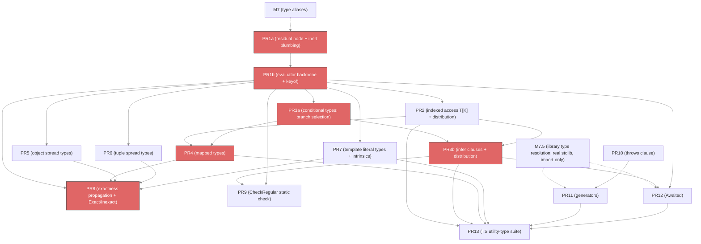

# M9 implementation plan — Type-level operators

This plan covers **M9 — Type-level operators** as listed in
[01-milestones.md](01-milestones.md). It is a PR-by-PR breakdown, modeled on the
[M4](m4-implementation-plan.md), [M5](m5-implementation-plan.md), and
[M6](m6-implementation-plan.md) plans: it records what prior milestones shipped,
the genuine delta M9 adds, the sequencing, the per-PR design with file
references, and a dependency graph.

M9 is the last MVP milestone and the largest by surface. It adds the full
type-level operator suite — `keyof`, indexed access, conditional types with
`infer`, mapped types, object and tuple spread types, and template literal types
— plus two orthogonal function-signature effects (`throws` and generators), all
resting on a shared **type-level evaluator** with a recursion-safe termination
strategy. The reduction architecture is settled: **Baseline-D** reduces an
operator as soon as its operands are ground, and **Design-A** keeps a
not-yet-ground operator as an inert residual node that reduces after coalescing.
Both are already prototyped in the spike ([internal/simplesub/typeops.go](../../internal/simplesub/typeops.go),
[residual.go](../../internal/simplesub/residual.go)); M9 promotes them onto the
production `soltype`/`solver` packages.

## What "operator" means here

A **type-level operator** is a type expression that *computes* a type from other
types rather than naming one directly. `keyof {x: number, y: string}` computes
the union `"x" | "y"`; `Pick<T, K>` computes a smaller object type. These are
distinct from the value-expression constraint solver: they are pure reductions
over already-formed types, with no inference variables in their results. The
milestone's job is to represent them, reduce them, and thread exactness through
the reduction.

## Prerequisites: M7 and M7.5 must land first

M9 builds directly on **M7 — Type aliases** and **M7.5 — Library type
resolution**. Three deliverables across those two milestones are hard
prerequisites:

1. **A generic type-alias representation in `soltype` (M7).** Today `soltype` has
   no alias node at all — [infer_enum.go:12-17](../../internal/solver/infer_enum.go)
   records "soltype has no type aliases yet (M7)", and
   [type_ann.go:21](../../internal/solver/type_ann.go) resolves only the single
   hardcoded `Promise<T>` reference, reporting every other `TypeRefTypeAnn` as
   unsupported. M9's operators are almost always written *as* generic aliases
   (`type Pick<T, K> = ...`), so the alias node, its type parameters, and
   scope-driven `TypeRef` resolution must exist first. M7 adds them.
2. **Alias instantiation and expansion (M7).** The evaluator reduces `Pick<Person,
   "name">` by instantiating `Pick`'s body with the arguments and reducing the
   result. That instantiate/expand step is M7 infrastructure.
3. **Real stdlib types (M7.5).** `Awaited<T>` needs the real `Promise<T>`;
   generators need `Generator<Y, R, TNext>` / `AsyncGenerator<…>`; the
   utility-type suite is checked against the real `.d.ts` shapes. Since M7.5 is
   import-only — there is no ambient global lib — the utility definitions and
   tests import these names from `std:*` / `web:*` / `node:*`. M2 seeded opaque
   placeholders; M7.5 swaps in the real structures, and M9 follows so it can rely
   on them.

The AST nodes M9 consumes already exist:
[`KeyOfTypeAnn`](../../internal/ast/type_ann.go),
[`TypeOfTypeAnn`](../../internal/ast/type_ann.go),
[`IndexTypeAnn`](../../internal/ast/type_ann.go),
[`CondTypeAnn`](../../internal/ast/type_ann.go),
[`InferTypeAnn`](../../internal/ast/type_ann.go),
[`MappedTypeAnn`](../../internal/ast/type_ann.go),
[`TemplateLitTypeAnn`](../../internal/ast/type_ann.go), and
[`IntrinsicTypeAnn`](../../internal/ast/type_ann.go) are all defined and
visitable. What is missing is the `soltype` representation, the reduction, and
the `resolveTypeAnn` arms that today fall through to `reportUnsupported`. Two
sibling annotation nodes are **out of scope** and stay unsupported: `MatchTypeAnn`
(the `match`-type surface the old checker never lowered — an alternative to
`CondTypeAnn`, not a parity gap) and `ImportTypeAnn` (`import("mod").T`, also
unsupported in the old checker; real imports cover the need).

## Spike provenance

The spike has already de-risked every hard part of M9. This plan promotes proven
spike work rather than inventing it:

- **Baseline-D operators** — [typeops.go](../../internal/simplesub/typeops.go):
  the `TypeEvaluator` over `TyExpr`, reducing `keyof` / indexed access /
  conditional-with-`infer` / union distribution when operands are ground, with
  the cycle cache plus depth budget for recursive aliases.
- **Design-A residual nodes** — [residual.go](../../internal/simplesub/residual.go):
  an operator whose operand is usage-inferred stays an inert `ResidualOp` that
  carries no bounds and is never touched by `constrain`, then reduces at
  coalescing once its operand has a concrete shape. Its defining property is that
  it adds **no new mutable solver state**.
- **CheckRegular** — [regularity.go](../../internal/simplesub/regularity.go): the
  optional level-2 static check that rejects *expanding* recursion at definition
  time, accepting `List` / `Json` / `DeepPartial` and rejecting `Grow`.
- **The lazy/coinductive alternative** — [lazy.go](../../internal/simplesub/lazy.go):
  an Amadio–Cardelli seen-set that decides regular recursive subtyping with no
  budget. M9 keeps the eager evaluator as the backbone and borrows the
  coinductive seen-set only where recursive-vs-recursive comparison needs it.

## What M9 adds (the delta)

1. **A residual type-operator representation in `soltype`.** New inert nodes —
   `KeyofType`, `IndexType`, `CondType` (with an `InferVar` binding form),
   `MappedType`, `ObjectSpreadType`, `TupleSpreadType`, `TemplateLitType` — that
   flow through `constrain` / `coalesce` / `extrude` / `LevelOf` / the visitor /
   the printer without being touched, exactly as `ResidualOp` does in the spike.
2. **A `TypeEvaluator`** with the two-part termination strategy (cycle cache keyed
   on the `(alias, evaluated-args)` instantiation state, plus a depth budget) and
   two invocation sites: **eager** at `resolveTypeAnn` when operands are ground,
   and **post-coalesce** for operands that only ground after the value solve.
3. **Per-operator reduction rules** for each node above, including distribution
   over unions, `infer`-variable binding by structural match, mapped-type modifier
   and `as`-remapping semantics, the Flow-faithful object-spread union rule, and
   the `IndexSignatureElem` a primitive-key mapped type reduces to.
4. **`typeof v` type queries**, resolved at annotation time against the value scope
   (not a residual), porting the old checker's `resolveTypeOfQualIdent` — the
   value→type bridge `keyof typeof x` needs.
5. **Exactness propagation through reduction** — the first milestone where
   exactness is *computed by* an operator, not merely checked — plus the
   `Exact<T>` / `Inexact<T>` intrinsics.
6. **`CheckRegular`** as a definition-time diagnostic for expanding recursion.
7. **`FuncType.Throws` and `FuncType.Yields` fields** with parallel arms in
   `constrain` / `extrude` / `LevelOf` / the printer, plus per-body inference
   variables that accumulate lowers from `throw e` / `yield e`.
8. **The TS utility-type suite** (`Pick`, `Omit`, `Partial`, …, `Awaited`,
   `Record`, `Capitalize`) as end-to-end verification, defined in Escalier and
   asserted to match TS reductions.

---

## PR-by-PR breakdown

Fifteen PRs across five tracks. Track A builds the evaluator and the core
operators in dependency order. Track B adds spread and template-literal
operators, which hang off the backbone but are independent of each other. Track C
adds exactness propagation and the recursion static-check. Track D is the two
function-signature effects, which touch `FuncType` and not the evaluator at all,
so it runs fully in parallel with A–C. Track E is the capstone verification.

The two heaviest concerns — the evaluator backbone and the conditional/`infer`
matcher — are each split in two so no single PR carries both a new representation
and a new algorithm: PR1a/PR1b and PR3a/PR3b below.

### PR1a — Residual-node representation + inert plumbing

The representation half of the backbone: a residual operator node that flows
through the solver untouched, before any evaluator exists to reduce it.

**Data structures.**
- `soltype`: add a residual operator node kind, starting with
  `KeyofType{Operand Type, exact bool}`, plus the shared inert-node contract:
  `isType()`, a visitor arm ([soltype/visitor.go](../../internal/soltype/visitor.go)),
  a printer arm rendering `keyof T` ([soltype/print.go](../../internal/soltype/print.go)),
  and `LevelOf` returning the operand's level. Model the node on the spike's
  `ResidualOp` ([residual.go](../../internal/simplesub/residual.go)) — it holds no
  bounds and is never a `constrain` participant.

**Algorithms.**
- **Inert arms in `constrain` / `extrude` / `coalesce`.** A residual node is passed
  through untouched, never decomposed — the "adds no new mutable solver state"
  invariant. This is the plumbing every later operator relies on; landing it alone,
  with one node kind, keeps the diff to the hot paths small and reviewable.

**Wiring.** `resolveTypeAnn` arm for `*ast.KeyOfTypeAnn`
([type_ann.go](../../internal/solver/type_ann.go)) that builds the **unreduced**
residual node; prov recording; printer.

**`typeof v` type queries land here too.** `typeof v` is the value→type bridge the
canonical `keyof typeof x` relies on, so it lands alongside the `keyof` wiring. It
is **not** a residual — a `resolveTypeAnn` arm for the `typeof` annotation looks the
name up in the **value** scope, walks any member chain (`typeof p.x`), and returns
that value's type directly, porting the old checker's `resolveTypeOfQualIdent`
([expand_type.go](../../internal/checker/expand_type.go)). No reduction, no residual
node — a resolution-time lookup.

**Accept.** `keyof T` for a type parameter `T` round-trips as a residual — renders
`keyof T` and flows through `constrain` / `coalesce` without being decomposed or
crashing (no reduction yet; that is PR1b). `typeof v` for a `val v = {a: 1}`
resolves to `{a: number}` at annotation time.

**Depends on** M7 (the alias representation the residual's operand may name).

### PR1b — Evaluator backbone + `keyof` reduction

The algorithm half: the evaluator that reduces the PR1a node.

**Data structures.**
- `solver`: a `TypeEvaluator` (new `internal/solver/typeops.go`) holding the alias
  environment, the cycle cache (`map[instantiationKey]soltype.Type`), and the
  depth budget. Promote the structure from
  [typeops.go](../../internal/simplesub/typeops.go).

**Algorithms.**
- `reduce(t soltype.Type) soltype.Type` — the evaluator's core. Walks the operator
  tree; an operator reduces only when every operand is **ground** (no unresolved
  `TypeVarType`, no unreduced residual sub-operand). `keyof` reduction matches the
  old checker's `KeyOfType` case
  ([expand_type.go](../../internal/checker/expand_type.go)): an `ObjectType` /
  `ClassType` projects its property/getter/setter keys and folds in an index
  signature's key type; a `TupleType` yields its numeric indices plus `"length"`;
  `keyof` distributes over a union or intersection target; `keyof` of a primitive
  or `never` / `unknown` is `never`; and `keyof` of a type variable or a
  not-yet-ground operand stays the residual `KeyofType`.
- The **two-part termination strategy** (promoted verbatim from the spike): the
  cycle cache emits a symbolic back-reference when an `(alias, args)` state
  recurs, giving the finite knot for a regular recursive type; the depth budget is
  the catch-all for unbounded growth. This is where `reduce` becomes safe over a
  recursive alias; `CheckRegular` (PR9) later rejects the expanding cases up front.
- **Two reduction sites.** Eager: `resolveTypeAnn` calls `reduce` on the operator
  it builds, so a ground `keyof {…}` reduces immediately (Baseline-D). Post-solve:
  a coalescing-time sweep reduces any residual whose operand has become concrete
  (Design-A). Wire the sweep into [coalesce.go](../../internal/solver/coalesce.go)
  at the point the spike marks — [coalesce.go:213](../../internal/simplesub/coalesce.go)
  ("a type operator left inert during the value solve reduces here").

**Accept.** `keyof {x: number, y: string}` ⇒ `"x" | "y"`; `keyof` over a
usage-inferred operand (`fn f(x) { x.a; x.b; keyof typeof x }`) reduces to `"a" |
"b"` post-solve; `keyof` of an operand that never gains structure stays symbolic.

**Depends on** PR1a (the node and its inert plumbing).

### PR2 — Indexed access `T[K]` + distribution over union keys

**Data structures.** `soltype.IndexType{Target, Index Type, exact bool}` with the
same inert-node contract as PR1a.

**Algorithms.**
- Indexed-access reduction: `{…}[k]` looks up field `k`; a tuple `[…][n]` selects
  element `n`; `T[keyof T]` yields the union of all value types; an object carrying
  an index signature (PR4) resolves a primitive-typed `K` to the signature's value
  type.
- **Distribution:** when `Index` reduces to a union, the access distributes —
  `T["a" | "b"]` ⇒ `T["a"] | T["b"]`. This is the same distribute-over-union
  mechanism conditionals reuse in PR3b.
- Errors carry typed `soltype.Type` references and assert full messages: an
  out-of-range tuple index and an unknown object key each get their own
  `SolverError` struct, modeled on [errors.go](../../internal/solver/errors.go).

**Wiring.** `resolveTypeAnn` arm for `*ast.IndexTypeAnn`.

**Depends on** PR1b (evaluator + `keyof`, since `T[keyof T]` is the canonical
combination).

### PR3a — Conditional types: branch selection

The subtyping-decision half of conditionals, without `infer` or distribution.

**Data structures.** `soltype.CondType{Check, Extends, Then, Else Type}`, an inert
residual node with the PR1a contract.

**Algorithms.**
- **Branch selection.** Decide `Check <: Extends` via an assignability probe —
  reuse the M6 `probe` journal ([probe.go](../../internal/solver/probe.go)) so a
  speculative match rolls back cleanly. Ground operands decide eagerly and reduce
  to `Then` or `Else`; a non-ground `Check` stays a residual `CondType` reduced
  post-coalescing.

**Wiring.** `resolveTypeAnn` arm for `*ast.CondTypeAnn` whose `extends` operand
holds no `infer`; an `*ast.InferTypeAnn` reports unsupported until PR3b.

**Accept.** `T extends string ? A : B` with a ground `T` reduces to the matching
branch; a non-ground `T` stays a residual `CondType` that reduces post-coalescing.

**Depends on** PR1b.

### PR3b — `infer` clauses + distribution

The structural-matcher half: the part that makes conditionals extract types.

**Data structures.** An `infer`-binding form: the evaluator's structural matcher
records `infer`-named positions into an environment, so `Then`/`Else` resolve
against the captured types. Promote `TyInfer` and the match machinery from
[typeops.go](../../internal/simplesub/typeops.go).

**Algorithms.**
- **`infer` binding by structural match.** Match `Check` against `Extends`
  structurally, binding each `infer U` to the matched position — function
  arg/return, tuple element, constructor return, promise payload. This is the
  Baseline-D structural matcher from
  [typeops.go:274](../../internal/simplesub/typeops.go).
- **Distribution over naked-type-parameter unions.** When `Check` is a bare type
  parameter bound to a union, the conditional distributes member-wise, matching TS
  semantics. Share the distribute helper introduced in PR2.

**Wiring.** `resolveTypeAnn` arm for `*ast.InferTypeAnn` (valid only inside a
conditional's `extends` operand — reject elsewhere with a full-message error).

**Accept.** `T extends (infer U)[] ? U : never` binds `U` to the element type; a
naked type-parameter union distributes member-wise.

**Depends on** PR3a. Reuses PR2's distribute helper.

### PR4 — Mapped types `{[K in Keys]: F<K>}`

**Data structures.** `soltype.MappedType{Key string, Keys Type, Value Type,
ReadonlyMod, OptionalMod Modifier, As Type}` where `Modifier` is
`add | remove | none` mirroring [`ast.MappedModifier`](../../internal/ast/type_ann.go).

**Algorithms.**
- Reduction iterates the `Keys` union; for each key it binds `K`, reduces the
  `Value` expression, and emits a field. The value position routinely uses indexed
  access (`T[K]`), which is why this depends on PR2.
- **Modifier application:** `readonly`/`?` add or remove with `+`/`-`, adjusting
  each emitted field's mutability and optionality.
- **Key remapping via `as`:** the `as` clause reduces per key; a key remapping to
  `never` drops the field. `as`-filtering commonly uses a conditional (`as K
  extends … ? K : never`) — branch selection, not `infer` — which is why this
  depends on PR3a.
- **Index signatures.** A mapped type over a **primitive** key constraint
  (`{[k in string]: T}`) reduces to an `IndexSignatureElem`, the old checker's
  representation ([type_system/types.go](../../internal/type_system/types.go)) that
  a literal-key map cannot express. This PR adds that element to
  `soltype.ObjectType`. Escalier has no hand-written `{[k: string]: T}` syntax, so
  mapped-type reduction is the *only* source of one in user code; `keyof` and
  indexed access (PR1b, PR2) already read it. It also lands the dynamic-key read
  inference (`recv[i]` against a non-tuple receiver) that M7.5 deferred here: a
  primitive key resolves through the index signature rather than a positional slot.
  Library types under `web:dom` / `std:*` carry index signatures, so M7.5 ingestion
  relies on this representation existing.
- This is the machinery underlying `Pick` / `Omit` / `Partial` / `Required` /
  `Readonly` / `Record`, verified end-to-end in PR13.

**Wiring.** `resolveTypeAnn` arm for `*ast.MappedTypeAnn`
([type_ann.go](../../internal/solver/type_ann.go)); the printer renders the mapped
and index-signature forms.

**Depends on** PR1b (`keyof` for `Keys`), PR2 (indexed access in the value
position), PR3a (`as`-clause conditional key filtering).

### PR5 — Object spread types `{...A, x: T}`

First-class object spread types, modeled on Flow — TypeScript has no equivalent.

**Data structures.** `soltype.ObjectSpreadType{Operands []Type}` where an operand
is either a spread (`...A`) or an explicit field.

**Algorithms.**
- Reduction merges operands left to right, **rightmost field winning** on overlap;
  stays residual when an operand is an abstract type parameter, reduced
  post-coalescing.
- **Flow-faithful optional-field show-through union.** When a later operand's
  *optional* field overlaps an earlier key, the values **union** rather than
  override. Required-in-earlier with optional-in-later yields `T | U` **required**;
  optional with optional yields `(T | U)?`. Concretely, `{...A, ...B}` with `A =
  {k: number}`, `B = {k?: string}` reduces to `k: number | string`, required.
- **Exactness threads from the operand:** a spread of an inexact object is inexact
  (the seed for PR9's propagation work).
- Object rest/spread in **both literals and type annotations** lands here, not M4.
  This PR adds the parser/AST support for object rest/spread if not already
  present.

**Wiring.** `resolveTypeAnn` arm for the object-spread annotation; literal-level
object spread in `inferObj`.

**Depends on** PR1b. Independent of PR2–PR4.

### PR6 — Tuple spread types `[...P, x]`

The positional analogue of PR5.

**Data structures.** `soltype.TupleSpreadType{Elems []TupleElem}` where an element
is a spread or a positional type.

**Algorithms.**
- Reduction splices the operand tuple in when it grounds to a concrete tuple;
  stays residual when the operand is an abstract type parameter, reduced
  post-coalescing.
- Distinct from a typed variadic tail like `[number, ...Array<number>]` — that
  needs `Array` and is an M7.5 concern. M4 already handles the concrete *literal*
  case (`[...pair, 3]` where `pair` is a known tuple); this PR adds only the
  abstract-operand **type**.

**Wiring.** `resolveTypeAnn` arm for the tuple-spread annotation.

**Depends on** PR1b. Independent of PR2–PR5.

### PR7 — Template literal types + string intrinsics

**Data structures.** `soltype.TemplateLitType{Quasis []string, Interps []Type}`.

**Algorithms.**
- Reduction takes the **cartesian product** over interpolated unions, producing a
  union of string-literal types. `` `on${"a" | "b"}` `` ⇒ `"ona" | "onb"`.
- The intrinsic string-manipulation operators `Uppercase` / `Lowercase` /
  `Capitalize` / `Uncapitalize` reduce over string-literal operands and stay
  residual over abstract ones.

**Wiring.** `resolveTypeAnn` arm for `*ast.TemplateLitTypeAnn`; the four
intrinsics registered as built-in operators.

**Depends on** PR1b. Independent of PR2–PR6.

### PR8 — Exactness propagation through operators + `Exact<T>` / `Inexact<T>`

The first milestone where exactness must **propagate through reduction**, not just
be checked. Builds on the exactness flag laid down in M3–M6
([exact-types/requirements.md](../exact-types/requirements.md) §7).

**Algorithms.** Thread exactness through every operator's reduction:
- `keyof T` is exact iff `T`'s key set is exact.
- `T[K]`, conditional results, mapped types, object spread, and template literals
  each derive exactness from their inputs.
- Add the `Exact<T>` / `Inexact<T>` intrinsics: `Exact<{x, ...}>` ⇒ `{x}`,
  `Inexact<{x}>` ⇒ `{x, ...}`. They are themselves type operators, so they slot
  into the evaluator.

**Wiring.** Touches each operator's reduce arm from PR1b–PR7 and the residual
nodes' `exact` fields.

**Depends on** PR1b–PR7 (it threads exactness through every operator, so it lands
once the operators exist).

### PR9 — `CheckRegular` static regularity check

**Algorithms.** Promote [regularity.go](../../internal/simplesub/regularity.go):
an optional level-2 static check that rejects *expanding* recursion up front. An
alias is flagged when a recursive reference into its strongly-connected component
passes a formal parameter nested under a type constructor, so the parameter grows
each lap and the reachable-instantiation set is infinite. It **accepts** regular
recursion (`List`, `Json`, `DeepPartial` on `T[P]`, conditionals recursing on an
`infer` binding) and **rejects** expanding recursion (`Grow<T> = Grow<Array<T>>`)
with a precise definition-time diagnostic.

The check is sound but incomplete — an expanding alias gated on a base-case
conditional terminates yet is still rejected, since deciding otherwise is the
halting problem — so the PR1b depth budget remains the runtime backstop. The two
are complementary: a precise early error where decidable, safe termination always.

**Data structures.** Operates over the alias dependency graph / SCCs
([internal/dep_graph/](../../internal/dep_graph/)); no new `soltype` node.

**Depends on** PR1b (evaluator + cycle cache) and PR3b (conditionals recursing on
an `infer` binding are an accept case). Independent of PR4–PR8.

### PR10 — `throws T` clause on functions

Orthogonal to the evaluator. Touches only `FuncType` and the function-inference
walk.

**Data structures.** `soltype.FuncType` gains a `Throws Type` field
([soltype/type.go:201](../../internal/soltype/type.go)), parallel to `Ret`,
defaulting to `never` (⊥) when the source has no `throws` clause.

**Algorithms.**
- **Constraint engine, parallel arms** — the function arm in `constrain` recurses
  `l.Throws <: r.Throws` (covariant); `extrude` recurses into `Throws` with the
  same polarity as `Ret`; `LevelOf` takes the max of params, ret, and throws; the
  printer renders `throws T` after the return type when `T` isn't `never`.
- **Per-body throws inference variable** that accumulates lowers as `throw e`
  statements and calls to throwing functions emit `constrain(thrown, throws_var)`.
- **Throws polymorphism** falls out of M3's let-generalization with no special
  handling — `E` in `<E>(f: () -> T throws E) -> T throws E` is just another
  quantified variable.
- **Open design question to resolve in this PR:** how `try`/`catch` narrows the
  inferred throws of the body. The conservative starting point is the two-variable
  encoding `body_throws <: surrounding_throws ∪ caught_throws`, which fits the
  existing lattice. Integration with the checker's narrowing semantics is the
  actual question to settle before implementation.

**Depends on** M3 only (the function machinery, landed). Independent of the whole
operator track — can start immediately.

### PR11 — Generators (`gen fn` / `yield e` / `yield from g`)

Same shape as `throws`; PR10's arms are the template.

**Data structures.** `soltype.FuncType` gains a `Yields Type` field, covariant in
subtyping, defaulting to `never`.

**Algorithms.**
- A `gen fn () -> R` is internally typed with body return `R` and a
  yields-inference variable accumulating each `yield e`'s type as a lower;
  externally the function's type is `Generator<Y, R, TNext>` — or
  `AsyncGenerator<…>` for `async gen fn` — where `Y` is the coalesced yields
  variable.
- `yield e` requires no special constraint beyond `typeof(e) <: yields_var`; the
  expression itself has type `TNext`.
- `yield from g` requires `g <: Iterable<Y>` and forwards yields.
- The constraint engine extends exactly as `throws` did: parallel arms in
  `constrain` / `extrude` / `LevelOf` / the printer, no new lattice machinery.
- `yield` outside a `gen` context is rejected by the AST walk, not the type rule.

**Depends on** PR10 (the parallel-arm template), M7.5 (the real `Generator<…>` /
`AsyncGenerator<…>` stdlib types). The async-gen + `Awaited<ReturnType<F>>` accept
case additionally rides on PR3b and PR13.

### PR12 — `Awaited<T>`

`Awaited<T>` is a recursive conditional with `infer` that flattens nested
promises. The milestone explicitly lands it here — M3 deliberately left
`Promise<Promise<T>>` un-flattened, deferring the recursive flattening to this
operator.

**Algorithms.** Define `Awaited<T>` as the recursive conditional `T extends
Promise<infer U> ? Awaited<U> : T`, reduced through the PR3b machinery with the
PR1b cycle-cache/budget termination protecting the recursion.

**Depends on** PR3b (conditional + `infer`), PR1b (recursion termination), M7.5
(real `Promise<T>`). Separated from PR13 because it is a real feature the async
story in PR11 depends on, not just a test.

### PR13 — TS utility-type suite (end-to-end verification)

The capstone. Mostly tests, defining each utility in Escalier and asserting its
reduction matches TS:

- `Pick<T, K>`, `Omit<T, K>` — mapped + indexed access + key filtering via
  conditional `K extends …`.
- `Partial<T>`, `Required<T>`, `Readonly<T>` — mapped-type modifiers.
- `Exclude<U, V>`, `Extract<U, V>`, `NonNullable<T>` — distributive conditional.
- `ReturnType<F>`, `Parameters<F>`, `ConstructorParameters<F>`, `InstanceType<C>`
  — conditional + `infer`.
- `Record<K, V>` — mapped over a key union.
- `Capitalize` / `Uncapitalize` / `Uppercase` / `Lowercase` and a small
  template-literal case (`EventName<K>` ⇒ `` `on${Capitalize<K>}` ``).

**Provisioning under the no-ambient model.** The old checker inherits these
utilities from the bundled TypeScript `lib.es*.d.ts`, resolved as ambient globals.
M7.5 has no ambient lib, so the same definitions — ordinary generic aliases built
from the M9 operators — ship as **importable** stdlib declarations a user pulls
from a `std:*` module. This PR's Escalier definitions are both the verification
corpus *and* the source of those shipped declarations; the operators PR1b–PR12
land are what make them reduce. So M9 does not just verify the utilities, it makes
them expressible at all under import-only resolution.

**Depends on** PR2, PR3b, PR4, PR7, PR12. Verifies the whole operator suite
composes.

---

## Sizing note

Each PR is scoped to a single reviewable concern. The two heaviest — the evaluator
backbone and the conditional/`infer` matcher — are split so neither PR pairs a new
representation with a new algorithm: **PR1a** is the residual node plus its inert
`constrain`/`coalesce`/`extrude` plumbing, **PR1b** is the evaluator and `keyof`
reduction; **PR3a** is conditional branch selection, **PR3b** is the `infer`
structural matcher and distribution. The remaining PRs are each a single operator
or a single function-signature effect, sized comparably to a typical M4/M6 PR.
Mapped types (PR4) and object spread (PR5) are the next-largest — the fiddly
modifier/`as`-remapping semantics and the Flow optional-field union rule
respectively — but each is one self-contained operator and stays within the M4/M6
band. PR10 and PR11 touch only `FuncType` and never the evaluator, so they carry
no operator-track review burden. PR13 is verification-heavy but low-risk; if the
utility corpus balloons it splits cleanly by category (mapped-based,
conditional-based, template-based).

## Dependency graph

```
M7   (type aliases: alias node + generics + scope-driven TypeRef)  ──► PR1a
M7.5 (library type resolution: real stdlib types, import-only)     ──► PR11, PR12

PR1a (residual-node representation + inert plumbing)
 └─► PR1b (evaluator backbone + keyof reduction)
      ├─► PR2 (indexed access T[K] + union-key distribution)
      │    └─► PR4 (mapped types)              ── also needs PR1b, PR3a
      ├─► PR3a (conditional types: branch selection)
      │    └─► PR3b (infer clauses + distribution)   ── also needs PR2
      │         ├─► PR9 (CheckRegular)          ── also needs PR1b
      │         └─► PR12 (Awaited<T>)           ── also needs PR1b, M7.5
      ├─► PR5 (object spread types)
      ├─► PR6 (tuple spread types)
      ├─► PR7 (template literal types + intrinsics)
      └─► PR8 (exactness propagation + Exact/Inexact)  ── needs PR1b–PR7

PR10 (throws clause)                      ── needs M3 only; parallel to everything
 └─► PR11 (generators)                    ── also needs M7.5 (+PR3b/PR12 for the async-gen accept case)

PR13 (TS utility-type suite)              ── needs PR2, PR3b, PR4, PR7, PR12
```

The same graph in mermaid, with the operator-track critical path
(PR1a → PR1b → PR3a → PR3b → PR4 → PR8) highlighted and the landed `M7` / `M7.5`
prerequisites dashed:



### Parallelism

- **Track A** (PR1a → PR1b → PR2/PR3a → PR3b/PR4, plus PR5/PR6/PR7 hanging directly
  off PR1b) is the operator core. PR5, PR6, and PR7 are mutually independent and can
  be built concurrently once PR1b lands.
- **Track C** — PR8 (exactness) is a barrier that waits for all operators; PR9
  (CheckRegular) needs only PR1b + PR3b and runs alongside PR4–PR8.
- **Track D** — PR10 (throws) has no operator dependency and can start on day one
  alongside PR1a; PR11 (generators) follows PR10.
- **Track E** — PR13 is the final join, waiting on PR2, PR3b, PR4, PR7, PR12.

The critical path is `M7 → PR1a → PR1b → PR3a → PR3b → PR4 → PR8`, and — for the
async-generator accept case — `M7 → PR1a → PR1b → PR3b → PR12 → PR13`.
