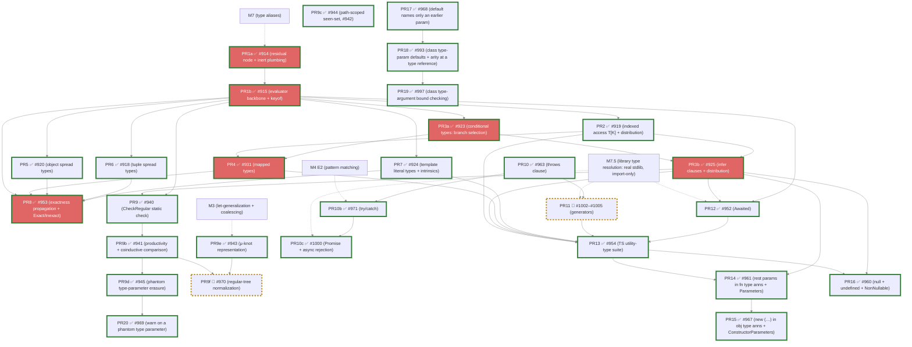

# M9 implementation plan — Type-level operators

This plan covers **M9 — Type-level operators** as listed in
[01-milestones.md](01-milestones.md). It is a PR-by-PR breakdown, modeled on the
[M4](m4-implementation-plan.md), [M5](m5-implementation-plan.md), and
[M6](m6-implementation-plan.md) plans: it records what prior milestones shipped,
the genuine delta M9 adds, the sequencing, the per-PR design with file
references, and a dependency graph.

M9 is the last MVP milestone and the largest by surface. It adds the full
type-level operator suite — `keyof`, indexed access, conditional types with
`infer`, mapped types, object and tuple spread types, and template literal types
— plus two orthogonal function-signature effects (`throws` and generators), all
resting on a shared **type-level evaluator** with a recursion-safe termination
strategy. The reduction architecture is settled: **Baseline-D** reduces an
operator as soon as its operands are ground, and **Design-A** keeps a
not-yet-ground operator as an inert residual node that reduces after coalescing.
Both are already prototyped in the spike ([internal/simplesub/typeops.go](../../internal/simplesub/typeops.go),
[residual.go](../../internal/simplesub/residual.go)); M9 promotes them onto the
production `soltype`/`solver` packages.

## What "operator" means here

A **type-level operator** is a type expression that *computes* a type from other
types rather than naming one directly. `keyof {x: number, y: string}` computes
the union `"x" | "y"`; `Pick<T, K>` computes a smaller object type. These are
distinct from the value-expression constraint solver: they are pure reductions
over already-formed types, with no inference variables in their results. The
milestone's job is to represent them, reduce them, and thread exactness through
the reduction.

## Prerequisites: M7 and M7.5 must land first

M9 builds directly on **M7 — Type aliases** and **M7.5 — Library type
resolution**. Three deliverables across those two milestones are hard
prerequisites:

1. **A generic type-alias representation in `soltype` (M7).** Today `soltype` has
   no alias node at all — [infer_enum.go:12-17](../../internal/solver/infer_enum.go)
   records "soltype has no type aliases yet (M7)", and
   [type_ann.go:21](../../internal/solver/type_ann.go) resolves only the single
   hardcoded `Promise<T>` reference, reporting every other `TypeRefTypeAnn` as
   unsupported. M9's operators are almost always written *as* generic aliases
   (`type Pick<T, K> = ...`), so the alias node, its type parameters, and
   scope-driven `TypeRef` resolution must exist first. M7 adds them.
2. **Alias instantiation and expansion (M7).** The evaluator reduces `Pick<Person,
   "name">` by instantiating `Pick`'s body with the arguments and reducing the
   result. That instantiate/expand step is M7 infrastructure.
3. **Real stdlib types and the index-signature representation (M7.5).** `Awaited<T>`
   needs the real `Promise<T>`; generators need `Generator<Y, R, TNext>` /
   `AsyncGenerator<…>`; the utility-type suite is checked against the real `.d.ts`
   shapes. Since M7.5 is import-only — there is no ambient global lib — the utility
   definitions and tests import these names from `std:*` / `web:*` / `node:*`. M7.5
   also **introduces the `IndexSignatureElem` representation**, because its ingested
   library types carry index signatures; M9 PR4 only *produces* and *reads* them, so
   the dependency runs one way (M7.5 → M9) — M9 introduces no artifact M7.5 needs.
   M2 seeded opaque placeholders; M7.5 swaps in the real structures, and M9 follows
   so it can rely on them.

The AST nodes M9 consumes already exist:
[`KeyOfTypeAnn`](../../internal/ast/type_ann.go),
[`TypeOfTypeAnn`](../../internal/ast/type_ann.go),
[`IndexTypeAnn`](../../internal/ast/type_ann.go),
[`CondTypeAnn`](../../internal/ast/type_ann.go),
[`InferTypeAnn`](../../internal/ast/type_ann.go),
[`MappedTypeAnn`](../../internal/ast/type_ann.go),
[`TemplateLitTypeAnn`](../../internal/ast/type_ann.go), and
[`IntrinsicTypeAnn`](../../internal/ast/type_ann.go) are all defined and
visitable. What is missing is the `soltype` representation, the reduction, and
the `resolveTypeAnn` arms that today fall through to `reportUnsupported`. Two
sibling annotation nodes are **out of scope** and stay unsupported: `MatchTypeAnn`
(the `match`-type surface the old checker never lowered — an alternative to
`CondTypeAnn`, not a parity gap) and `ImportTypeAnn` (`import("mod").T`, also
unsupported in the old checker; real imports cover the need).

## Spike provenance

The spike has already de-risked every hard part of M9. This plan promotes proven
spike work rather than inventing it:

- **Baseline-D operators** — [typeops.go](../../internal/simplesub/typeops.go):
  the `TypeEvaluator` over `TyExpr`, reducing `keyof` / indexed access /
  conditional-with-`infer` / union distribution when operands are ground, with
  the cycle cache plus depth budget for recursive aliases.
- **Design-A residual nodes** — [residual.go](../../internal/simplesub/residual.go):
  an operator whose operand is usage-inferred stays an inert `ResidualOp` that
  carries no bounds and is never touched by `constrain`, then reduces at
  coalescing once its operand has a concrete shape. Its defining property is that
  it adds **no new mutable solver state**.
- **CheckRegular** — [regularity.go](../../internal/simplesub/regularity.go): the
  optional level-2 static check that rejects *expanding* recursion at definition
  time, accepting `List` / `Json` / `DeepPartial` and rejecting `Grow`. PR9 lands
  it, and PR9b replaces its condition with productivity.
- **The lazy/coinductive alternative** — [lazy.go](../../internal/simplesub/lazy.go):
  an Amadio–Cardelli seen-set that decides regular recursive subtyping with no
  budget. M9 keeps the eager evaluator as the backbone and borrows the
  coinductive seen-set only where recursive-vs-recursive comparison needs it,
  which is PR9b.

## What M9 adds (the delta)

1. **A residual type-operator representation in `soltype`.** New inert nodes —
   `KeyofType`, `IndexType`, `CondType` (with an `InferVar` binding form),
   `MappedType`, `ObjectSpreadType`, `TupleSpreadType`, `TemplateLitType` — that
   flow through `constrain` / `coalesce` / `extrude` / `LevelOf` / the visitor /
   the printer without being touched, exactly as `ResidualOp` does in the spike.
2. **A `TypeEvaluator`** with the two-part termination strategy (cycle cache keyed
   on the `(alias, evaluated-args)` instantiation state, plus a depth budget) and
   two invocation sites: **eager** at `resolveTypeAnn` when operands are ground,
   and **post-coalesce** for operands that only ground after the value solve.
3. **Per-operator reduction rules** for each node above, including distribution
   over unions, `infer`-variable binding by structural match, mapped-type modifier
   and `as`-remapping semantics, the Flow-faithful object-spread union rule, and
   the `IndexSignatureElem` a primitive-key mapped type reduces to.
4. **`typeof v` type queries**, resolved at annotation time against the value scope
   (not a residual), porting the old checker's `resolveTypeOfQualIdent` — the
   value→type bridge `keyof typeof x` needs.
5. **Exactness propagation through reduction** — the first milestone where
   exactness is *computed by* an operator, not merely checked — plus the
   `Exact<T>` / `Inexact<T>` intrinsics.
6. **A definition-time recursion check.** `CheckRegular` first, rejecting an alias
   whose recursion grows one of its own parameters, then the productivity condition
   that supersedes it and the coinductive comparison the types it newly accepts
   require.
7. **`FuncType.Throws` and `FuncType.Yields` fields** with parallel arms in
   `constrain` / `extrude` / `LevelOf` / the printer, plus per-body inference
   variables that accumulate lowers from `throw e` / `yield e`.
8. **The TS utility-type suite** (`Pick`, `Omit`, `Partial`, …, `Awaited`,
   `Record`, `Capitalize`) as end-to-end verification, defined in Escalier and
   asserted to match TS reductions.

---

## PR-by-PR breakdown

Twenty-nine PRs across six tracks. Track A builds the evaluator and the core
operators in dependency order. Track B adds spread and template-literal
operators, which hang off the backbone but are independent of each other. Track C
adds exactness propagation and the recursion static-check. Track D is the
function-signature effects and the exception machinery around them, which touch
`FuncType` and not the evaluator at all, so it runs fully in parallel with A–C.
Track E is the capstone verification and the follow-ons it turned up. Track F brings a
class reference's type arguments up to the checking an alias reference already gets.

The two heaviest concerns — the evaluator backbone and the conditional/`infer`
matcher — are each split in two so no single PR carries both a new representation
and a new algorithm: PR1a/PR1b and PR3a/PR3b below.

Sixteen of the twenty-nine were planned up front. PR9c through PR9f were added to Track C
after PR9b's review, which turned up one soundness question, one wrong answer, and one
representation the milestone assumed exists. They are described together in "the
recursion-safety follow-on group" below. PR14 through PR16 were added to Track E after
PR13, which found four utilities inexpressible and identified what each waits on.

PR10b and PR10c were added to Track D after PR10, which settled how `try`/`catch` narrows
a body's throws but could not build it: the solver has no `try`/`catch` walk at all, so
the design had no caller. PR10b is that walk. PR10c then moves an `async fn`'s throws off
its own signature and into the promise it returns, which is where a rejection belongs and
which needs PR10b's `try` to be catchable. Both were assumed by
[01-milestones.md](01-milestones.md) — its M9 accept list calls for "a `try`/`catch` test
for the body-narrowing rule" — without a PR to build them.

PR17 through PR20 were added as Track F after PR9d's review, which found that a written
type argument is never checked against its parameter's declared bound. #956 has since
closed that for aliases, and for enums with it, since an enum registers as a transparent
alias. What the review turned up beyond it stays open, and Track F is that remainder, plus
PR20, which surfaces the erasure PR9d performs silently.

### PR1a — Residual-node representation + inert plumbing

The representation half of the backbone: a residual operator node that flows
through the solver untouched, before any evaluator exists to reduce it.

**Data structures.**
- `soltype`: add a residual operator node kind, starting with
  `KeyofType{Operand Type, exact bool}`, plus the shared inert-node contract:
  `isType()`, a visitor arm ([soltype/visitor.go](../../internal/soltype/visitor.go)),
  a printer arm rendering `keyof T` ([soltype/print.go](../../internal/soltype/print.go)),
  and `LevelOf` returning the operand's level. Model the node on the spike's
  `ResidualOp` ([residual.go](../../internal/simplesub/residual.go)) — it holds no
  bounds and is never a `constrain` participant.

**Algorithms.**
- **Inert arms in `constrain` / `extrude` / `coalesce`.** A residual node is passed
  through untouched, never decomposed — the "adds no new mutable solver state"
  invariant. This is the plumbing every later operator relies on; landing it alone,
  with one node kind, keeps the diff to the hot paths small and reviewable.

**Wiring.** `resolveTypeAnn` arm for `*ast.KeyOfTypeAnn`
([type_ann.go](../../internal/solver/type_ann.go)) that builds the **unreduced**
residual node; prov recording; printer.

**`typeof v` type queries land here too.** `typeof v` is the value→type bridge the
canonical `keyof typeof x` relies on, so it lands alongside the `keyof` wiring. It
is **not** a residual — a `resolveTypeAnn` arm for the `typeof` annotation looks the
name up in the **value** scope, walks any member chain (`typeof p.x`), and returns
that value's type directly, porting the old checker's `resolveTypeOfQualIdent`
([expand_type.go](../../internal/checker/expand_type.go)). No reduction, no residual
node — a resolution-time lookup.

**Accept.** `keyof T` for a type parameter `T` round-trips as a residual — renders
`keyof T` and flows through `constrain` / `coalesce` without being decomposed or
crashing (no reduction yet; that is PR1b). `typeof v` for a `val v = {a: 1}`
resolves to `{a: number}` at annotation time.

**Depends on** M7 (the alias representation the residual's operand may name).

### PR1b — Evaluator backbone + `keyof` reduction

The algorithm half: the evaluator that reduces the PR1a node.

**Data structures.**
- `solver`: a `TypeEvaluator` (new `internal/solver/typeops.go`) holding the alias
  environment, the cycle cache (`map[instantiationKey]soltype.Type`), and the
  depth budget. Promote the structure from
  [typeops.go](../../internal/simplesub/typeops.go).

**Algorithms.**
- `reduce(t soltype.Type) soltype.Type` — the evaluator's core. Walks the operator
  tree; an operator reduces only when every operand is **ground** (no unresolved
  `TypeVarType`, no unreduced residual sub-operand). `keyof` reduction matches the
  old checker's `KeyOfType` case
  ([expand_type.go](../../internal/checker/expand_type.go)): an `ObjectType` /
  `ClassType` projects its property/getter/setter keys and folds in an index
  signature's key type; a `TupleType` yields its numeric indices plus `"length"`;
  `keyof` distributes over a union or intersection target; `keyof` of a primitive
  or `never` / `unknown` is `never`; and `keyof` of a type variable or a
  not-yet-ground operand stays the residual `KeyofType`.
- The **two-part termination strategy** (promoted verbatim from the spike): the
  cycle cache emits a symbolic back-reference when an `(alias, args)` state
  recurs, giving the finite knot for a regular recursive type; the depth budget is
  the catch-all for unbounded growth. This is where `reduce` becomes safe over a
  recursive alias; `CheckRegular` (PR9) later rejects the expanding cases up front.
- **Two reduction sites.** Eager: `resolveTypeAnn` calls `reduce` on the operator
  it builds, so a ground `keyof {…}` reduces immediately (Baseline-D). Post-solve:
  a coalescing-time sweep reduces any residual whose operand has become concrete
  (Design-A). Wire the sweep into [coalesce.go](../../internal/solver/coalesce.go)
  at the point the spike marks — [coalesce.go:213](../../internal/simplesub/coalesce.go)
  ("a type operator left inert during the value solve reduces here").

**Accept.** `keyof {x: number, y: string}` ⇒ `"x" | "y"`; `keyof` over a
usage-inferred operand (`fn f(x) { x.a; x.b; keyof typeof x }`) reduces to `"a" |
"b"` post-solve; `keyof` of an operand that never gains structure stays symbolic.

**Depends on** PR1a (the node and its inert plumbing).

### PR2 — Indexed access `T[K]` + distribution over union keys

**Data structures.** `soltype.IndexType{Target, Index Type, exact bool}` with the
same inert-node contract as PR1a.

**Algorithms.**
- Indexed-access reduction: `{…}[k]` looks up field `k`; a tuple `[…][n]` selects
  element `n`; `T[keyof T]` yields the union of all value types; an object carrying
  an index signature (PR4) resolves a primitive-typed `K` to the signature's value
  type.
- **Distribution:** when `Index` reduces to a union, the access distributes —
  `T["a" | "b"]` ⇒ `T["a"] | T["b"]`. This is the same distribute-over-union
  mechanism conditionals reuse in PR3b.
- Errors carry typed `soltype.Type` references and assert full messages: an
  out-of-range tuple index and an unknown object key each get their own
  `SolverError` struct, modeled on [errors.go](../../internal/solver/errors.go).

**Wiring.** `resolveTypeAnn` arm for `*ast.IndexTypeAnn`.

**Depends on** PR1b (evaluator + `keyof`, since `T[keyof T]` is the canonical
combination).

### PR3a — Conditional types: branch selection

The subtyping-decision half of conditionals, without `infer` or distribution.

**Data structures.** `soltype.CondType{Check, Extends, Then, Else Type}`, an inert
residual node with the PR1a contract.

**Algorithms.**
- **Branch selection.** Decide `Check <: Extends` via an assignability probe —
  reuse the M6 `probe` journal ([probe.go](../../internal/solver/probe.go)) so a
  speculative match rolls back cleanly. Ground operands decide eagerly and reduce
  to `Then` or `Else`; a non-ground `Check` stays a residual `CondType` reduced
  post-coalescing.

**Wiring.** `resolveTypeAnn` arm for `*ast.CondTypeAnn` whose `extends` operand
holds no `infer`; an `*ast.InferTypeAnn` reports unsupported until PR3b.

**Accept.** `T extends string ? A : B` with a ground `T` reduces to the matching
branch; a non-ground `T` stays a residual `CondType` that reduces post-coalescing.

**Depends on** PR1b.

### PR3b — `infer` clauses + distribution

The structural-matcher half: the part that makes conditionals extract types.

**Data structures.** An `infer`-binding form: the evaluator's structural matcher
records `infer`-named positions into an environment, so `Then`/`Else` resolve
against the captured types. Promote `TyInfer` and the match machinery from
[typeops.go](../../internal/simplesub/typeops.go).

**Algorithms.**
- **`infer` binding by structural match.** Match `Check` against `Extends`
  structurally, binding each `infer U` to the matched position — function
  arg/return, tuple element, constructor return, promise payload. This is the
  Baseline-D structural matcher from
  [typeops.go:274](../../internal/simplesub/typeops.go).
- **Distribution over naked-type-parameter unions.** When `Check` is a bare type
  parameter bound to a union, the conditional distributes member-wise, matching TS
  semantics. Share the distribute helper introduced in PR2.

**Wiring.** `resolveTypeAnn` arm for `*ast.InferTypeAnn` (valid only inside a
conditional's `extends` operand — reject elsewhere with a full-message error).

**Accept.** `T extends (infer U)[] ? U : never` binds `U` to the element type; a
naked type-parameter union distributes member-wise.

**Depends on** PR3a. Reuses PR2's distribute helper.

### PR4 — Mapped types `{[K in Keys]: F<K>}`

**Data structures.** `soltype.MappedType{Key string, Keys Type, Value Type,
ReadonlyMod, OptionalMod Modifier, As Type}` where `Modifier` is
`add | remove | none` mirroring [`ast.MappedModifier`](../../internal/ast/type_ann.go).

**Algorithms.**
- Reduction iterates the `Keys` union; for each key it binds `K`, reduces the
  `Value` expression, and emits a field. The value position routinely uses indexed
  access (`T[K]`), which is why this depends on PR2.
- **Modifier application:** `readonly`/`?` add or remove with `+`/`-`, adjusting
  each emitted field's mutability and optionality.
- **Key remapping via `as`:** the `as` clause reduces per key; a key remapping to
  `never` drops the field. `as`-filtering commonly uses a conditional (`as K
  extends … ? K : never`) — branch selection, not `infer` — which is why this
  depends on PR3a.
- **Index signatures.** A mapped type over a **primitive** key constraint
  (`{[k in string]: T}`) reduces to an `IndexSignatureElem`, the old checker's
  representation ([type_system/types.go](../../internal/type_system/types.go)) that
  a literal-key map cannot express. The `IndexSignatureElem` on `soltype.ObjectType`
  is **introduced in M7.5, not here** — its ingested `web:dom` / `std:*` library
  types carry index signatures and M7.5 lands first, so the dependency runs one way
  (M7.5 → M9) with no cycle. This PR is the first *producer* in user code:
  mapped-type reduction emits one, and Escalier has no hand-written
  `{[k: string]: T}` syntax so that is the only source. `keyof` and indexed access
  (PR1b, PR2) read it, and this PR adds the dynamic-key read inference (`recv[i]`
  against a non-tuple receiver) M7.5 deferred here — a primitive key resolves
  through the index signature rather than a positional slot.
- This is the machinery underlying `Pick` / `Omit` / `Partial` / `Required` /
  `Readonly` / `Record`, verified end-to-end in PR13.

**Wiring.** `resolveTypeAnn` arm for `*ast.MappedTypeAnn`
([type_ann.go](../../internal/solver/type_ann.go)); the printer renders the mapped
and index-signature forms.

**Depends on** PR1b (`keyof` for `Keys`), PR2 (indexed access in the value
position), PR3a (`as`-clause conditional key filtering).

### PR5 — Object spread types `{...A, x: T}`

First-class object spread types, modeled on Flow — TypeScript has no equivalent.

**Data structures.** `soltype.ObjectSpreadType{Operands []Type}` where an operand
is either a spread (`...A`) or an explicit field.

**Algorithms.**
- Reduction merges operands left to right, **rightmost field winning** on overlap;
  stays residual when an operand is an abstract type parameter, reduced
  post-coalescing.
- **Flow-faithful optional-field show-through union.** When a later operand's
  *optional* field overlaps an earlier key, the values **union** rather than
  override. Required-in-earlier with optional-in-later yields `T | U` **required**;
  optional with optional yields `(T | U)?`. Concretely, `{...A, ...B}` with `A =
  {k: number}`, `B = {k?: string}` reduces to `k: number | string`, required.
- **Exactness threads from the operand:** a spread of an inexact object is inexact
  (the seed for PR9's propagation work).
- Object rest/spread in **both literals and type annotations** lands here, not M4.
  This PR adds the parser/AST support for object rest/spread if not already
  present.

**Wiring.** `resolveTypeAnn` arm for the object-spread annotation; literal-level
object spread in `inferObj`.

**Depends on** PR1b. Independent of PR2–PR4.

### PR6 — Tuple spread types `[...P, x]`

The positional analogue of PR5.

**Data structures.** `soltype.TupleSpreadType{Elems []TupleElem}` where an element
is a spread or a positional type.

**Algorithms.**
- Reduction splices the operand tuple in when it grounds to a concrete tuple;
  stays residual when the operand is an abstract type parameter, reduced
  post-coalescing.
- Distinct from a typed variadic tail like `[number, ...Array<number>]` — that
  needs `Array` and is an M7.5 concern. M4 already handles the concrete *literal*
  case (`[...pair, 3]` where `pair` is a known tuple); this PR adds only the
  abstract-operand **type**.

**Wiring.** `resolveTypeAnn` arm for the tuple-spread annotation.

**Depends on** PR1b. Independent of PR2–PR5.

### PR7 — Template literal types + string intrinsics

**Data structures.** `soltype.TemplateLitType{Quasis []string, Interps []Type}`.

**Algorithms.**
- Reduction takes the **cartesian product** over interpolated unions, producing a
  union of string-literal types. `` `on${"a" | "b"}` `` ⇒ `"ona" | "onb"`.
- The intrinsic string-manipulation operators `Uppercase` / `Lowercase` /
  `Capitalize` / `Uncapitalize` reduce over string-literal operands and stay
  residual over abstract ones.

**Wiring.** `resolveTypeAnn` arm for `*ast.TemplateLitTypeAnn`; the four
intrinsics registered as built-in operators.

**Depends on** PR1b. Independent of PR2–PR6.

### PR8 — Exactness propagation through operators + `Exact<T>` / `Inexact<T>`

The first milestone where exactness must **propagate through reduction**, not just
be checked. Builds on the exactness flag laid down in M3–M6
([exact-types/requirements.md](../exact-types/requirements.md) §7).

**Algorithms.** Thread exactness through every operator's reduction:
- `keyof T` is exact iff `T`'s key set is exact.
- `T[K]`, conditional results, mapped types, object spread, and template literals
  each derive exactness from their inputs.
- Add the `Exact<T>` / `Inexact<T>` intrinsics: `Exact<{x, ...}>` ⇒ `{x}`,
  `Inexact<{x}>` ⇒ `{x, ...}`. They are themselves type operators, so they slot
  into the evaluator.

**Wiring.** Touches each operator's reduce arm from PR1b–PR7 and the residual
nodes' `exact` fields.

**Depends on** PR1b–PR7 (it threads exactness through every operator, so it lands
once the operators exist).

### PR9 — `CheckRegular` static regularity check

**Algorithms.** Promote [regularity.go](../../internal/simplesub/regularity.go):
an optional level-2 static check that rejects *expanding* recursion up front. An
alias is flagged when a recursive reference into its strongly-connected component
passes a formal parameter nested under a type constructor, so the parameter grows
each lap and the reachable-instantiation set is infinite. It **accepts** regular
recursion (`List`, `Json`, `DeepPartial` on `T[P]`, conditionals recursing on an
`infer` binding) and **rejects** expanding recursion (`Grow<T> = Grow<Array<T>>`)
with a precise definition-time diagnostic.

The check is sound but incomplete — an expanding alias gated on a base-case
conditional terminates yet is still rejected, since deciding otherwise is the
halting problem — so the PR1b depth budget remains the runtime backstop. The two
are complementary: a precise early error where decidable, safe termination always.

**Data structures.** Operates over the alias dependency graph / SCCs
([internal/dep_graph/](../../internal/dep_graph/)); no new `soltype` node.

**Depends on** PR1b (evaluator + cycle cache) and PR3b (conditionals recursing on
an `infer` binding are an accept case). Independent of PR4–PR8.

### PR9b — Productivity check + coinductive comparison

PR9's condition is sound but rejects a family of types that are well defined and
that TypeScript accepts. This PR replaces it with the condition that actually
decides whether a recursive alias denotes a type, and adds the comparison
machinery the newly accepted types need.

Two terms do the work here. Recursion is **productive** when every cycle through an
alias passes under a type constructor in its body, so each lap emits one level of
structure. Recursion is **regular** when the type has finitely many distinct
subtrees, so a finite μ-knot represents it. PR9 checks a proxy for regularity. This
PR checks productivity instead.

The two conditions come apart on exactly the cases that motivate the PR:

- `type Deep<T> = {a: Deep<{b: T}>}` is productive and non-regular. It emits
  `{a: …}` every lap, so `Deep<number>` is a well-defined infinite tree, but its
  payloads are `{b: number}`, `{b: {b: number}}`, and so on, all distinct. PR9
  rejects it. TypeScript accepts it.
- `type Grow<T> = Grow<{a: T}>` is non-productive. No lap emits a constructor, so
  the equation `G(T) = G({a: T})` is satisfied by every constant function and
  pins down no type at all. PR9 rejects it for the wrong reason; this PR rejects
  it for the right one.

**Data structures.** No new `soltype` node. `AliasDef.NotRegular` is renamed
`NotProductive` and keeps its meaning, a marker the evaluator reads to decline
expansion. `NotRegularAliasError` is replaced by a productivity diagnostic that
names the cycle rather than a growing parameter. `constrain` gains the seen-set of
`(sub, super)` pairs described below, threaded the way its existing alias-cycle set
already is.

**Algorithms.**
- **Productivity replaces regularity.** The SCC machinery from PR9 stays as is.
  The nesting walk moves from the arguments of a recursive reference to the
  reference's own position in the alias body: an alias is rejected when some cycle
  returns to it without passing under a type constructor. This accepts `List`,
  `DeepPartial`, the self-referential `type SelfA = {a: SelfA}`, and `Deep`, and
  rejects `Grow` and `type Bad = Bad`. It is the guard condition from coinductive
  type theory.
- **Coinductive comparison.** A non-regular type has no finite normal form, so the
  eager evaluator cannot materialize `Deep<number>` and productivity alone would
  accept a type nothing can use. Promote the Amadio–Cardelli seen-set from
  [lazy.go](../../internal/simplesub/lazy.go): `constrain` records the
  `(sub, super)` pair it is deciding and succeeds when that pair recurs, so
  `Deep<number> <: Deep<number>` closes with no unfolding at all. The eager
  evaluator stays the backbone. The seen-set covers recursive-against-recursive
  comparison, which is the one case with no normal form to compare.
- **Refusing to expand a rejected alias carries over.** PR9 marks a rejected alias
  so the evaluator never expands it, which keeps a diagnostic naming the arguments
  the source wrote rather than ones the expansion had grown. A non-productive alias
  is refused the same way, for the same reason.
- **The expansion budgets stay.** Neither condition bounds a reduction that is wide
  rather than deep. A chain of non-recursive aliases that each spread the one below
  them twice is exponential in the chain length, and no recursion check sees it, so
  `maxExpandDepth` and `maxExpandKeyChars` remain as the backstop.

**Accept.** `type Deep<T> = {a: Deep<{b: T}>}` is accepted and a value checks
against `Deep<number>`. `type Grow<T> = Grow<{a: T}>` and `type Bad = Bad` are
rejected with a productivity diagnostic. Every alias PR9 accepted still passes,
including the DOM-shaped `type Node = {parent?: Node, children: [Node]}`, which
keeps reducing under `keyof`, indexed access, and mapped types.

**Depends on** PR9. Independent of PR4–PR8 and PR10–PR13.

### The recursion-safety follow-on group (PR9c–PR9f)

These four came out of PR9b's review rather than the original plan. PR9b left the
recursion story working but not finished. It inherited one soundness question, introduced
one wrong answer, and assumed a representation that nothing has built. A fourth PR
extends coverage once that representation exists.

The target architecture is already written down, in
[03-references.md](03-references.md) §"Beyond a plain lattice (for context)":

> **Recursive types** are not lattice elements per se; they are handled
> coinductively (Amadio-Cardelli seen-set) with a finite μ-knot representation,
> plus a depth budget for the genuinely non-regular (Turing-complete) residue.

That sentence names three pieces. PR9b landed the coinductive seen-set and the depth
budget. The finite μ-knot representation has no implementation anywhere in `soltype`, so
this group is what closes the gap between the reference design and the code.

Read the group's ordering off the dependency list on each PR rather than off the
numbering. PR9c and PR9d are independent of each other and of PR9e, and PR9f is the only
one that waits on anything in the group.

### PR9c — Path-scoped coinductive seen-set in `constrain`

`constrain`'s seen-set of `(sub, super, mutCtx)` pairs is add-only. The spike's
Amadio–Cardelli port scopes an entry to the current derivation path
([lazy.go](../../internal/simplesub/lazy.go): `s.seen[key] = true` followed by
`defer delete(s.seen, key)`), and so does `coalesce`'s recursion guard
([coalesce.go:102](../../internal/solver/coalesce.go), commented "path-scoped: pop
on the way back up"). `constrain` is the outlier within its own package.

The distinction matters because succeeding by hitting the seen-set is a *conditional*
success: the pair held because the derivation assumed an enclosing goal. If that goal
later fails, the assumption was never discharged and the entry is stale. The union-super
and intersection-sub trial arms already defend against exactly this with `seen.Clone()`,
so the hazard is recognized; the ordinary structural recursion over object properties,
tuple elements, and function parameters shares one `seen` unclone.

Neither option this PR was scoped around survives contact with what the add-only set is
doing. Scoping every entry to the path, the literal spike discipline, causes an
exponential blowup. A chain of aliases 24 deep, where each names the one below it twice,
goes from instant to 41 seconds, because every level asks the same pair at both fields
and nothing memoizes the answer. Declaring the persistence sound is no better, since it
leaves a memo entry claiming a verdict that only held while some enclosing goal was open.
So the two roles the one set was playing get split apart.

**Data structures.** A `seenPairs` carrying two records in place of the single
`set.Set[constraintKey]` threaded through `constrain`. `assumed` holds the pairs whose
derivations are open on the current path, each carrying the depth of the frame that opened
it, and is popped on the way back up. `decided` holds the pairs an earlier
derivation settled without assuming anything outside itself, and outlives it as a memo
table. `Context` gains `shallowestAssumed`, the depth of the shallowest goal the running
derivation has closed an assumption on.

**Algorithms.** A frame promotes its pair to `decided` only when every close its
derivation made was on a goal at or below its own depth. Such a derivation contains those
goals' own derivations, so re-running it anywhere reproduces every step and reaches the
same verdict. A close on a shallower goal leaves the verdict conditional and the pair in
neither record, so a later sibling re-derives it rather than replaying a success that
rested on an assumption nothing discharged.

`constrainNominalWalk`'s superclass-candidate loop was the last arm in the package to
discard a failed candidate's errors while sharing one `seen`. It moves to a clone, like
the union-super and intersection-sub trials. Every arm that rejects a branch also restores
`shallowestAssumed`, so a branch the caller threw away cannot inform the caller's own
promotion check.

`decided` records membership rather than the verdict, so a settled *failure* still reads
as a success when re-asked. That keeps one mistake from being reported once per position,
and it is safe because the first ask's error propagates to the top of the constraint. The
clone-at-every-discard-site discipline is what upholds that invariant. Storing verdicts
instead would need diagnostic dedup downstream, which is a larger change than this PR.

**Accept.** A pair whose derivation closed on a goal above it is absent from `decided`,
so a later sibling asking it re-derives rather than replaying, while a pair that closed
only on itself is memoized and a doubly-referenced alias chain stays linear.

**Depends on** nothing. The seen-set and its canonical alias-identity keying landed in
M7 PR3, so this is independent of the whole operator track and can go first. Tracked as
[#942](https://github.com/escalier-lang/escalier/issues/942).

### PR9d — Phantom type-parameter erasure

PR9b reports an `ExpansionLimitError` for `Deep<number> <: Deep<string>` over
`type Deep<T> = {a: Deep<{b: T}>}`. That is a wrong answer, not a slow path: `T` occurs
only inside the argument of the recursive reference, so it is always one level further
away and never reaches the tree. Both sides are the same infinite type `{a: {a: …}}`,
and TypeScript accepts the assignment in both directions.

A parameter that cannot reach the tree is called *phantom* here. Erasing phantom
arguments from an alias's canonical identity makes `Deep<number>` and `Deep<string>`
intern to one representative, so PR9b's reflexive rule settles the comparison in one
step with no unfolding and no budget.

**Data structures.** A per-parameter relevance marker on `AliasDef`
([aliases.go](../../internal/solver/aliases.go)), computed once per dep_graph component
beside `checkProductive`.

**Algorithms.** A greatest fixed point over the alias reference graph. Start with every
parameter phantom. Mark a parameter relevant when it occurs anywhere other than an
argument of a reference into its own strongly connected component, or when it occurs in
such an argument at a slot whose own parameter is already relevant. Iterate to a fixed
point. Then drop the phantom arguments when `internAlias` renders an identity key.

**Accept.** `Deep<number>` and `Deep<string>` are interchangeable, matching TypeScript.
`type Nest<T> = {here: T, deeper: Nest<{b: T}>}` keeps `T` relevant, so
`Nest<number> <: Nest<string>` still reports the `number` against `string` mismatch it
reports today.

**Depends on** PR9b for the reflexive rule the erasure feeds and the SCC walk it reuses.
Independent of PR9c, PR9e, and the operator track.

### PR9e — μ-knot representation

The representation [03-references.md](03-references.md) names and that `soltype` has
never had. It is owed from M3 rather than new: `coalesce` collapses a cyclic inference
variable to the polarity identity and says so —
[coalesce.go:96](../../internal/solver/coalesce.go), "A precise μ-bound rendering of
such recursion is M3" — and a retained type parameter's cycle renders as a bare
variable, [coalesce.go:380](../../internal/solver/coalesce.go), "a rough μ-reference,
refined in M3's precise μ-rendering". M3 landed; neither rendering did. So an inferred
recursive type has no faithful form today.

An alias's recursive position gets away without one, because the alias name serves as
the μ-variable and expansion ties the knot. That only works when the knot lands on an
instantiation the source wrote, which is the assumption PR9f breaks.

**Data structures.** A recursive-type node in `soltype` carrying a binder and a body,
with the PR1a inert-node contract — `isType()`, a visitor arm, a printer arm, `LevelOf`.

**Algorithms.** Unlike PR1a's residuals the node is not inert, so it needs real arms:
`coalesce` emits it when a path cycle closes rather than degenerating the position,
`constrain` unfolds it, `extrude` handles the binder crossing a level boundary, and
`equalType` compares two knots up to a consistent renaming of their binders, reusing the
`alphaCtx` bijection that already does this for a generic function's type parameters.

**Accept.** An inferred recursive type renders as a μ form instead of `never` or
`unknown`, and two alpha-equivalent knots compare equal.

**Depends on** M3, which has landed. Independent of the whole operator track — it touches
`coalesce`, `constrain`, `extrude`, and the printer, and no evaluator arm.

### PR9f — Regular-tree normalization

The evaluator's active-state guard keys on the rendered instantiation, so it ties a knot
only when an instantiation repeats. An alias can have a regular tree — finitely many
distinct subtrees — while its instantiations never repeat, and the guard misses every
such case. `type H<T> = {a: keyof T, b: H<{c: T}>}` emits `keyof T` at the root and
`"c"` at every level below it, since `keyof {c: X}` is `"c"` whatever `X` is. Two
distinct subtrees, and an instantiation that grows forever.

Keying the guard on the *emitted* node instead of the instantiation ties the knot where
it actually is. That is the normalization Amadio–Cardelli presupposes: their algorithm
decides subtyping for types already presented as finite μ-terms, and nothing in the
compiler currently produces one for this shape.

**Data structures.** None new in `soltype`; PR9e's node is where a found knot goes. The
`Context` gains a per-alias memo of the knot the check proves, keyed by alias name.

**Algorithms.** The PR was scoped around finding a candidate by abstracted shape and
confirming it by partition refinement over the nodes emitted so far. That confirmation
does not survive contact with the problem. Partition refinement decides bisimilarity on a
*finite* state set, and the states here are instantiations, of which a growing alias has
infinitely many. Refining over the finite prefix already emitted means treating the
unexpanded frontier optimistically, which merges two levels that a later level would have
split, so a knot could be tied for a type that is not regular at all.

What replaces it is a proof, not a search. Expand the alias with a rigid skolem in place
of its argument and reduce. If the skolem is nowhere in the result, the reduction never
read the argument, so it produces that one body for *every* argument. Write `A<T>` for the
alias and `g` for the argument its recursive reference passes, so `H`'s `g` maps `T` to
`{c: T}`. The check expands `A<g(S)>` for a fresh skolem `S` and asks two things of it:

1. its shape — the body with every reference back to `A` abstracted to the μ-binder —
   holds no skolem, so every `A<g(σ)>` has that one shape;
2. its recursive reference passes `g(g(S))`, so the state below `A<g(σ)>` is again of the
   form `A<g(·)>`.

Together those close the family `{A<g(σ)> : σ}` under the successor relation and give
every member one shape Σ, so all of them are the same tree and that tree is `μX.Σ`. The
answer is memoized per alias, and a reference is admitted as that knot when its own level
renders the same Σ. `H<number>` is not admitted, since its own level emits
`{a: never, …}`; the `H<{c: number}>` its expansion yields is.

An alias with several recursive references, or several type parameters, runs the same
check with `g` ranging over one argument pattern per reference.

The knot stands in only once the alias is already being unfolded further up the constraint
path. Substituting at the first unfolding works for termination, but it puts the knot
everywhere the expansion goes, including the value types a member read pulls out and
records as a bound, so `mk().b` over `H` would infer `μX0.{a: "c", b: X0}` where it infers
`H<{c: {c: number}}>` today. A knot is only ever needed to close a cycle, and a cycle takes
at least two unfoldings, so waiting for the second keeps the alias name on everything the
first produces. The cost is one duplicated diagnostic when a value disagrees with the
knot's body, once for each of the two unfoldings.

Three shapes are declined that the argument-independence proof alone would admit. A level
whose reduction reported a diagnostic is declined, so the plain expansion carries that
report to the constraint site rather than the knot swallowing it. A shape still carrying an
operator is declined, since a recursive reference standing as a spread's operand abstracts
to `{...X0}`, which reduction has no rule for grounding. Such an alias does have a knot, so
that one is incompleteness rather than a shape no knot fits. And a knot body
that puts no type constructor between the knot and its own binder is declined, since
`μX0.X0` unfolds to itself and would close against any super at all — the guard
`coalesce`'s `tie` already carries for the knots it mints.

The abstracted shape is still what candidates are compared by, so the "structural hash"
half of the original scoping survives. It is the confirmation that changed, from a
fixed point over a partial graph to a single argument-independence proof.

**Accept.** `H<number>` reduces to a finite μ form, and a value checks against it.
`Chain<{c: number}> <: Chain<{c: string}>` succeeds for
`type Chain<T> = {a: keyof T, b: Chain<{c: T}>}`, since neither argument appears anywhere
in the tree either side denotes, where before it was cut off at `maxUnwrapDepth`.

The check is sound and incomplete: it proves a knot for an alias whose argument stops
mattering at a bounded depth, and nothing for one whose argument keeps mattering forever.
`type Nest<T> = {here: T, deeper: Nest<{b: T}>}` reads `T` at every level, so its probe
shape holds the skolem. That alias denotes a genuinely non-regular tree, and
`maxExpandDepth`, `maxExpandKeyChars`, and `maxUnwrapDepth` all stay as the backstop for
it — the same reservation [03-references.md](03-references.md) makes. A level whose own
reduction one of those budgets cut off is not the node the alias emits, so the check
declines it rather than reading a shape off a truncation. PR9d already
covers the phantom-parameter shapes, so this PR's marginal class is aliases whose
parameter genuinely reaches the tree at a bounded depth. Those exist but are contrived,
which is why it sits last: worth building when a real library type demands it, not
before.

**Depends on** PR9e for the knot representation and PR9b for the productivity condition
that lets a non-regular alias through in the first place.

### PR10 — `throws T` clause on functions

Orthogonal to the evaluator. Touches only `FuncType` and the function-inference
walk.

**Data structures.** `soltype.FuncType` gains a `Throws Type` field
([soltype/type.go:201](../../internal/soltype/type.go)), parallel to `Ret`. A nil
Throws reads as `never` (⊥), so a FuncType minted without thinking about exceptions
raises nothing.

Omitting the clause is how a source function declares that it raises nothing, matching
the old checker's `inferFuncSig`, which gives a clause-less signature `never`. A body
that raises anyway is rejected at the `throw` or the call, so `throws never` is never
the way to spell a non-throwing function. `throws _` opts into inference and is what a
function whose raised type should come from its body writes.

This contradicts [06_error_handling.md](../../docs/06_error_handling.md), which shows
`fn foo() { throw FooError() }` as "inferred as `fn() -> undefined throws FooError |
...`" and whose `try`/`catch` examples call clause-less functions that raise. The doc
needs revising to match, which is tracked separately from this PR.

A signature can also declare more than its body delivers, in either direction, since
`never` sits below every type. Both are warnings rather than errors, because a
conservative signature and a not-yet-implemented stub are each written that way:
`UnusedThrowsClauseError` for a clause no exceptional exit reaches, and
`UnreachableReturnAnnotationError` for a `-> R` on a body that always throws. The first
is the exceptional twin of `UnusedLifetimeParamError`.

**Algorithms.**
- **Constraint engine, parallel arms** — the function arm in `constrain` recurses
  `l.Throws <: r.Throws` (covariant); `extrude` recurses into `Throws` with the
  same polarity as `Ret`; `LevelOf` takes the max of params, ret, and throws; the
  printer renders `throws T` after the return type when `T` isn't `never`.
- **Per-body throws inference variable** that accumulates lowers as `throw e`
  statements and calls to throwing functions emit `constrain(thrown, throws_var)`.
- **Throws polymorphism** falls out of M3's let-generalization with no special
  handling — `E` in `<E>(f: () -> T throws E) -> T throws E` is just another
  quantified variable.
- **How `try`/`catch` narrows the body's throws — settled.** The body carries one
  **throws sink**, the type every `throw` and every call is constrained into. The
  signature seeds it: `throws T` makes `T` the sink directly, no clause makes it
  `never`, and `throws _` makes it a fresh variable whose coalesced value becomes the
  inferred clause. Each exceptional exit is therefore checked at its own site. A `try`
  block then needs no new lattice machinery: it pushes a nested sink, and the enclosing
  sink receives only the part the `catch` arms leave unhandled. That is the
  two-variable encoding `body_throws <: surrounding_throws ∪ caught_throws` with the
  union realized by the arms' patterns rather than by a second variable.

  The nested sink is also what makes a clause-less function usable once `try`/`catch`
  lands: a call wrapped in a `try` whose arms are exhaustive contributes nothing to the
  enclosing `never` sink, so the caller needs no clause of its own.

  The nested sink is not built here, because the solver has no `try`/`catch` walk to
  push it: `TryCatchExpr` reaches `inferExpr`'s default arm and reports the node
  unsupported. Building the sink with no caller would be dead code, so it lands in
  PR10b. The `funcCtx.throws` field is the single place that walk pushes and pops.

**Depends on** M3 only (the function machinery, landed). Independent of the whole
operator track — can start immediately.

### PR10b — `try`/`catch`

The walk PR10's design was written against. It is what lets a caller HANDLE an
exception rather than re-declare it, so it is the other half of the checked-exception
story: with no clause meaning `never`, a `try` is the only way a clause-less function
can call a throwing one.

`ast.TryCatchExpr` ([ast/expr.go](../../internal/ast/expr.go)) is already parsed and
visitable, carrying a `Try` block and a `Catch []*MatchCase`. The solver never walks
it — `inferExpr`'s default arm reports the node unsupported — so nothing about
try/catch exists below the AST.

**Data structures.** None new in `soltype`. The nested sink is a save/restore of
`funcCtx.throws` around the try block, the same shape `pushFuncCtx` uses for a whole
body, so a `try` inside a `try` nests for free.

**Algorithms.**
- **The nested sink.** Save `funcCtx.throws`, install a fresh variable, walk the `Try`
  block, then restore. What the fresh variable collected is the union the catch arms
  match against, and it is the value the docs render as the caught binding's type.
- **Catch arms reuse the match machinery.** The arms are `[]*ast.MatchCase`, so
  `inferMatch` ([infer_expr.go](../../internal/solver/infer_expr.go)) is the template
  arm for arm: a child scope per arm, `bindPattern` over the caught union,
  `narrowMatchArm` to drop members a structural pattern cannot destructure, a boolean
  guard, and `inferBlockOrExpr` for the body. The try/catch's own value is the join of
  the try block's tail value and each non-diverging arm body, exactly as `inferMatch`
  joins its arms.
- **Automatic rethrow rather than an exhaustiveness error.** The arms need not cover
  the caught union. Per [06_error_handling.md](../../docs/06_error_handling.md), "if
  there is no catch-all, the compiler will automatically re-throw the unhandled error",
  so an uncovered member is constrained into the ENCLOSING sink instead of being
  reported. `unionMemberCovered` and `isCatchAll`
  ([infer_expr.go](../../internal/solver/infer_expr.go)) already decide coverage per
  member for `checkMatchExhaustive`; this reads the same relation the other way, keeping
  one definition of "this pattern covers this member". A catch-all therefore
  contributes nothing to the enclosing sink, which is what makes a clause-less caller
  legal.
- **The caught union is inexact.** The docs are explicit that a caught error is always
  an open union — `FooError | ...` — because any function can throw something the type
  system did not predict. `soltype.UnionType` already carries `Inexact`, so the caught
  binding sets it. The open tail is itself an uncovered remainder, so a `try` without a
  catch-all always rethrows something, however many members its arms name. Only a
  catch-all closes the union, which is the same rule `checkMatchExhaustive` applies to
  an inexact scrutinee, reached here through the rethrow instead of a diagnostic.
- **A diverging try/catch.** `exprDiverges` ([infer_expr.go](../../internal/solver/infer_expr.go))
  gains an arm: the form diverges when the try block and every arm body do, the same
  AND-fold `MatchExpr` uses.

**Wiring.** An `inferExpr` arm for `*ast.TryCatchExpr`.

**Not in scope: `finally`.** The parser's grammar comment reads `'try' block ('catch'
matchCase (',' matchCase)*)? ('finally' block)?`, but `tryExpr`
([parser/expr.go](../../internal/parser/expr.go)) never parses the clause and
`ast.TryCatchExpr` has no field to hold it. `finally` affects control flow rather than
the throws lattice, so it is a parser/AST addition first; it belongs with whatever
milestone adds the field, not here.

**Accept.** A `try` with a catch-all lets a clause-less caller call a throwing function
with no diagnostic. A `try` with no catch-all propagates the uncovered members, plus the
inexact tail, to the enclosing clause. The caught binding renders as an inexact union.
A `try` nested in another `try`'s block sends its own uncovered remainder to the outer
arms rather than to the function's clause.

**Depends on** PR10 (the sink it pushes and pops) and M4 E2 (the pattern and
exhaustiveness machinery, landed). Independent of the whole operator track.

### PR10c — `Promise<T, E>` and async rejection

An `async fn` that throws rejects its promise; it does not raise to its caller. PR10
records what such a function raises on its own `FuncType.Throws` because
`soltype.PromiseType` is `struct{ Inner Type }`
([soltype/type.go:650](../../internal/soltype/type.go)) with nowhere else to put it.
That is the wrong place: a caller that never awaits the promise cannot observe the
rejection, and one that does should be the site that has to handle it.

The two-parameter promise is not new to Escalier. `internal/interop` already augments
TypeScript's `Promise<T>` to `Promise<T, E>` through `PromiseVisitor`
([interop/decl.go](../../internal/interop/decl.go)) and emits it back as `Promise<T>`
for `.d.ts` compatibility, and
[stdlib_types/requirements.md](../stdlib_types/requirements.md) §"Promise<T, E> Usage"
specifies the surface. This PR is the `soltype` half of that existing design.

**Data structures.** `soltype.PromiseType` gains an `Err Type` field, nil reading as
`never` exactly as `FuncType.Throws` does, so a promise that cannot reject is the zero
value and `Promise<T>` stays the rendered form. It is covariant, like `Inner`. The
visitor, `LevelOf`, the printer, `equalType`, and `compareType` each grow the arm
`Throws` grew in PR10.

**Algorithms.**
- **An async body's throws becomes the promise's rejection type.** `inferFunc`'s async
  arm ([infer_expr.go](../../internal/solver/infer_expr.go)) moves the body's sink into
  the wrapped `PromiseType.Err` and leaves the function's own `Throws` at `never`,
  since calling an async function raises nothing — it returns a promise.
- **The return annotation's E is the rejection's only declaration surface.** An async
  body's throws are absorbed by the promise rather than raised, so the rules PR10 ties
  to the `throws` clause attach to the E in `-> Promise<V, E>` instead: a written E
  fixes the rejection type and the body's exits are checked against it, `Promise<V>`
  reads the missing E as `never` and forbids them, `Promise<_, _>` infers both
  arguments, and no annotation infers the whole promise. The clause form belongs to
  sync functions; writing one on an `async fn` draws an AsyncThrowsClauseError pointing
  at the clause, and recovery ignores it. A non-async function returning a
  `Promise<V, E>` is untouched by all of this: its own throws still reach its own
  clause, separate from the promise it returns.
- **`await` is an exceptional exit.** `inferAwait` constrains the awaited promise's
  `Err` into the enclosing body's throws sink, so awaiting a rejecting promise needs a
  clause or a `try` the same way a throwing call does. This is the join with PR10b: a
  `try` around an `await` catches the rejection, which is the pattern
  [06_error_handling.md](../../docs/06_error_handling.md)'s `fetchJSON` example is
  built on.
- **The annotation surface.** `resolveTypeAnn`'s Promise arm reads a second type
  argument when written, so `Promise<number, FetchError>` resolves, and a
  single-argument `Promise<T>` leaves `Err` nil.
- **Async generators.** `AsyncGenerator<…>` is the same question one level out and
  rides on whatever PR11 lands for `Generator`.

**Accept.** `async fn f() { throw "x" }` renders `fn () -> Promise<never, "x">` with no
`throws` clause of its own, and the same body under `-> Promise<never>` is rejected at
the `throw`. A caller that only holds the promise needs no clause. An async caller that
awaits it absorbs `"x"` into its own rejection, or catches it with a `try` around the
`await`. The `fetchJSON` example from
[06_error_handling.md](../../docs/06_error_handling.md) type-checks, including its catch
arms narrowing the rejection union.

**Depends on** PR10 (the covariant-effect arms this copies), PR10b (the `try` that
catches an awaited rejection), and M7.5 (the real `Promise` from the stdlib, which is
where the second parameter has to survive ingestion). Relates to PR11 for
`AsyncGenerator` and PR12 for `Awaited<T>`, neither of which it blocks.

### PR11 — Generators (`gen fn` / `yield e` / `yield from g`)

Same shape as `throws`; PR10's arms are the template.

**Data structures.** `soltype.FuncType` gains a `Yields Type` field, covariant in
subtyping, defaulting to `never`.

**Algorithms.**
- A `gen fn () -> R` is internally typed with body return `R` and a
  yields-inference variable accumulating each `yield e`'s type as a lower;
  externally the function's type is `Generator<Y, R, TNext>` — or
  `AsyncGenerator<…>` for `async gen fn` — where `Y` is the coalesced yields
  variable.
- `yield e` requires no special constraint beyond `typeof(e) <: yields_var`; the
  expression itself has type `TNext`.
- `yield from g` requires `g <: Iterable<Y>` and forwards yields.
- The constraint engine extends exactly as `throws` did: parallel arms in
  `constrain` / `extrude` / `LevelOf` / the printer, no new lattice machinery.
- `yield` outside a `gen` context is rejected by the AST walk, not the type rule.

**Depends on** PR10 (the parallel-arm template), M7.5 (the real `Generator<…>` /
`AsyncGenerator<…>` stdlib types). The async-gen + `Awaited<ReturnType<F>>` accept
case additionally rides on PR3b and PR13.

### PR12 — `Awaited<T>`

`Awaited<T>` is a recursive conditional with `infer` that flattens nested
promises. The milestone explicitly lands it here — M3 deliberately left
`Promise<Promise<T>>` un-flattened, deferring the recursive flattening to this
operator.

**Algorithms.** Define `Awaited<T>` as the recursive conditional `T extends
Promise<infer U> ? Awaited<U> : T`, reduced through the PR3b machinery with the
PR1b cycle-cache/budget termination protecting the recursion.

**Depends on** PR3b (conditional + `infer`), PR1b (recursion termination), M7.5
(real `Promise<T>`). Separated from PR13 because it is a real feature the async
story in PR11 depends on, not just a test.

### PR13 — TS utility-type suite (end-to-end verification)

The capstone. Mostly tests, defining each utility in Escalier and asserting its
reduction matches TS:

- `Pick<T, K>`, `Omit<T, K>` — mapped + indexed access + key filtering via
  conditional `K extends …`.
- `Partial<T>`, `Required<T>`, `Readonly<T>` — mapped-type modifiers.
- `Exclude<U, V>`, `Extract<U, V>`, `NonNullable<T>` — distributive conditional.
- `ReturnType<F>`, `Parameters<F>`, `ConstructorParameters<F>`, `InstanceType<C>`
  — conditional + `infer`.
- `Record<K, V>` — mapped over a key union.
- `Capitalize` / `Uncapitalize` / `Uppercase` / `Lowercase` and a small
  template-literal case (`EventName<K>` ⇒ `` `on${Capitalize<K>}` ``).

**Provisioning under the no-ambient model.** The old checker inherits these
utilities from the bundled TypeScript `lib.es*.d.ts`, resolved as ambient globals.
M7.5 has no ambient lib, so the same definitions — ordinary generic aliases built
from the M9 operators — ship as **importable** stdlib declarations a user pulls
from a `std:*` module. This PR's Escalier definitions are both the verification
corpus *and* the source of those shipped declarations; the operators PR1b–PR12
land are what make them reduce. So M9 does not just verify the utilities, it makes
them expressible at all under import-only resolution.

**Four utilities the landed operators cannot express.** Each has a disabled test in
[utility_types_test.go](../../internal/solver/utility_types_test.go) naming its blocker.

- `NonNullable<T>` tests its argument against `null | undefined`, and neither spelling
  resolves. The two atoms exist in `soltype`, but no annotation reaches them, so
  `resolveLitTypeAnn` reports both as unsupported. PR16 below covers it.
- `Parameters<F>` binds one `infer` name to a whole parameter list, which the pattern
  writes as a rest parameter. Neither the annotation surface nor the tuple capture exists.
  PR14 below covers both.
- `ConstructorParameters<C>` and `InstanceType<C>` match a `new (…)` member, which
  `objTypeAnnElemInner` does not parse. The printer already renders the form on a class's
  static side, so the gap is the annotation surface rather than the representation. PR15
  below covers it.

**`ReturnType<F>` matches one arity at a time.** TypeScript's definition matches a
function of any arity through a rest parameter. Escalier's accept-set rule decides `sub <:
super` by containment over the argument counts each side tolerates, and two exact function
types have single-point accept-sets, so containment forces equal arity. Widening the pattern
does not help, because a rest parameter or the inexact `fn (...)` marker lifts its upper
bound to infinity, which a fixed-arity argument then fails to contain. So the arity-agnostic
definition needs a decision about how a conditional's `Check <: Extends` probe treats arity.
PR14 makes that decision and unlocks both utilities together.

The corpus leaves `F` unbounded, so `ReturnType<number>` reduces to `never` where
TypeScript reports an error. Alias bounds are enforced since #956, so the bound is the only
missing half, but no writable bound admits every function. A function type's return is
covariant, so the bound would have to be `fn () -> unknown`, and that pins the arity to
nullary alongside it. PR14 step 5 settles the bound, which is `fn (...args: Array<_>) -> _`
over a minimal `Array<T>`. This PR does
add the `UnknownTypeAnn` arm `resolveTypeAnn` was missing, since `unknown` is the lattice top
and had no annotation surface.

**Depends on** PR2, PR3b, PR4, PR7, PR12. Verifies the whole operator suite
composes.

### PR14 — Rest parameters in function type annotations + `Parameters<F>` / `ReturnType<F>`

PR13 left `Parameters<F>` disabled and `ReturnType<F>` matching one arity with no bound
on `F`. Both wait on the same rest-parameter work, so this PR lands them together, plus
the minimal `Array<T>` a bound on `F` needs.

The pattern-matching half needs no `Array<T>`, since an `infer` clause in a rest slot reads
no element type. Two other pieces do. The bound is `fn (...args: Array<_>) -> _`, the shape
that admits a function of any arity, and the per-argument checking deferred on
`FuncParam.Rest` ([soltype/type.go:191-193](../../internal/soltype/type.go)) needs an
element type to check trailing arguments against. The `Array<T>` here is minimal: an element
type and no members. The full one, with `length`, indexing, and the iteration protocol, is
still M7.5's.

**Data structures.** One new node, `soltype.ArrayType`, described in step 5. The
rest-parameter half needs no new node. `soltype.FuncParam.Rest` already exists and is
already plumbed end to end: the visitor carries it through a rewrite
([soltype/visitor.go](../../internal/soltype/visitor.go)), `equalType` compares it
([coalesce.go:1245](../../internal/solver/coalesce.go)), the canonical ordering ranks
it ([lattice.go:473](../../internal/solver/lattice.go)), and the printer renders
`...xs: T` ([soltype/print.go:1043](../../internal/soltype/print.go)). Nothing sets
it. This PR is its first producer. A tuple-typed rest parameter reuses `TupleType`.

**Algorithms.**

1. **The annotation surface.** `resolveFuncTypeAnn`
   ([type_ann.go:721-725](../../internal/solver/type_ann.go)) reports a `RestPat`
   unsupported and recovers it to a positional parameter, because `acceptSet` and
   `hasRest` assume a rest parameter is last and the parser does not enforce that.
   Enforce it at resolution instead. A `RestPat` in the final position sets `Rest`,
   and one written anywhere else reports a full-message error. The parameter keeps
   the inner `IdentPat`, so `mirrorParamPat` needs no new arm and the printer's
   existing `Rest` case renders the round trip.
2. **A tuple in the rest parameter's type slot.** The note on `FuncParam.Rest` reads
   `...xs: T[]`, an array. TypeScript's `Parameters` works because a rest parameter
   may instead be tuple-typed, and that is what lets `infer P` bind a tuple. Give
   each shape its own arity contribution. An array-typed rest binds zero or more
   arguments, so it adds nothing to the accept-set floor and lifts the ceiling to ∞,
   which is what `acceptSet` does today. A tuple-typed rest binds exactly its length,
   so it adds that length to both ends, and an inexact tuple lifts the ceiling to ∞
   again. Only the tuple branch is exercisable in this PR, since writing an
   array-typed rest parameter needs the `Array<T>` M7.5 supplies. The array branch is
   the existing behavior, kept and given a name.

   Every rule that walks a parameter list needs that arity contribution, not just
   `acceptSet`: `constrain`'s shared-position pairing, the call-site arity lints, the
   owned-mutable argument upgrade, and `consumeCallArgs`. Rather than grow a rest case in
   each, a tuple-typed rest parameter expands to one positional parameter per element
   before any of them run, so `fn (...xs: [number, string]) -> R` is walked as a
   two-parameter function. That is the same function for every arity and pairing rule,
   since the rest parameter binds exactly those two arguments at exactly those positions.
   The expanded form is never stored or printed, so a diagnostic still names the written
   type.
3. **The gather rule in `constrain`'s function arm.** The arm pairs the positions the
   two sides share and never collects the surplus ones, so an `infer` variable in a
   rest slot captures the first parameter's type rather than a tuple. Let `k` be the
   super's rest index. Pair positions `[0, k)` contravariantly as today, build a
   `TupleType` from `sub.Params[k:]`, and constrain the rest parameter's type against
   it in the same contravariant orientation. The trial then records that tuple as an
   upper bound on the `infer` variable, and `capturedBound`
   ([probe.go:387](../../internal/solver/probe.go)) returns the meet of the uppers,
   which is the tuple itself. A sub with fewer than `k` parameters is the genuine
   arity failure and still reports one.

   The gather covers the `infer` hole alone. A written tuple rest parameter is already
   positions by the time the arm runs, courtesy of step 2's expansion, which is what makes
   a written one work as a value-level type rather than only as a pattern.
4. **Ordering against the accept-set gate.** The gate rejects the match today. A
   pattern `fn (...args: P) -> R` has accept-set [0, ∞) and a `fn (x: number) ->
   string` argument has [1, 1], so both clauses of `loSub <= loSup && hiSub >= hiSup`
   fail. Once the rest slot's type is a tuple its arity is known, but at the moment
   the gate runs that type is still an unsolved inference variable. Run the gather
   first, so the variable is fixed before the gate evaluates. The gather assigns every
   sub parameter a position, which is what the gate exists to verify, so for this
   shape it is satisfied by construction. The alternative is to exempt a
   variable-typed rest slot from the gate outright, which is a smaller change and a
   weaker invariant.

   The laxity this introduces stays confined to pattern matching, which is what makes
   it safe. A rest slot holds an unsolved inference variable only inside a
   `reduceCondInfer` trial. In an ordinary value-level constraint both sides are
   written types, so a `...args: [number, string]` slot keeps its [2, 2] accept-set
   and still rejects a one-parameter function. TypeScript reaches the same place by
   being lax everywhere. This keeps the strict rule for values and relaxes only the
   match.

5. **A bound that admits every function, and the `Array<T>` it needs.** `ReturnType<F>`
   should reject `ReturnType<number>` at the reference rather than reduce it through the
   Else branch. TypeScript reports that error, because its `ReturnType` constrains `T` to a
   function type. Alias bounds are enforced since #956, so the bound itself is the only
   missing half, and the arity-agnostic pattern makes one harder to find rather than easier.

   No written signature is the top of the function lattice under the accept-set rule as it
   stands. `sub <: super` holds iff accept(sub) contains accept(super), and the accept-sets
   of `fn () -> T` and `fn (x) -> T` are the disjoint points [0, 0] and [1, 1]. A type below
   both would need an empty accept-set, and every signature accepts at least one count. A
   rest-parameter bound is the worst candidate rather than the best: its [0, ∞) is the
   widest accept-set there is, so it rejects every fixed-arity function, nullary included.

   The bound is `fn (...args: Array<_>) -> _`, and what makes it work is a change to how a
   rest parameter on the SUPER side is checked. Such a parameter **absorbs** the sub
   parameters from its index on rather than declaring an arity they must contain. Two slot
   types absorb, each checking the absorbed group its own way. An `infer` hole binds the
   group as one tuple, which is step 3's gather. An `Array<E>` checks each absorbed
   parameter against `E`. Either way the absorbed positions have no count to compare, so
   the accept-set gate narrows to the fixed prefix before the rest parameter.

   That narrowing drops the `hiSub >= hiSup` clause for an absorbing super, which is the
   clause that made a signature bound impossible. What it gives up is real and worth
   stating plainly: a holder of `fn (...xs: Array<number>) -> R` may call with zero
   arguments where the function filling it declares one. The lower-bound clause over the
   fixed prefix is kept, so a sub demanding more than the super's fixed positions guarantee
   is still rejected.

   `Array<T>` is a `soltype` node in the shape of `PromiseType`: one covariant child with
   leaf plumbing, the annotation surface, and a `constrain` arm. It is minimal, carrying the
   element type and nothing else, so `xs.length` and `xs[0]` do not resolve until library
   ingestion supplies the members. Covariance is the read-only reading, which is what a rest
   parameter needs, since the callee only reads the arguments it gathers.

   Its element type is also what closes the per-argument deferral recorded on
   `FuncParam.Rest`. A sub rest parameter typed `Array<E>` **scatters** over the super's
   positions from its index on, the mirror of the absorb, so each is checked against `E`.
   The synthesized call-shape is the super, which is why one rule covers both a call and a
   subtyping check: `g(1, "a")` against `g: fn (...xs: Array<number>) -> R` checks
   `"a" <: number` at the second position.

   Two alternatives were weighed and rejected. A `Function` atom, the type TypeScript spells
   the same way, names no signature so it imposes no arity and needs no relaxation, but it
   adds a `soltype` node that says nothing the language can otherwise write. Leaving
   `ReturnType<F>` unbounded costs nothing and is what PR13 shipped, but it forgoes a
   diagnostic TypeScript reports.

**`_` in a conditional's pattern.** Writing the bound as `fn (...args: Array<_>) -> _` invites
the same spelling in the pattern the utilities match against, and it did not work at first: a
conditional reduces only when both operands are ground, and `_` resolved to an inference variable,
so a pattern carrying one never grounded.

The fix is not a new kind of type. A variable minted by `_` inside the Extends operand is owned by
the match rather than waiting on anything outside it, which is exactly what an `infer` clause is,
minus the name. So `_` there lowers to an anonymous `InferType` binder. `reduceCondInfer` mints one
variable per binder and solves them all from the single subtype check that decides the branch, and
the capture is dropped because no branch can reference a name the source never wrote. Each
occurrence mints its own declaration, so two `_` in one pattern are independent holes.

That leaves one marker with two fillers, chosen by position. In a pattern the match fills it; in a
value annotation the value flowing in does, which is what `Promise<_>` on an async return relies on.
A `_` in the *Check* operand stays a variable and keeps the conditional symbolic, which is right,
since the Check is the input to the match rather than a position matched against.

**Rejected shapes.** The parser accepts a rest parameter in any position, with no type, and
marked `?`. Resolution rejects all three with a full message and recovers the parameter to a
positional one. A rest parameter with no type is rejected because the slot's type is what
says how many arguments it binds, so leaving it as the fresh var an unannotated parameter
recovers to would let the initializer decide the declared type's arity. A `?` marker is
rejected because a slot binding zero or more arguments is already omittable and a tuple slot
fixes its count, so the marker changes nothing either way.

**Resolved detail.** A surplus *optional* parameter has no faithful tuple counterpart —
`TupleType.Elems` is a plain `[]Type` with no per-element optionality. Such an element
widens with `undefined` rather than rejecting the match, so
`Parameters<fn (x: number, y?: string) -> boolean>` captures `[number, string | undefined]`.
Widening keeps both facts the slot carries, its type and that it may go unsupplied, where
rejecting would lose the whole match over one parameter. TypeScript writes the same capture
`[x: number, y?: string]` using a tuple with per-element optionality.

**Wiring.** Re-enable `TestUtilityTypeParameters`'s `Parameters<F>` cases in
[utility_types_test.go](../../internal/solver/utility_types_test.go) and move the
definition into `utilityTypeDecls`. Rewrite `ReturnType<F>` there to the arity-agnostic
`type ReturnType<F: fn (...args: Array<_>) -> _> = if F : fn (...args: infer P) -> infer R { R } else { never }`
and drop `TestUtilityTypeReturnTypeIsAritySpecific`, whose cases all reduce once the
pattern matches any arity. Move its `ReturnTypeOfNonFunction` case from
`TestUtilityTypeReductions` to the bound-rejection table, since the bound catches it before
the Else branch does.

**Accept.** `Parameters<fn (x: number, y: string) -> boolean>` ⇒ `[number, string]`;
`Parameters<fn () -> boolean>` ⇒ `[]`. `ReturnType<fn (x: number) -> string>` ⇒ `string`,
matching TypeScript, and the same for every other arity. `ReturnType<number>` and
`Parameters<number>` are each rejected at the reference by the
`fn (...args: Array<_>) -> _` bound, with a full message, rather than reducing to `never`.
That bound accepts a function of any arity and rejects every non-function. An
`...xs: Array<E>` rest parameter binds any number of trailing arguments and checks each
against `E`, so `g(1, "a")` against `fn (...xs: Array<number>) -> R` reports one error. A rest parameter written anywhere but last
reports a full-message error. A function type carrying one round-trips through the printer as
`fn (...xs: T) -> R`. A value-level `fn (x: number) -> string` is still rejected
against a `fn (...args: [number, string]) -> string` slot, so the relaxation reaches
only the match.

**Out of scope.** Rest parameters in a function *declaration*, which `bindPat`
reports unsupported ([pattern.go:240-244](../../internal/solver/pattern.go)) and
which pulls in the value-level element checking M7.5 owns. `ConstructorParameters<C>`
needs all of the above plus the `new (…)` member PR15 adds, so it stays disabled here.

**Depends on** PR3b for the `infer` matcher the capture runs through, and PR13 for
the corpus and the disabled test it re-enables. Independent of PR4–PR12. The `Array<T>` and
the absorbing rest parameter in step 5 are what a bound on `F` rests on, so that step does
not split off from the rest-parameter work.

### PR15 — `new (…)` members in object type annotations + `ConstructorParameters<C>` / `InstanceType<C>`

The last two utilities PR13 disabled. Both match a constructor signature, and every
layer but two already carries one, so this PR is mostly connecting parts that exist.

**Data structures.** No new node in either `ast` or `soltype`.

- `ast.ConstructorTypeAnn{Fn *FuncTypeAnn}` is already an `ObjTypeAnnElem`
  ([ast/type_ann.go:219](../../internal/ast/type_ann.go)). The `.d.ts` interop bridge
  builds one ([interop/helper.go:176](../../internal/interop/helper.go)), the AST
  printer renders it ([printer/printer.go:1312](../../internal/printer/printer.go)),
  and the old checker resolves it
  ([checker/infer_type_ann.go:402](../../internal/checker/infer_type_ann.go)). The
  parser is the only layer that never produces one.
- `soltype.ConstructorElem{Fn *FuncType}` exists
  ([soltype/type.go:335](../../internal/soltype/type.go)) and is plumbed end to end:
  `ObjectType.Constructor()` looks one up, the printer renders `new (params) -> ret`
  ([soltype/print.go:945](../../internal/soltype/print.go)), `equalType` compares it
  ([coalesce.go:1479](../../internal/solver/coalesce.go)), and `constrain` already
  checks one as a super requirement
  ([constrain.go:779](../../internal/solver/constrain.go)). Class inference is its
  only producer ([infer_class.go:157](../../internal/solver/infer_class.go)).

**Algorithms.**

1. **Parse the member.** `objTypeAnnElemInner`
   ([parser/type_ann.go:804](../../internal/parser/type_ann.go)) has no `new` arm, so
   `{new (x: number) -> T}` fails with `Expected a property name`. `new` is already a
   keyword token ([parser/lexer.go:79](../../internal/parser/lexer.go)). Add the arm
   ahead of the `objExprKey` call and parse the signature through the existing
   function-type-annotation path, so type parameters and the `-> R` return need no new
   parsing.
2. **Resolve it.** `resolveObjectTypeAnn`
   ([type_ann.go](../../internal/solver/type_ann.go)) reports every member that is not
   a property, spread, or mapped type as `object type member other than a property or
   spread`. Add a `*ast.ConstructorTypeAnn` arm on both of its paths that lowers the
   signature through `resolveFuncTypeAnn` and emits a `ConstructorElem`. The
   residual-free path routes members through `newObjElemBuilder`, which dedups by
   name, and a `ConstructorElem` is unnamed, so it is appended outside the builder. A
   second `new` signature in one annotation reports a full-message error, since
   `ObjectType.Constructor()` returns exactly one.
3. **Decide how a statics-free class value matches.** `classValue`
   ([infer_class.go:145-159](../../internal/solver/infer_class.go)) binds a class with
   no static members to its bare constructor `FuncType` and one with statics to an
   object carrying a `ConstructorElem`. So `typeof Point` renders `fn (x: number) ->
   Point` for the first and `{new (x: number) -> Point, origin: number}` for the
   second, while TypeScript's `InstanceType<typeof C>` matches the `new` form for
   both. `constrain` checks a constructor requirement only in its object-sub against
   object-super arm, so the statics-free shape would take the Else branch and reduce
   to `never`. Two ways out:
   - Let a constructor-only object super be satisfied by a bare `FuncType` sub, a
     targeted rule beside the existing `ConstructorElem` arm. Rendering is unchanged
     and the diff is one arm.
   - Drop `classValue`'s no-statics shortcut so every class value is an object.
     Uniform, but it rewrites every rendered class-value type and moves the path a
     `Point(…)` call resolves through, so it churns snapshots broadly.

   The first is recommended. Record whichever is chosen, because a reader who meets
   `fn (x: number) -> Point` will otherwise not see why `InstanceType` matches it.
4. **Check `keyof` over a constructor-carrying object.** `keyofObject`
   ([typeops.go:1053](../../internal/solver/typeops.go)) projects property, getter, and
   setter names. A `ConstructorElem` is unnamed, so confirm it is skipped rather than
   projected as an empty-string key, and pin the case.

**Wiring.** Re-enable `TestUtilityTypeInstanceType` and the `ConstructorParameters<C>`
cases in `TestUtilityTypeParameters`
([utility_types_test.go](../../internal/solver/utility_types_test.go)), moving both
definitions into `utilityTypeDecls`. Add parser and printer round-trip coverage for
the new member.

**Accept.** `{new (x: number) -> {a: number}}` parses, resolves, and round-trips
through both printers. `ConstructorParameters<{new (x: number, y: string) -> T}>` ⇒
`[number, string]`; `InstanceType<{new (x: number) -> {a: number}}>` ⇒ `{a: number}`;
both over a non-constructor argument ⇒ `never`. `InstanceType<typeof Point>` ⇒ `Point`
for a class with statics and for one without, which is what step 3 settles. A second
`new` signature in one annotation reports a full-message error.

**Depends on** PR14 for the rest parameter and the tuple capture
`ConstructorParameters<C>` binds through, and PR13 for the corpus and the disabled
tests it re-enables. `InstanceType<C>` needs only steps 1 and 3 when its pattern is
written at a fixed arity, so that half could land without PR14 if the two are
sequenced apart.

**Completes the suite.** `NonNullable<T>` landed with PR16 and `Parameters<F>` with PR14,
so `ConstructorParameters<C>` and `InstanceType<C>` are the last two disabled and this PR
enables both.

### PR16 — `null` and `undefined` + `NonNullable<T>`

The last utility the suite cannot express, and the one gap that touches neither
function parameters nor constructor signatures. Both atoms already exist in `soltype`
and one of them is already inferred. What is missing is the surface that writes them
down and the `constrain` arm that compares them.

The asymmetry is concrete. Given `val o: {a?: number} = {}`, reading `o.a` infers
`number | undefined`, because the optional-property arm constrains an
`UndefinedType` into the read
([constrain.go:809](../../internal/solver/constrain.go)). No annotation can name that
type, so the checker infers a type the source cannot write.

**Data structures.** No new node.

- `soltype.NullType` and `soltype.UndefinedType` are atoms already
  ([soltype/type.go:641](../../internal/soltype/type.go)), with leaf `Accept` arms
  ([soltype/visitor.go:81-82](../../internal/soltype/visitor.go)), printing
  ([soltype/print.go:648-650](../../internal/soltype/print.go)), `equalType`
  ([coalesce.go:1187-1191](../../internal/solver/coalesce.go)), a canonical union
  order that places them after the data members
  ([lattice.go:612-648](../../internal/solver/lattice.go)), and error rendering
  ([errors.go:2131-2133](../../internal/solver/errors.go)).
- `ast.NullLit` and `ast.UndefinedLit` exist and parse
  ([ast/expr.go:188-189](../../internal/ast/expr.go)).
- Neither atom is a member of `soltype.Lit`. Nothing about them routes through
  `LitType`, which is what makes the surface work below a signature change rather than
  two new switch cases.

**Algorithms.**

1. **The missing `constrain` arm.** `UndefinedType` has a reflexive arm
   ([constrain.go:998](../../internal/solver/constrain.go)) and `NullType` has none,
   so even a hand-built `null <: null` fails. Add the twin. Both stay unrelated to
   `Void` and to every data type, matching TypeScript under strict null checks, and
   both reach the top through the existing `_ <: unknown` rule. This arm is what lets
   `NonNullable<T>`'s probe decide `null <: null | undefined` through the union-super
   arm.
2. **The annotation, expression, and pattern surface.** Three sites read `litTypeOf`
   ([pattern.go:691](../../internal/solver/pattern.go)), which returns a
   `*soltype.LitType` and covers only number, string, and boolean. `resolveLitTypeAnn`
   reports `Unsupported: LitTypeAnn` ([type_ann.go:420](../../internal/solver/type_ann.go)),
   the literal-pattern arm rejects a `null` match arm
   ([pattern.go:124](../../internal/solver/pattern.go)), and the exhaustiveness
   comparison cannot match one
   ([infer_expr.go:2872](../../internal/solver/infer_expr.go)). `inferLiteral` rejects
   both separately, so `val n = null` reports `Unsupported: NullLit`
   ([infer_expr.go:20-36](../../internal/solver/infer_expr.go)). Since the two are
   atoms, `litTypeOf`'s return type does not fit them. Either widen it to
   `soltype.Type` or add a sibling that returns an atom and have each caller consult
   both. Either way all four sites gain the two cases together, so writing `null` as a
   type, as a value, and as a match arm lands as one behavior rather than three.
3. **The provenance hazard.** `NullType` and `UndefinedType` are empty structs, so Go
   gives every `&soltype.NullType{}` the same address, and `Prov` is keyed by pointer
   identity. Recording provenance against one would file every `null` in a module under
   a single entry, so each would report the last one's span, and the `debugProv` guard
   would panic on the second. Skip `recordProv` for both, the way the `NeverTypeAnn`
   arm already does and documents
   ([type_ann.go:22-32](../../internal/solver/type_ann.go)). This is the one trap here.
   `resolveLitTypeAnn` records unconditionally today, so the new cases must return
   before that line rather than fall through it.
4. **Keep them out of widening.** `widen`
   ([widen.go:26-36](../../internal/solver/widen.go)) widens a literal to its
   primitive. `null` and `undefined` are already their own widest form with no
   primitive above them. Its switch is over `*soltype.LitType`, so an atom falls
   through untouched. Confirm and pin that rather than assume it.
5. **`NonNullable<T>`.** Written `if T : null | undefined { never } else { T }`. `T` is
   a naked type parameter, so the conditional distributes over a union and decides each
   member alone, which is PR3b machinery. The evaluator needs nothing new.

**Wiring.** Re-enable `TestUtilityTypeNonNullable`
([utility_types_test.go](../../internal/solver/utility_types_test.go)) and move the
definition into `utilityTypeDecls`.

**Accept.** `NonNullable<string | null | undefined>` ⇒ `string`;
`NonNullable<null | undefined>` ⇒ `never`; `NonNullable<string | number>` unchanged.
`val x: number | undefined = o.a` for `o: {a?: number}` is accepted, closing the gap
above. `val n: null = null` round-trips, and a `null` match arm binds. A union renders
in the documented canonical order, which `lattice.go:612-614` describes as
`T0 | number | null | void | undefined` and which no annotation could write before.

**Out of scope.** Narrowing `null` out of a union through a test such as `if x != null`,
which is flow-sensitive rather than representational. Optional chaining. Codegen, which
is M10.

**Depends on** PR3b for the distributive conditional and PR13 for the corpus and the
disabled test it re-enables. Independent of PR14 and PR15.

**Leaves two utilities disabled.** `ConstructorParameters<C>` and `InstanceType<C>` both
match a `new (…)` member, which PR15 adds. Every other utility PR13 lists reduces.

### The generic-parameter checking group (PR17–PR20)

These three came out of PR9d's review. That PR's accept criteria assumed a type parameter's
declared bound is checked against the argument a reference writes, and at the time nothing
checked it anywhere. #956 closed the alias half, and enums came with it, since
`inferEnumDecl` registers an enum as a transparent alias and a reference to one resolves
through `buildAliasInstance`. A **class** reference resolves through `buildClassInstance`
([infer_class.go](../../internal/solver/infer_class.go)) instead, which resolves exactly the
arguments the source wrote and checks nothing about them. Pulling on that turned up a third
gap, in how a parameter's default is resolved, that neither path handles.

Two terms carry the group. A **type parameter's bound** is the `T: number` of
`type Hold<T: number> = …`, the upper bound an argument must satisfy. A **default** is the
`= number` of `type Hold<T = number> = …`, the argument a reference may omit.
[resolveTypeParams](../../internal/solver/type_params.go) resolves both, and #956 added the
`TypeParam.Constraint` field that keeps the declared bound where later solving cannot
overwrite it — a class's constructor body writes inferred upper bounds onto the same
parameter var, so the var's bound list is not what the source declared.

Why the function and constructor positions already work is worth stating, since it explains
why only a written type argument is left. A parameter's var carries its bound, so calling
`fn f<T: number>(x: T)` as `f("hi")` records `"hi"` against it and `constrain` reports the
mismatch, and `class Box<T: A>` renders its constructor `fn <T>(value: T & A)` so
`Box(Other())` does the same. Both work because a **value** flows into the parameter. A
written type argument flows nowhere on the class path: `buildClassInstance` substitutes it
into the body and the bound goes with the var it was attached to.

The first three land in dependency order. PR17 is independent and fixes the worst answer of
the group. PR18 needs it, so the class path does not start filling defaults while a default
can still leak a declaration var. PR19 needs PR18's helper, which is the one place that pairs
a written argument with the parameter it fills. PR20 sits apart from the chain: it is the
only one that reports on a declaration rather than a reference, and it hangs off PR9d rather
than off any of the other three.

### PR17 — A default may name only an earlier parameter

`resolveTypeParams` resolves a default in a second pass, after every sibling name is
declared, so `type Pair<T = U, U = number>` resolves `T`'s default to `U`'s **parameter
var**. Instantiation cannot fill that: `buildAliasInstance` substitutes only the parameters
before the one it is filling, so the var survives into the instance and behaves as a live
inference variable.

The result is worse than a bad rendering. The var belongs to the declaration, so every
reference to the alias shares it. Given `type Pair<T = U, U = number> = {a: T, b: U}`,
`val p: Pair = {a: 1, b: 2}` alongside `val q: Pair = {a: "s", b: 3}` infers `p` as
`Pair<1 | "s", number>` — `q`'s value widened the type of `p`. A self-referential default
`type Loop<T = T> = {v: T}` leaks the same way.

**Data structures.** A `TypeParamDefaultForwardRefError` naming the parameter, the parameter
its default reaches, and the declaration node.

**Algorithms.** In `resolveTypeParams`' second pass, resolve parameter `i`'s default against
a scope holding only parameters `0..i-1`. A later or self reference then finds the name
undeclared and is reported, instead of silently resolving to the sibling's var.

The restriction applies to the default position alone. Pass one declares every parameter
name before any bound or default is read, and a bound needs that: `<T: U, U: T>` is a legal
mutual F-bound, and an F-bound `<T: Foo<T>>` names the parameter being declared. Only a
default has to be substitutable positionally, so only a default is restricted.

Recover by dropping the default, which leaves the parameter required and lets the existing
arity diagnostic name the omission. TypeScript draws the same line, rejecting a default that
names a later parameter.

**Accept.** `type Pair<T = U, U = number>` and `type Loop<T = T>` are rejected with a
full-message error. `type Pair<T = number, U = T>` still resolves, since `U`'s default names
an earlier parameter. `<T: U, U: T>` still resolves, since the restriction does not touch
bounds. No declaration var reaches an instance, so two references to one alias no longer
share an argument.

**Depends on** M7, landed. Independent of the operator track.

### PR18 — Class type-parameter defaults and arity at a type reference

`buildAliasInstance` checks a reference's argument count against the alias's parameters and
fills a trailing omitted argument from its default. `buildClassInstance` does neither. It
resolves exactly the arguments the reference wrote and returns them, so
`class Box<T = number>` referenced bare as `Box` yields the declaration handle, whose
unconstrained parameter var coalesces to `never` and renders `Box<never>` rather than
`Box<number>`. A reference that supplies too many arguments, `Box<number, string>` on a
one-parameter class, carries the extra one with no diagnostic.

An enum reaches the alias path, since an enum name binds to an alias whose body is the union
of its variant handles, so `enum Opt<T = number>` referenced bare already infers `Opt<number>`
and a miscounted `Opt<number, string>` already reports. What it does not get is the right
noun. The message calls `Opt` a type alias, naming a shell the source never wrote.

**Data structures.** One `TypeArgArityMismatchError` carrying the required/total/got triple
and a `TypeDeclKind` — `type alias`, `class`, or `enum` — so the three sorts render alike and
differ only in the noun. `LifetimeArgArityMismatchError` carries the same kind. An `Enum` flag
on `AliasDef`, set by `preBindEnum`, is what tells an enum's synthesized alias from one a
`type` declaration wrote. An `Arity` field on `ClassDef` holds the class's required and total
type-parameter counts. A `TypeParamRequiredAfterDefaultError` reports a default that a later
parameter without one makes unreachable.

**Algorithms.** Factor the arity check and the default filling out of `buildAliasInstance`
into one helper over a `[]*soltype.TypeParam` and a reference's written arguments, returning
one argument per parameter. Both instance builders call it, so an alias, an enum, and a class
resolve a defaulted or miscounted reference the same way. The helper is also the one place
that pairs a written argument with the parameter it fills, which is what PR19 needs.

The class path has to split where the two halves of that come from. A class's members resolve
in whatever order the dep graph reaches its declaration, and a class body naming a sibling
class is ordinary, so a reference is regularly resolved before the class it names has run its
own pass. `getOrCreateClass` therefore reads the counts straight off the declaration's `<…>`
clause when it registers the identity, which is before any reference can be resolved, and
`inferClassDecl` fills `TypeParams` later. The count is always available, so every reference is
checked. The defaults land with the resolved parameters, which the type-key pre-pass makes
final for every class in a component before any body runs, so no body's reference can reach a
class whose parameters are unresolved, and a reference that omits an argument fills the
default no matter which declaration the dep graph reaches first. The one window left open is a
sibling's own `<…>` clause, which resolves while the pre-pass is still walking the component;
a reference there recovers an omitted argument to a fresh var.

A fresh var rather than the declaration's own var is what keeps the recovery contained. Filling
`class A { b: B }` against `class B<T>` with `B`'s parameter var would make `A`'s constructor
generic, since that var is quantified at `B`'s boundary and generalizing `A` would capture it.

Every written argument is resolved, including any past the parameter count. A surplus argument
is dropped from the instance, but resolving it first is what reports an unresolvable name
inside it rather than swallowing that diagnostic along with the argument.

The required count is one past the last parameter with no default, not the number of parameters
that lack one. Arguments bind positionally, so an argument can be omitted only when every
parameter from that position on has a default to fill it. Counting `<T = number, U>` as taking
one argument would let `Pair<string>` pass while leaving `U` a fresh variable that coalesces to
`never`. `resolveTypeParams` reports the unreachable default at the declaration, on every path
that resolves a `<…>` clause, and keeps it, so a reference writing every argument still resolves
against the full list.

**Accept.** `class Box<T = number>` referenced bare infers `Box<number>`.
`Box<number, string>` on a one-parameter class reports a full-message arity error, and so does
a bare `Box` against `class Box<T>`, matching what an alias reports for the same omission. The
same miscount reports from a class body, an alias body, and an enum variant parameter list, not
only from a `fn` or `val` annotation. A miscounted enum reference calls its target an enum
rather than a type alias. `Box<number, Nonexistent>` reports the unresolvable name alongside
the count. `<T = number, U>` reports its unreachable default at the declaration, and a reference
writing one argument to it reports a count of two rather than passing and synthesizing `U`.
Every alias arity and default case that passes today still passes, since the shared helper is
`buildAliasInstance`'s existing logic moved rather than rewritten.

**Depends on** PR17, so the class path does not inherit the forward-reference leak the moment
it starts filling defaults. Independent of the operator track.

### PR19 — Class type-argument bound checking

`class Box<T: A>` accepts `Box<Other>` in an annotation with no diagnostic. #956 built the
alias-side answer — `checkAliasArgBounds`, its deferral through `deferredAliasBounds` for a
sibling whose body is not yet filled, and the live rather than discarded comparison that
leaves a bound on a caller's variable — so this PR is that machinery reaching a second
caller, not a second design.

**Data structures.** A `classShell` per class declaration, held on the checker's `classShells`
map, carrying the resolved type parameters and the scope the class body resolves in.
`preBindClassTypeParams` fills it during the SCC type-key pass and `inferClassDecl` reuses it
rather than minting a second set of parameter vars.

**Algorithms.**
- **Resolve every class's type parameters in the SCC type-key pass**, after every identity in
  the component is registered and before any body runs. A class body resolves at its value
  key, while a reference to a class depends only on that class's type key, so without the
  pre-pass a reference regularly reads a def whose `TypeParams` are empty — no defaults to
  fill and no bounds to check. With it, the parameter list every reference reads is final.
  This also closes PR18's known gap: an omitted argument fills its default in every
  declaration order, not only when the referenced class happens to resolve first.
- **The whole non-value pre-bind block runs before the component's value walk.** A class
  member body creates a value dependency, so `type:A` and `value:B` share a component when
  A's body calls B and B's field names `A<T>`; inferring B's body first would read `A` before
  anything registered it.
- Check each argument `buildClassInstance` resolves against its parameter's
  `TypeParam.Constraint` through `checkTypeArgBounds`, #956's alias check moved to
  type_params.go beside the other shared type-argument helpers and renamed with its deferral
  plumbing (`deferArgBounds`, `runDeferredArgBounds`), since the queue now holds class
  comparisons too. The bound is substituted with the reference's own arguments first, so a
  bound naming a sibling parameter reaches the argument that filled it.
- The comparison is live, not a discarded trial, which is what makes a type-variable argument
  defer to the caller's instantiation instead of silently passing.
- A class reference resolved while a sibling alias's body is still nil routes through the
  same deferral window the alias check uses, replayed once the component's bodies are filled.

**Accept.** `Box<Other>` against `class Box<T: A>` reports a full-message bound error, and an
argument inside the bound passes. `Box(Other())` keeps reporting the
`cannot constrain Other <: A` it reports today, so the inference path and the check path do
not double-report one mismatch. A forwarding declaration `fn g<U>(u: U) -> Box<U>` defers to
its call site, matching what #956 settled for the alias position. `class B<T = number>`
referenced bare from a sibling class body infers `B<number>` in either declaration order.

**Depends on** PR18 for the helper and #956 for the comparison. Independent of the operator
track.

### PR20 — Warn on a phantom type parameter

PR9d computes, for every alias parameter, whether an argument passed to it can appear in the
type the alias denotes, and erases the ones that cannot from the alias's canonical identity.
That erasure is silent. `type Deep<T> = {a: Deep<{b: T}>}` reads as a type parameterized by
T, and it is not. `Deep<number>` and `Deep<string>` are one type, so a caller who wrote the
argument expecting it to mean something gets no signal. `type Ignore<T> = number` is the
degenerate form of the same thing.

This PR reports both, at warning severity. It is the type-sort twin of
`UnusedLifetimeParamError` ([errors.go](../../internal/solver/errors.go)), which fires on a
`<'a>` binder no `&'a` references and is likewise always a warning: the program is
well-typed, and the binder is dead weight.

**The warning cannot read PR9d's marks directly.** `AliasDef.PhantomParams` answers "can an
argument reach the denoted type", and it is computed over the alias body alone, which is
correct for erasure and wrong as a use-check. Two shapes come back phantom while the
parameter is doing real work:

- `type Foo<T, U: T> = {x: U}` marks T phantom. T constrains U.
- `type Pair<T, U = T> = {b: U}` marks T phantom. T supplies U's default, and `Pair<number>`
  still denotes `{b: number}`.

Neither argument reaches the denoted type through T's own slot, so erasing T is right in
both — `Pair<number>` and `Pair<string>` keep distinct identities through U's slot, which is
relevant. But warning on either would be a false positive.

**Data structures.** Two diagnostics, both warnings, both blaming the parameter's declaration
node:

- `UnusedTypeParamError` — the parameter occurs nowhere.
- `UnreachableTypeParamError` — the parameter occurs, but no argument passed to it can appear
  in the denoted type. Its message names the consequence rather than the analysis, since that
  is what a reader can act on: `Deep<number>` and `Deep<string>` are the same type.

**Algorithms.** One occurrence pass over the positions PR9d's body walk skips, joined with
the marks it already computed. A parameter is *mentioned* when its var occurs in the alias
body, in a sibling parameter's `Constraint`, or in a sibling parameter's `Default`. Its own
bound does not count, since `<T: number>` constrains T rather than using it. Then:

- not mentioned anywhere ⇒ `UnusedTypeParamError`;
- mentioned only in the body, and marked phantom ⇒ `UnreachableTypeParamError`;
- mentioned in a sibling's bound or default ⇒ no warning, whatever the mark says;
- not marked phantom ⇒ no warning.

It runs beside `markPhantomParams` in the same per-component pass, which is the point where
every body in the component is resolved and the marks are final.

**An escape hatch is the open question.** Rust makes the analogous case a hard error and
supplies `PhantomData` to opt in. Escalier has no such marker and needs none, because a
parameter that genuinely cannot reach the denoted type cannot brand a type either — the two
instantiations *are* the same type, so there is no nominal distinction to preserve. What is
left is a parameter left unused mid-edit, which a warning should not obstruct. A leading
underscore, `type Ignore<_T> = number`, is the cheap convention and the recommended answer.
Settle it in this PR rather than shipping the warning with no way to quiet it.

**Scope.** The unreachable tier is aliases only, since `PhantomParams` exists only for them.
That is not a gap in what a class or an enum gets checked, it is a property those sorts do
not have. A nominal handle carries its arguments into its identity and `constrain` compares
them position by position, so an argument to a parameter the body does write stays
observable however deep the recursion drives it. `class Nest<T> {deeper: Nest<{b: T}>}`
reports a mismatch between `Nest<number>` and `Nest<string>` where the alias of that shape
settles them as one type. Unreachability is a property of a transparent alias.

The unused tier needs no reachability and covers all three sorts. A class reports from
`inferClassDecl` over its members, its constructor's parameters, and its `extends` and
`implements` targets, with a method's `self` receiver dropped the way variance inference
drops it. An enum reports from `inferEnumBody` over its variants' parameters, which is the
only place an enum's own parameter can be written — the variant handles and the constructor
returns carry every parameter var mechanically.

A declaration that already drew a diagnostic reports nothing. Recovery drops the subtree it
could not resolve, so a parameter written only there leaves no occurrence behind and would
read as unused. `type M<T> = {f(x: T) -> T}` drops the unsupported method, and
`class B<T> extends T {}` drops the super it rejected. A `checker.errorWindow` around each
declaration's inference is what each of the three sorts consults.

**Accept.** `type Ignore<T> = number`, `class Box<T> {x: number}`, and `enum Opt<T> {A}` warn
that T is never used. `type Deep<T> = {a: Deep<{b: T}>}` warns that no argument to T can
appear in the type, and the message names `Deep<number>` and `Deep<string>` as the same type.
`type Foo<T, U: T> = {x: U}`, `type Pair<T, U = T> = {b: U}`, `type List<T> = {head: T}`, and
`class Nest<T> {deeper: Nest<{b: T}>}` warn about nothing. Both diagnostics are warnings, so
no program that checks today stops checking.

**Depends on** PR9d for the marks and for `phantom.go`, where the pass belongs. Independent of
PR17–PR19 and of the operator track.

---

## Sizing note

Each PR is scoped to a single reviewable concern. The two heaviest — the evaluator
backbone and the conditional/`infer` matcher — are split so neither PR pairs a new
representation with a new algorithm: **PR1a** is the residual node plus its inert
`constrain`/`coalesce`/`extrude` plumbing, **PR1b** is the evaluator and `keyof`
reduction; **PR3a** is conditional branch selection, **PR3b** is the `infer`
structural matcher and distribution. The remaining PRs are each a single operator
or a single function-signature effect, sized comparably to a typical M4/M6 PR.
Mapped types (PR4) and object spread (PR5) are the next-largest — the fiddly
modifier/`as`-remapping semantics and the Flow optional-field union rule
respectively — but each is one self-contained operator and stays within the M4/M6
band. PR10, PR10c, and PR11 touch only `FuncType` and `PromiseType`, never the
evaluator, so they carry no operator-track review burden. PR10b is the largest of
Track D: it is a new expression walk rather than a field plus parallel arms, sized
like `inferMatch`, whose arm loop it reuses. PR13 is verification-heavy but low-risk; if the
utility corpus balloons it splits cleanly by category (mapped-based,
conditional-based, template-based).

PR9b is the one PR that carries both a condition change and new comparison
machinery, and the two cannot land apart: relaxing the check without the
coinductive seen-set accepts types the eager evaluator cannot materialize, and
adding the seen-set without relaxing the check leaves nothing for it to decide. It
stays within the band because the condition change reuses PR9's SCC walk and the
seen-set is promoted from the spike rather than designed here. If it does need
splitting, the seam is to land the seen-set first as a no-op fast path for
comparisons the evaluator already settles, then flip the condition.

The follow-on group spans a wider size range than the rest. PR9c and PR9d are the two
smallest PRs in the milestone: PR9c is a scoping decision plus the `Remove` that
implements it or the comment that declines to, and PR9d is one fixed point over the
alias graph feeding one existing identity key. PR9e is the largest of the four, because
its node is the first recursive former in `soltype` and, unlike PR1a's residuals, it is
not inert — `constrain`, `coalesce`, `extrude`, and `equalType` each need a real arm, so
PR1a's inert-plumbing cost is its floor rather than its estimate. PR9f is a graph
algorithm in one new file, sized like PR4, and it is the one PR here worth deferring
until a real library type motivates it.

PR14 sits below the M4/M6 band on volume and above it on care. The rest-parameter
representation is already built and plumbed, so that half is one resolver arm, one
`acceptSet` refinement, and one gather in `constrain`'s function arm. What makes it worth
its own PR is that the gather changes how the hottest arm in the package pairs positions,
and the arity ordering it forces is a semantic decision rather than a mechanical one. The
`Array<T>` and the absorbing rest parameter in step 5 add one node with single-child
plumbing and one narrowing of the accept-set gate.

PR15 is the smallest PR in Track E and spans the most layers, since the parser, the
resolver, and `constrain` each need one arm and none of them needs a new node. Its one
judgment call is how a statics-free class value matches a `new (…)` pattern, and the
recommended answer keeps the diff to a single arm.

PR16 is comparable, and its cost is spread the same way. The atoms and their comparison,
ordering, and rendering already exist, so the work is one `constrain` arm plus the four
sites that turn a written `null` into one. What earns it a PR of its own is that those
sites span the annotation, expression, and pattern walks, and that the shared
`litTypeOf` they read cannot return an atom as it stands.

Track F is small, and shrank when #956 landed: PR17 is a scope restriction in one pass of
`resolveTypeParams` plus its diagnostic, PR18 moves `buildAliasInstance`'s arity-and-default
logic into a helper the class path also calls, so most of its diff is a move, and PR19 routes
#956's existing comparison to that helper. None of the three designs anything new. PR20 is
one occurrence pass and two warnings, sized like PR17; its cost is the escape-hatch decision
rather than the code.

## Dependency graph

A PR marked ✅ has merged, and the number after it is the merged pull request. A PR
marked 🔄 has an open pull request. An unmarked PR has not been built yet.

```
M7   (type aliases: alias node + generics + scope-driven TypeRef)  ──► PR1a
M7.5 (library type resolution: real stdlib types, import-only)     ──► PR10c, PR11, PR12

PR1a ✅ #914 (residual-node representation + inert plumbing)
 └─► PR1b ✅ #915 (evaluator backbone + keyof reduction)
      ├─► PR2 ✅ #919 (indexed access T[K] + union-key distribution)
      │    └─► PR4 ✅ #931 (mapped types)          ── also needs PR1b, PR3a
      ├─► PR3a ✅ #923 (conditional types: branch selection)
      │    └─► PR3b ✅ #925 (infer clauses + distribution)  ── also needs PR2
      │         ├─► PR9 ✅ #940 (CheckRegular)      ── also needs PR1b
      │         │    └─► PR9b ✅ #941 (productivity check + coinductive comparison)
      │         │         └─► PR9d ✅ #945 (phantom type-parameter erasure)
      │         └─► PR12 ✅ #952 (Awaited<T>)       ── also needs PR1b, M7.5
      ├─► PR5 ✅ #920 (object spread types)
      ├─► PR6 ✅ #918 (tuple spread types)
      ├─► PR7 ✅ #924 (template literal types + intrinsics)
      └─► PR8 ✅ #953 (exactness propagation + Exact/Inexact)  ── needs PR1b–PR7

PR9c ✅ #944 (path-scoped seen-set, #942)  ── needs nothing; the seen-set landed in M7 PR3

PR9e ✅ #943 (μ-knot representation)       ── needs M3 only; owed from M3, not new
 └─► PR9f 🔄 #970 (regular-tree normalization)  ── also needs PR9b

PR10 ✅ #963 (throws clause)                ── needs M3 only; parallel to everything
 ├─► PR10b ✅ #971 (try/catch)              ── also needs M4 E2 (pattern machinery)
 │    └─► PR10c ✅ #1000 (Promise<T, E> + async rejection)  ── also needs M7.5
 └─► PR11 🔄 #1002–#1005 (generators)       ── also needs M7.5 (+PR3b/PR12 for the async-gen accept case)

PR13 ✅ #954 (TS utility-type suite)        ── needs PR2, PR3b, PR4, PR7, PR12
 ├─► PR14 ✅ #961 (rest params in fn type anns + Parameters<F>)  ── also needs PR3b
 │    └─► PR15 ✅ #967 (new (…) members in obj type anns + ConstructorParameters<C>)
 └─► PR16 ✅ #960 (null + undefined + NonNullable<T>)     ── also needs PR3b

PR17 ✅ #968 (default names only an earlier param) ── needs M7 only
 └─► PR18 ✅ #993 (class type-param defaults + arity at a type reference)
      └─► PR19 ✅ #997 (class type-argument bound checking)  ── also needs #956

PR20 ✅ #969 (warn on a phantom type parameter)  ── needs PR9d only
```

PR9b replaced PR9's regularity condition with the productivity condition, so PR9's
check no longer runs even though the PR merged. Several follow-ups landed without a plan
entry of their own: #935 corrected `keyof` over a union to intersect the members' key
sets, #937 capped total alias expansion with a monotonic budget, #938 added the
`{[K: Keys]: Value}` index-signature shorthand to PR4's mapped types, and #949 factored
out the `alphaCtx` bijection that PR9e's knot comparison reuses. Four more extended plan
entries after they merged: #976 gave codegen the solver's catch-all rule for PR10b's
try/catch, #981 let getters and setters raise, #995 added method, getter, and setter
members to the object type annotations PR15 opened up, and #998 checked a type parameter's
default against its own bound.

Everything still open is PR9f and PR11. PR9f has pull request #970. PR11 is split across
four stacked pull requests, #1002 through #1005, which add `gen fn` syntax, the generator
type, yield inference, and `yield from` delegation in that order. Its first attempt, #1001,
was closed unmerged in favor of that stack. Track D closed out with PR10b and PR10c landing
as #971 and #1000, Track E with PR15 landing as #967, and Track F with PR17, PR18, and PR19
landing as #968, #993, and #997. PR20 landed as #969. PR8 landed in two steps: #922 threaded
an object's exactness through `keyof`, and #953 carried it through the remaining operators
and added the `Exact` / `Inexact` intrinsics.

The same graph in mermaid, with the operator-track critical path
(PR1a → PR1b → PR3a → PR3b → PR4 → PR8) highlighted, merged PRs outlined in green, the
two with an open pull request outlined in dashed amber, and the `M7` / `M7.5` prerequisites
dashed:


```mermaid
graph TD
    M7["M7 (type aliases)"]
    M75["M7.5 (library type resolution: real stdlib, import-only)"]
    PR1a["PR1a ✅ #914 (residual node + inert plumbing)"]
    PR1b["PR1b ✅ #915 (evaluator backbone + keyof)"]
    PR2["PR2 ✅ #919 (indexed access T[K] + distribution)"]
    PR3a["PR3a ✅ #923 (conditional types: branch selection)"]
    PR3b["PR3b ✅ #925 (infer clauses + distribution)"]
    PR4["PR4 ✅ #931 (mapped types)"]
    PR5["PR5 ✅ #920 (object spread types)"]
    PR6["PR6 ✅ #918 (tuple spread types)"]
    PR7["PR7 ✅ #924 (template literal types + intrinsics)"]
    PR8["PR8 ✅ #953 (exactness propagation + Exact/Inexact)"]
    PR9["PR9 ✅ #940 (CheckRegular static check)"]
    PR9b["PR9b ✅ #941 (productivity + coinductive comparison)"]
    PR9c["PR9c ✅ #944 (path-scoped seen-set, #942)"]
    PR9d["PR9d ✅ #945 (phantom type-parameter erasure)"]
    PR9e["PR9e ✅ #943 (μ-knot representation)"]
    PR9f["PR9f 🔄 #970 (regular-tree normalization)"]
    M3["M3 (let-generalization + coalescing)"]
    PR10["PR10 ✅ #963 (throws clause)"]
    PR10b["PR10b ✅ #971 (try/catch)"]
    PR10c["PR10c ✅ #1000 (Promise<T, E> + async rejection)"]
    M4E2["M4 E2 (pattern matching)"]
    PR11["PR11 🔄 #1002–#1005 (generators)"]
    PR12["PR12 ✅ #952 (Awaited<T>)"]
    PR13["PR13 ✅ #954 (TS utility-type suite)"]
    PR14["PR14 ✅ #961 (rest params in fn type anns + Parameters<F>)"]
    PR15["PR15 ✅ #967 (new (…) in obj type anns + ConstructorParameters<C>)"]
    PR16["PR16 ✅ #960 (null + undefined + NonNullable<T>)"]
    PR17["PR17 ✅ #968 (default names only an earlier param)"]
    PR18["PR18 ✅ #993 (class type-param defaults + arity at a type reference)"]
    PR19["PR19 ✅ #997 (class type-argument bound checking)"]
    PR20["PR20 ✅ #969 (warn on a phantom type parameter)"]

    M7 -.-> PR1a
    M75 -.-> PR10c
    M75 -.-> PR11
    M75 -.-> PR12
    M4E2 -.-> PR10b
    M3 -.-> PR9e

    PR1a --> PR1b
    PR1b --> PR2
    PR1b --> PR3a
    PR1b --> PR5
    PR1b --> PR6
    PR1b --> PR7
    PR1b --> PR8
    PR3a --> PR3b
    PR2 --> PR3b
    PR2 --> PR4
    PR2 --> PR13
    PR3a --> PR4
    PR3b --> PR9
    PR1b --> PR9
    PR9 --> PR9b
    PR9b --> PR9d
    PR9b --> PR9f
    PR9e --> PR9f
    PR3b --> PR12
    PR1b --> PR12
    PR3b --> PR13
    PR4 --> PR8
    PR4 --> PR13
    PR5 --> PR8
    PR6 --> PR8
    PR7 --> PR8
    PR7 --> PR13
    PR10 --> PR10b
    PR10 --> PR11
    PR10b --> PR10c
    PR11 --> PR13
    PR12 --> PR13
    PR13 --> PR14
    PR3b --> PR14
    PR14 --> PR15
    PR13 --> PR16
    PR3b --> PR16
    PR17 --> PR18
    PR18 --> PR19
    PR9d --> PR20

    linkStyle default stroke:#888
    style PR1a fill:#e06666,stroke:#2e7d32,stroke-width:4px,color:#fff
    style PR1b fill:#e06666,stroke:#2e7d32,stroke-width:4px,color:#fff
    style PR3a fill:#e06666,stroke:#2e7d32,stroke-width:4px,color:#fff
    style PR3b fill:#e06666,stroke:#2e7d32,stroke-width:4px,color:#fff
    style PR4 fill:#e06666,stroke:#2e7d32,stroke-width:4px,color:#fff
    style PR8 fill:#e06666,stroke:#2e7d32,stroke-width:4px,color:#fff
    style PR2 stroke:#2e7d32,stroke-width:4px
    style PR5 stroke:#2e7d32,stroke-width:4px
    style PR6 stroke:#2e7d32,stroke-width:4px
    style PR7 stroke:#2e7d32,stroke-width:4px
    style PR9 stroke:#2e7d32,stroke-width:4px
    style PR9b stroke:#2e7d32,stroke-width:4px
    style PR9c stroke:#2e7d32,stroke-width:4px
    style PR9e stroke:#2e7d32,stroke-width:4px
    style PR12 stroke:#2e7d32,stroke-width:4px
    style PR13 stroke:#2e7d32,stroke-width:4px
    style PR16 stroke:#2e7d32,stroke-width:4px
    style PR10 stroke:#2e7d32,stroke-width:4px
    style PR9d stroke:#2e7d32,stroke-width:4px
    style PR14 stroke:#2e7d32,stroke-width:4px
    style PR17 stroke:#2e7d32,stroke-width:4px
    style PR18 stroke:#2e7d32,stroke-width:4px
    style PR10b stroke:#2e7d32,stroke-width:4px
    style PR10c stroke:#2e7d32,stroke-width:4px
    style PR15 stroke:#2e7d32,stroke-width:4px
    style PR19 stroke:#2e7d32,stroke-width:4px
    style PR20 stroke:#2e7d32,stroke-width:4px
    style PR9f stroke:#b8860b,stroke-width:4px,stroke-dasharray:5 5
    style PR11 stroke:#b8860b,stroke-width:4px,stroke-dasharray:5 5
```

### Parallelism

- **Track A** (PR1a → PR1b → PR2/PR3a → PR3b/PR4, plus PR5/PR6/PR7 hanging directly
  off PR1b) is the operator core. PR5, PR6, and PR7 are mutually independent and can
  be built concurrently once PR1b lands.
- **Track C** — PR8 (exactness) is a barrier that waits for all operators; PR9
  (CheckRegular) needs only PR1b + PR3b and runs alongside PR4–PR8. PR9b follows
  PR9 and depends on nothing else, so it can land at any point after it.
- **Track C, follow-on group** — PR9c and PR9e depend on nothing in this milestone and
  can be built alongside PR1a. PR9d needs only PR9b. PR9f is the group's only join,
  waiting on PR9e and PR9b. Those three have landed in that order, so PR9f is all that
  remains of the group and both of its prerequisites are in. Its pull request, #970, is
  open. It stays last by value: build it when a real library type needs a finite μ form
  for a regular tree whose instantiations never repeat, not before.
- **Track D** — PR10 (throws) has no operator dependency and can start on day one
  alongside PR1a. PR10b (try/catch) and PR11 (generators) both follow PR10 and are
  independent of each other, so they can be built concurrently. PR10c (Promise<T, E>)
  is the track's only join, waiting on PR10b and M7.5. PR10 landed first, then PR10b as
  #971 and PR10c as #1000, so PR11 is the track's remainder and its review is under way
  across #1002–#1005.
- **Track E** — PR13 is the final join, waiting on PR2, PR3b, PR4, PR7, PR12. PR14 and
  PR15 follow it in that order, closing the gaps PR13 found that the operator track can
  close on its own. All four of PR13–PR16 have landed, so the track is done.
- **Track F** — a chain, PR17 → PR18 → PR19, and nothing outside it waits on any of the
  three, so it can run start to finish alongside any other track. The order is both the
  dependency order and the value order: PR17 fixes a wrong answer, PR18 fixes a second one
  and builds the helper, PR19 routes #956's comparison to it. The whole chain has landed,
  as #968, #993, and #997. PR20 is off the chain, waiting only on PR9d, and it landed as
  #969.

The critical path is `M7 → PR1a → PR1b → PR3a → PR3b → PR4 → PR8`, and — for the
async-generator accept case — `M7 → PR1a → PR1b → PR3b → PR12 → PR13 → PR14 → PR15`.
Both have now landed end to end. The follow-on group sits off both: nothing in PR1a–PR16
waits on PR9c–PR9f, and nothing waits on Track F.

PR9f and PR11 are what is left, and both have every prerequisite in. PR9f is in review as
#970, and PR11 is in review as the four-part stack #1002–#1005.
