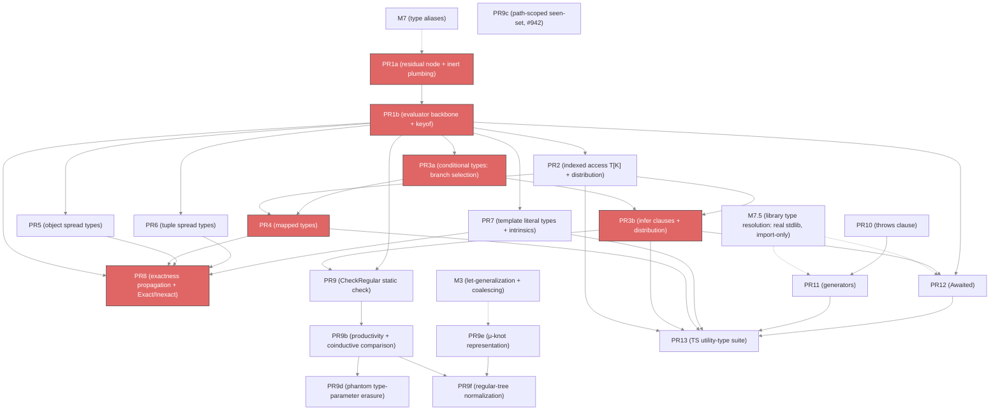

# M9 implementation plan — Type-level operators

This plan covers **M9 — Type-level operators** as listed in
[01-milestones.md](01-milestones.md). It is a PR-by-PR breakdown, modeled on the
[M4](m4-implementation-plan.md), [M5](m5-implementation-plan.md), and
[M6](m6-implementation-plan.md) plans: it records what prior milestones shipped,
the genuine delta M9 adds, the sequencing, the per-PR design with file
references, and a dependency graph.

M9 is the last MVP milestone and the largest by surface. It adds the full
type-level operator suite — `keyof`, indexed access, conditional types with
`infer`, mapped types, object and tuple spread types, and template literal types
— plus two orthogonal function-signature effects (`throws` and generators), all
resting on a shared **type-level evaluator** with a recursion-safe termination
strategy. The reduction architecture is settled: **Baseline-D** reduces an
operator as soon as its operands are ground, and **Design-A** keeps a
not-yet-ground operator as an inert residual node that reduces after coalescing.
Both are already prototyped in the spike ([internal/simplesub/typeops.go](../../internal/simplesub/typeops.go),
[residual.go](../../internal/simplesub/residual.go)); M9 promotes them onto the
production `soltype`/`solver` packages.

## What "operator" means here

A **type-level operator** is a type expression that *computes* a type from other
types rather than naming one directly. `keyof {x: number, y: string}` computes
the union `"x" | "y"`; `Pick<T, K>` computes a smaller object type. These are
distinct from the value-expression constraint solver: they are pure reductions
over already-formed types, with no inference variables in their results. The
milestone's job is to represent them, reduce them, and thread exactness through
the reduction.

## Prerequisites: M7 and M7.5 must land first

M9 builds directly on **M7 — Type aliases** and **M7.5 — Library type
resolution**. Three deliverables across those two milestones are hard
prerequisites:

1. **A generic type-alias representation in `soltype` (M7).** Today `soltype` has
   no alias node at all — [infer_enum.go:12-17](../../internal/solver/infer_enum.go)
   records "soltype has no type aliases yet (M7)", and
   [type_ann.go:21](../../internal/solver/type_ann.go) resolves only the single
   hardcoded `Promise<T>` reference, reporting every other `TypeRefTypeAnn` as
   unsupported. M9's operators are almost always written *as* generic aliases
   (`type Pick<T, K> = ...`), so the alias node, its type parameters, and
   scope-driven `TypeRef` resolution must exist first. M7 adds them.
2. **Alias instantiation and expansion (M7).** The evaluator reduces `Pick<Person,
   "name">` by instantiating `Pick`'s body with the arguments and reducing the
   result. That instantiate/expand step is M7 infrastructure.
3. **Real stdlib types and the index-signature representation (M7.5).** `Awaited<T>`
   needs the real `Promise<T>`; generators need `Generator<Y, R, TNext>` /
   `AsyncGenerator<…>`; the utility-type suite is checked against the real `.d.ts`
   shapes. Since M7.5 is import-only — there is no ambient global lib — the utility
   definitions and tests import these names from `std:*` / `web:*` / `node:*`. M7.5
   also **introduces the `IndexSignatureElem` representation**, because its ingested
   library types carry index signatures; M9 PR4 only *produces* and *reads* them, so
   the dependency runs one way (M7.5 → M9) — M9 introduces no artifact M7.5 needs.
   M2 seeded opaque placeholders; M7.5 swaps in the real structures, and M9 follows
   so it can rely on them.

The AST nodes M9 consumes already exist:
[`KeyOfTypeAnn`](../../internal/ast/type_ann.go),
[`TypeOfTypeAnn`](../../internal/ast/type_ann.go),
[`IndexTypeAnn`](../../internal/ast/type_ann.go),
[`CondTypeAnn`](../../internal/ast/type_ann.go),
[`InferTypeAnn`](../../internal/ast/type_ann.go),
[`MappedTypeAnn`](../../internal/ast/type_ann.go),
[`TemplateLitTypeAnn`](../../internal/ast/type_ann.go), and
[`IntrinsicTypeAnn`](../../internal/ast/type_ann.go) are all defined and
visitable. What is missing is the `soltype` representation, the reduction, and
the `resolveTypeAnn` arms that today fall through to `reportUnsupported`. Two
sibling annotation nodes are **out of scope** and stay unsupported: `MatchTypeAnn`
(the `match`-type surface the old checker never lowered — an alternative to
`CondTypeAnn`, not a parity gap) and `ImportTypeAnn` (`import("mod").T`, also
unsupported in the old checker; real imports cover the need).

## Spike provenance

The spike has already de-risked every hard part of M9. This plan promotes proven
spike work rather than inventing it:

- **Baseline-D operators** — [typeops.go](../../internal/simplesub/typeops.go):
  the `TypeEvaluator` over `TyExpr`, reducing `keyof` / indexed access /
  conditional-with-`infer` / union distribution when operands are ground, with
  the cycle cache plus depth budget for recursive aliases.
- **Design-A residual nodes** — [residual.go](../../internal/simplesub/residual.go):
  an operator whose operand is usage-inferred stays an inert `ResidualOp` that
  carries no bounds and is never touched by `constrain`, then reduces at
  coalescing once its operand has a concrete shape. Its defining property is that
  it adds **no new mutable solver state**.
- **CheckRegular** — [regularity.go](../../internal/simplesub/regularity.go): the
  optional level-2 static check that rejects *expanding* recursion at definition
  time, accepting `List` / `Json` / `DeepPartial` and rejecting `Grow`. PR9 lands
  it, and PR9b replaces its condition with productivity.
- **The lazy/coinductive alternative** — [lazy.go](../../internal/simplesub/lazy.go):
  an Amadio–Cardelli seen-set that decides regular recursive subtyping with no
  budget. M9 keeps the eager evaluator as the backbone and borrows the
  coinductive seen-set only where recursive-vs-recursive comparison needs it,
  which is PR9b.

## What M9 adds (the delta)

1. **A residual type-operator representation in `soltype`.** New inert nodes —
   `KeyofType`, `IndexType`, `CondType` (with an `InferVar` binding form),
   `MappedType`, `ObjectSpreadType`, `TupleSpreadType`, `TemplateLitType` — that
   flow through `constrain` / `coalesce` / `extrude` / `LevelOf` / the visitor /
   the printer without being touched, exactly as `ResidualOp` does in the spike.
2. **A `TypeEvaluator`** with the two-part termination strategy (cycle cache keyed
   on the `(alias, evaluated-args)` instantiation state, plus a depth budget) and
   two invocation sites: **eager** at `resolveTypeAnn` when operands are ground,
   and **post-coalesce** for operands that only ground after the value solve.
3. **Per-operator reduction rules** for each node above, including distribution
   over unions, `infer`-variable binding by structural match, mapped-type modifier
   and `as`-remapping semantics, the Flow-faithful object-spread union rule, and
   the `IndexSignatureElem` a primitive-key mapped type reduces to.
4. **`typeof v` type queries**, resolved at annotation time against the value scope
   (not a residual), porting the old checker's `resolveTypeOfQualIdent` — the
   value→type bridge `keyof typeof x` needs.
5. **Exactness propagation through reduction** — the first milestone where
   exactness is *computed by* an operator, not merely checked — plus the
   `Exact<T>` / `Inexact<T>` intrinsics.
6. **A definition-time recursion check.** `CheckRegular` first, rejecting an alias
   whose recursion grows one of its own parameters, then the productivity condition
   that supersedes it and the coinductive comparison the types it newly accepts
   require.
7. **`FuncType.Throws` and `FuncType.Yields` fields** with parallel arms in
   `constrain` / `extrude` / `LevelOf` / the printer, plus per-body inference
   variables that accumulate lowers from `throw e` / `yield e`.
8. **The TS utility-type suite** (`Pick`, `Omit`, `Partial`, …, `Awaited`,
   `Record`, `Capitalize`) as end-to-end verification, defined in Escalier and
   asserted to match TS reductions.

---

## PR-by-PR breakdown

Twenty PRs across five tracks. Track A builds the evaluator and the core
operators in dependency order. Track B adds spread and template-literal
operators, which hang off the backbone but are independent of each other. Track C
adds exactness propagation and the recursion static-check. Track D is the two
function-signature effects, which touch `FuncType` and not the evaluator at all,
so it runs fully in parallel with A–C. Track E is the capstone verification.

The two heaviest concerns — the evaluator backbone and the conditional/`infer`
matcher — are each split in two so no single PR carries both a new representation
and a new algorithm: PR1a/PR1b and PR3a/PR3b below.

Sixteen of the twenty were planned up front. PR9c through PR9f were added to Track C
after PR9b's review, which turned up one soundness question, one wrong answer, and one
representation the milestone assumed exists. They are described together in "the
recursion-safety follow-on group" below.

### PR1a — Residual-node representation + inert plumbing

The representation half of the backbone: a residual operator node that flows
through the solver untouched, before any evaluator exists to reduce it.

**Data structures.**
- `soltype`: add a residual operator node kind, starting with
  `KeyofType{Operand Type, exact bool}`, plus the shared inert-node contract:
  `isType()`, a visitor arm ([soltype/visitor.go](../../internal/soltype/visitor.go)),
  a printer arm rendering `keyof T` ([soltype/print.go](../../internal/soltype/print.go)),
  and `LevelOf` returning the operand's level. Model the node on the spike's
  `ResidualOp` ([residual.go](../../internal/simplesub/residual.go)) — it holds no
  bounds and is never a `constrain` participant.

**Algorithms.**
- **Inert arms in `constrain` / `extrude` / `coalesce`.** A residual node is passed
  through untouched, never decomposed — the "adds no new mutable solver state"
  invariant. This is the plumbing every later operator relies on; landing it alone,
  with one node kind, keeps the diff to the hot paths small and reviewable.

**Wiring.** `resolveTypeAnn` arm for `*ast.KeyOfTypeAnn`
([type_ann.go](../../internal/solver/type_ann.go)) that builds the **unreduced**
residual node; prov recording; printer.

**`typeof v` type queries land here too.** `typeof v` is the value→type bridge the
canonical `keyof typeof x` relies on, so it lands alongside the `keyof` wiring. It
is **not** a residual — a `resolveTypeAnn` arm for the `typeof` annotation looks the
name up in the **value** scope, walks any member chain (`typeof p.x`), and returns
that value's type directly, porting the old checker's `resolveTypeOfQualIdent`
([expand_type.go](../../internal/checker/expand_type.go)). No reduction, no residual
node — a resolution-time lookup.

**Accept.** `keyof T` for a type parameter `T` round-trips as a residual — renders
`keyof T` and flows through `constrain` / `coalesce` without being decomposed or
crashing (no reduction yet; that is PR1b). `typeof v` for a `val v = {a: 1}`
resolves to `{a: number}` at annotation time.

**Depends on** M7 (the alias representation the residual's operand may name).

### PR1b — Evaluator backbone + `keyof` reduction

The algorithm half: the evaluator that reduces the PR1a node.

**Data structures.**
- `solver`: a `TypeEvaluator` (new `internal/solver/typeops.go`) holding the alias
  environment, the cycle cache (`map[instantiationKey]soltype.Type`), and the
  depth budget. Promote the structure from
  [typeops.go](../../internal/simplesub/typeops.go).

**Algorithms.**
- `reduce(t soltype.Type) soltype.Type` — the evaluator's core. Walks the operator
  tree; an operator reduces only when every operand is **ground** (no unresolved
  `TypeVarType`, no unreduced residual sub-operand). `keyof` reduction matches the
  old checker's `KeyOfType` case
  ([expand_type.go](../../internal/checker/expand_type.go)): an `ObjectType` /
  `ClassType` projects its property/getter/setter keys and folds in an index
  signature's key type; a `TupleType` yields its numeric indices plus `"length"`;
  `keyof` distributes over a union or intersection target; `keyof` of a primitive
  or `never` / `unknown` is `never`; and `keyof` of a type variable or a
  not-yet-ground operand stays the residual `KeyofType`.
- The **two-part termination strategy** (promoted verbatim from the spike): the
  cycle cache emits a symbolic back-reference when an `(alias, args)` state
  recurs, giving the finite knot for a regular recursive type; the depth budget is
  the catch-all for unbounded growth. This is where `reduce` becomes safe over a
  recursive alias; `CheckRegular` (PR9) later rejects the expanding cases up front.
- **Two reduction sites.** Eager: `resolveTypeAnn` calls `reduce` on the operator
  it builds, so a ground `keyof {…}` reduces immediately (Baseline-D). Post-solve:
  a coalescing-time sweep reduces any residual whose operand has become concrete
  (Design-A). Wire the sweep into [coalesce.go](../../internal/solver/coalesce.go)
  at the point the spike marks — [coalesce.go:213](../../internal/simplesub/coalesce.go)
  ("a type operator left inert during the value solve reduces here").

**Accept.** `keyof {x: number, y: string}` ⇒ `"x" | "y"`; `keyof` over a
usage-inferred operand (`fn f(x) { x.a; x.b; keyof typeof x }`) reduces to `"a" |
"b"` post-solve; `keyof` of an operand that never gains structure stays symbolic.

**Depends on** PR1a (the node and its inert plumbing).

### PR2 — Indexed access `T[K]` + distribution over union keys

**Data structures.** `soltype.IndexType{Target, Index Type, exact bool}` with the
same inert-node contract as PR1a.

**Algorithms.**
- Indexed-access reduction: `{…}[k]` looks up field `k`; a tuple `[…][n]` selects
  element `n`; `T[keyof T]` yields the union of all value types; an object carrying
  an index signature (PR4) resolves a primitive-typed `K` to the signature's value
  type.
- **Distribution:** when `Index` reduces to a union, the access distributes —
  `T["a" | "b"]` ⇒ `T["a"] | T["b"]`. This is the same distribute-over-union
  mechanism conditionals reuse in PR3b.
- Errors carry typed `soltype.Type` references and assert full messages: an
  out-of-range tuple index and an unknown object key each get their own
  `SolverError` struct, modeled on [errors.go](../../internal/solver/errors.go).

**Wiring.** `resolveTypeAnn` arm for `*ast.IndexTypeAnn`.

**Depends on** PR1b (evaluator + `keyof`, since `T[keyof T]` is the canonical
combination).

### PR3a — Conditional types: branch selection

The subtyping-decision half of conditionals, without `infer` or distribution.

**Data structures.** `soltype.CondType{Check, Extends, Then, Else Type}`, an inert
residual node with the PR1a contract.

**Algorithms.**
- **Branch selection.** Decide `Check <: Extends` via an assignability probe —
  reuse the M6 `probe` journal ([probe.go](../../internal/solver/probe.go)) so a
  speculative match rolls back cleanly. Ground operands decide eagerly and reduce
  to `Then` or `Else`; a non-ground `Check` stays a residual `CondType` reduced
  post-coalescing.

**Wiring.** `resolveTypeAnn` arm for `*ast.CondTypeAnn` whose `extends` operand
holds no `infer`; an `*ast.InferTypeAnn` reports unsupported until PR3b.

**Accept.** `T extends string ? A : B` with a ground `T` reduces to the matching
branch; a non-ground `T` stays a residual `CondType` that reduces post-coalescing.

**Depends on** PR1b.

### PR3b — `infer` clauses + distribution

The structural-matcher half: the part that makes conditionals extract types.

**Data structures.** An `infer`-binding form: the evaluator's structural matcher
records `infer`-named positions into an environment, so `Then`/`Else` resolve
against the captured types. Promote `TyInfer` and the match machinery from
[typeops.go](../../internal/simplesub/typeops.go).

**Algorithms.**
- **`infer` binding by structural match.** Match `Check` against `Extends`
  structurally, binding each `infer U` to the matched position — function
  arg/return, tuple element, constructor return, promise payload. This is the
  Baseline-D structural matcher from
  [typeops.go:274](../../internal/simplesub/typeops.go).
- **Distribution over naked-type-parameter unions.** When `Check` is a bare type
  parameter bound to a union, the conditional distributes member-wise, matching TS
  semantics. Share the distribute helper introduced in PR2.

**Wiring.** `resolveTypeAnn` arm for `*ast.InferTypeAnn` (valid only inside a
conditional's `extends` operand — reject elsewhere with a full-message error).

**Accept.** `T extends (infer U)[] ? U : never` binds `U` to the element type; a
naked type-parameter union distributes member-wise.

**Depends on** PR3a. Reuses PR2's distribute helper.

### PR4 — Mapped types `{[K in Keys]: F<K>}`

**Data structures.** `soltype.MappedType{Key string, Keys Type, Value Type,
ReadonlyMod, OptionalMod Modifier, As Type}` where `Modifier` is
`add | remove | none` mirroring [`ast.MappedModifier`](../../internal/ast/type_ann.go).

**Algorithms.**
- Reduction iterates the `Keys` union; for each key it binds `K`, reduces the
  `Value` expression, and emits a field. The value position routinely uses indexed
  access (`T[K]`), which is why this depends on PR2.
- **Modifier application:** `readonly`/`?` add or remove with `+`/`-`, adjusting
  each emitted field's mutability and optionality.
- **Key remapping via `as`:** the `as` clause reduces per key; a key remapping to
  `never` drops the field. `as`-filtering commonly uses a conditional (`as K
  extends … ? K : never`) — branch selection, not `infer` — which is why this
  depends on PR3a.
- **Index signatures.** A mapped type over a **primitive** key constraint
  (`{[k in string]: T}`) reduces to an `IndexSignatureElem`, the old checker's
  representation ([type_system/types.go](../../internal/type_system/types.go)) that
  a literal-key map cannot express. The `IndexSignatureElem` on `soltype.ObjectType`
  is **introduced in M7.5, not here** — its ingested `web:dom` / `std:*` library
  types carry index signatures and M7.5 lands first, so the dependency runs one way
  (M7.5 → M9) with no cycle. This PR is the first *producer* in user code:
  mapped-type reduction emits one, and Escalier has no hand-written
  `{[k: string]: T}` syntax so that is the only source. `keyof` and indexed access
  (PR1b, PR2) read it, and this PR adds the dynamic-key read inference (`recv[i]`
  against a non-tuple receiver) M7.5 deferred here — a primitive key resolves
  through the index signature rather than a positional slot.
- This is the machinery underlying `Pick` / `Omit` / `Partial` / `Required` /
  `Readonly` / `Record`, verified end-to-end in PR13.

**Wiring.** `resolveTypeAnn` arm for `*ast.MappedTypeAnn`
([type_ann.go](../../internal/solver/type_ann.go)); the printer renders the mapped
and index-signature forms.

**Depends on** PR1b (`keyof` for `Keys`), PR2 (indexed access in the value
position), PR3a (`as`-clause conditional key filtering).

### PR5 — Object spread types `{...A, x: T}`

First-class object spread types, modeled on Flow — TypeScript has no equivalent.

**Data structures.** `soltype.ObjectSpreadType{Operands []Type}` where an operand
is either a spread (`...A`) or an explicit field.

**Algorithms.**
- Reduction merges operands left to right, **rightmost field winning** on overlap;
  stays residual when an operand is an abstract type parameter, reduced
  post-coalescing.
- **Flow-faithful optional-field show-through union.** When a later operand's
  *optional* field overlaps an earlier key, the values **union** rather than
  override. Required-in-earlier with optional-in-later yields `T | U` **required**;
  optional with optional yields `(T | U)?`. Concretely, `{...A, ...B}` with `A =
  {k: number}`, `B = {k?: string}` reduces to `k: number | string`, required.
- **Exactness threads from the operand:** a spread of an inexact object is inexact
  (the seed for PR9's propagation work).
- Object rest/spread in **both literals and type annotations** lands here, not M4.
  This PR adds the parser/AST support for object rest/spread if not already
  present.

**Wiring.** `resolveTypeAnn` arm for the object-spread annotation; literal-level
object spread in `inferObj`.

**Depends on** PR1b. Independent of PR2–PR4.

### PR6 — Tuple spread types `[...P, x]`

The positional analogue of PR5.

**Data structures.** `soltype.TupleSpreadType{Elems []TupleElem}` where an element
is a spread or a positional type.

**Algorithms.**
- Reduction splices the operand tuple in when it grounds to a concrete tuple;
  stays residual when the operand is an abstract type parameter, reduced
  post-coalescing.
- Distinct from a typed variadic tail like `[number, ...Array<number>]` — that
  needs `Array` and is an M7.5 concern. M4 already handles the concrete *literal*
  case (`[...pair, 3]` where `pair` is a known tuple); this PR adds only the
  abstract-operand **type**.

**Wiring.** `resolveTypeAnn` arm for the tuple-spread annotation.

**Depends on** PR1b. Independent of PR2–PR5.

### PR7 — Template literal types + string intrinsics

**Data structures.** `soltype.TemplateLitType{Quasis []string, Interps []Type}`.

**Algorithms.**
- Reduction takes the **cartesian product** over interpolated unions, producing a
  union of string-literal types. `` `on${"a" | "b"}` `` ⇒ `"ona" | "onb"`.
- The intrinsic string-manipulation operators `Uppercase` / `Lowercase` /
  `Capitalize` / `Uncapitalize` reduce over string-literal operands and stay
  residual over abstract ones.

**Wiring.** `resolveTypeAnn` arm for `*ast.TemplateLitTypeAnn`; the four
intrinsics registered as built-in operators.

**Depends on** PR1b. Independent of PR2–PR6.

### PR8 — Exactness propagation through operators + `Exact<T>` / `Inexact<T>`

The first milestone where exactness must **propagate through reduction**, not just
be checked. Builds on the exactness flag laid down in M3–M6
([exact-types/requirements.md](../exact-types/requirements.md) §7).

**Algorithms.** Thread exactness through every operator's reduction:
- `keyof T` is exact iff `T`'s key set is exact.
- `T[K]`, conditional results, mapped types, object spread, and template literals
  each derive exactness from their inputs.
- Add the `Exact<T>` / `Inexact<T>` intrinsics: `Exact<{x, ...}>` ⇒ `{x}`,
  `Inexact<{x}>` ⇒ `{x, ...}`. They are themselves type operators, so they slot
  into the evaluator.

**Wiring.** Touches each operator's reduce arm from PR1b–PR7 and the residual
nodes' `exact` fields.

**Depends on** PR1b–PR7 (it threads exactness through every operator, so it lands
once the operators exist).

### PR9 — `CheckRegular` static regularity check

**Algorithms.** Promote [regularity.go](../../internal/simplesub/regularity.go):
an optional level-2 static check that rejects *expanding* recursion up front. An
alias is flagged when a recursive reference into its strongly-connected component
passes a formal parameter nested under a type constructor, so the parameter grows
each lap and the reachable-instantiation set is infinite. It **accepts** regular
recursion (`List`, `Json`, `DeepPartial` on `T[P]`, conditionals recursing on an
`infer` binding) and **rejects** expanding recursion (`Grow<T> = Grow<Array<T>>`)
with a precise definition-time diagnostic.

The check is sound but incomplete — an expanding alias gated on a base-case
conditional terminates yet is still rejected, since deciding otherwise is the
halting problem — so the PR1b depth budget remains the runtime backstop. The two
are complementary: a precise early error where decidable, safe termination always.

**Data structures.** Operates over the alias dependency graph / SCCs
([internal/dep_graph/](../../internal/dep_graph/)); no new `soltype` node.

**Depends on** PR1b (evaluator + cycle cache) and PR3b (conditionals recursing on
an `infer` binding are an accept case). Independent of PR4–PR8.

### PR9b — Productivity check + coinductive comparison

PR9's condition is sound but rejects a family of types that are well defined and
that TypeScript accepts. This PR replaces it with the condition that actually
decides whether a recursive alias denotes a type, and adds the comparison
machinery the newly accepted types need.

Two terms do the work here. Recursion is **productive** when every cycle through an
alias passes under a type constructor in its body, so each lap emits one level of
structure. Recursion is **regular** when the type has finitely many distinct
subtrees, so a finite μ-knot represents it. PR9 checks a proxy for regularity. This
PR checks productivity instead.

The two conditions come apart on exactly the cases that motivate the PR:

- `type Deep<T> = {a: Deep<{b: T}>}` is productive and non-regular. It emits
  `{a: …}` every lap, so `Deep<number>` is a well-defined infinite tree, but its
  payloads are `{b: number}`, `{b: {b: number}}`, and so on, all distinct. PR9
  rejects it. TypeScript accepts it.
- `type Grow<T> = Grow<{a: T}>` is non-productive. No lap emits a constructor, so
  the equation `G(T) = G({a: T})` is satisfied by every constant function and
  pins down no type at all. PR9 rejects it for the wrong reason; this PR rejects
  it for the right one.

**Data structures.** No new `soltype` node. `AliasDef.NotRegular` is renamed
`NotProductive` and keeps its meaning, a marker the evaluator reads to decline
expansion. `NotRegularAliasError` is replaced by a productivity diagnostic that
names the cycle rather than a growing parameter. `constrain` gains the seen-set of
`(sub, super)` pairs described below, threaded the way its existing alias-cycle set
already is.

**Algorithms.**
- **Productivity replaces regularity.** The SCC machinery from PR9 stays as is.
  The nesting walk moves from the arguments of a recursive reference to the
  reference's own position in the alias body: an alias is rejected when some cycle
  returns to it without passing under a type constructor. This accepts `List`,
  `DeepPartial`, the self-referential `type SelfA = {a: SelfA}`, and `Deep`, and
  rejects `Grow` and `type Bad = Bad`. It is the guard condition from coinductive
  type theory.
- **Coinductive comparison.** A non-regular type has no finite normal form, so the
  eager evaluator cannot materialize `Deep<number>` and productivity alone would
  accept a type nothing can use. Promote the Amadio–Cardelli seen-set from
  [lazy.go](../../internal/simplesub/lazy.go): `constrain` records the
  `(sub, super)` pair it is deciding and succeeds when that pair recurs, so
  `Deep<number> <: Deep<number>` closes with no unfolding at all. The eager
  evaluator stays the backbone. The seen-set covers recursive-against-recursive
  comparison, which is the one case with no normal form to compare.
- **Refusing to expand a rejected alias carries over.** PR9 marks a rejected alias
  so the evaluator never expands it, which keeps a diagnostic naming the arguments
  the source wrote rather than ones the expansion had grown. A non-productive alias
  is refused the same way, for the same reason.
- **The expansion budgets stay.** Neither condition bounds a reduction that is wide
  rather than deep. A chain of non-recursive aliases that each spread the one below
  them twice is exponential in the chain length, and no recursion check sees it, so
  `maxExpandDepth` and `maxExpandKeyChars` remain as the backstop.

**Accept.** `type Deep<T> = {a: Deep<{b: T}>}` is accepted and a value checks
against `Deep<number>`. `type Grow<T> = Grow<{a: T}>` and `type Bad = Bad` are
rejected with a productivity diagnostic. Every alias PR9 accepted still passes,
including the DOM-shaped `type Node = {parent?: Node, children: [Node]}`, which
keeps reducing under `keyof`, indexed access, and mapped types.

**Depends on** PR9. Independent of PR4–PR8 and PR10–PR13.

### The recursion-safety follow-on group (PR9c–PR9f)

These four came out of PR9b's review rather than the original plan. PR9b left the
recursion story working but not finished. It inherited one soundness question, introduced
one wrong answer, and assumed a representation that nothing has built. A fourth PR
extends coverage once that representation exists.

The target architecture is already written down, in
[03-references.md](03-references.md) §"Beyond a plain lattice (for context)":

> **Recursive types** are not lattice elements per se; they are handled
> coinductively (Amadio-Cardelli seen-set) with a finite μ-knot representation,
> plus a depth budget for the genuinely non-regular (Turing-complete) residue.

That sentence names three pieces. PR9b landed the coinductive seen-set and the depth
budget. The finite μ-knot representation has no implementation anywhere in `soltype`, so
this group is what closes the gap between the reference design and the code.

Read the group's ordering off the dependency list on each PR rather than off the
numbering. PR9c and PR9d are independent of each other and of PR9e, and PR9f is the only
one that waits on anything in the group.

### PR9c — Path-scoped coinductive seen-set in `constrain`

`constrain`'s seen-set of `(sub, super, mutCtx)` pairs is add-only. The spike's
Amadio–Cardelli port scopes an entry to the current derivation path
([lazy.go](../../internal/simplesub/lazy.go): `s.seen[key] = true` followed by
`defer delete(s.seen, key)`), and so does `coalesce`'s recursion guard
([coalesce.go:102](../../internal/solver/coalesce.go), commented "path-scoped: pop
on the way back up"). `constrain` is the outlier within its own package.

The distinction matters because succeeding by hitting the seen-set is a *conditional*
success: the pair held because the derivation assumed an enclosing goal. If that goal
later fails, the assumption was never discharged and the entry is stale. The union-super
and intersection-sub trial arms already defend against exactly this with `seen.Clone()`,
so the hazard is recognized; the ordinary structural recursion over object properties,
tuple elements, and function parameters shares one `seen` unclone.

Neither option this PR was scoped around survives contact with what the add-only set is
doing. Scoping every entry to the path, the literal spike discipline, causes an
exponential blowup. A chain of aliases 24 deep, where each names the one below it twice,
goes from instant to 41 seconds, because every level asks the same pair at both fields
and nothing memoizes the answer. Declaring the persistence sound is no better, since it
leaves a memo entry claiming a verdict that only held while some enclosing goal was open.
So the two roles the one set was playing get split apart.

**Data structures.** A `seenPairs` carrying two records in place of the single
`set.Set[constraintKey]` threaded through `constrain`. `assumed` holds the pairs whose
derivations are open on the current path, each carrying the depth of the frame that opened
it, and is popped on the way back up. `decided` holds the pairs an earlier
derivation settled without assuming anything outside itself, and outlives it as a memo
table. `Context` gains `shallowestAssumed`, the depth of the shallowest goal the running
derivation has closed an assumption on.

**Algorithms.** A frame promotes its pair to `decided` only when every close its
derivation made was on a goal at or below its own depth. Such a derivation contains those
goals' own derivations, so re-running it anywhere reproduces every step and reaches the
same verdict. A close on a shallower goal leaves the verdict conditional and the pair in
neither record, so a later sibling re-derives it rather than replaying a success that
rested on an assumption nothing discharged.

`constrainNominalWalk`'s superclass-candidate loop was the last arm in the package to
discard a failed candidate's errors while sharing one `seen`. It moves to a clone, like
the union-super and intersection-sub trials. Every arm that rejects a branch also restores
`shallowestAssumed`, so a branch the caller threw away cannot inform the caller's own
promotion check.

`decided` records membership rather than the verdict, so a settled *failure* still reads
as a success when re-asked. That keeps one mistake from being reported once per position,
and it is safe because the first ask's error propagates to the top of the constraint. The
clone-at-every-discard-site discipline is what upholds that invariant. Storing verdicts
instead would need diagnostic dedup downstream, which is a larger change than this PR.

**Accept.** A pair whose derivation closed on a goal above it is absent from `decided`,
so a later sibling asking it re-derives rather than replaying, while a pair that closed
only on itself is memoized and a doubly-referenced alias chain stays linear.

**Depends on** nothing. The seen-set and its canonical alias-identity keying landed in
M7 PR3, so this is independent of the whole operator track and can go first. Tracked as
[#942](https://github.com/escalier-lang/escalier/issues/942).

### PR9d — Phantom type-parameter erasure

PR9b reports an `ExpansionLimitError` for `Deep<number> <: Deep<string>` over
`type Deep<T> = {a: Deep<{b: T}>}`. That is a wrong answer, not a slow path: `T` occurs
only inside the argument of the recursive reference, so it is always one level further
away and never reaches the tree. Both sides are the same infinite type `{a: {a: …}}`,
and TypeScript accepts the assignment in both directions.

A parameter that cannot reach the tree is called *phantom* here. Erasing phantom
arguments from an alias's canonical identity makes `Deep<number>` and `Deep<string>`
intern to one representative, so PR9b's reflexive rule settles the comparison in one
step with no unfolding and no budget.

**Data structures.** A per-parameter relevance marker on `AliasDef`
([aliases.go](../../internal/solver/aliases.go)), computed once per dep_graph component
beside `checkProductive`.

**Algorithms.** A greatest fixed point over the alias reference graph. Start with every
parameter phantom. Mark a parameter relevant when it occurs anywhere other than an
argument of a reference into its own strongly connected component, or when it occurs in
such an argument at a slot whose own parameter is already relevant. Iterate to a fixed
point. Then drop the phantom arguments when `internAlias` renders an identity key.

**Accept.** `Deep<number>` and `Deep<string>` are interchangeable, matching TypeScript.
`type Nest<T> = {here: T, deeper: Nest<{b: T}>}` keeps `T` relevant, so
`Nest<number> <: Nest<string>` still reports the `number` against `string` mismatch it
reports today.

**Depends on** PR9b for the reflexive rule the erasure feeds and the SCC walk it reuses.
Independent of PR9c, PR9e, and the operator track.

### PR9e — μ-knot representation

The representation [03-references.md](03-references.md) names and that `soltype` has
never had. It is owed from M3 rather than new: `coalesce` collapses a cyclic inference
variable to the polarity identity and says so —
[coalesce.go:96](../../internal/solver/coalesce.go), "A precise μ-bound rendering of
such recursion is M3" — and a retained type parameter's cycle renders as a bare
variable, [coalesce.go:380](../../internal/solver/coalesce.go), "a rough μ-reference,
refined in M3's precise μ-rendering". M3 landed; neither rendering did. So an inferred
recursive type has no faithful form today.

An alias's recursive position gets away without one, because the alias name serves as
the μ-variable and expansion ties the knot. That only works when the knot lands on an
instantiation the source wrote, which is the assumption PR9f breaks.

**Data structures.** A recursive-type node in `soltype` carrying a binder and a body,
with the PR1a inert-node contract — `isType()`, a visitor arm, a printer arm, `LevelOf`.

**Algorithms.** Unlike PR1a's residuals the node is not inert, so it needs real arms:
`coalesce` emits it when a path cycle closes rather than degenerating the position,
`constrain` unfolds it, `extrude` handles the binder crossing a level boundary, and
`equalType` compares two knots up to a consistent renaming of their binders, reusing the
`alphaCtx` bijection that already does this for a generic function's type parameters.

**Accept.** An inferred recursive type renders as a μ form instead of `never` or
`unknown`, and two alpha-equivalent knots compare equal.

**Depends on** M3, which has landed. Independent of the whole operator track — it touches
`coalesce`, `constrain`, `extrude`, and the printer, and no evaluator arm.

### PR9f — Regular-tree normalization

The evaluator's active-state guard keys on the rendered instantiation, so it ties a knot
only when an instantiation repeats. An alias can have a regular tree — finitely many
distinct subtrees — while its instantiations never repeat, and the guard misses every
such case. `type H<T> = {a: keyof T, b: H<{c: T}>}` emits `keyof T` at the root and
`"c"` at every level below it, since `keyof {c: X}` is `"c"` whatever `X` is. Two
distinct subtrees, and an instantiation that grows forever.

Keying the guard on the *emitted* node instead of the instantiation ties the knot where
it actually is. That is the normalization Amadio–Cardelli presupposes: their algorithm
decides subtyping for types already presented as finite μ-terms, and nothing in the
compiler currently produces one for this shape.

**Data structures.** None new. PR9e's node is where a found knot goes.

**Algorithms.** Expand one level, abstract the recursive positions to placeholders, and
look for an earlier emitted node with the same abstracted shape. A candidate must be
confirmed by partition refinement rather than by a structural hash, since a hash
collapses `{a: X}` and `{a: Y}` for unrelated `X` and `Y`.

**Accept.** `H<number>` reduces to a finite μ form, and a value checks against it.

The walk converges only when the tree really is regular, so `maxExpandDepth`,
`maxExpandKeyChars`, and `maxUnwrapDepth` all stay as the backstop for the non-regular
residue — the same reservation [03-references.md](03-references.md) makes. PR9d already
covers the phantom-parameter shapes, so this PR's marginal class is aliases whose
parameter genuinely reaches the tree at a bounded depth. Those exist but are contrived,
which is why it sits last: worth building when a real library type demands it, not
before.

**Depends on** PR9e for the knot representation and PR9b for the productivity condition
that lets a non-regular alias through in the first place.

### PR10 — `throws T` clause on functions

Orthogonal to the evaluator. Touches only `FuncType` and the function-inference
walk.

**Data structures.** `soltype.FuncType` gains a `Throws Type` field
([soltype/type.go:201](../../internal/soltype/type.go)), parallel to `Ret`,
defaulting to `never` (⊥) when the source has no `throws` clause.

**Algorithms.**
- **Constraint engine, parallel arms** — the function arm in `constrain` recurses
  `l.Throws <: r.Throws` (covariant); `extrude` recurses into `Throws` with the
  same polarity as `Ret`; `LevelOf` takes the max of params, ret, and throws; the
  printer renders `throws T` after the return type when `T` isn't `never`.
- **Per-body throws inference variable** that accumulates lowers as `throw e`
  statements and calls to throwing functions emit `constrain(thrown, throws_var)`.
- **Throws polymorphism** falls out of M3's let-generalization with no special
  handling — `E` in `<E>(f: () -> T throws E) -> T throws E` is just another
  quantified variable.
- **Open design question to resolve in this PR:** how `try`/`catch` narrows the
  inferred throws of the body. The conservative starting point is the two-variable
  encoding `body_throws <: surrounding_throws ∪ caught_throws`, which fits the
  existing lattice. Integration with the checker's narrowing semantics is the
  actual question to settle before implementation.

**Depends on** M3 only (the function machinery, landed). Independent of the whole
operator track — can start immediately.

### PR11 — Generators (`gen fn` / `yield e` / `yield from g`)

Same shape as `throws`; PR10's arms are the template.

**Data structures.** `soltype.FuncType` gains a `Yields Type` field, covariant in
subtyping, defaulting to `never`.

**Algorithms.**
- A `gen fn () -> R` is internally typed with body return `R` and a
  yields-inference variable accumulating each `yield e`'s type as a lower;
  externally the function's type is `Generator<Y, R, TNext>` — or
  `AsyncGenerator<…>` for `async gen fn` — where `Y` is the coalesced yields
  variable.
- `yield e` requires no special constraint beyond `typeof(e) <: yields_var`; the
  expression itself has type `TNext`.
- `yield from g` requires `g <: Iterable<Y>` and forwards yields.
- The constraint engine extends exactly as `throws` did: parallel arms in
  `constrain` / `extrude` / `LevelOf` / the printer, no new lattice machinery.
- `yield` outside a `gen` context is rejected by the AST walk, not the type rule.

**Depends on** PR10 (the parallel-arm template), M7.5 (the real `Generator<…>` /
`AsyncGenerator<…>` stdlib types). The async-gen + `Awaited<ReturnType<F>>` accept
case additionally rides on PR3b and PR13.

### PR12 — `Awaited<T>`

`Awaited<T>` is a recursive conditional with `infer` that flattens nested
promises. The milestone explicitly lands it here — M3 deliberately left
`Promise<Promise<T>>` un-flattened, deferring the recursive flattening to this
operator.

**Algorithms.** Define `Awaited<T>` as the recursive conditional `T extends
Promise<infer U> ? Awaited<U> : T`, reduced through the PR3b machinery with the
PR1b cycle-cache/budget termination protecting the recursion.

**Depends on** PR3b (conditional + `infer`), PR1b (recursion termination), M7.5
(real `Promise<T>`). Separated from PR13 because it is a real feature the async
story in PR11 depends on, not just a test.

### PR13 — TS utility-type suite (end-to-end verification)

The capstone. Mostly tests, defining each utility in Escalier and asserting its
reduction matches TS:

- `Pick<T, K>`, `Omit<T, K>` — mapped + indexed access + key filtering via
  conditional `K extends …`.
- `Partial<T>`, `Required<T>`, `Readonly<T>` — mapped-type modifiers.
- `Exclude<U, V>`, `Extract<U, V>`, `NonNullable<T>` — distributive conditional.
- `ReturnType<F>`, `Parameters<F>`, `ConstructorParameters<F>`, `InstanceType<C>`
  — conditional + `infer`.
- `Record<K, V>` — mapped over a key union.
- `Capitalize` / `Uncapitalize` / `Uppercase` / `Lowercase` and a small
  template-literal case (`EventName<K>` ⇒ `` `on${Capitalize<K>}` ``).

**Provisioning under the no-ambient model.** The old checker inherits these
utilities from the bundled TypeScript `lib.es*.d.ts`, resolved as ambient globals.
M7.5 has no ambient lib, so the same definitions — ordinary generic aliases built
from the M9 operators — ship as **importable** stdlib declarations a user pulls
from a `std:*` module. This PR's Escalier definitions are both the verification
corpus *and* the source of those shipped declarations; the operators PR1b–PR12
land are what make them reduce. So M9 does not just verify the utilities, it makes
them expressible at all under import-only resolution.

**Depends on** PR2, PR3b, PR4, PR7, PR12. Verifies the whole operator suite
composes.

---

## Sizing note

Each PR is scoped to a single reviewable concern. The two heaviest — the evaluator
backbone and the conditional/`infer` matcher — are split so neither PR pairs a new
representation with a new algorithm: **PR1a** is the residual node plus its inert
`constrain`/`coalesce`/`extrude` plumbing, **PR1b** is the evaluator and `keyof`
reduction; **PR3a** is conditional branch selection, **PR3b** is the `infer`
structural matcher and distribution. The remaining PRs are each a single operator
or a single function-signature effect, sized comparably to a typical M4/M6 PR.
Mapped types (PR4) and object spread (PR5) are the next-largest — the fiddly
modifier/`as`-remapping semantics and the Flow optional-field union rule
respectively — but each is one self-contained operator and stays within the M4/M6
band. PR10 and PR11 touch only `FuncType` and never the evaluator, so they carry
no operator-track review burden. PR13 is verification-heavy but low-risk; if the
utility corpus balloons it splits cleanly by category (mapped-based,
conditional-based, template-based).

PR9b is the one PR that carries both a condition change and new comparison
machinery, and the two cannot land apart: relaxing the check without the
coinductive seen-set accepts types the eager evaluator cannot materialize, and
adding the seen-set without relaxing the check leaves nothing for it to decide. It
stays within the band because the condition change reuses PR9's SCC walk and the
seen-set is promoted from the spike rather than designed here. If it does need
splitting, the seam is to land the seen-set first as a no-op fast path for
comparisons the evaluator already settles, then flip the condition.

The follow-on group spans a wider size range than the rest. PR9c and PR9d are the two
smallest PRs in the milestone: PR9c is a scoping decision plus the `Remove` that
implements it or the comment that declines to, and PR9d is one fixed point over the
alias graph feeding one existing identity key. PR9e is the largest of the four, because
its node is the first recursive former in `soltype` and, unlike PR1a's residuals, it is
not inert — `constrain`, `coalesce`, `extrude`, and `equalType` each need a real arm, so
PR1a's inert-plumbing cost is its floor rather than its estimate. PR9f is a graph
algorithm in one new file, sized like PR4, and it is the one PR here worth deferring
until a real library type motivates it.

## Dependency graph

```
M7   (type aliases: alias node + generics + scope-driven TypeRef)  ──► PR1a
M7.5 (library type resolution: real stdlib types, import-only)     ──► PR11, PR12

PR1a (residual-node representation + inert plumbing)
 └─► PR1b (evaluator backbone + keyof reduction)
      ├─► PR2 (indexed access T[K] + union-key distribution)
      │    └─► PR4 (mapped types)              ── also needs PR1b, PR3a
      ├─► PR3a (conditional types: branch selection)
      │    └─► PR3b (infer clauses + distribution)   ── also needs PR2
      │         ├─► PR9 (CheckRegular)          ── also needs PR1b
      │         │    └─► PR9b (productivity check + coinductive comparison)
      │         │         └─► PR9d (phantom type-parameter erasure)
      │         └─► PR12 (Awaited<T>)           ── also needs PR1b, M7.5
      ├─► PR5 (object spread types)
      ├─► PR6 (tuple spread types)
      ├─► PR7 (template literal types + intrinsics)
      └─► PR8 (exactness propagation + Exact/Inexact)  ── needs PR1b–PR7

PR9c (path-scoped seen-set, #942)         ── needs nothing; the seen-set landed in M7 PR3

PR9e (μ-knot representation)              ── needs M3 only; owed from M3, not new
 └─► PR9f (regular-tree normalization)    ── also needs PR9b

PR10 (throws clause)                      ── needs M3 only; parallel to everything
 └─► PR11 (generators)                    ── also needs M7.5 (+PR3b/PR12 for the async-gen accept case)

PR13 (TS utility-type suite)              ── needs PR2, PR3b, PR4, PR7, PR12
```

The same graph in mermaid, with the operator-track critical path
(PR1a → PR1b → PR3a → PR3b → PR4 → PR8) highlighted and the landed `M7` / `M7.5`
prerequisites dashed:


```mermaid
graph TD
    M7["M7 (type aliases)"]
    M75["M7.5 (library type resolution: real stdlib, import-only)"]
    PR1a["PR1a (residual node + inert plumbing)"]
    PR1b["PR1b (evaluator backbone + keyof)"]
    PR2["PR2 (indexed access T[K] + distribution)"]
    PR3a["PR3a (conditional types: branch selection)"]
    PR3b["PR3b (infer clauses + distribution)"]
    PR4["PR4 (mapped types)"]
    PR5["PR5 (object spread types)"]
    PR6["PR6 (tuple spread types)"]
    PR7["PR7 (template literal types + intrinsics)"]
    PR8["PR8 (exactness propagation + Exact/Inexact)"]
    PR9["PR9 (CheckRegular static check)"]
    PR9b["PR9b (productivity + coinductive comparison)"]
    PR9c["PR9c (path-scoped seen-set, #942)"]
    PR9d["PR9d (phantom type-parameter erasure)"]
    PR9e["PR9e (μ-knot representation)"]
    PR9f["PR9f (regular-tree normalization)"]
    M3["M3 (let-generalization + coalescing)"]
    PR10["PR10 (throws clause)"]
    PR11["PR11 (generators)"]
    PR12["PR12 (Awaited<T>)"]
    PR13["PR13 (TS utility-type suite)"]

    M7 -.-> PR1a
    M75 -.-> PR11
    M75 -.-> PR12
    M3 -.-> PR9e

    PR1a --> PR1b
    PR1b --> PR2
    PR1b --> PR3a
    PR1b --> PR5
    PR1b --> PR6
    PR1b --> PR7
    PR1b --> PR8
    PR3a --> PR3b
    PR2 --> PR3b
    PR2 --> PR4
    PR2 --> PR13
    PR3a --> PR4
    PR3b --> PR9
    PR1b --> PR9
    PR9 --> PR9b
    PR9b --> PR9d
    PR9b --> PR9f
    PR9e --> PR9f
    PR3b --> PR12
    PR1b --> PR12
    PR3b --> PR13
    PR4 --> PR8
    PR4 --> PR13
    PR5 --> PR8
    PR6 --> PR8
    PR7 --> PR8
    PR7 --> PR13
    PR10 --> PR11
    PR11 --> PR13
    PR12 --> PR13

    linkStyle default stroke:#888
    style PR1a fill:#e06666,stroke:#333,color:#fff
    style PR1b fill:#e06666,stroke:#333,color:#fff
    style PR3a fill:#e06666,stroke:#333,color:#fff
    style PR3b fill:#e06666,stroke:#333,color:#fff
    style PR4 fill:#e06666,stroke:#333,color:#fff
    style PR8 fill:#e06666,stroke:#333,color:#fff
```

### Parallelism

- **Track A** (PR1a → PR1b → PR2/PR3a → PR3b/PR4, plus PR5/PR6/PR7 hanging directly
  off PR1b) is the operator core. PR5, PR6, and PR7 are mutually independent and can
  be built concurrently once PR1b lands.
- **Track C** — PR8 (exactness) is a barrier that waits for all operators; PR9
  (CheckRegular) needs only PR1b + PR3b and runs alongside PR4–PR8. PR9b follows
  PR9 and depends on nothing else, so it can land at any point after it.
- **Track C, follow-on group** — PR9c and PR9e depend on nothing in this milestone and
  can be built alongside PR1a. PR9d needs only PR9b. PR9f is the group's only join,
  waiting on PR9e and PR9b. Suggested order by value rather than by dependency: PR9c
  first, since it is the one soundness question; then PR9e, which pays off an M3 debt
  and unblocks PR9f; then PR9d, which fixes a wrong answer PR9b introduced; PR9f last,
  and only if a real library type needs it.
- **Track D** — PR10 (throws) has no operator dependency and can start on day one
  alongside PR1a; PR11 (generators) follows PR10.
- **Track E** — PR13 is the final join, waiting on PR2, PR3b, PR4, PR7, PR12.

The critical path is `M7 → PR1a → PR1b → PR3a → PR3b → PR4 → PR8`, and — for the
async-generator accept case — `M7 → PR1a → PR1b → PR3b → PR12 → PR13`. The follow-on
group sits off both: nothing in PR1a–PR13 waits on PR9c–PR9f.
