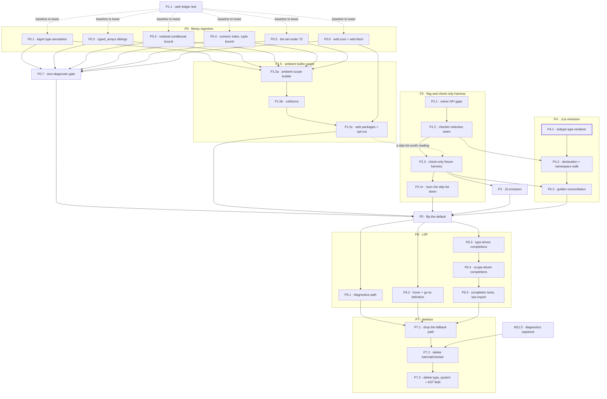

# 01 — Cutover plan

Nine phases, about thirty pull requests. P0 through P5 reach the flip, and P6
and P7 finish the migration. Each phase states what it does not do. The plan
is short because it keeps refusing work the flip does not need.

Every numbered item below is one pull request. A phase that fits in a single
pull request carries no sub-number.

## The two splits this plan makes

**Split the library prerequisite near the `std:` / `web:` line.** M7.5 and
builtins §7 treat clean ingestion of the pseudo-package tree as one gate. The
measurements in [00-current-state.md](00-current-state.md) say the two halves
are nothing alike: `std:*` is four root causes from clean, and `web:*` carries
roughly 2,500 diagnostics concentrated in DOM types.

The split is near the line rather than on it. `web:core` is the shared floor
under every `web:*` sibling at 224 diagnostics, and `fixtures/async_await` needs
`web:fetch`, which reaches it. So the prerequisite is `std:*` plus `web:core`
plus `web:fetch`, and everything behind `web:dom` is not.

**Split the M12 flip from the M12 deletion.** M12 reads as one step: default the
compiler to the solver, retire `internal/checker`, delete the AST's
`inferredType` field. Those have different prerequisites. Defaulting needs
codegen to work. Deleting needs the LSP ported and the diagnostics audit done,
because `cmd/lsp-server` imports `checker` and because M11.5 wants the old
checker's diagnostics as its parity baseline.

Keeping `internal/checker/` in the tree satisfies both and costs nothing but
build time. After P5 it is no longer the compiler's default, and it stays
reachable three ways: through P2's environment variable, through
`cmd/lsp-server`, which imports it until P6, and through its own test suite,
which is M11.5's parity baseline. P7 is what removes it.

## Phase order

Rows are in execution order, so the numbers do not read top to bottom. P1.1 is
first because it is the measurement harness the P0 pull requests report against.

| Order | Phase | Pull requests | Depends on | Parallel within the phase |
| --- | --- | --- | --- | --- |
| 1 | P1 — ledger | P1.1 | — | one |
| 2 | P0 — ingestion | P0.1 … P0.7 | P1.1, softly | P0.1 to P0.6 all independent; P0.7 closes them |
| 2 | P2 — flag and harness | P2.1 … P2.3, then one per skip-list cause | P1.5 for a useful skip list | sequential to P2.3, then parallel |
| 2 | P4 — `.d.ts` emission | P4.1 … P4.3 | P4.1 on nothing; P4.2 on P2.2 | sequential, but P4.1 starts on day one |
| 3 | P1.5 — ambient builtins | P1.5a … P1.5c | P0.1–P0.5, then P0.6 | sequential |
| 4 | P3 — JS emission | P3 | P2.3 | one |
| 5 | P5 — flip | P5 | P0.7, P1.5, P2, P3, P4.3 | one, and atomic by design |
| 6 | P6 — LSP | P6.1 … P6.5 | P5 | P6.1 to P6.3 independent; P6.4 and P6.5 follow P6.3 |
| 7 | P7 — deletion | P7.1 … P7.3 | P6, and M11.5 for P7.2 | sequential |

Four things are worth reading off this table before anything else.

**P1.1 is the first pull request of the plan.** It is the measurement harness, so
each P0 pull request lands as a baseline reduction in one committed table rather
than as an unverifiable claim.

**P4.1 is the long pole and has no dependencies.** The `soltype` type renderer is
roughly 490 lines ported from `dts.go`, it is unit-testable against `soltype`
values alone, and it needs neither the compiler seam nor the fixture harness. It
can start the same day as P1.1 and run alongside all of P0 and P2.

**P1.5 gates P2.3's usefulness, not its existence.** The harness can be built
first, but a skip list seeded before the ambient surface exists is mostly
`Unknown identifier: Math`. Land P1.5 first and the skip list names real solver
gaps instead.

**Three tracks run at once.** P0 is library data quality in `internal/solver` and
the generator. P2 is compiler wiring in `internal/compiler` and `cmd/escalier`.
P4 starts in `internal/codegen`. They share no files.

### The work, and what runs in parallel

The dotted edges are soft. A P0 pull request can land without the ledger; it
just lands without a number attached to it. P2.3 can land without P1.5; its skip
list is then mostly noise.

---

## P0 — Clear the `std:*` ingestion tail, plus `web:core` and `web:fetch`

**Goal.** Every `std:*` package loads with zero diagnostics, and so do
`web:core` and `web:fetch`.

**Work.** Seven pull requests. P0.1 through P0.6 touch different files and can
land in any order or at the same time; P0.7 closes them out. The first five come
from the four root causes in
[00-current-state.md](00-current-state.md)§"What the residual diagnostics
actually are".

**P0.1 — the `bigint` type annotation.** Add the `*ast.BigintTypeAnn` arm to
`internal/solver/type_ann.go`, porting the shape from
`internal/checker/infer_type_ann.go:99`. Clears 137 diagnostics. Three solver
tests assert the current `Unsupported: BigintTypeAnn` message and need updating:
`infer_async_test.go:419` and `:434`, and `infer_throws_test.go:394`.

**P0.2 — bare sibling names in `std:typed_arrays`.** A bare `Int32Array` fails to
resolve inside its own package while `typed_arrays.Int32Array` succeeds. Build a
minimal reproduction first and let it say which side is wrong: the generator
emitting the bare name, in `internal/dts_to_esc/ref_rewrite.go`, or the loader
failing to search a group member's own namespace, in
`internal/solver/stdlib_group_load.go`. If it is the generator, this pull request
also regenerates the affected files. Clears 82 diagnostics.

**P0.3 — a residual conditional against a type parameter's bound.**
`export declare type Omit<T, K: keyof any> = Pick<T, Exclude<keyof T, K>>` at
`internal/interop/data/std/prelude.esc:925` leaves `Exclude` as a residual
conditional, which is then checked against `Pick`'s `K: keyof T` bound instead
of being deferred. This is bound-check ordering in the type-operator evaluator,
not new operator surface.

**P0.4 — a numeric indexed access against a tuple-bounded parameter.**
`static race<T: Array<unknown> | []>(values: T) -> Promise<Awaited<T[number]>>`
at `internal/interop/data/std/prelude.esc:599`, repeated for `any` at 645,
constrains the tuple itself against `number` rather than yielding the element
type.

P0.3 and P0.4 are the two diagnostics `std:prelude` carries, so they reach every
run. Take them first if anything is blocked on a clean baseline.

**P0.5 — the tail under 70.** The `owned-mutable field annotation` reports, the
`typeof of a name that is not a readable value` reports, the two
overload-distinguishability reports, and the inherited-member redeclarations.
Triage each as a solver gap or a generator gap, and file the generator ones
against builtins §6 rather than hand-editing the committed tree, which is
generated output. Split further if the triage finds unrelated causes.

**P0.6 — `web:core` and `web:fetch`.** They are in P0 rather than P1 because
`fixtures/async_await` calls `fetch`, which the old checker supplies ambiently
from `lib.dom.d.ts` and the solver supplies only from `web:fetch`. `web:core` is
the shared floor under every `web:*` sibling, so clearing it moves all ten at
once and shrinks what P1 has to quarantine. Triage its 224 diagnostics before
committing to this scope. If they turn out to be the DOM-name mass rather than a
few root causes, the cheaper answer is to rewrite `fixtures/async_await` to
declare its own `fetch` and move both packages to P1.

**P0.7 — the zero-diagnostic gate.** Replace the P1 ledger's rows for `std:*`,
`web:core`, and `web:fetch` with a test that asserts an empty diagnostic list for
each. Depends on P0.1 through P0.6.

**Gate.** P0.7 passes, so every `std:*` package plus `web:core` and `web:fetch`
loads with nothing reported.

**Not in scope.** Any `web:*` package behind `web:dom`. Regenerating the tree,
except where P0.2 or P0.5 finds a generator gap. Hand-edits to generated `.esc`
files.

---

## P1 — Quarantine `web:*` behind a ledger

**Goal.** Everything behind `web:dom` stops gating anything, without rotting
while parked. `web:core` and `web:fetch` belong to P0, not here.

**P1.1 — the ledger test.** One pull request, and the first of the plan. Commit
the per-package survey from
[00-current-state.md](00-current-state.md)§"How these numbers were taken" as a
real test in `internal/solver`. It loads each package's closure, counts
diagnostics, and compares against a checked-in baseline table. A count that
grows fails. A count that shrinks fails too, with a message saying to lower the
baseline, so improvements land in the table instead of silently widening the
allowance.

Record the top unresolved names alongside the counts. The five DOM names in
[00-current-state.md](00-current-state.md) account for 1,829 of the 2,397
`cannot find type` reports, so a future `web:dom` session starts from a ranked
list rather than a wall.

**Gate.** The ledger test passes at the recorded baseline, and CI runs it.

**Not in scope.** Fixing any `web:*` diagnostic. Deleting or moving any `web:*`
data file, the partition table, the tiering pass, or the loader. See
[02-parked-work.md](02-parked-work.md).

---

## P1.5 — Ambient builtin scope

**Goal.** A program writes `Math.PI`, `console.log`, `JSON.parse`, `parseInt`,
and `Error` with no import, the way it does on the old checker.

**Why this is a phase and not a footnote.** The old checker flattens every lib
file into one global scope. The solver binds a pseudo-package as a namespace, so
the same program has to say `import "std:math"` and then `math.PI` — a different
spelling, not just an added line. Without this phase the flip is a user-visible
language change riding on a checker swap, which is the coupling this whole plan
exists to avoid. See
[00-current-state.md](00-current-state.md)§"How a builtin is reached, on each
checker" for the measured spellings.

This phase does **not** reverse the imports-only decision in M7.5 and builtins
FR1. It is a compatibility surface with a retirement path, so that decision can
be taken on its own schedule instead of being forced by the flip.

**The binding rule is derivable, not hand-written.** Every value-carrying export
in the tree already carries an `@js` decorator naming its runtime path, and
type-only exports carry none because a type has no runtime path. Three rules
cover the whole surface:

1. A type-only export binds ambient under its declared name. `interface Console`
   binds as `Console`.
2. A value export with a bare path binds ambient under that path.
   `@js("parseInt")` binds `parseInt`; `@js("Error")` binds `Error`.
3. A value export with a dotted path binds its last segment into an ambient
   namespace named by the prefix, created on first use. `@js("Math.clz32")` puts
   `clz32` into an ambient `Math`.

Rule 3 is what reconstructs `Math`, `JSON`, `Reflect`, and `Intl` as objects
after the partition dissolved them, and rule 2 is what restores `console`,
`NaN`, `parseFloat`, and the global constructors. Nothing here needs a table
that could drift from the tree.

Rule 2 also routes around
[#1651](https://github.com/escalier-lang/escalier/issues/1651), where
`import "std:console"` followed by `console.log` fails because the package's
derived namespace name hides its own `console` export. The ambient scope binds
that export from its `@js("console")` path, so it never consults the namespace.
That is a side effect, not a fix, and #1651 still owns the explicit-import
spelling.

**P1.5a — the ambient scope builder.** Mint a scope between the prelude scope
and the module scope, and fill it from a configured package list by the three
rules above. `bindPreludeExports` in `prelude.go` is the model for the ambient
half and `bindCoreExports` in `imports.go` for the flat-binding half; this is
those two composed over a list, plus rule 3, which neither has. Scope the list
to `std:*` in this pull request. Depends on P0.1 through P0.5, so the surface it
binds is not also a diagnostic source.

**P1.5b — collisions.** Two packages can claim one global name: `std:url` and
`web:url` both export `URL`. The old checker resolved this by load order, ES
libs then DOM. Pick a policy, state it, and report a diagnostic when two
packages claim one name with different definitions. `CoreImportShadowsDeclarationError`
in `imports.go` is the shape to follow. A module's own declaration still wins
over the ambient surface, as it does for the prelude today.

**P1.5c — `web:core`, `web:fetch`, and the opt-out.** Extend the list to the two
web packages P0.6 clears, which is what makes `fetch` ambient again and keeps
`fixtures/async_await` working without an import. Add a way for a file or a
package to decline the ambient surface, so imports-only can arrive later per
file rather than as a second flip. Depends on P0.6 and P1.5b.

**Cost to watch.** The ambient list loads on every inference run, and a language
server pays it per re-inference. `BenchmarkStdlibClosureLoad` in
`stdlib_load_bench_test.go` already measures exactly this, warm and cold, so
record both figures in P1.5a and again in P1.5c rather than discovering the cost
at P6.

**Gate.** A test asserting that `Math.PI`, `JSON.parse`, `console.log`,
`parseInt`, `NaN`, `Error`, and `fetch` all resolve with no import, and that a
module-level declaration of any of those names shadows the ambient one. The
benchmark's warm and cold figures are recorded.

**Not in scope.** `web:dom` and everything behind it, which stays parked; the
ambient list only covers what P0 has cleared. The builtins §9 trigger map, which
is the eventual replacement for this phase rather than part of it.

---

## P2 — Solver behind a flag, with a check-only fixture harness

**Goal.** Find out what the solver actually rejects in real Escalier code,
before any codegen work is spent.

**Work.** Three pull requests, then one per cause the harness turns up. P2.1
through P2.3 are strictly sequential; each one is the thing the next needs.

**P2.1 — the solver API gaps.** Close the two gaps the compiler path needs, from
[00-current-state.md](00-current-state.md)§"Gaps between the solver's API and the
compiler's needs": a lib-scope argument on `InferScript`, so a `bin/` script
checks against the library module's scope, and the dep graph on `ModuleResult`,
which codegen takes. Both live in `internal/solver` and touch nothing else.
Third-party `.d.ts` ingestion and JSX inference are the other two gaps and are
**not** needed here; both are parked in
[02-parked-work.md](02-parked-work.md).

**P2.2 — the checker-selection seam.** Add a solver path at the five
`checker.NewChecker` sites in `internal/compiler/compiler.go`, selected by one
environment variable. The `type_system.Namespace` in the public signatures of
`CheckBinScript`, `CompileScript`, and `collectUsedLibSymbols` is what resists
this. The cheapest shape is a small interface or a per-checker pair of entry
points, not a `soltype` to `type_system` bridge, which this plan never builds.

**P2.3 — the check-only fixture harness.** M8 phase 1: a sibling to
`cmd/escalier/fixture_test.go` that runs the solver over every fixture and
asserts accept or reject, with no codegen and no `build/` comparison. Give it a
per-fixture skip list, seeded with everything that fails on day one. The seeded
list is this pull request's real output, because it is the first honest measure
of what the solver cannot yet check. Land P1.5 first, or most of that list is
`Unknown identifier: Math` rather than a solver gap.

**P2.4 and up — burn the skip list down.** One pull request per cause, and they
parallelize once P2.3 has named them. Two causes are known from the milestone
plans and may or may not bite: M6 PR7, which is `if`-`val` and `val`-`else`, and
M9 PR9f, which is regular-tree normalization.

**Gate.** The skip list is empty, or every remaining entry is a triaged intended
improvement with a note naming why the divergence is right.

**Not in scope.** Codegen. `build/` goldens. The LSP. Changing the default
checker. Adding imports to fixtures, which is P5.

---

## P3 — JS emission on the solver

**Goal.** `BuildTopLevelDecls` produces identical JS from solver results.

**Work.** Replace the five `InferredType()` read sites in
`internal/codegen/builder.go` and `js_lowering.go` with `Info` lookups. They ask
five questions, all expressible over `soltype`: is the callee a nominal object,
does it carry a constructor element, is this expression a function, does an
optional-chaining target's union include `null` or `undefined`, and is a member
expression's object a namespace. `js_lowering.go` also reads the AST's
`BindingOwner` field, which P7 re-homes.

The emitter is otherwise driven by the AST and the dep graph, which are
checker-agnostic, so this is a narrow change rather than a port. That is why P3
carries no sub-number: five call sites in two files is one pull request. Split it
only if the golden comparison below turns up diffs that need their own
investigation.

**Depends on** P2.3, for a harness to compare against.

**Gate.** Every fixture's `build/lib/index.js` and `index.js.map` is
byte-identical under both checkers. Extend the P2 harness to compare them.

**Not in scope.** `.d.ts`. `self_type_utils.go`, which serves `.d.ts` alone.

---

## P4 — `.d.ts` emission on the solver

**Goal.** `BuildDefinitions` produces `.d.ts` from solver results.

**Work.** The largest piece of the cutover, in three pull requests.
`BuildDefinitions` takes a `type_system.Namespace` and renders through
`buildTypeAnn(type_sys.Type)`, so the split follows that seam: the renderer
first, then the walk that calls it, then the goldens.

Write a `soltype` twin of `buildTypeAnn` rather than a `soltype` to
`type_system` bridge. A bridge would have to reconstruct a representation the
whole migration exists to retire, and it would keep `type_system` alive past P7.

**P4.1 — the `soltype` type renderer.** Port the type-driven half of `dts.go`:
`buildTypeAnn` at 186 lines, `buildObjTypeAnnElems` and `buildObjTypeAnnElem` at
94, `buildFuncTypeAnn` and `funcTypeToParams` at 46, `buildTypeAnnObjKey` at 37,
`patToPat` at 24, `litToLit` at 18, `mapMappedModifier` at 16, and
`convertQualIdent` at 12, plus all 53 lines of `self_type_utils.go`, which
rewrites `Self` to `this`. Roughly 490 lines.

This pull request has **no dependencies at all**. It takes `soltype` values and
returns codegen `TypeAnn` nodes, so it is unit-testable on its own and needs
neither the compiler seam nor a fixture. Start it on day one.

`internal/soltype/print.go` already renders every `soltype` former for
diagnostics. It emits Escalier syntax rather than TypeScript, so it is a
reference for the case analysis rather than something to reuse.

The `*FromAST` functions stay as they are. `buildObjTypeAnnElemFromAST`,
`buildTypeAnnObjKeyFromAST`, `mapASTMappedModifier`, `buildFuncTypeAnnFromAST`,
and `astPatToPat` are roughly 184 lines already driven by the AST, so they are
checker-agnostic and need no port.

**P4.2 — the declaration and namespace walk.** Retarget `BuildDefinitions` at
102 lines, `buildDeclStmt` at 519, `buildNamespaceDecl` at 44, and `findNamespace`
at 19 onto the solver's `Scope` and `Namespace`, calling P4.1's renderer. Depends
on P4.1 and on P2.2 for the seam that hands it solver results.

**P4.3 — golden reconciliation.** Extend the P2.3 harness to compare
`build/lib/index.d.ts` across every fixture, and work the diffs down. Depends on
P4.2 and P2.3. This is where the surprises land, so keep it separate from the
port.

**Gate.** Every fixture's `build/lib/index.d.ts` is byte-identical, or its diff
is triaged and recorded.

**Not in scope.** The `@escalier-type` JSDoc round-tripping for exactness and
the value-level `exact<T>(v)` lowering, both of which M10 owns and neither of
which the current fixtures exercise.

---

## P5 — Flip the default

**Goal.** `internal/solver` is the checker the compiler runs.

**Work.** One pull request, and it has to stay one. The three changes below are
atomic with each other, because the fixture tree cannot be green on both checkers
in between.

1. Default the environment variable from P2 to the solver, keeping the old
   checker reachable by setting it the other way.
2. Fix up whatever fixtures P1.5 did not cover. With the ambient scope in place
   most of the 18 fixtures that name `console`, `String`, `Date`, `Number`, or
   `Object` need no change at all, because those names bind ambiently again.
   Anything left over is rewritten here, and it rides in the same commit as the
   default change, because the old checker cannot resolve `std:` imports against
   the committed tree. That is why both existing stdlib fixtures are marked
   `DISABLED`, and it is the one place this plan accepts a moment where the two
   harnesses cannot both be green on the same tree.
3. Re-enable `fixtures/stdlib_import_local` and
   `fixtures/stdlib_import_class_via_namespace` by removing their `DISABLED`
   markers. Builtins §7 also records four disabled `TestStdlibImport_*` tests;
   those now run against a `t.TempDir` tree rather than the committed one, so
   confirm which of §7's disablements are still live before acting on that note.

**Gate.** `go test ./...` passes with the solver as the default. The old-checker
harness is retired in the same commit, not kept limping.

**Not in scope.** Deleting anything. `internal/checker`, `internal/type_system`,
the AST's `inferredType` field, and `internal/checker/tests` all stay, compiled
and tested, as the parity baseline M11.5 needs.

---

## P6 — LSP on the solver

**Goal.** `cmd/lsp-server` stops importing `internal/checker`.

**Work.** M11, in five pull requests. 86 non-test references, 76 of them in
`completion.go`, plus 51 in `completion_test.go`. The LSP runs on the old checker
from P5 until P6.5 lands, which is safe because both packages are in the tree.

The split follows where the references sit. P6.1, P6.2, and P6.3 touch different
files or different regions of `completion.go` and can run in parallel. P6.4 and
P6.5 follow P6.3 because they edit regions it has already moved.

**P6.1 — the diagnostics path.** `text_document.go`'s `validate`,
`validateBinScript`, `validateFull`, `publishDiagnosticsForScript`, and
`filterOutTypeErrors` thread `checker.Error`. Retarget them at the solver's
error type. Nine references.

**P6.2 — hover and go-to-definition.** `textDocumentHover` reads
`node.InferredType()` at four places. Move them to the solver's `Info` side
table. This one also has to land before P7.3, which deletes the AST field those
reads use.

**P6.3 — type-driven completions.** `completionsFromType` and its family —
`completionsFromTypeImpl`, `completionsFromObjectType`, `completionsFromNamespace`,
`completionsFromUnionType`, `completionsFromIntersectionType` — plus the
rendering helpers at the end of the file: `safeTypeString`,
`completionKindForValueType`, `completionKindForTypeAlias`, `primWrapperName`,
`stripNullUndefined`, and `isNullOrUndefined`. 53 references, the largest single
block.

**P6.4 — scope-driven completions.** `buildPreludeCompletions`,
`buildScopeCompletionsNoDetail`, `getPreludeCompletions`, `completionsFromScope`,
`completionsFromModuleScope`, `collectScopeTypeBindings`, and
`typeCompletionsFromScope` all take a `*checker.Scope`, as does `main.go`'s
`preludeScope` field. 17 references.

**P6.5 — the tests and the last import.** Port `completion_test.go`'s 51
references and `testmain_test.go`'s 2, then delete the `checker` and
`type_system` imports from `cmd/lsp-server`.

**Gate.** No `checker` or `type_system` import under `cmd/lsp-server`, and the
existing LSP tests pass.

---

## P7 — Deletion

**Goal.** Finish M12.

**Work.** Three pull requests, strictly sequential: stop referring to the old
checker, delete it, then delete the representation it carried.

**P7.1 — drop the fallback path.** Remove P2.2's environment variable and the
old-checker branch at the five compiler entry points, leaving one path. Depends
on P6, so nothing outside `internal/checker` still reaches it.

**P7.2 — delete `internal/checker`.** Remove the package and
`internal/checker/tests`. Before this lands, port the assertions
[02-parked-work.md](02-parked-work.md)§"What keeps the first two honest" names,
so the `node_modules` and JSX gaps stay asserted rather than disappearing with
the old checker's test files. Depends on M11.5, whose audit wants the old
checker's diagnostics as its parity baseline.

**P7.3 — delete `internal/type_system` and the AST field.** Remove the package,
re-home the two names `internal/ast` still carries — `type_system.Type` and
`type_system.BindingOwner` — and delete the `inferredType` field, its
`InferredType` and `SetInferredType` accessors, the
`type Type = type_system.Type` alias, and `tools/gen_ast`'s generation of the
field. This is what leaves the AST type-system-agnostic.

`internal/simplesub` needs nothing here. Its `doc.go` and `differential_test.go`
name `internal/checker` in prose only; the package does not import it, and its
expected strings are hardcoded.

**Not in scope.** Anything in [02-parked-work.md](02-parked-work.md).

---

## What this plan deliberately leaves undone at the flip

Stated plainly so nobody reads P5 as "the migration is finished":

- Everything behind `web:dom` ingests with roughly 2,500 diagnostics, so a
  program importing one of those packages gets a wall of noise, and P1.5 cannot
  put those names in the ambient scope either. A program writing `document` or
  `Element` today has nowhere to get them after the flip. The ledger from P1 is
  the honest record. Everything P0 clears does stay ambient, so this is the DOM
  proper rather than the whole builtin surface.
- Third-party `.d.ts` ingestion does not work on the solver. A program importing
  from `node_modules` does not type-check.
- JSX does not type-check on the solver. `internal/solver` has no JSX handling
  at all, and JSX reaches `@types/react` through the same resolver chain, so it
  is downstream of the previous item.

  `node_modules` and JSX have no fixture coverage, so P2's harness will not flag
  either. All three losses are parked rather than dropped;
  [02-parked-work.md](02-parked-work.md) says how each is kept asserted.
- The per-file shape loader, builtins §9, does not exist. P1.5's ambient scope
  covers the common case it was meant to serve, so what is missing is the lazy
  part: a file pays for the whole ambient list rather than for the packages its
  literals actually reach.
- Diagnostics quality has had no cross-cutting pass. M11.5 still owes that.
