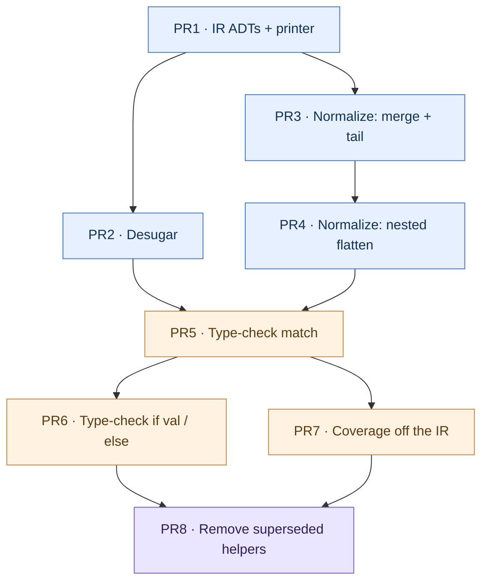

# UCS conditional-normalization IR — Implementation Plan

This plan implements Phase 1 of the MLstruct rework-minimization plan,
[issue #882](https://github.com/escalier-lang/escalier/issues/882), scoped to
`internal/solver`. It sequences the work into dependency-ordered pull requests,
each sized to be reviewable on its own. The follow-up is Phase 2,
[issue #883](https://github.com/escalier-lang/escalier/issues/883), the MLstruct
graft that reuses this IR.

## What UCS gives us

The design adopts the desugar-then-normalize pipeline from "The Ultimate
Conditional Syntax" (Cheng & Parreaux, OOPSLA 2024). Three terms recur below:

- **Desugared core.** A small term language the rich conditional surface lowers
  into. It has one `Split` node that tests a scrutinee against a sequence of
  branches, `Bind` nodes for intermediate bindings, guard tests, and leaf nodes
  that hold an arm body. The core still carries nested patterns.
- **Normalized form.** A backtracking-free rewrite of the core. Nested patterns
  are flattened into successive scrutinee splits, so each split tests exactly one
  tag-level of one scrutinee and hands its sub-scrutinees to inner splits. The
  checker then reasons about one tag-level at a time instead of walking deep
  nesting.
- **Scrutinee.** The value a split tests. The top-level scrutinee is the match
  target. A nested split's scrutinee is a projection of an outer one, for example
  the field `x` of an object the outer split already matched.

The normalized form is the shared IR for type checking, coverage checking, and
later codegen. Phase 1 builds it and drives type checking and the interim
top-level coverage check off it. Comprehensive nested-match exhaustiveness rides
Phase 2 (#883) via the negation algebra, not this work.

## Worked examples

These show the two lowering stages the PRs below build: PR2 produces the
desugared core, PR3 and PR4 produce the normalized form. The notation is
illustrative, not the printer's final output.

- `split <scrutinee> { <test> => <cont> }` tests a scrutinee against branches.
- The desugared core keeps a branch's source pattern whole, written `pat …`, and
  writes a fallthrough arm as `else`.
- The normalized form replaces each pattern test with a one-tag-level test, binds
  the leaves it introduces with `bind <name> = <path>`, and moves the catch-all or
  fallthrough into a `default <tail>`. A projection path such as `l.start` names a
  sub-scrutinee. A split with no covering branch has an empty tail, written `✗`.

### A literal match

The catch-all arm becomes the split's default tail.

```
match n {
    1 => "one",
    _ => "other"
}
```

```
# desugared core (PR2)          # normalized form (PR3)
split n {                       split n {
    pat 1 => leaf "one"             1 => leaf "one"
    pat _ => leaf "other"       } default leaf "other"
}
```

### A nested pattern

The source pattern `Line { start: {x, y} }` is one deep shape in the core. PR4
flattens it into a split on `l`, then a split on the projected `l.start`, so the
checker only ever sees one tag-level.

```
match l {
    Line { start: {x, y} } => [x, y]
}
```

```
# desugared core (PR2)                    # normalized form (PR4)
split l {                                 split l {
    pat Line { start: {x, y} }                Line => split l.start {
        => leaf [x, y]                            {x, y} => bind x = l.start.x,
}                                                           y = l.start.y;
                                                           leaf [x, y]
                                              } default ✗
                                          } default ✗
```

### A guard

The guard lowers to a test inside the bound branch, after the leaves bind, so it
can read `x` and `y`. On failure it falls to the split's tail, never to a sibling
arm. This is why a guarded arm covers nothing for exhaustiveness.

```
match p {
    {x, y} if x > y => x,
    _              => 0
}
```

```
# desugared core (PR2)              # normalized form (PR3)
split p {                           split p {
    pat {x, y} guard (x > y)            {x, y} => bind x = p.x, y = p.y;
        => leaf x                                 guard (x > y) => leaf x
    pat _ => leaf 0                                default ↘
}                                   } default leaf 0
```

### `if val` and `val … else` share the shape

Neither is special-cased. Both lower to the same two-branch split a two-arm match
produces, which is what lets PR5 and PR6 collapse the four ad-hoc paths into one
walk.

```
if val {x, y} = p { cons } else { alt }
```

```
# desugared core (PR2)          # normalized form (PR6)
split p {                       split p {
    pat {x, y} => leaf cons         {x, y} => bind x = p.x, y = p.y; leaf cons
    else       => leaf alt      } default leaf alt
}
```

## Scope and constraints

- **Solver only.** All work lands in `internal/solver` and a new pure-IR
  subpackage. Nothing here depends on negation types, DNF/CNF, or the MLstruct
  graft. It is `internal/solver`, not the legacy `internal/checker`.
- **Subsumes four ad-hoc paths.** Today `match`, `if val`, `val … else`, and
  refutable-pattern guard handling are four separate hand-written paths in
  `internal/solver`. This plan unifies them under one desugar → normalize →
  check pipeline. The paths and their current homes:
  - `inferMatch` — [internal/solver/infer_expr.go:2476](../../internal/solver/infer_expr.go)
  - `inferIfLet` — [internal/solver/infer_expr.go:2356](../../internal/solver/infer_expr.go)
  - `inferLetElse` — [internal/solver/infer_expr.go:2423](../../internal/solver/infer_expr.go)
  - `bindRefutable` — [internal/solver/infer_expr.go:2386](../../internal/solver/infer_expr.go)
  - dispatch at [internal/solver/infer.go:423](../../internal/solver/infer.go) and
    [internal/solver/infer_stmt.go:128](../../internal/solver/infer_stmt.go).
- **Interim coverage stays.** The existing top-level exhaustiveness check moves
  onto the normalized form with its semantics unchanged. No new coverage
  algorithm is written here — that is Phase 2's residual-based check. The interim
  helpers are `checkMatchExhaustive`, `unionMatchExhaustive`, `armCoversShape`,
  `structuralInexact`, `narrowMatchArm`, and `isCatchAll`, all in
  [internal/solver/infer_expr.go](../../internal/solver/infer_expr.go).
- **Reuse the shared pattern path.** Leaf binding keeps going through
  `bindPattern` / `bindPatternWith` in
  [internal/solver/pattern.go](../../internal/solver/pattern.go). The IR decides
  *which* scrutinee a leaf binds against; `bindPattern` still does the
  member-lookup constraints and the borrow-mode projection.

### Out of scope

- **Codegen (M10).** The IR package is placed so `internal/codegen` can import it
  later, but no codegen consumer is written here.
- **Pattern alternatives / or-patterns.** The surface form the issue lists as
  "pattern alternatives" has no AST node today —
  [internal/ast/pattern.go](../../internal/ast/pattern.go) has no `OrPat`. The
  desugarer is shaped to accept one branch producing several core branches, but
  wiring real alternatives needs parser and AST work first. Flagged, not built.
- **`try` / `catch` arms.** `TryCatchExpr` carries `[]*MatchCase` for its catch
  clauses but has no solver typing yet. The desugarer is designed so catch arms
  can lower through the same `Split`, but throws-narrowing is a Phase 2 (#883)
  payoff and is not part of this plan.

## Package layout

Put the pure IR in a new subpackage `internal/solver/ucs`:

- `ucs` holds the core and normalized ADTs, the desugarer, the normalizer, and a
  printer. It imports only `internal/ast`. It never imports `internal/solver` or
  `internal/soltype`, so it stays acyclic and additive.
- The typing walk and the coverage check stay in `internal/solver`, which imports
  `ucs`. They need the checker's mutable `Context`, `bindPattern`, and
  `soltype`, none of which the IR should pull in.

This boundary lets `internal/codegen` import `internal/solver/ucs` for M10 without
a dependency on the solver engine, matching the acyclic layering the package doc
in [internal/solver/doc.go](../../internal/solver/doc.go) already relies on.

## Pull requests

Eight PRs, each ordered to merge without the next and sized so the diff and its
regression surface stay reviewable in one sitting. Two concerns were split out of
their first draft to keep the size down. Normalization became PR3 and PR4, since
same-scrutinee merging and nested flattening are separable and the second is the
algorithmically hard half. Retyping became PR5 and PR6, since rewriting all four
ad-hoc paths at once put four entry points and their whole test surface in one
review. PR1 through PR4 are pure IR with no behavior change. PR5 and PR6 flip type
checking onto the IR. PR7 moves coverage. PR8 deletes the superseded code. The
[dependency graph](#dependency-graph-and-parallelism) below marks the two points
where PRs can proceed in parallel.

### PR1 — Core and normalized IR ADTs plus a printer

Add the `internal/solver/ucs` package with the term types and a printer, wired
into nothing.

- Define the desugared-core ADT: a `Split` over a scrutinee with an ordered list
  of branches, a `Bind` node for an intermediate binding, a guard-test node, and a
  leaf node carrying the arm's body expression and its source span.
- Define the normalized-form ADT: a split whose branches each test one tag-level
  and whose sub-scrutinees are projection paths into the matched value, plus a
  default / fallthrough tail.
- Define `Scrutinee` as either the root match target or a projection path
  relative to an enclosing scrutinee, so a nested split names its value without
  re-inferring it.
- Add a `String()` printer over both ADTs so tests can lock IR shape with
  `snaps.MatchInlineSnapshot` per the testing guidance in
  [CLAUDE.md](../../CLAUDE.md), rather than drilling into fields.

**Tests.** Constructor and printer round-trips on hand-built IR values. No
solver behavior changes.

### PR2 — Desugar the surface into the core

Add `desugar` in `internal/solver/ucs`: a pure function from the AST conditional
surface to the desugared core.

- Lower `MatchExpr` arms into a `Split` whose branches carry each arm's pattern,
  optional guard, and body. Guards become guard-test nodes on their branch, not
  inline boolean handling.
- Lower `IfLetExpr` into a `Split` with the pattern branch and the `else`
  fallthrough.
- Lower a `val pat = init else { … }` `VarDecl` into a `Split` with the pattern
  branch and the diverging-or-fallback `else`.
- Represent intermediate bindings introduced by desugaring as `Bind` nodes so
  later stages see them uniformly.

**Tests.** Snapshot the core IR for a representative source of each surface form.
No typing yet; the desugarer is not called from `inferMatch` in this PR.

### PR3 — Normalize: same-scrutinee merging and the default tail

Add `normalize` in `internal/solver/ucs` for the shallow half of the rewrite:
merge and tail, no nested flattening yet. Patterns stay one level deep in this PR.

- Merge branches that test the same scrutinee against different tags into one
  split, so the checker visits each scrutinee once.
- Thread a default / fallthrough tail through every split so the form is
  backtracking-free: a failed test falls to the tail, never re-tries an earlier
  branch.
- Leave a nested pattern intact inside its branch for now; PR4 flattens it. The
  form is already correct for flat matches such as `1 => …, _ => …`.

**Tests.** Snapshot the normalized IR for flat matches, overlapping arms, and
guarded arms. `normalize` runs on hand-built core IR, so this PR does not need the
desugarer from PR2.

### PR4 — Normalize: flatten nested patterns into projection splits

Extend `normalize` to the hard half: turn a nested pattern into successive
scrutinee splits, one tag-level each.

- An object or tuple pattern becomes an outer split on the container tag whose
  branches split again on the projected sub-scrutinees, for example `Line { start:
  {x, y} }` splitting first on `l` then on `l.start`.
- Emit a projection scrutinee for each sub-split so the inner split names its value
  without re-inferring it.
- Recurse to arbitrary depth, keeping every split at one tag-level so the checker
  and Phase 2's coverage never see a deep shape at once.
- Before finalizing the split and tail shape, confirm the details against the UCS
  paper's normalization section and the `hkust-taco/ucs` reference, per the issue's
  fourth task.

**Tests.** Snapshot the normalized IR for nested object and tuple patterns,
asserting the one-tag-level-at-a-time shape and the projection scrutinee paths.

### PR5 — Type-check `match` off the normalized form

Rewrite `inferMatch` to desugar, normalize, then walk the normalized form,
introducing the shared walk the other paths reuse. `if val`, `val … else`, and
`bindRefutable` keep their current bodies until PR6. This is the first
behavior-affecting PR.

- Add the walk over the normalized form: each split projects its scrutinee's type,
  each leaf infers its body, and non-diverging bodies constrain into one fresh
  branch-join var, as `inferMatch` already does.
- Bind leaves through the existing `bindPattern` / `bindPatternWith`. The IR
  supplies the projected sub-scrutinee type for each leaf; `bindPattern` keeps
  emitting the member-lookup constraints and the borrow-mode projection it does
  today.
- Type each guard-test node as a boolean over its branch's bindings, matching the
  current inline guard constraint.
- Preserve the `MatchBranch` provenance edge from
  [internal/solver/prov.go](../../internal/solver/prov.go), `checkUniformOwnership`
  ([internal/solver/infer_expr.go:514](../../internal/solver/infer_expr.go)), and
  the divergence-join where an all-diverging match coalesces to `never`.
- Reproduce `narrowMatchArm`'s union narrowing through the split projection: an
  arm that destructures one union variant must still bind against only that
  variant's members, so no regression in variant-narrowing.

**Tests.** The match suites stay green: `infer_pattern_test.go`,
`infer_pattern_nominal_test.go`, `infer_pattern_mut_test.go`, and the match cases
in `infer_expr_test.go`. Run `go test ./...`; `UPDATE_SNAPS=true` only for intended
IR-print snapshots.

### PR6 — Type-check `if val`, `val … else`, and refutable bindings off the IR

Migrate the three remaining ad-hoc paths onto the PR5 walk, retiring their
hand-written bodies.

- Replace the bodies of `inferIfLet`, `inferLetElse`, and `bindRefutable` with a
  desugar → normalize → walk over the same normalized form, reusing the PR5 walk.
- Preserve the `IfLetBranch` and `LetElseBranch` provenance edges so their
  branch-join vars still render with their source.
- Keep the scope discipline: an `if val` and a `val … else` run their `else` in a
  scope that does not see the pattern's bindings, matching the current child-scope
  handling in `inferIfLet` / `inferLetElse`.

**Tests.** `infer_if_let_test.go` and the `val … else` cases stay green with
unchanged inferred types and messages.

### PR7 — Run the interim coverage check off the normalized form

Move the top-level exhaustiveness check onto the IR without changing its verdict
on any current input.

- Reimplement `checkMatchExhaustive` to read the normalized form's top-level
  split and its default tail instead of the `matchShape` scrutinee snapshot taken
  in `inferMatch`.
- Keep the interim semantics identical: an inexact scrutinee needs a catch-all, an
  exact union is covered when every member has an unguarded covering branch, and a
  guarded branch covers nothing. This is the seam Phase 2 (#883) later replaces
  with `residual = scrutinee ∧ ¬covered ; exhaustive iff residual <: ⊥`.

**Tests.** Every current `NonExhaustiveMatchError` case keeps its exact message,
asserted in full per [CLAUDE.md](../../CLAUDE.md). The `matchShape` snapshot logic
in `inferMatch` is removed once coverage reads the IR.

### PR8 — Remove the superseded ad-hoc helpers

Cleanup only, no behavior change.

- Delete the now-dead helpers `unionMatchExhaustive`, `armCoversShape`,
  `structuralInexact`, `narrowMatchArm`, and the pattern-shape branches of
  `isCatchAll` that the IR walk and the PR7 coverage check subsume.
- Fold any still-needed predicate into the `ucs` package if the coverage walk
  reuses it, keeping the solver side free of pattern-shape casing.

**Tests.** `go test ./...` unchanged; this PR removes code with no reachable
callers after PR6 and PR7.

## Dependency graph and parallelism

The order below respects two rules: a pure-IR PR must land before the PR that
consumes it, and a behavior-affecting PR must land before the one that deletes the
code it supersedes.

| PR | Depends on | Can run in parallel with |
|----|------------|--------------------------|
| PR1 — IR ADTs + printer | — | — |
| PR2 — Desugar | PR1 | PR3 |
| PR3 — Normalize: merge + tail | PR1 | PR2 |
| PR4 — Normalize: nested flatten | PR3 | PR2 |
| PR5 — Type-check `match` | PR2, PR4 | — |
| PR6 — Type-check `if val` / `else` | PR5 | PR7 |
| PR7 — Coverage off the IR | PR5 | PR6 |
| PR8 — Remove superseded helpers | PR6, PR7 | — |

Two parallel windows open up:

- **After PR1**, the desugarer (PR2) and the shallow normalizer (PR3) are
  independent. PR3 works against hand-built core IR, so it does not wait on PR2.
  PR4 extends PR3 and can start as soon as PR3 lands, still in parallel with PR2.
  PR5 is the join point that first needs both the desugarer and the full
  normalizer.
- **After PR5**, migrating the remaining surface paths (PR6) and moving coverage
  onto the IR (PR7) touch different code and are independent. PR8 is the join
  point that waits on both.



Blue is pure-IR work with no behavior change, orange flips type checking or
coverage onto the IR, purple is deletion. The two diamonds in the graph, PR5 and
PR8, are the join points where a parallel window closes.

## Handoff to Phase 2 (#883)

Phase 2 plugs into two seams this plan creates:

- **The normalized form IR** is what `#883`'s residual coverage check consumes.
  `residual = scrutinee ∧ ¬covered` is computed over the same splits, and the
  residual's DNF is the uncovered witness set.
- **`checkMatchExhaustive`** is the function `#883` supersedes. Phase 1 leaves it
  reading off the IR so Phase 2 swaps the body for the algebra without touching
  the surface lowering.

The IR is also the M10 codegen substrate. Keeping it in `internal/solver/ucs`
with an ast-only dependency lets codegen import it later without a solver cycle.

## Risks

- **Projection must match `bindPattern`.** The split's sub-scrutinee type has to
  be the same projection `bindPattern` would compute through `CarrierOf` and the
  member-lookup path, or leaf types drift. Mitigate by having the IR walk call the
  existing projection rather than recomputing it.
- **Union-variant narrowing.** `narrowMatchArm` currently drops the union members
  an arm cannot destructure. The normalized split must reproduce this so a
  one-variant arm does not bind against the whole union. Snapshot the normalized
  IR for a union scrutinee to lock the split boundaries.
- **Guard and binding scope.** A guard sees its arm's bindings; the `else` of an
  `if val` and a `val … else` does not. The IR must keep guard tests inside the
  bound branch and fallthroughs outside it, matching the current child-scope
  discipline.
- **Snapshot churn.** PR5, PR6, and PR7 should not move any inferred type or error
  message. Land IR-print snapshots in PR1 through PR4 so each behavior-affecting
  PR's diff is limited to the walk, making an accidental behavior change visible in
  review.
