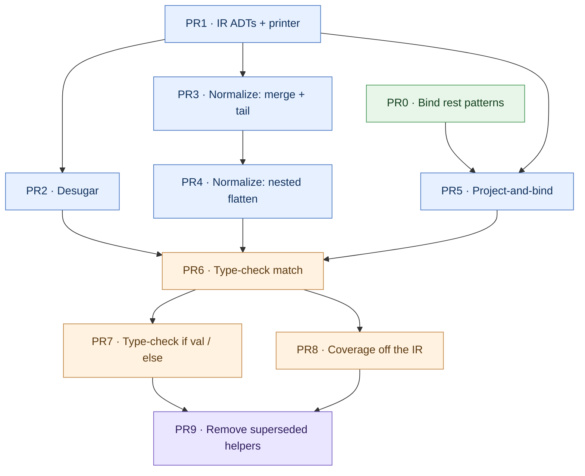

# UCS conditional-normalization IR — Implementation Plan

This plan implements Phase 1 of the MLstruct rework-minimization plan,
[issue #882](https://github.com/escalier-lang/escalier/issues/882), scoped to
`internal/solver`. It sequences the work into dependency-ordered pull requests,
each sized to be reviewable on its own. The follow-up is Phase 2,
[issue #883](https://github.com/escalier-lang/escalier/issues/883), the MLstruct
graft that reuses this IR.

## What UCS gives us

The design adopts the desugar-then-normalize pipeline from ["The Ultimate
Conditional Syntax"](https://dl.acm.org/doi/10.1145/3689746) (Cheng & Parreaux,
OOPSLA 2024; [artifact and demo](https://github.com/hkust-taco/ucs)). Three terms
recur below:

- **Desugared core.** A small term language the rich conditional surface lowers
  into. It has one `Split` node that tests a scrutinee against a sequence of
  branches, `Bind` nodes for intermediate bindings, guard tests, and leaf nodes
  that hold an arm body. The core still carries nested patterns.
- **Normalized form.** A backtracking-free rewrite of the core. Nested patterns
  are flattened into successive scrutinee splits, so each split tests exactly one
  tag-level of one scrutinee and hands its sub-scrutinees to inner splits. The
  checker then reasons about one tag-level at a time instead of walking deep
  nesting.
- **Scrutinee.** The value a split tests. The top-level scrutinee is the match
  target. A nested split's scrutinee is a projection of an outer one, for example
  the field `x` of an object the outer split already matched.
- **Split test.** The tag a branch tests. It ranges over every pattern kind: a
  structural object or tuple shape, a literal, a nominal class tag from an instance
  pattern `Point { x, y }`, or an extractor tag from `Ok(v)`. A rest pattern adds
  no tag. It relaxes the split to an inexact prefix and binds the remainder as a
  leaf. Because a split is agnostic to which kind its test is, the pipeline handles
  all pattern kinds with one mechanism, and a nested sub-pattern becomes a
  projected sub-scrutinee regardless of the outer test's kind.

The normalized form is the shared IR for type checking, coverage checking, and
later codegen. Phase 1 builds it and drives type checking and the interim
top-level coverage check off it. Comprehensive nested-match exhaustiveness rides
Phase 2 (#883) via the negation algebra, not this work.

## Worked examples

These show the two lowering stages the PRs below build: PR2 produces the
desugared core, PR3 and PR4 produce the normalized form. The notation is
illustrative, not the printer's final output.

- `split <scrutinee> { <test> => <cont> }` tests a scrutinee against branches.
- The desugared core keeps a branch's source pattern whole, written `pat …`, and
  writes a fallthrough arm as `else`.
- The normalized form replaces each pattern test with a one-tag-level test, binds
  the leaves it introduces with `bind <name> = <path>`, and moves the catch-all or
  fallthrough into a `default <tail>`. A projection path such as `l.start` names a
  sub-scrutinee. A split with no covering branch has an empty tail, written `✗`.

### A literal match

The catch-all arm becomes the split's default tail.

```
match n {
    1 => "one",
    _ => "other"
}
```

```
# desugared core (PR2)          # normalized form (PR3)
split n {                       split n {
    pat 1 => leaf "one"             1 => leaf "one"
    pat _ => leaf "other"       } default leaf "other"
}
```

### A nested pattern

The source pattern `Line { start: {x, y} }` is one deep shape in the core. PR4
flattens it into a split on `l`, then a split on the projected `l.start`, so the
checker only ever sees one tag-level.

```
match l {
    Line { start: {x, y} } => [x, y]
}
```

```
# desugared core (PR2)                    # normalized form (PR4)
split l {                                 split l {
    pat Line { start: {x, y} }                Line => split l.start {
        => leaf [x, y]                            {x, y} => bind x = l.start.x,
}                                                           y = l.start.y;
                                                           leaf [x, y]
                                              } default ✗
                                          } default ✗
```

### Instance, extractor, and rest patterns

An **instance pattern** tests a nominal class tag, then binds its fields as
projections, the same flattening as a structural object but with a class tag at
the outer split.

```
match p {
    Point { x, y } => [x, y]
}
```

```
# normalized form
split p {
    Point => bind x = p.x, y = p.y; leaf [x, y]
} default ✗
```

An **extractor pattern** tests an extractor tag. The values it yields become
positional sub-scrutinees, written `.0`, `.1`, …, so a nested argument pattern
splits on them just like a tuple element. The current solver narrows to the
constructor's return type as an interim gate; the real `[Symbol.customMatcher]`
protocol arrives with M7, and the IR shape is unchanged either way.

```
match r {
    Ok(v)  => v,
    Err(_) => 0
}
```

```
# normalized form
split r {
    Ok  => bind v = r.0; leaf v,
    Err => leaf 0
} default ✗
```

A **rest pattern** adds no tag. It relaxes its split to an inexact prefix, and the
prefix relaxation — a tuple "at least this long" or an object "has at least these
fields" — already works. The remainder *binding* needs a type for the leftover.
M9 has since shipped that machinery for both containers, so the types now exist.
Wiring `bindPattern`'s `ObjRestPat` and tuple-`RestPat` cases to produce them is
the [PR0](#pr0--prerequisite-bind-rest-patterns-on-m9s-types) prerequisite; both
report unsupported until it lands
([internal/solver/pattern.go](../../internal/solver/pattern.go)). The two
containers differ, so `bind` needs two projection kinds, not one.

A **tuple rest** binds a positional suffix. `xs[1..]` is the tuple of elements past
the fixed prefix, typed by M9's tuple spread `soltype.RestSpreadType` — `[first,
...rest]` reads `rest` as the `...` tail.

```
match xs {
    [first, ...rest] => first
}
```

```
# normalized form
split xs {
    [_, ...] => bind first = xs.0, rest = xs[1..]; leaf first
} default ✗
```

An **object rest** has no positional slice. `rest` must bind an object of exactly
the fields the pattern did not name — "the scrutinee minus a key set," not a
suffix. M9 expresses that as `Omit<typeof p, "x">`: a mapped type whose key
remapping drops the named keys, the same reduction `typeops.go` runs for `Omit`
and `Pick`. It stays a residual operator while the scrutinee is abstract and
reduces once it is a concrete object. The notation below writes it `p \ {x}`, the
scrutinee with the named keys removed.

```
match p {
    {x, ...rest} => rest
}
```

```
# normalized form
split p {
    {x, ...} => bind x = p.x, rest = p \ {x}; leaf rest
} default ✗
```

Here `p \ {x}` resolves to `Omit<typeof p, "x">` under M9's operators. The excluded
key set is exactly the keys named at this object pattern, so a key matched by a
deeper nested split does not remove it from a shallower `rest`.

For coverage, the instance and extractor tags cover nominal union members the same
way `unionMatchExhaustive` already does, and a rest-relaxed inexact split needs a
catch-all, matching today's `structuralInexact` rule. Neither changes the interim
coverage semantics PR8 carries over.

### A guard

The guard lowers to a test inside the bound branch, after the leaves bind, so it
can read `x` and `y`. On failure, control continues into the remaining arms in
source order, preserving first-match semantics: a later arm of the same shape,
such as an unguarded `{x, y} => …` after the guarded one, stays reachable.
Normalization threads that continuation as the branch's fallthrough, which for
this two-arm example happens to be the split's tail. This is why a guarded arm
covers nothing for exhaustiveness — its continuation can always reach a later arm.

```
match p {
    {x, y} if x > y => x,
    _              => 0
}
```

```
# desugared core (PR2)              # normalized form (PR3)
split p {                           split p {
    pat {x, y} guard (x > y)            {x, y} => bind x = p.x, y = p.y;
        => leaf x                                 guard (x > y) => leaf x
    pat _ => leaf 0                                default ↘
}                                   } default leaf 0
```

### `if val` and `val … else` share the shape

Neither is special-cased. Both lower to the same two-branch split a two-arm match
produces, which is what lets PR6 and PR7 collapse the four ad-hoc paths into one
walk.

```
if val {x, y} = p { cons } else { alt }
```

```
# desugared core (PR2)          # normalized form (PR7)
split p {                       split p {
    pat {x, y} => leaf cons         {x, y} => bind x = p.x, y = p.y; leaf cons
    else       => leaf alt      } default leaf alt
}
```

## Scope and constraints

- **Solver only.** All work lands in `internal/solver` and a new pure-IR
  subpackage. Nothing here depends on negation types, DNF/CNF, or the MLstruct
  graft. It is `internal/solver`, not the legacy `internal/checker`.
- **Subsumes four ad-hoc paths.** Today `match`, `if val`, `val … else`, and
  refutable-pattern guard handling are four separate hand-written paths in
  `internal/solver`. This plan unifies them under one desugar → normalize →
  check pipeline. The paths and their current homes:
  - `inferMatch` — [internal/solver/infer_expr.go:2476](../../internal/solver/infer_expr.go)
  - `inferIfVal` — [internal/solver/infer_expr.go:2356](../../internal/solver/infer_expr.go)
  - `inferValElse` — [internal/solver/infer_expr.go:2423](../../internal/solver/infer_expr.go)
  - `bindRefutable` — [internal/solver/infer_expr.go:2386](../../internal/solver/infer_expr.go)
  - dispatch at [internal/solver/infer.go:423](../../internal/solver/infer.go) and
    [internal/solver/infer_stmt.go:128](../../internal/solver/infer_stmt.go).
- **Interim coverage stays.** The existing top-level exhaustiveness check moves
  onto the normalized form with its semantics unchanged. No new coverage
  algorithm is written here — that is Phase 2's residual-based check. The interim
  helpers are `checkMatchExhaustive`, `unionMatchExhaustive`, `armCoversShape`,
  `structuralInexact`, `narrowMatchArm`, and `isCatchAll`, all in
  [internal/solver/infer_expr.go](../../internal/solver/infer_expr.go).
- **Reuse the shared pattern path.** Leaf binding keeps going through
  `bindPattern` / `bindPatternWith` in
  [internal/solver/pattern.go](../../internal/solver/pattern.go). It already
  dispatches every pattern kind, including `InstancePat`, `ExtractorPat`, and
  `RestPat` through `bindInstancePat` / `bindExtractorPat`. The IR decides *which*
  scrutinee a leaf binds against; `bindPattern` still does the member-lookup
  constraints and the borrow-mode projection. Its two gates come along
  unchanged. The extractor path narrows to the constructor return type until the
  `[Symbol.customMatcher]` protocol lands in M7, still open. Rest bindings still
  bind no name — `bindPattern`'s `ObjRestPat` and tuple-`RestPat` cases report
  unsupported today. M9 has since shipped the types they need — tuple spread
  (`RestSpreadType`) for a tuple rest and an `Omit`-style mapped type for an object
  rest — so wiring those two cases is the self-contained
  [PR0](#pr0--prerequisite-bind-rest-patterns-on-m9s-types) prerequisite rather than
  a blocked one, as [the worked example](#instance-extractor-and-rest-patterns)
  spells out. The IR names both projections regardless. Neither gate is introduced
  or worsened by this work.

### Out of scope

- **Codegen (M10).** The IR package is placed so `internal/codegen` can import it
  later, but no codegen consumer is written here. Sourcemaps ride that consumer; the
  [Sourcemaps](#sourcemaps) note records the span provenance M10 needs so it is not
  dropped before then, and the [Codegen efficiency](#codegen-efficiency) note
  records the once-evaluation requirement likewise.
- **Pattern alternatives / or-patterns.** An or-pattern lets one arm match several
  shapes and share a body, for example a `|`-separated alternative:

  ```
  match c {
      Circle(r) | Square(r) => r,
      _                     => 0
  }
  ```

  It would desugar to several core branches that share the arm's body, the shape
  the desugarer is already built to emit:

  ```
  # desugared core
  split c {
      pat Circle(r) => leaf r
      pat Square(r) => leaf r
  } default leaf 0
  ```

  The surface form the issue lists as "pattern alternatives" has no AST node today
  — [internal/ast/pattern.go](../../internal/ast/pattern.go) has no `OrPat`. The
  desugarer is shaped to accept one branch producing several core branches, but
  wiring real alternatives needs parser and AST work first. Flagged, not built.
- **`try` / `catch` arms.** `TryCatchExpr` carries `[]*MatchCase` for its catch
  clauses but has no solver typing yet. The desugarer is designed so catch arms
  can lower through the same `Split`, but throws-narrowing is a Phase 2 (#883)
  payoff and is not part of this plan.

## Package layout

Put the pure IR in a new subpackage `internal/solver/ucs`:

- `ucs` holds the core and normalized ADTs, the desugarer, the normalizer, and a
  printer. It imports only `internal/ast`. It never imports `internal/solver` or
  `internal/soltype`, so it stays acyclic and additive.
- The typing walk and the coverage check stay in `internal/solver`, which imports
  `ucs`. They need the checker's mutable `Context`, `bindPattern`, and
  `soltype`, none of which the IR should pull in.

This boundary lets `internal/codegen` import `internal/solver/ucs` for M10 without
a dependency on the solver engine, matching the acyclic layering the package doc
in [internal/solver/doc.go](../../internal/solver/doc.go) already relies on.

## Diagnostics

Desugaring erases surface structure. Once `match`, `if val`, and `val … else` all
lower to one `Split`, an error raised on the IR knows only "a pattern failed," not
which flow-control form the user wrote. Left unaddressed, that regresses messages
from "this `if val` binding may not match" to a generic "non-exhaustive pattern."
The fix is to carry back, on the IR itself, exactly what a diagnostic needs to
speak the user's language. Three pieces of provenance do that. This is the same
move Rust's compiler makes with `MatchSource` / `DesugaringKind` after it lowers
`if let` and `for` into `match`, and the codebase already distinguishes the three
constructs for *type* provenance in
[internal/solver/prov.go](../../internal/solver/prov.go) with `MatchBranch` /
`IfValBranch` / `ValElseBranch`. This applies the same idea to diagnostics.

1. **An `Origin` tag on every core and normalized node.** A sum —
   `MatchArm`, `IfVal`, `ValElse`, `Guard`, extensible to `TryCatch` — plus the
   originating `ast.Node`. A diagnostic reads the tag to choose wording: an
   inexhaustive `match` says "add a catch-all branch"; an `if val` that cannot bind
   says "this `if val` pattern may not match"; a `val … else` phrases around its
   `else`. The tag rides the node, so it survives desugaring and normalization.

2. **A synthetic marker on invented nodes.** The desugarer mints nodes the user
   never wrote — the fallthrough tail, an implicit `else`. Each is marked synthetic
   and records the construct it was synthesized for, so a diagnostic never anchors a
   span the user cannot see. This is the most common way desugaring wrecks
   messages, so the marker is mandatory, not optional.

3. **An original-arm back-reference preserved through normalization.** When PR3
   merges same-scrutinee branches and PR4 flattens nesting, a node is no longer
   traceable to "the merged split." Each branch and leaf keeps a pointer to the
   surface arm it came from, so "unreachable arm" or "missing field" blames the arm
   the user typed. A guard's fall-through keeps the guard's own span, so a
   guard-related note points at the guard, not the tail it falls into.

Two rules make this stick rather than drift:

- **Error wording is a function of `Origin`, not of node kind.** The error structs
  such as `NonExhaustiveMatchError` take the origin and template `Message()` on it,
  keeping construct-specific phrasing in one place instead of scattered kind
  checks.
- **Per-construct message tests are a PR requirement.** PR6, PR7, and PR8 each
  assert not only full-message parity with today but that the message names the
  right construct. "Diagnostics name the original flow-control form" is enforced by
  a golden test, not left to hope.

The same `Origin` tag is forward-compatible: it lets a future LSP code action be
construct-aware — "add missing match arms" versus "add an `else` branch" — and lets
Phase 2's free coverage witnesses be phrased per construct. Ownership across the
PRs: PR1 adds the `Origin` tag and synthetic marker to the ADT, PR2 sets them while
desugaring, PR3 and PR4 preserve the back-reference through their rewrites, and
PR6 through PR8 add the origin-keyed wording and its tests.

### Sourcemaps

The same node-level provenance is what a future codegen needs for correct
sourcemaps, so the two uses share one substrate rather than each carrying spans
separately. Codegen itself is out of scope — sourcemap *emission* lives in
[internal/codegen/source_map.go](../../internal/codegen/source_map.go), which maps
generated-JS nodes back to `.esc` spans through the `Span` on codegen AST nodes,
and M10 writes that consumer. This plan's job is only to not drop the spans before
then. Because every core and normalized node already carries its originating
`ast.Node`, M10 can attach the user's `match` / `if val` / `val … else` span to the
JS it lowers, so a sourcemap points at the source the user wrote, not a desugared
position.

One decision is deferred to M10, not settled here: the **synthesized-node span
policy**. The desugarer invents nodes with no source — the fallthrough tail, an
implicit `else` — and a sourcemap must not point at a column the user cannot see.
The synthetic marker from point 2 above is what M10 keys that policy off: map a
synthetic node to the span its cause chain reaches, or emit no mapping for it,
rather than inventing a position. `Origin.Cause` records what a synthetic node was
minted from and `NearestSpan` walks that chain, so the span is recoverable from the
node alone rather than by threading the enclosing origin down a walk. Recording
both now keeps the choice open instead of foreclosing it with a lost span.

## Codegen efficiency

Codegen (M10) is out of scope, but the normalized form is shaped so M10 emits
efficient destructuring and dispatch. This note records the one requirement so it
is not lost before then.

- **The split form is a decision tree.** Successive one-tag-level splits lower
  directly to `switch` / `if`, each scrutinee tested once, with no re-testing
  because the form is backtracking-free. This is the shape efficient hand-written
  matching takes, so M10 walks it rather than reconstructing it.
- **Each `Scrutinee` node is materialized once.** A nested sub-scrutinee such as
  `l.start` is one shared node that its inner split and every leaf under it
  reference, not a path re-derived per leaf. M10 binds each `Scrutinee` to a local
  once — `const _s = l.start` — then reads `_s.x` / `_s.y` and tests off `_s`. That
  evaluates a shared prefix once and, crucially, evaluates a side-effecting
  scrutinee like `match f() { … }` once, before any test. The `bind x = p.x`
  notation in the worked examples names each leaf's source; it does not imply a
  re-read, because the projections share the scrutinee node.

Native `{x, y}` destructuring syntax is not emitted, but `const x = p.x; const y =
p.y` is what it desugars to, so there is no runtime cost, only output form. One
tradeoff is left to M10: a decision tree can duplicate a leaf body reachable by
several paths. UCS bounds this by sharing the default tail and giving each arm one
leaf; if blowup ever appears, the fix is to share join points as labeled
continuations, not to change this IR.

## Pull requests

A prerequisite PR0 wires rest-pattern binding onto M9's types, then nine PRs build
the IR, each ordered to merge without the next and sized so the diff and its
regression surface stay reviewable in one sitting. PR0 is not UCS work — it is the
one `bindPattern` gap the plan depends on — so it lands first and independently.
Three concerns were split out of their first draft to keep the nine's size down. Normalization became PR3 and PR4, since
same-scrutinee merging and nested flattening are separable and the second is the
algorithmically hard half. The solver-side project-and-bind operation became its
own PR5 ahead of the `match` rewrite, since it is a self-contained contract worth
testing before anything calls it. Retyping split into PR6 and PR7, since rewiring
all four ad-hoc paths at once put four entry points and their whole test surface in
one review. PR1 through PR5 change no inferred type — PR1 through PR4 are pure IR
and PR5 is an unwired helper. PR6 and PR7 flip type checking onto the IR. PR8 moves
coverage. PR9 deletes the superseded code. The
[dependency graph](#dependency-graph-and-parallelism) below marks the two windows
where PRs can proceed in parallel.

### PR0 — Prerequisite: bind rest patterns on M9's types

Wire `bindPattern`'s rest cases to the types M9 shipped, so a `match`, `if val`, or
`val … else` leaf that uses `...rest` binds a real name instead of reporting
unsupported. This is not UCS IR work; it lands first because every walk PR binds
leaves through `bindPattern`, and a rest pattern in an arm would otherwise hit the
unsupported path.

- Tuple rest: bind the `...rest` name to the tuple suffix, typed by M9's
  `soltype.RestSpreadType`, replacing the `reportUnsupported` at the tuple
  `RestPat` case in [internal/solver/pattern.go](../../internal/solver/pattern.go).
- Object rest: bind `...rest` to `Omit<typeof scrutinee, K>` over the keys `K` the
  pattern named, M9's mapped-type key removal, replacing the `reportUnsupported` at
  the `ObjRestPat` case.
- Remove the stale "needs … which arrive in M9" comments at both cases, now that
  M9 has shipped the types they named.
- Propagate borrow mode: a rest of a `&mut` scrutinee binds a `&mut` view of the
  leftover, as the sibling leaves already do.

**Tests.** Bind `[a, ...rest]` and `{x, ...rest}` in `val` destructuring, a
function param, and a `match` arm, asserting the inferred `rest` type in Escalier
annotation syntax; add a borrowed-scrutinee rest that binds as a borrow.

**Depends on** M9, shipped. Independent of the UCS IR PRs; it feeds PR5, whose
project-and-bind binds rest-containing leaves through `bindPattern`.

### PR1 — Core and normalized IR ADTs plus a printer

Add the `internal/solver/ucs` package with the term types and a printer, wired
into nothing.

- Define the desugared-core ADT: a `Split` over a scrutinee with an ordered list
  of branches, a `Bind` node for an intermediate binding, a guard-test node, and a
  leaf. A leaf has two shapes, since `val … else` is not fully expression-shaped. A
  `match` or `if val` arm carries a body expression and its span. A `val … else`
  success path carries no body: it hands its bindings to the enclosing
  continuation, the rest of the block, so the leaf models a binding escape. Its
  `else` path is a divergence or a fallback value, kept distinct from a covering
  arm so PR7 and PR8 do not treat it as one.
- Enumerate the branch-test kinds as a sum: a structural object or tuple shape, a
  literal, a nominal class tag for an instance pattern, an extractor tag, and an
  inexact-prefix marker a rest pattern sets. A projection path segment must be able
  to name a field, a tuple index, a positional value an extractor yields, a tuple
  suffix for a tuple rest, and an object remainder excluding a key set for an object
  rest.
  M9 has shipped the types the last two resolve to — tuple spread and an
  `Omit`-style mapped type — and PR0 wires their `bindPattern` cases, so the IR
  names both projections and PR5 onward bind them for real.
- Define the normalized-form ADT: a split whose branches each test one tag-level
  and whose sub-scrutinees are projection paths into the matched value, plus a
  default / fallthrough tail.
- Define `Scrutinee` as either the root match target or a projection path
  relative to an enclosing scrutinee, so a nested split names its value without
  re-inferring it.
- Add the diagnostics provenance from the [Diagnostics](#diagnostics) section to
  every node: an `Origin` tag (`MatchArm` / `IfVal` / `ValElse` / `Guard`) with the
  originating `ast.Node`, and a synthetic marker for a node the desugarer invents.
  Later PRs read these; PR1 only defines and prints them.
- Add a `String()` printer over both ADTs so tests can lock IR shape with
  `snaps.MatchInlineSnapshot` per the testing guidance in
  [CLAUDE.md](../../CLAUDE.md), rather than drilling into fields.

**Tests.** Constructor and printer round-trips on hand-built IR values. No
solver behavior changes.

### PR2 — Desugar the surface into the core

Add `desugar` in `internal/solver/ucs`: a pure function from the AST conditional
surface to the desugared core.

- Lower `MatchExpr` arms into a `Split` whose branches carry each arm's pattern,
  optional guard, and body. Guards become guard-test nodes on their branch, not
  inline boolean handling.
- Lower `IfValExpr` into a `Split` with the pattern branch and the `else`
  fallthrough.
- Lower a `val pat = init else { … }` `VarDecl` into a `Split` with the pattern
  branch and the diverging-or-fallback `else`.
- Represent intermediate bindings introduced by desugaring as `Bind` nodes so
  later stages see them uniformly.
- Set each node's `Origin` from the surface form it lowers — `MatchArm` for a match
  arm, `IfVal` / `ValElse` for those two, `Guard` for a guard test — and mark the
  invented fallthrough and implicit `else` synthetic, per the
  [Diagnostics](#diagnostics) section.

**Tests.** Snapshot the core IR for a representative source of each surface form,
including its `Origin` tags. No typing yet; the desugarer is not called from
`inferMatch` in this PR.

### PR3 — Normalize: same-scrutinee merging and the default tail

Add `normalize` in `internal/solver/ucs` for the shallow half of the rewrite:
merge and tail, no nested flattening yet. Patterns stay one level deep in this PR.

- Merge branches that test the same scrutinee against different tags into one
  split, so the checker visits each scrutinee once.
- Thread a default / fallthrough tail through every split so the form is
  backtracking-free: a failed test falls to the tail, never re-tries an earlier
  branch.
- Leave a nested pattern intact inside its branch for now; PR4 flattens it. The
  form is already correct for flat matches such as `1 => …, _ => …`.
- Preserve each branch's original-arm back-reference and `Origin` when merging, per
  the [Diagnostics](#diagnostics) section, so a merged split still blames the arm
  the user wrote.

**Tests.** Snapshot the normalized IR for flat matches, overlapping arms, and
guarded arms, asserting merged branches keep their original-arm back-reference.
`normalize` runs on hand-built core IR, so this PR does not need the desugarer from
PR2.

### PR4 — Normalize: flatten nested patterns into projection splits

Extend `normalize` to the hard half: turn a nested pattern into successive
scrutinee splits, one tag-level each.

- An object or tuple pattern becomes an outer split on the container tag whose
  branches split again on the projected sub-scrutinees, for example `Line { start:
  {x, y} }` splitting first on `l` then on `l.start`.
- Emit a projection scrutinee for each sub-split so the inner split names its value
  without re-inferring it.
- Recurse to arbitrary depth, keeping every split at one tag-level so the checker
  and Phase 2's coverage never see a deep shape at once.
- Before finalizing the split and tail shape, confirm the details against the UCS
  paper's normalization section and the [`hkust-taco/ucs`](https://github.com/hkust-taco/ucs)
  reference, per the issue's
  fourth task.
- Carry the source pattern node onto each projection scrutinee so a flattened split
  reports against the user's nested pattern, not the internal path, per the
  [Diagnostics](#diagnostics) section.

**Tests.** Snapshot the normalized IR for nested object and tuple patterns,
asserting the one-tag-level-at-a-time shape, the projection scrutinee paths, and
that each carries its source pattern node.

### PR5 — Solver-side project-and-bind over an IR path

Add the one solver-side operation that resolves an IR projection path into a
bound leaf, the contract every walk that follows depends on. It has no caller yet,
so it changes no inferred type; it lands with its own unit tests, the same way the
pure-IR PRs land unwired.

- Resolve an IR projection *path*, not a precomputed `soltype.Type`, into a bound
  leaf. Derive the sub-scrutinee type through the existing machinery — `CarrierOf`
  to peel a borrow, the member-lookup constraints, union narrowing, and borrow-mode
  propagation — then bind through `bindPattern` / `bindPatternWith`. The `ucs`
  package supplies only the ast-level path; every type is computed here in
  `internal/solver`.
- Reproduce `narrowMatchArm`'s union narrowing at the path level: a path into one
  union variant must resolve against only that variant's members, so PR6 inherits
  variant-narrowing with no regression.

**Tests.** Unit-test the contract against hand-built paths: a field, a tuple
index, an extractor result, a union-narrowed arm, and a borrowed scrutinee that
must bind its leaves as borrows. No inferred type or message changes, since nothing
calls it yet.

### PR6 — Type-check `match` off the normalized form

Rewrite `inferMatch` to desugar, normalize, then walk the normalized form with the
PR5 project-and-bind, introducing the shared walk the other paths reuse. `if val`,
`val … else`, and `bindRefutable` keep their current bodies until PR7. This is the
first behavior-affecting PR.

- Add the walk over the normalized form: each split projects its scrutinee's type
  through the PR5 operation, each leaf infers its body, and non-diverging bodies
  constrain into one fresh branch-join var, as `inferMatch` already does.
- Type each guard-test node as a boolean over its branch's bindings, matching the
  current inline guard constraint.
- Preserve the `MatchBranch` provenance edge from
  [internal/solver/prov.go](../../internal/solver/prov.go), `checkUniformOwnership`
  ([internal/solver/infer_expr.go:514](../../internal/solver/infer_expr.go)), and
  the divergence-join where an all-diverging match coalesces to `never`.

**Tests.** The match suites stay green: `infer_pattern_test.go`,
`infer_pattern_nominal_test.go`, `infer_pattern_mut_test.go`, and the match cases
in `infer_expr_test.go`. Add a golden test that a `match` error names the `match`
construct, per the [Diagnostics](#diagnostics) section. Run `go test ./...`;
`UPDATE_SNAPS=true` only for intended IR-print snapshots.

### PR7 — Type-check `if val` and `val … else` off the IR

Migrate `inferIfVal` and `inferValElse` onto the PR6 walk, retiring their
hand-written arm-walking bodies.

- Route `inferIfVal` and `inferValElse` through desugar → normalize → walk, reusing
  the PR6 walk. Do not rewrite `bindRefutable` as an IR walk. It stays a
  solver-side binding adapter the walk calls for a refutable leaf, preserving the
  `IdentPat.TypeAnn` narrowing path through `bindNarrowedIdent`, the leaf `VarID`,
  and its caller-owned scope, none of which the IR models.
- Preserve the `IfValBranch` and `ValElseBranch` provenance edges so their
  branch-join vars still render with their source.
- Keep the scope discipline: an `if val` and a `val … else` run their `else` in a
  scope that does not see the pattern's bindings, matching the current child-scope
  handling in `inferIfVal` / `inferValElse`. The `val … else` success bindings still
  escape into the enclosing block, as the core's binding-escape leaf models.

**Tests.** `infer_if_val_test.go` and the `val … else` cases stay green with
unchanged inferred types and messages. Add golden tests that an `if val` error
names `if val` and a `val … else` error names its `else`, per the
[Diagnostics](#diagnostics) section, so neither reverts to generic `match` wording.

### PR8 — Run the interim coverage check off the normalized form

Move the top-level exhaustiveness check onto the IR without changing its verdict
on any current input.

- Reimplement `checkMatchExhaustive` to read the normalized form's top-level
  split and its default tail instead of the `matchShape` scrutinee snapshot taken
  in `inferMatch`. It reads the IR's split structure but keeps its type-dependent
  predicates in `internal/solver`: deciding exact-union membership, inexactness, and
  guarded-arm coverage needs `soltype`, so this is a typed coverage adapter, not
  ast-only logic. It is the replacement PR9 deletes the old helpers in favor of.
- Keep the interim semantics identical: an inexact scrutinee needs a catch-all, an
  exact union is covered when every member has an unguarded covering branch, and a
  guarded branch covers nothing. This is the seam Phase 2 (#883) later replaces
  with `residual = scrutinee ∧ ¬covered ; exhaustive iff residual <: ⊥`.

**Tests.** Every current `NonExhaustiveMatchError` case keeps its exact message,
asserted in full per [CLAUDE.md](../../CLAUDE.md), with the message keyed off the
split's `Origin` per the [Diagnostics](#diagnostics) section rather than assuming a
`match`. The `matchShape` snapshot logic in `inferMatch` is removed once coverage
reads the IR.

### PR9 — Remove the superseded ad-hoc helpers

Cleanup only, no behavior change.

- Delete only the helpers PR8's coverage walk has made truly dead:
  `unionMatchExhaustive`, `armCoversShape`, `structuralInexact`, `narrowMatchArm`,
  and the pattern-shape branches of `isCatchAll`.
- Do not move these into the `ucs` package. They inspect `soltype` — exact-union
  membership, inexact-scrutinee shape, guarded-arm coverage — and `ucs` is ast-only,
  so it cannot host type-dependent logic. Their replacement is the typed coverage
  adapter PR8 already puts in `internal/solver`. If any predicate is still reachable
  after PR8, it stays solver-side; nothing type-dependent folds into `ucs`.

**Tests.** `go test ./...` unchanged; this PR removes code with no reachable
callers after PR7 and PR8.

## Dependency graph and parallelism

The order below respects two rules: a pure-IR PR must land before the PR that
consumes it, and a behavior-affecting PR must land before the one that deletes the
code it supersedes.

| PR | Depends on | Can run in parallel with |
|----|------------|--------------------------|
| PR0 — Bind rest patterns | M9 (shipped) | PR1, PR2, PR3, PR4 |
| PR1 — IR ADTs + printer | — | PR0 |
| PR2 — Desugar | PR1 | PR0, PR3, PR5 |
| PR3 — Normalize: merge + tail | PR1 | PR0, PR2, PR5 |
| PR4 — Normalize: nested flatten | PR3 | PR0, PR2, PR5 |
| PR5 — Project-and-bind | PR0, PR1 | PR2, PR3, PR4 |
| PR6 — Type-check `match` | PR2, PR4, PR5 | — |
| PR7 — Type-check `if val` / `else` | PR6 | PR8 |
| PR8 — Coverage off the IR | PR6 | PR7 |
| PR9 — Remove superseded helpers | PR7, PR8 | — |

Two parallel windows open up:

- **From the start**, PR0 and PR1 are independent — PR0 wires `bindPattern` against
  the shipped M9 types and needs nothing from the IR, so it runs alongside the whole
  early IR fan-out.
- **After PR1**, three lanes run independently: the desugarer (PR2), the
  normalizer chain (PR3 then PR4), and the project-and-bind operation (PR5). Each
  works against hand-built inputs — core IR for PR3, projection paths for PR5 — so
  none waits on another. PR5 also folds in PR0's rest binding, since project-and-bind
  binds rest-containing leaves through `bindPattern`. PR6 is the join point that
  first needs the desugarer, the full normalizer, and project-and-bind together.
- **After PR6**, migrating the remaining surface paths (PR7) and moving coverage
  onto the IR (PR8) touch different code and are independent. PR9 is the join
  point that waits on both.


```mermaid
graph TD
    PR0["PR0 · Bind rest patterns"]
    PR1["PR1 · IR ADTs + printer"]
    PR2["PR2 · Desugar"]
    PR3["PR3 · Normalize: merge + tail"]
    PR4["PR4 · Normalize: nested flatten"]
    PR5["PR5 · Project-and-bind"]
    PR6["PR6 · Type-check match"]
    PR7["PR7 · Type-check if val / else"]
    PR8["PR8 · Coverage off the IR"]
    PR9["PR9 · Remove superseded helpers"]

    PR0 --> PR5
    PR1 --> PR2
    PR1 --> PR3
    PR1 --> PR5
    PR3 --> PR4
    PR2 --> PR6
    PR4 --> PR6
    PR5 --> PR6
    PR6 --> PR7
    PR6 --> PR8
    PR7 --> PR9
    PR8 --> PR9

    classDef prereq fill:#e8f5e9,stroke:#4a9a5a,color:#12401c;
    classDef pure fill:#e6f0ff,stroke:#4a78c2,color:#12325c;
    classDef behavior fill:#fff2e0,stroke:#c2894a,color:#5c3a12;
    classDef cleanup fill:#eae6ff,stroke:#7a5cc2,color:#2f1c5c;
    class PR0 prereq;
    class PR1,PR2,PR3,PR4,PR5 pure;
    class PR6,PR7,PR8 behavior;
    class PR9 cleanup;
```

Green is the PR0 prerequisite, on M9's types rather than the UCS IR. Blue is
IR-only work that changes no inferred type — PR1 through PR4 build the IR and PR5
adds the unwired project-and-bind helper. Orange flips type checking or coverage
onto the IR, purple is deletion. The two diamonds in the graph, PR6 and PR9, are
the join points where a parallel window closes.

## Handoff to Phase 2 (#883)

Phase 2 plugs into two seams this plan creates:

- **The normalized form IR** is what `#883`'s residual coverage check consumes.
  `residual = scrutinee ∧ ¬covered` is computed over the same splits, and the
  residual's DNF is the uncovered witness set.
- **`checkMatchExhaustive`** is the function `#883` supersedes. Phase 1 leaves it
  reading off the IR so Phase 2 swaps the body for the algebra without touching
  the surface lowering.

The IR is also the M10 codegen substrate. Keeping it in `internal/solver/ucs`
with an ast-only dependency lets codegen import it later without a solver cycle.

## Risks

- **Projection must match `bindPattern`.** The split's sub-scrutinee type has to
  be the same projection `bindPattern` would compute through `CarrierOf` and the
  member-lookup path, or leaf types drift. Mitigate by having the IR walk call the
  existing projection rather than recomputing it.
- **Union-variant narrowing.** `narrowMatchArm` currently drops the union members
  an arm cannot destructure. The normalized split must reproduce this so a
  one-variant arm does not bind against the whole union. Snapshot the normalized
  IR for a union scrutinee to lock the split boundaries.
- **Guard and binding scope.** A guard sees its arm's bindings; the `else` of an
  `if val` and a `val … else` does not. The IR must keep guard tests inside the
  bound branch and fallthroughs outside it, matching the current child-scope
  discipline.
- **Snapshot churn.** PR6, PR7, and PR8 should not move any inferred type or error
  message. Land IR-print snapshots in PR1 through PR4 so each behavior-affecting
  PR's diff is limited to the walk, making an accidental behavior change visible in
  review.
